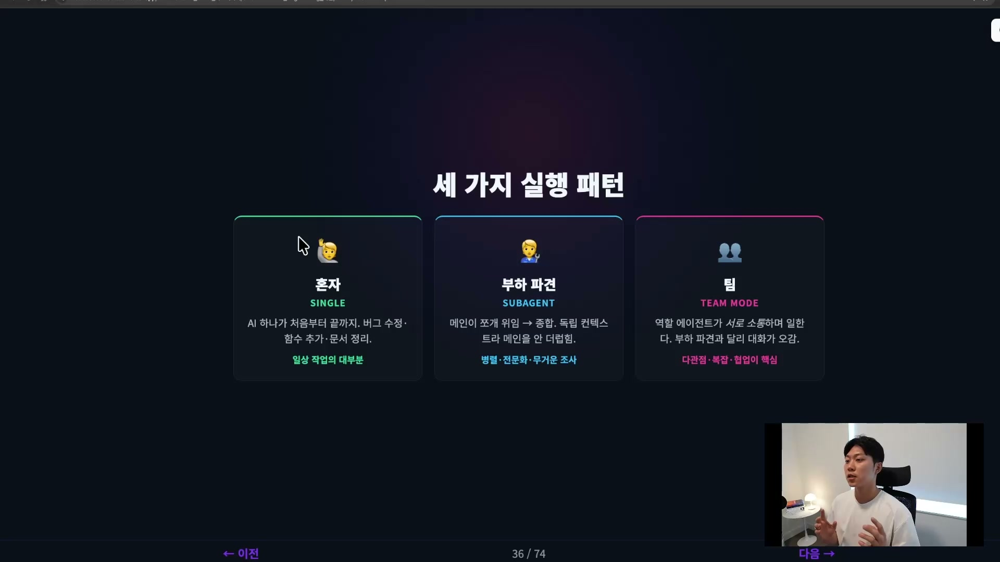
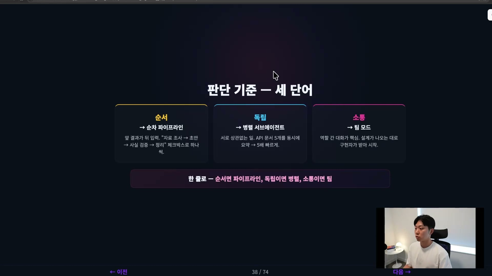
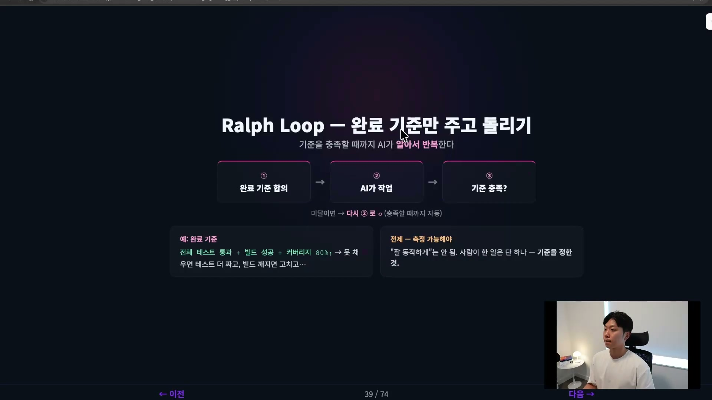
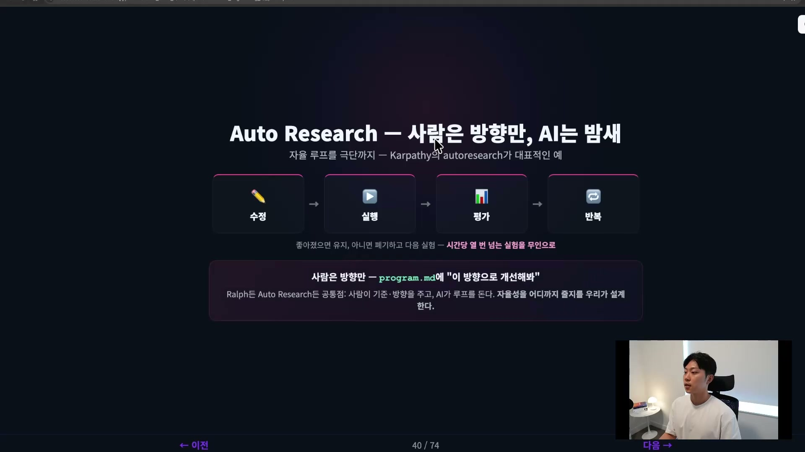

계획이 섰으면 다음은 실행이다. 그런데 "실행한다"는 말 안에는 사실 서로 다른 그림 여러 개가 들어 있다. 에이전트 하나한테 처음부터 끝까지 맡길 수도 있고, 일을 잘게 쪼개 여러 에이전트에게 나눠줄 수도 있고, 아예 역할별로 팀을 꾸려 서로 일을 주고받게 할 수도 있다. 사람한테, 직원한테 일을 시킬 때와 똑같다. 누구한테 어떻게 시킬지는 일의 성격에 달려 있다.

작업의 성격에 맞는 실행 패턴을 고르는 일, 이게 오케스트레이션(orchestration)이다. 많은 사람이 여기서 과욕을 부린다. 에이전트를 여럿 부리는 그림이 멋있어 보여서 덜컥 팀 모드를 꺼내 드는데, 대부분의 일은 그럴 필요가 전혀 없다.

## 세 가지 실행 패턴

실행에는 세 패턴이 있다. 싱글(single), 서브에이전트(subagent), 팀(team).

**싱글은 AI 하나가 처음부터 끝까지 다 하는 것**이다. 버그 고치고, 함수 추가하고, 문서 정리하고. 단순한 작업, 그리고 솔직히 일상 작업의 대부분이 여기 해당한다. 굳이 일을 쪼갤 이유가 없는 일들이다.

서브에이전트는 메인 에이전트가 일을 쪼개 서브에이전트들에게 위임하고, 결과를 다시 종합하는 형태다. "너는 조사를 하고, 너는 코드를 고치고, 너는 코드를 리뷰해" 이런 식으로 나눠 보낸 뒤 메인이 마지막에 취합한다. 흩뿌리고(fan-out) 다시 모은다(fan-in)고 해서 팬아웃, 팬인이라고도 부른다. 일을 병렬로 돌리거나 각 부분을 전문화하고 싶을 때 좋다.

서브에이전트의 핵심은 따로 있다. 각 서브에이전트는 독립된 컨텍스트(context)에서 일하기 때문에, 메인 컨텍스트를 더럽히지 않는다. 컨텍스트가 점점 차오르는 것은 늘 두려워해야 하는 일이다. 무거운 조사는 서브에게 맡기고, 메인은 깨끗한 상태로 결과만 받는다. 이 구조가 그래서 의미가 있다.

마지막이 팀 모드다. 모르는 사람이 많은 패턴이다. PM이 있고, 개발이 있고, 디자인이 있고, QA가 있다. 이런 역할을 가진 에이전트들이 서로 소통하며 일한다.

서브에이전트와 팀을 가르는 결정적 차이가 여기 있다. **서브에이전트는 서로 소통할 수 없고, 무조건 메인하고만 소통한다.** 회사가 외주를 주는 그림에 가깝다. 외주 업체끼리는 서로 모르고, 발주한 우리하고만 이야기한다. 반면 팀은 한 회사 안의 진짜 팀이 서로 대화하며 일하는 것에 가깝다. 디자인하다가 개발에게 물어보고, 개발하다가 PM과 이야기하고, 설계자가 내린 결정을 구현자가 곧바로 받아 일을 시작한다. 그래서 팀 모드는 복잡하고 협업이 핵심인 작업에 쓰면 좋다.

## 기억할 숫자 두 개

이 세 패턴에 숫자 두 개를 붙여두면 판단이 쉬워진다.

첫째, 일상 작업의 90%는 혼자나 서브에이전트로 충분할 만큼 단순한 일이다. 둘째, 팀 모드는 강력하지만 토큰 비용이 대략 7배까지 뛸 수 있다. 에이전트끼리 계속 대화를 주고받으니 그만큼 토큰을 많이 쓴다.

이 두 숫자를 붙여 놓으면 결론이 저절로 나온다. 팀 모드는 여러 관점이 동시에, 실시간으로 필요할 때만 꺼내는 비싼 카드로 두는 게 좋다. 큰 공사에 종합팀을 부르지, 작은 공사에 큰 팀을 부르지는 않는다. 닭 잡는 데 소 잡는 칼을 쓰느냐는 비유 그대로다. 간단한 일에 팀을 꾸리면 결과는 혼자 한 것과 비슷한데 비용만 7배가 나간다. 그래서 일을 시작하기 전에 "이 일에 정말 소통이 필요한가"를 먼저 물어야 한다. 판단이 안 서면 클로드(Claude)에게 직접 물어봐도 된다. 이거 에이전트 팀으로 하는 게 좋냐, 아니면 서브에이전트로 충분하냐.

## 어떤 상황에 어떤 패턴인가 (순서, 독립, 소통)

좀 더 구체적으로, 어떤 상황에 어떤 형태를 쓰는지 보자. 판단 기준은 세 단어다. 순서, 독립, 소통.

**순서가 중요하면 순차적으로, 파이프라인(pipeline)으로 만든다.** 앞 단계의 결과가 뒤 단계의 입력이 되게 묶는 것이다. 리서치 보고서를 쓴다고 해보자. 자료 조사를 먼저 하고, 초안을 작성하고, 사실 검증을 하고, 정리한다. 정해진 순서가 있다. 조사가 끝나기 전에 갑자기 정리를 할 수는 없다. 이렇게 단계가 줄지어 있을 때는 작업을 파이프라인 형태로 흘려보낸다.

독립적인 일이면 병렬(parallel)로 간다. 서로 상관없는 일들, 앞 결과를 기다리지 않아도 되는 일들이다. 테스트를 500개 작성해야 한다거나, 코드베이스를 탐색해야 한다거나. API 문서 다섯 개를 각각 요약해야 한다면, 서로 영향을 주지 않으니 에이전트 다섯 개를 동시에 띄워 요약하는 게 훨씬 효율이 좋다.

소통이 필요하면 팀이다. 역할 간의 대화가 작업의 핵심일 때다. 새 기능을 설계하면서 동시에 구현까지 하고 리뷰까지 받아야 한다면, 설계 에이전트, 구현 에이전트, 리뷰 에이전트로 팀을 꾸린다. 설계가 나오는 대로 구현자가 받아 시작하게 하는 식이다.

한 줄로 압축하면 이렇다. 순서면 파이프라인, 독립이면 병렬, 소통이면 팀.

## 한 단계 더, 자율 루프

여기서 한 단계 더 나아간 패턴이 있다. 자율적인 패턴이다. 요즘 스펙 드리븐 디벨롭먼트(spec-driven development)나 골 드리븐 디벨롭먼트(goal-driven development)라고 부르는 흐름과 닿아 있다.

랄프 루프(Ralph Loop)라는 게 있다. 랄프는 심슨 가족에 나오는, 일을 잘 못하는 캐릭터를 가리키는 것 같다(심슨을 안 봐서 확실치는 않다). 일을 시켰는데 그 친구가 실패하면, "그러면 될 때까지 계속 해라"고 시킨다. 기준을 충족할 때까지 계속 반복하게 한다. 그래서 랄프 루프다.

정리하면 이렇게 돈다. 먼저 완료 기준을 정해준다. 그러면 그 목표를 충족할 때까지 AI가 알아서 반복한다. 흐름의 출발점은 완료 기준 합의다. 사실 완료 기준이 제일 중요하다. 예를 들어 테스트 커버리지가 80% 이상이어야 한다, 캐시 레이트(cache rate)가 70% 이상이어야 한다. 이렇게 기준을 합의하고 나면 AI가 작업을 시작한다. 작업을 끝낸 뒤 기준을 충족했는지 확인한다. 테스트 커버리지가 아직 40%밖에 안 됐다면 다시 돌아가서 한다. 60%가 됐어도 다시 돌아간다. 80%가 되면 그때 멈추고 보고한다.

그래서 사람이 하는 일은 하나다. 기준을 정하는 것. 스펙 드리븐 디벨롭먼트와 똑같은 결이다. 스펙을 정하면 사람이 할 일은 없고, 마지막에 검증만 하면 된다. 무엇이 되면 끝인지 완료 기준만 명확하게 주면, 나머지는 AI가 될 때까지 혼자 굴러간다. 요즘 유명한 랄프어톤이라는 해커톤도 이 방식에 기반한 것이다.

단, 전제가 하나 있다. 기준이 측정 가능해야 한다. "이 웹사이트를 좋게 만들어줘, 좋게 만들 때까지 계속 돌려줘"라고 하면 AI는 멈출 수가 없다. 무엇이 좋은지는 주관적이기 때문이다. 객관적이고, 실행 가능하고, 판정 가능한 기준이어야 루프가 닫힌다.

## 자율 루프를 극단까지, 오토리서치

랄프 루프를 정말 극단까지 미는 패턴이 오토리서치(autoresearch)다. 카파시(Karpathy)가 만든 것으로, 말 그대로 리서치를 할 때 쓰는 방식이다. 우리가 일반 작업에서 꼭 써야 하는 건 아니다. 다만 결이 같은 일은 많다. 어떤 코드베이스의 테스트 커버리지를 100%까지 극한으로 밀어올리고 싶다거나, 웹페이지의 라이트하우스(Lighthouse) 스코어를 몇 점까지 끌어올리고 싶다거나. 그렇게 한 기준점을 극단까지 미는 일이다.

리서치에는 보통 가설(hypothesis)이 있다. 그 가설이 맞는지 틀린지를 극단까지 밀어붙여 확인하는 게 오토리서치다. 사람은 방향만 정하고, AI에게 밤새 실험을 굴리게 한다. 리서치는 특히 실험이 엄청나게 많은데, 그 실험을 AI가 다 굴린다. 사람은 연구 방향만 정해 `program.md` 같은 곳에 적어둔다. "이 방향으로 모델 성능을 개선해 봐라" 하는 식이다. 요즘 "AI가 AI를 개선한다"는 말이 나오는 게 바로 이것 때문이다.

그러면 AI가 코드를 수정하거나 하이퍼파라미터, 아키텍처 같은 것을 바꾼다. 짧게 학습을 돌려보고, 벤치마크를 테스트한다. 벤치마크가 좋아졌으면 그 변경을 유지하고, 아니면 폐기하고 다음 실험으로 간다. 이걸 무인으로 반복한다. 핵심 패턴은 네 단어다. 수정, 실행, 평가, 반복.

랄프 루프든 오토리서치든 공통점은 같다. 사람이 기준과 방향을 주고, AI가 루프를 돈다. 자율성을 어디까지 줄지를 우리가 설계한다.

## 가장 흔한 실수, 필요 없는데 복잡하게

실행에서 가장 흔한 실수는 필요가 없는데 복잡하게 가는 것이다. 앞에서 말한 그대로다. 팀 모드를 할 필요가 없는데 팀 모드를 한다. 서브에이전트나 팀 모드가 있어 보이니까 간단한 버그 하나에 갑자기 에이전트 팀을 붙인다. 에이전트끼리 "이건 네가, 아니 네가" 하며 토큰만 잔뜩 쓰고, 결과는 혼자 한 것과 비슷하다.

반대로, 서브에이전트를 꼭 써야 하는 순간도 분명히 있다. 컨텍스트 절약이 대표적이다. 큰 코드베이스를 조사시키는 경우, 클로드 코드(Claude Code) 하네스(harness)는 이걸 자동으로 한다. "코드베이스를 검색해"라고 시키면 익스플로어(Explore) 에이전트를 여러 서브에이전트로 병렬 실행해 조사를 시킨다. 클로드 코드 자체 하네스 안에 그렇게 서브에이전트를 오케스트레이션하는 패턴이 들어 있는 것이다. 무거운 탐색은 서브에이전트의 독립된 컨텍스트에서 일어나게 하고, 메인은 결과 요약만 받는다. 그래야 메인 컨텍스트가 잘 보존된다. 이것 역시 하네스의 일부다.

판단 기준은 결국 하나로 모인다. 이 일에 정말 이렇게 복잡한 게 필요한가. 그것마저 클로드와 상의하며 정할 수 있다. 이렇게 하네스를 설계하는 하네스를 또 만드는 것을 메타 하네스(meta harness)라고 부른다.

## 정리

실행하기를 정리하면, 패턴은 세 가지다. 싱글, 서브에이전트, 팀. 그리고 고르는 기준도 세 가지다. 순서대로 해야 하면 파이프라인, 독립적으로 해야 하면 병렬, 서로 소통해야 하면 팀. 대부분의 경우 팀은 쓸 필요가 없다. 이 자율 루프를 극한까지 끌어올린 게 랄프 루프와 오토리서치 같은 패턴이다.

실행의 핵심은 이거다. 우리가 방향만 잡아주면 나머지는 AI가 알아서 한다. 대신 검증 기준을 잘 잡아줘야 한다. 그런데 AI가 자율적으로 도는 시간이 길어질수록 더 중요해지는 게 하나 생긴다. 그 결과를 어떻게 믿을 것인가. 그래서 다음은 검증이다.
