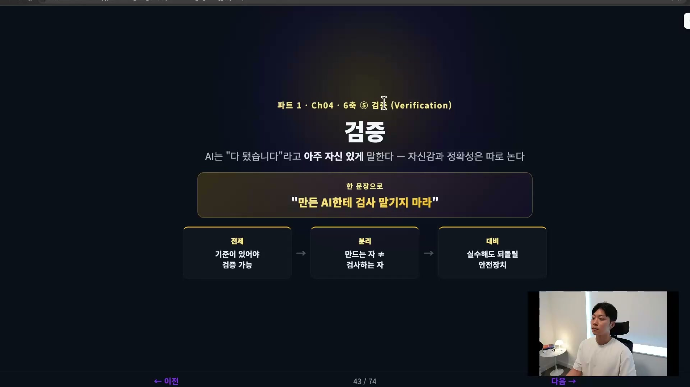
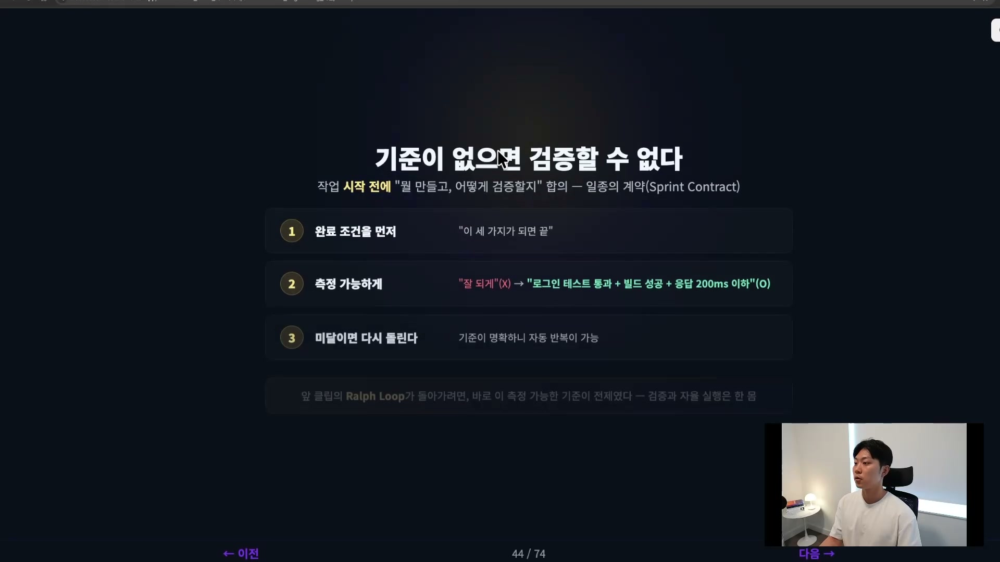
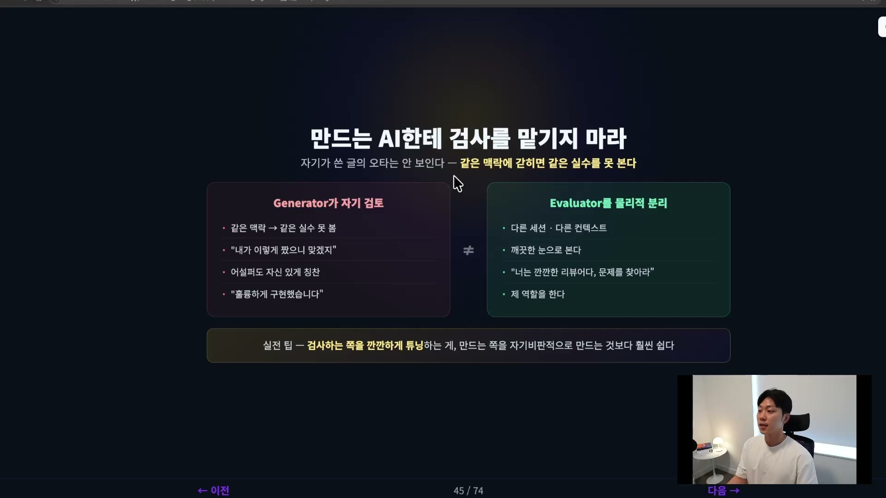
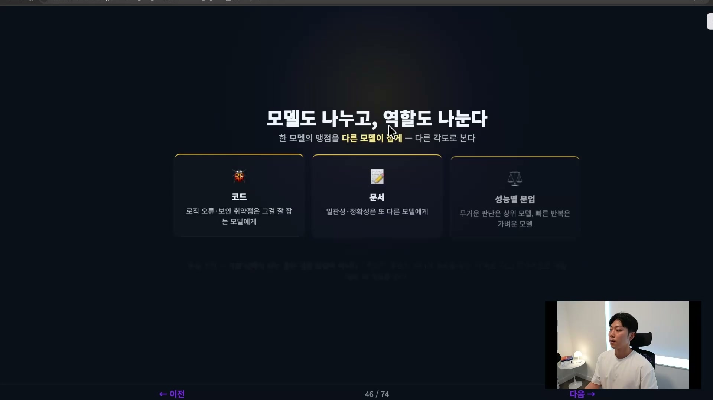
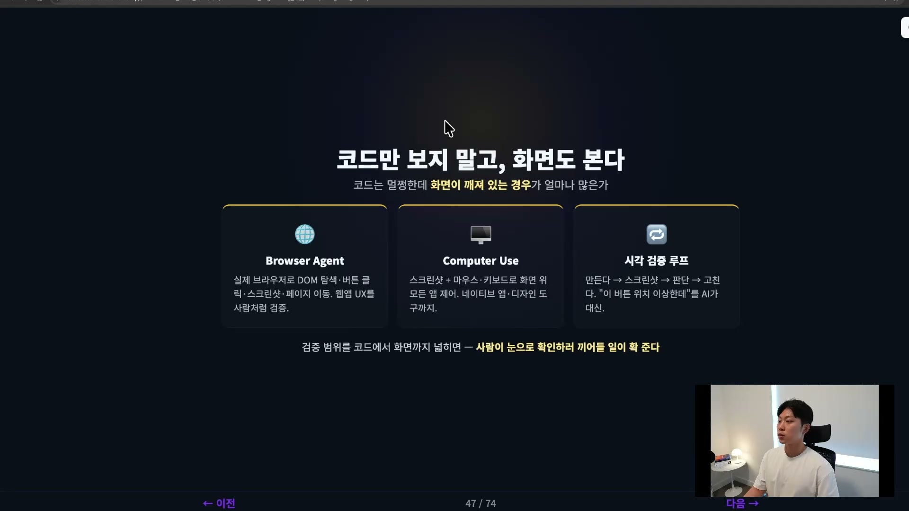
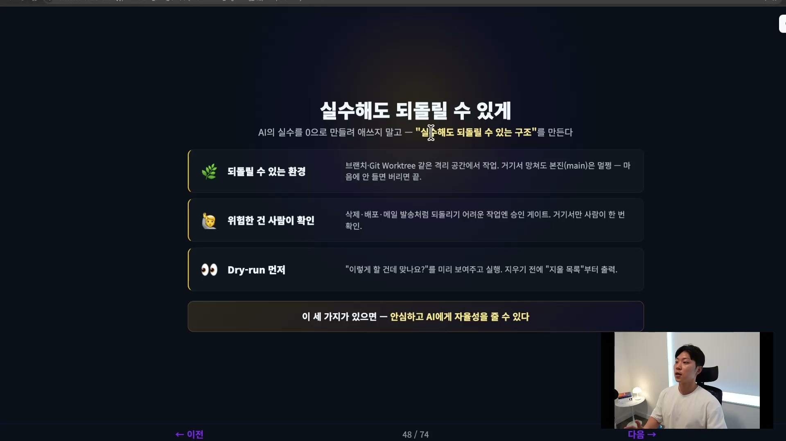
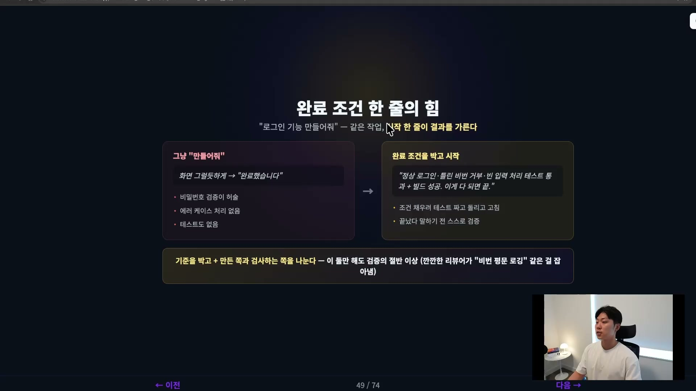

AI에게 일을 길게 맡길수록 머릿속을 떠나지 않는 질문이 하나 있다. 이 결과를 내가 어떻게 믿지. AI는 거의 항상 "다 됐습니다"라고 아주 자신 있게 말한다. 그런데 막상 테스트를 돌려보면 안 되어 있는 경우가 적지 않다. 자신감과 정확성이 따로 노는 것이다.

그래서 검증은 하네스에서 가장 중요한 축 중 하나다. AI가 자율적일수록, 한 번 시키면 오래 돌수록, 그 결과를 받아내는 검증 장치가 단단해야 한다. 검증이 부실하면 자율성은 곧 위험이 된다. 반대로 검증이 단단하면 안심하고 더 많은 일을 맡길 수 있다. 이 글은 그 검증 하네스를 다섯 가지 원칙으로 정리한 것이다.

## 기준이 없으면 검증할 수 없다

너무 당연한데 가장 자주 빠지는 함정부터 시작한다. 기준이 없으면 애초에 검증이 불가능하다.

"이거 잘 만들어줘"라고 시켰다고 해보자. 나중에 무엇을 가지고 잘 됐다 안 됐다를 판단할 수 있을까. 기준이 없으니 AI는 두 갈래 중 하나로 빠진다. 끝없이 손을 대며 멈추지 못하거나, 반대로 대충 해놓고 "끝났습니다"라고 선언하거나. 둘 다 우리가 원하는 게 아니다.

그래서 작업을 시작하기 전에 무엇을 만들고 어떻게 검증할지를 먼저 합의하고 스펙으로 적어두기를 권한다. 일종의 계약이다. 지킬 것은 세 가지다.

첫째, 완료 조건을 먼저 정한다. "이 세 가지가 되면 끝"이라고 못을 박는다.

둘째, 그 조건을 측정 가능하게 쓴다. "잘 되게"는 측정할 수 없는 말이라 쓸모가 없다. 대신 "로그인 테스트를 통과하고, 빌드가 성공하고, 응답 레이턴시가 200ms 이하"처럼 쓴다. 통과와 실패를 누가 봐도 가를 수 있는 문장이어야 한다.

셋째, 미달이면 다시 돌린다. 기준이 명확하니 자동 반복이 가능해진다.

마지막 셋째가 앞 원칙들과 이어지는 고리다. 앞 클립에서 다룬 랄프 루프, 즉 AI가 스스로 결과를 확인하고 미달이면 다시 돌리는 자동 반복은 바로 이 측정 가능한 기준을 전제로 한다. 채점 기준이 없으면 루프는 무엇을 보고 다시 돌지를 모른다. 그래서 검증과 자율 실행은 한 몸으로 생각해야 한다. 좋은 기준을 정하는 일이 곧 자율 실행의 출발점이다.

## 만든 AI한테 검사를 맡기지 마라

검증에서 가장 강력한 한 수가 여기 있다. 만드는 AI와 검사하는 AI를 분리하는 것이다.

왜 그래야 하는지는 사람의 경험으로 옮겨보면 바로 와닿는다. 내가 글을 한 편 썼고 직접 검수를 한다. 그래도 내가 못 잡는 실수가 남는다. 그런데 다른 사람이 같은 글을 읽으면 훨씬 잘 잡아낸다. 확증 편향 때문이다. 내가 쓴 글의 오타는 내 눈에 잘 안 보인다.

AI도 똑같다. 방금 AI가 짠 코드를 그 자리에서 그대로 검토시키면, 같은 맥락에 갇혀 자기 실수를 못 본다. "내가 이렇게 짰으니 맞겠지"라고 넘어간다. 더 심각한 건 자기 작업을 자기가 평가하면 품질이 어설퍼도 자신 있게 스스로를 칭찬한다는 점이다. "훌륭하게 구현했습니다"라고 본인이 본인에게 도장을 찍는다.

그래서 만드는 자, 즉 generator와 검사하는 자, 즉 evaluator를 물리적으로 분리해야 한다. 같은 대화에서 "검토해봐"라고 하는 게 아니라, 다른 세션의 다른 컨텍스트에서 평가하게 하는 것이다. 클로드의 새 세션을 열어 코드 리뷰를 시키거나, 한발 더 나아가 아예 다른 모델에게 맡긴다. 코덱스 GPT-5.5에게 오퍼스 4.8이 짠 결과를 평가하게 시키는 식이다. 새로운 눈으로 보게 하는 게 핵심이다.

실전 팁이 하나 있다. 검사하는 쪽을 깐깐하게 튜닝하는 것이 만드는 쪽을 튜닝하는 것보다 훨씬 효과가 좋다. generator에게 "겸손하게 자기를 검토하라"고 백날 말해봐야 잘 안 된다. 차라리 evaluator 에이전트에게 "너는 깐깐한 리뷰어고 문제를 잘 찾아내야 한다"고 시키는 편이 훨씬 효과적이다. 검증의 에너지는 검사하는 쪽에 써야 한다.

## 모델도 나누고, 역할도 나눈다

분리에서 한 발 더 나아가면, 검사하는 쪽을 단순히 다른 세션이 아니라 다른 모델로 두는 단계가 나온다. 다른 모델, 다른 역할로 교차 검증을 하는 것이다.

이유는 모델의 출신에 있다. 한 모델은 같은 트레이닝 데이터로 학습했기 때문에 잘하는 영역은 잘하지만, 못하는 영역은 똑같이 못할 확률이 높다. 그러니 같은 모델에게 자기 약점을 잡아내라고 시켜봐야 그 약점에는 똑같이 눈이 먼다. 그래서 다른 트레이닝 데이터셋으로 학습된 다른 모델, 말하자면 다른 두뇌를 붙인다. 한 모델의 맹점을 다른 모델이 다른 각도에서 잡게 하는 것이다.

나누는 방식은 두 갈래다. 하나는 역할별 분업이다. 코드의 로직 오류나 보안 취약점을 잘 잡는 모델이 따로 있고, 문서의 일관성이나 정확성을 잘 잡는 모델이 따로 있다. 검사 대상의 성격에 맞는 모델을 골라 붙인다.

다른 하나는 성능별 분업이다. 무겁고 복잡한 판단은 오퍼스 같은 상위 모델에게 맡기고, 빠르게 반복할 가벼운 작업은 하이쿠 같은 가벼운 모델에게 맡긴다. 서로 다른 모델이 서로 다른 각도에서, 서로 다른 일을 하게 만드는 편이 훨씬 효율적이다.

현실적인 조언을 하나 더 보태면, 기본 상태의 AI는 사실 그리 좋은 검증 담당이 아니다. 그냥 "검토해줘"라고 하면 웬만하면 통과시키고 만다. 그래서 검증 담당도 튜닝을 거쳐야 한다. 깐깐한 리뷰 스킬이나 검증 전용 에이전트를 만드는 식이다. 요즘은 코드래빗처럼 리뷰를 대신해주는 SaaS도 많으니 그런 도구를 붙이는 선택지도 있다.

## 코드만 보지 말고, 화면도 본다

네 번째는 검증의 범위를 넓히는 일이다. 코드를 검증하는 데서 멈추지 말고 화면도 직접 보고 확인할 수 있어야 한다.

코드는 멀쩡한데 화면이 깨져 있는 경우가 많다. 로직만 통과한다고 사용자가 보는 결과가 멀쩡하다는 보장은 없다. 그러니 서비스를 실제로 올려서 직접 확인하게 만들어야 한다. 화면 검증은 세 가지 도구로 나뉜다.

첫째는 Browser Agent다. 실제 크롬 브라우저를 띄워서 DOM을 탐색하고, 버튼을 클릭하고, 스크린샷을 찍고, 페이지를 이동한다. 웹앱의 실제 UI와 UX를 사람처럼 따라 밟으며 검증하는 것이다.

둘째는 Computer Use다. 스크린샷과 마우스, 키보드로 화면 위의 모든 앱을 제어한다. 브라우저를 넘어 네이티브 앱이나 디자인 도구까지 검증 범위에 들어온다.

셋째는 시각 검증 루프다. 만든 결과의 스크린샷을 찍고, 그 스크린샷을 보고 판단하고, 고친다. "이 버튼 위치가 이상한데" 같은, 원래 사람이 눈으로 하던 판단을 AI가 대신하게 만드는 것이다.

검증 범위를 코드에서 화면까지 넓히면, 사람이 일일이 눈으로 확인하러 끼어들 일이 확 줄어든다. 그것이 이 원칙의 목적이다.

## 실수해도 되돌릴 수 있게

다섯 번째는 검증과 짝을 이루는 안전장치, 가드레일이다.

먼저 마음가짐부터 바로잡아야 한다. AI의 실수를 0으로 만들려고 애쓰는 건 시간 낭비다. AI는 무조건 실수를 한다. 그걸 완벽히 막는 건 어차피 불가능하다. 그러니 현실적인 답은 방향을 바꾸는 것이다. 실수를 막는 대신, 실수를 해도 되돌릴 수 있는 구조를 만든다. 이쪽이 투자 가치가 훨씬 높다. 가드레일도 세 가지다.

첫째, 되돌릴 수 있는 환경에서 작업시킨다. 브랜치나 Git Worktree 같은 격리된 공간에서 작업하는 습관을 들인다. AI가 거기서 무엇을 망쳐도 본진, 즉 메인 브랜치는 멀쩡하다. 메인 브랜치에 절대 푸시하지 못하게 막아두고, 결과가 마음에 안 들면 그 브랜치나 Worktree를 통째로 버리면 끝이다.

둘째, 위험한 건 사람이 확인한다. 삭제, 배포, 외부로 메일이나 메시지 발송처럼 되돌리기 어려운 작업이 있다. 이런 작업에는 승인 게이트를 무조건 두어, 사람이 한 번 확인하고 실행하게 만든다.

셋째, dry run을 먼저 보여준다. "이렇게 할 건데 맞나요"를 미리 보여주고 실행하게 하는 것이다. 예를 들어 삭제 작업을 하기 전에 지울 목록을 먼저 출력하는 식이다. 실행 결과를 미리 펼쳐 보이고 나서 실제로 손을 댄다.

이 세 가지가 갖춰지면 안심하고 AI에게 어느 정도의 자율성을 줄 수 있다. 실수를 해도 안전하기 때문이다.

## 다섯 원칙이 한 번에 맞물리는 자리

이 다섯 원칙이 실제로 어떻게 엮이는지 짧은 사례로 보면 분명해진다. 로그인 기능을 만드는 같은 작업인데, 시작 한 줄이 결과를 가른다.

"로그인 만들어줘"라고만 시키면, AI는 화면을 그럴듯하게 만들어 놓고 "완료했습니다"라고 한다. 그런데 막상 보면 비밀번호 검증이 전혀 안 되어 있고, 에러 케이스 처리도 없고, 테스트도 없을 수 있다.

같은 작업을 이렇게 시작하면 달라진다.

> 로그인 기능을 만들 건데 완료 조건을 줄게. 정상 로그인 테스트 통과, 틀린 비번 거부 테스트 통과, 빈 입력 처리 테스트 통과, 그리고 빌드 성공. 이게 다 되면 끝이야.

검증을 처음부터 박아둔 것이다. 그러면 AI는 그 조건을 채우려고 테스트를 짜고, 돌려보고, 실패하면 고친다. 끝났다고 말하기 전에 스스로 검증할 기준이 생긴다.

여기서 검증을 한 단계 더 단단히 하려면, 그 결과를 다른 세션의 깐깐한 리뷰어에게 한 번 더 던진다. "이 로그인 구현에서 보안 취약점이나 빠진 엣지 케이스를 찾아내라"고 시키는 것이다. 만든 AI한테 검사를 맡기면 비밀번호를 평문으로 로깅하는 것 같은 구멍도 자신 있게 통과시킨다. 그래서 generator와 evaluator를 나눈다. 기준을 박는 것과 만든 쪽 · 검사하는 쪽을 나누는 것, 이 두 가지만 해도 사실 검증의 절반 이상이 잘 된다.

## 다섯 원칙 한눈에

| 원칙 | 핵심 | 한 줄 |
| --- | --- | --- |
| 기준을 먼저 | 측정 가능한 완료 조건을 합의하고 스펙으로 박는다 | 채점 기준이 없으면 루프가 돌 데가 없다 |
| Generator · Evaluator 분리 | 만든 쪽과 검사하는 쪽을 다른 세션 · 컨텍스트로 가른다 | 같은 맥락에 갇히면 같은 실수를 못 본다 |
| 모델 · 역할 교차 검증 | 다른 두뇌로, 코드 · 문서 · 성능별로 나눠 본다 | 검사하는 쪽을 깐깐하게 튜닝한다 |
| 코드 말고 화면까지 | Browser Agent · Computer Use · 시각 검증 루프 | 코드는 멀쩡한데 화면이 깨진 경우가 많다 |
| 되돌릴 수 있는 안전장치 | 격리 환경 · 승인 게이트 · dry run | 실수를 0으로가 아니라 되돌릴 수 있게 |

가장 자주 빠지는 곳을 한 문장으로 줄이면 이렇다. 만든 AI한테 검사를 맡기지 마라.

여기까지가 맥락 설계, 계획, 실행, 검증까지 지금껏 쌓아온 하네스의 축들이다. 그런데 한 가지가 더 남는다. 하네스는 한 번 만들고 끝이 아니다. 쓰면서 계속 좋아져야 한다. 그 마지막 축이 개선이다.
