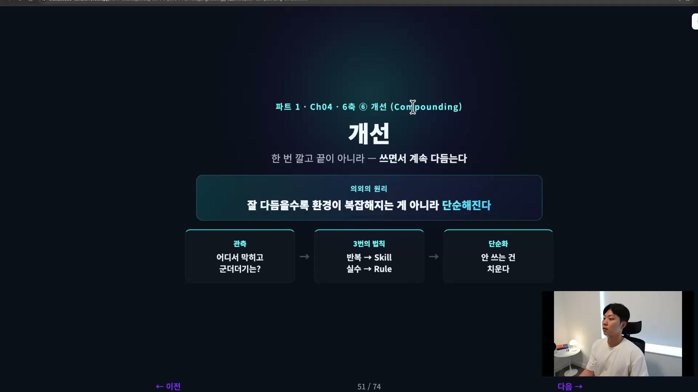
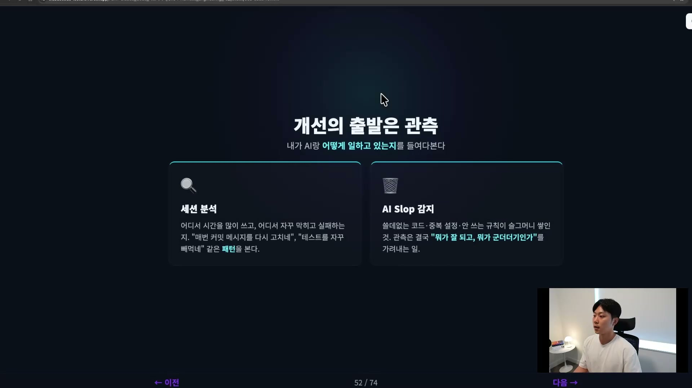
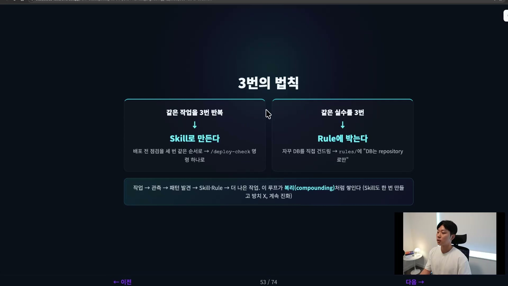
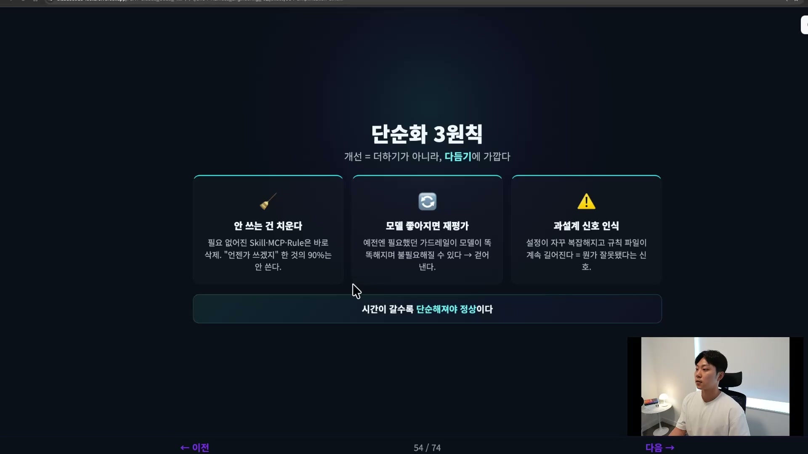
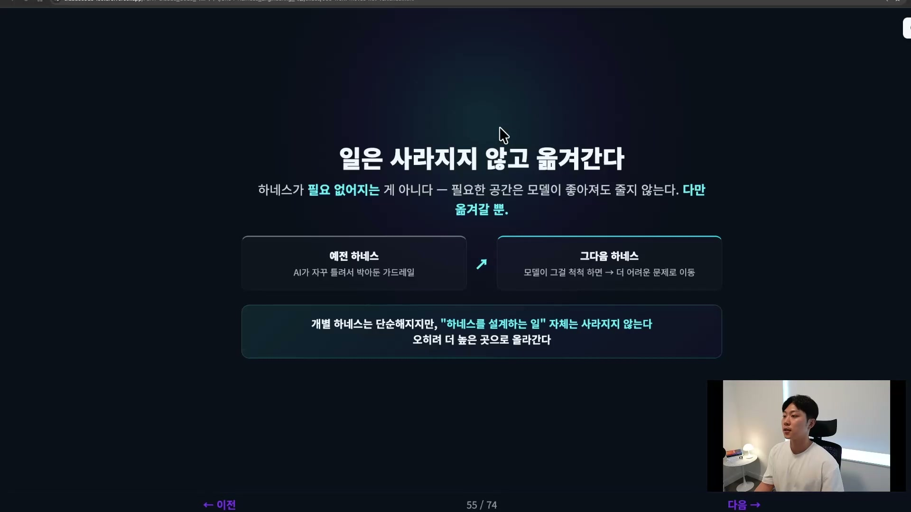
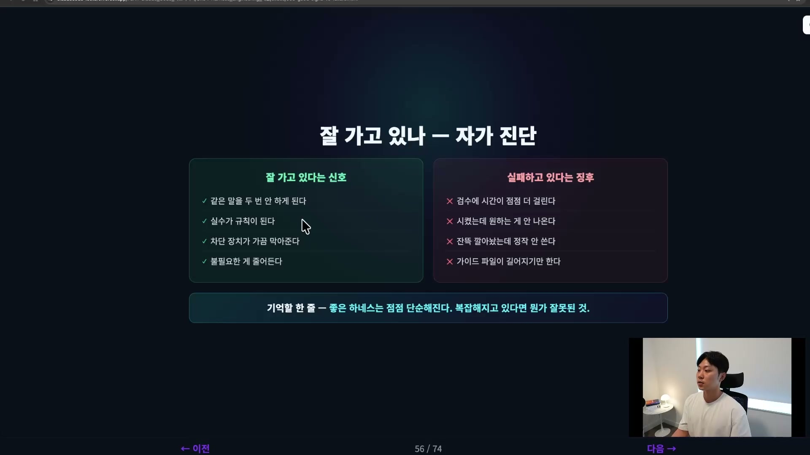
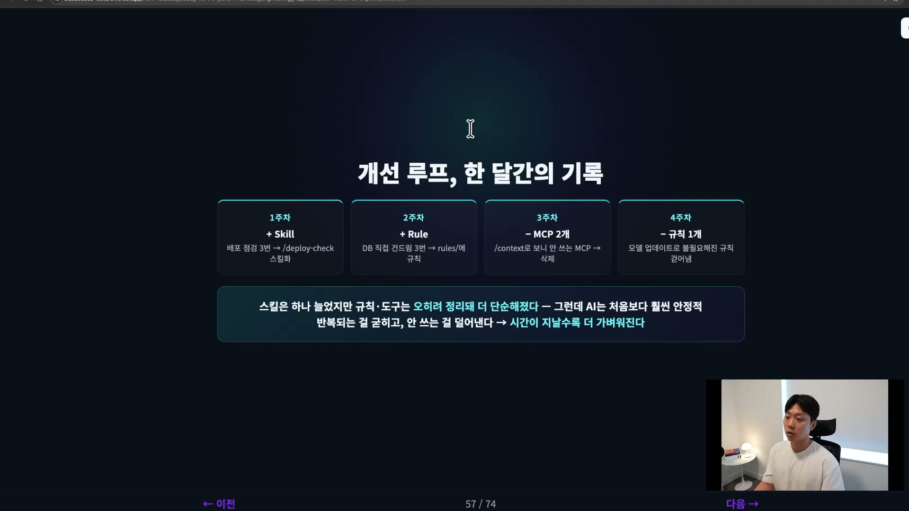
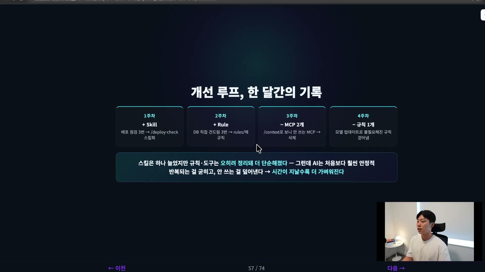
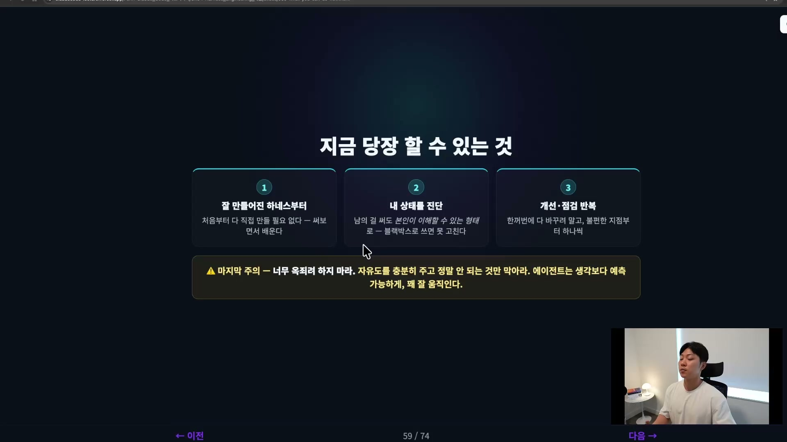

하네스(harness, AI가 일하는 환경)는 한 번 깔고 끝나는 설정이 아니다. 쓰면서 계속 다듬어야 하는 살아 있는 것이다. 그런데 이 '다듬기'에는 의외의 원리가 하나 박혀 있다. 잘 다듬을수록 환경이 복잡해지는 게 아니라 오히려 단순해진다는 것.

보통 '개선'이라고 하면 뭔가를 자꾸 더하는 그림을 떠올린다. 규칙을 추가하고, 도구를 붙이고, 가드레일을 하나 더 세우고. 좋은 하네스는 살짝 반대로 간다. 더하기보다 덜어내기에 가깝다. 이 역설이 Harness Engineering의 마지막 축인 '개선(compounding)'의 핵심이다.

## 개선의 출발은 관측

다듬으려면 먼저 봐야 한다. 내가 AI랑 실제로 어떻게 일하고 있는지를 들여다보는 일, 그게 관측이다. 볼 것은 크게 둘이다.

하나는 세션 분석이다. 에이전트가 어디서 시간을 많이 쓰는지, 어디서 자꾸 막히고 실패하는지를 본다. 매번 커밋 메시지를 내가 다시 고쳐 쓰게 만든다든가, 테스트 짜는 걸 계속 빼먹는다든가, 같은 에이전트가 같은 자리에서 헛발질하는 패턴이 보이기 시작한다. 요즘은 세션 로그를 분석해 프롬프트 패턴이나 도구 호출 빈도를 뽑아주는 도구도 많다.

다른 하나는 AI 슬롭(AI slop) 감지다. 작업을 하다 보면 쓸데없는 코드, 중복된 설정, 더는 안 쓰는 규칙이 슬그머니 쌓인다. 이게 테크 뎁트(tech debt, 기술 부채)다. 결국 관측이란 뭐가 잘 되고 있고 뭐가 군더더기인지를 가려내는 일이다.

## 3번의 법칙: 작업 3번이면 Skill, 실수 3번이면 Rule

관측에서 패턴을 찾았으면, 이제 그 패턴을 처리해야 한다. 여기서 쓰는 기준이 '3번의 법칙'이다. 횟수 자체가 마법인 건 아니고, 세 번이면 '이건 한 번 우연이 아니라 반복되는 구조다'라고 판단하기에 충분한 신호라는 뜻이다.

같은 작업을 세 번 반복했다면, 그건 Skill로 만든다. 배포 전 점검이나 코드 리뷰를 세 번쯤 똑같은 순서로 했다면 자동화할 때가 됐다는 신호다. 이를테면 린트 돌리고, 테스트 돌리고, 빌드 확인하는 절차를 `/deploy-check` 같은 스킬로 굳혀서, 다음부터는 명령 하나로 부른다.

같은 실수를 세 번 했다면, 그건 Rule이나 CLAUDE.md에 박는다. AI가 자꾸 같은 실수를 반복한다면, 예를 들어 자꾸 프로덕션 DB를 직접 건드린다면, 그건 환경에 규칙으로 못 박을 때다. rules 폴더에 "DB는 repository를 통해서만" 같은 줄을 추가해 두는 식이다.

| 관측한 것 | 처리 | 결과물 |
| --- | --- | --- |
| 같은 작업을 3번 반복 | 자동화한다 | Skill (`/deploy-check` 등) |
| 같은 실수를 3번 | 규칙으로 못 박는다 | Rule · CLAUDE.md |

한 가지 빠지기 쉬운 함정. 만들어 놓은 스킬은 한 번 만들고 방치하면 안 된다. 그 스킬을 쓰고, 세션을 분석해 병목을 찾고, 다시 그 스킬을 다듬는다. 스킬도 계속 개선 대상이다.

한 문장으로 묶으면 이렇다. 작업을 하고, 관측을 하고, 패턴을 발견하면 Skill이나 Rule로 굳혀 더 나은 하네스를 만든다. 이 루프를 한 바퀴 돌 때마다 환경이 좋아지고, 좋아진 환경이 다음 작업을 또 좋게 만든다. 복리(compounding)처럼 쌓인다. 이 축의 이름이 '개선'이면서 영어로 compounding인 이유가 여기 있다.

## 단순화의 역설: 개선은 더하기가 아니라 다듬기

이제 앞에서 말한 역설이 작동하는 자리다. 개선 루프가 더하기만 하는 게 아니라는 건, 같은 루프 안에 덜어내는 일이 들어 있다는 뜻이다. 덜어내는 데도 세 가지 원칙이 있다.

첫째, 안 쓰는 건 치운다. 필요 없어진 스킬, MCP, 룰은 미루지 말고 바로 삭제한다. 이게 쌓이면 그게 곧 AI 슬롭이고, 컨텍스트만 잡아먹는다. "언젠가 쓰겠지" 하고 둔 것의 90%는 결국 안 쓰는 패턴을 보게 된다.

둘째, 모델이 좋아지면 하네스를 재평가한다. 예전에는 필요했던 가드레일이 모델이 똑똑해지면서 불필요해질 수 있다. 옛날에는 AI가 계속 틀려서 박아둔 규칙인데 지금은 안 틀린다면, 그 규칙은 없애야 한다. 최근 Opus가 4.7에서 4.8로 올라간 것처럼 모델이 좋아졌을 때, Opus한테 "하네스 점검해 줘"라고 한번 시켜 보는 것도 좋은 패턴이다.

셋째, 과설계의 신호를 인식한다. 설정이 자꾸 복잡해지고 규칙 파일이 계속 길어지고 있다면, 그건 뭔가 잘못됐다는 신호로 받아들여야 한다.

## 일은 사라지지 않고 옮겨간다

여기서 오해하면 안 되는 지점이 있다. 단순화한다고 해서 하네스를 없애는 게 아니다. 하네스가 필요 없어지는 것도 아니다.

하네스가 필요한 공간은 모델이 좋아져도 줄어들지 않는다. 다만 옮겨갈 뿐이다. 모델이 예전에 못하던 걸 이제 척척 해낸다면, 그 영역(area)은 더 이상 하네스에 둘 필요가 없어진다. 대신 우리는 그 하네스를 더 어려운 문제로 옮겨갈 수 있다. 그래서 개별 하네스는 단순해질 수 있지만, 하네스를 설계하는 일 자체는 사라지지 않는다. 오히려 더 높은 곳으로 올라간다. 앞으로도 필요한 역량으로 남는다는 뜻이다.

## 잘 가고 있나: 자가 진단

하네스가 잘 설계되고 잘 개선되고 있는지는 몇 가지 신호로 점검할 수 있다.

잘 가고 있다는 신호는 이렇다. Claude가 같은 말을 두 번 안 하게 된다. 맥락 전달이 잘 되고 있다는 뜻이다. 실수가 규칙이 된다. 개선 루프가 잘 돌고 있다는 뜻이다. 차단 장치가 가끔 막아준다. 사고가 구조적으로 예방되고 있다는 뜻이다. 그리고 불필요한 게 줄어든다. 복잡해지는 게 아니라 단순해지고 있다는 좋은 신호다.

반대로 실패하고 있다는 징후는 이렇다. 검수에 시간이 점점 더 걸린다. 시켰는데 원하는 게 안 나온다. 스킬이나 에이전트는 잔뜩 깔아놨는데 정작 잘 안 쓴다. 가이드 파일이 길어지기만 하고 관리가 안 된다. 이런 특징이 몇 개만 보여도 손을 볼 때가 된 거다.

기억할 한 줄로 요약하면, 좋은 하네스는 점점 단순해진다. 복잡해지고 있다면 뭔가 잘못된 거다.

## 개선 루프, 한 달간의 기록

이 루프가 실제로 어떻게 도는지 한 달짜리 흐름으로 그려보면 감이 온다.

- **1주차 (+ Skill).** 배포 전 점검을 매번 말로 시킨다. "린트 돌리고 테스트 돌리고 빌드 확인해 줘." 세 번쯤 반복하니 스킬로 만들 때가 됐다 싶어 `/deploy-check`를 만든다.
- **2주차 (+ Rule).** AI가 자꾸 프로덕션 DB를 건드린다. 한 번, 두 번, 세 번. 세 번째에 rules에 "데이터베이스는 건드리지 마라"를 추가하고, 그다음부터는 틀리지 않는다.
- **3주차 (− MCP 2개).** 컨텍스트를 보니 예전에 깔아둔 MCP 두 개가 컨텍스트만 잔뜩 차지하고 한 번도 안 쓰이고 있다. 미련 없이 지운다.
- **4주차 (− 규칙 1개).** 모델이 업그레이드됐다. 예전에 AI가 자꾸 틀려서 추가했던 규칙 하나가 이제 불필요해진 걸 발견하고, 그것도 걷어낸다.

한 달 뒤를 보면 재밌는 일이 벌어져 있다. 스킬은 하나 늘었지만 규칙과 도구는 오히려 정리돼 더 단순해졌다. 그런데 AI는 처음보다 훨씬 안정적으로 일한다. 이게 개선 루프의 모습이다. 뭔가를 자꾸 더하는 것만이 하네스를 좋게 만드는 게 아니다. 반복되는 걸 굳히고, 안 쓰는 걸 덜어낸다. 그래서 좋은 하네스는 시간이 지날수록 더 가벼워질 수 있다.

## 사람의 역할은 어디로 옮겨가나

이렇게 여섯 개의 축을 다 돌았다. 구조를 설계하고, 맥락을 설계하고, 계획을 세우고, 실행하고, 검증하고, 개선 루프를 돈다. 그럼 AI가 코드를 다 쓰는 시대에 사람은 뭘 해야 할까.

세 가지로 정리된다. 비즈니스가 바뀌면 구조를 발전시키고, 맥락(CLAUDE.md 같은 문서들)을 코드와 함께 최신으로 유지하고, 개선 루프를 계속 점검한다. 반복된 실수는 규칙으로, 반복된 작업은 스킬로, 안 쓰는 건 클린업한다. 한 문장으로 줄이면, 사람의 역할은 '코드를 잘 짜는 것'에서 'AI가 잘 일하는 환경을 설계하는 것'으로 옮겨간다. 코드가 잘 나오는 환경, AI가 잘 일할 수 있는 환경을 설계하는 사람이 되는 것이다.

## 지금 당장 할 수 있는 것

추상적인 이야기로 끝나지 않게, 당장 손댈 수 있는 세 가지를 짚어 둔다.

첫째, 이미 잘 만들어진 하네스부터 써본다. 처음부터 직접 만들 필요는 없다. Superpowers, gstack, oh-my-codex 같은 유명한 하네스를 한번 써보면 AI가 더 잘한다는 게 느껴진다.

둘째, 내 상태를 진단한다. 여기서 제일 중요한 건, 남이 만든 걸 그대로 쓰더라도 본인이 이해할 수 있는 형태로 써야 한다는 점이다. 하네스가 어떻게 동작하는지 모르고 블랙박스로 갖다 쓰면, 정작 커스터마이즈가 필요할 때 손을 못 댄다. 배우는 것도 없다.

셋째, 개선과 점검을 반복한다. 한꺼번에 다 바꾸려 하지 말고, 불편한 지점부터 하나씩 개선해 나가면 충분하다.

마지막으로 주의 하나. 하네스를 설계할 때 AI 에이전트를 너무 옥죄려 하지 마라. 규칙을 너무 빡빡하게 채우려 들지 마라. 자유도를 충분히 주고, 안 될 때 하나씩 add하는 게 훨씬 낫다. 생각보다 가볍게 시작해야 하고, 에이전트는 생각보다 예측 가능하게 꽤 잘, 자율적으로도 잘 움직인다. 오히려 가드레일을 너무 많이 세우거나 규칙을 너무 많이 만들면 일을 못한다.

이것도 결국 단순화의 역설과 같은 자리에서 만나는 말이다. 좋은 하네스는 더 많은 통제가 아니라, 더 적은 통제로 더 잘 돌아가는 쪽으로 간다.
