하네스는 에이전트와 스킬로 짜인 AI 작업 파이프라인이다. 앞 실습에서는 그 하네스를 손으로 깔았다. 여섯 가지 축을 하나씩 직접 얹어 작업 구조를 만들었다. 이번 실습의 출발점은 거기서 한 칸 위로 올라간다. 하네스를 자동으로 만들어주는 하네스를 쓴다.

이걸 메타 하네스라고 부른다. 메타라는 말은 "자기 자신에 적용한다"는 뜻이다. 하네스가 작업을 자동화하는 도구라면, 메타 하네스는 그 하네스 만들기를 자동화하는 하네스다. 카카오톡의 황민호가 레브팩토리(revfactory)라는 깃헙 계정에 'harness'라는 클로드 코드 플러그인으로 올려놨다. 도메인을 한 문장으로 설명하면, 그 도메인에 맞는 에이전트 팀과 스킬을 알아서 생성해준다.

강의에서는 코드 대신 일부러 다른 주제를 골랐다. "웹툰을 제작해주는 하네스를 만들어 달라"는 한 문장을 이 플러그인에 던진다. 그 한 문장에서 에이전트 팀 6개와 스킬 7개로 된 웹툰 콘텐츠 파이프라인이 통째로 만들어지고, 그걸로 실제 웹툰 3컷까지 뽑는다. 이 글은 그 과정을 따라가며 메타 하네스가 무엇이고, 어떤 단계로 하네스를 찍어내며, 그게 왜 의미 있는지 정리한다.

## 마켓플레이스에서 플러그인을 받는다

이 하네스는 클로드 코드 플러그인이다. 받는 절차는 우리가 팀 플러그인을 배포해 쓰는 방식과 똑같다. 구글에 "revfactory"를 검색하면 맨 위에 `revfactory/harness`가 나온다. 그 깃헙 README에 설치법이 친절하게 적혀 있다.

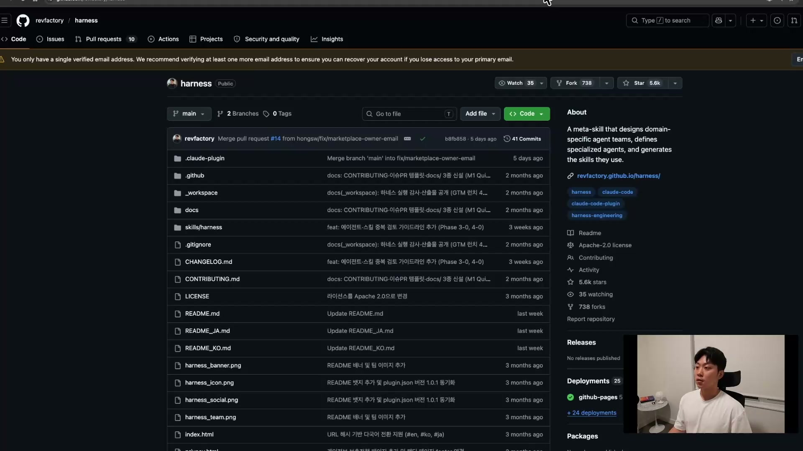

순서는 두 단계다. 먼저 마켓플레이스를 등록하고(`/plugin marketplace add`), 그다음 플러그인을 설치한다(`/plugin install`). 설치 범위는 두 가지 중에 고른다. 이 컴퓨터 전체에서 쓰는 user scope, 지금 폴더에서만 쓰는 project scope. 강의에서는 project scope로 깔았다. 회사라면 보통 사내 마켓플레이스가 있고, 거기에 팀이 만든 플러그인을 올려 인스톨하는 식이다.

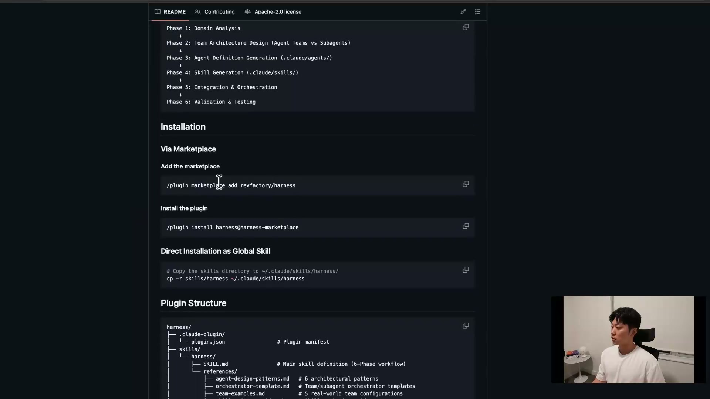

설치 후 한 가지를 빼먹으면 안 된다. 플러그인이나 스킬을 새로 깔면 세션을 껐다 켜거나 Reload를 해줘야 한다. 안내문에도 "Reload Plugin to Apply"라고 적혀 있다. 이걸 안 하면 방금 깐 플러그인도, 스킬도 목록에 나타나지 않는다.

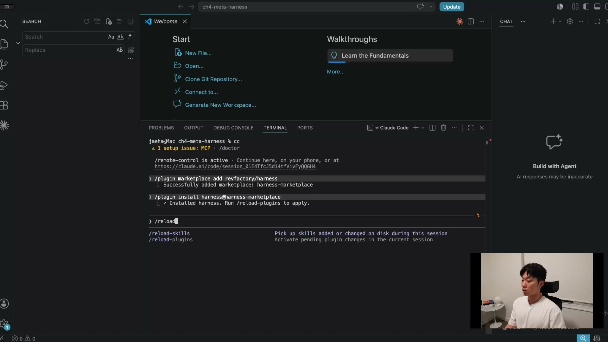

리로드까지 끝나면 `/harness`라는 슬래시 명령이 생긴다. 여기에 "툴 만드는 harness 구성해줘"처럼 도메인을 한 문장으로 적어 넣으면 된다.

## 메타 하네스의 정체, 아키텍처 공장

도메인 한 문장에서 에이전트 팀이 튀어나오는 게 어떻게 가능한가. 강사의 표현을 빌리면 이건 "아키텍처 공장"이다. 복잡한 작업을 전문화된 에이전트들의 협업 팀으로 분해하고, 그 팀을 미리 정해진 패턴 위에 얹는다.

그 패턴이 여섯 가지다. 어떤 도메인이든 이 여섯 중 하나 또는 둘의 조합으로 표현된다는 게 핵심 발상이다.

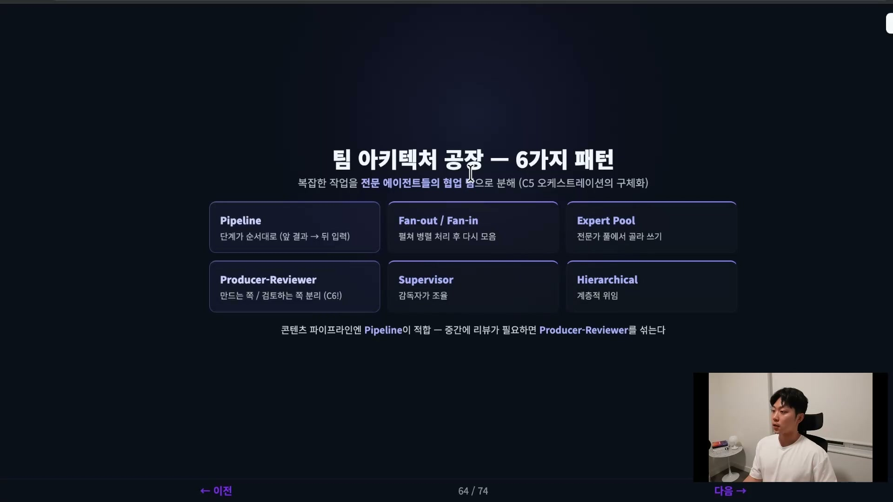

| 패턴 | 한 줄 정의 |
| --- | --- |
| Pipeline | 단계가 순서대로 이어진다(앞 결과가 뒤 입력) |
| Fan-out / Fan-in | 펼쳐 병렬 처리한 뒤 다시 한곳으로 모은다 |
| Expert Pool | 전문가 풀에서 필요한 걸 골라 쓴다 |
| Producer-Reviewer | 만드는 쪽과 검토하는 쪽을 분리한다 |
| Supervisor | 감독자 한 명이 전체를 조율한다 |
| Hierarchical | 상위가 하위에 일을 계층적으로 위임한다 |

웹툰처럼 기획에서 작화까지 단계가 한 방향으로 흐르는 콘텐츠 작업에는 Pipeline이 맞는다. 중간에 검수가 끼어야 하면 Producer-Reviewer를 섞는다. 만드는 에이전트와 검증하는 에이전트를 따로 두는 이 분리는 앞 실습에서도 강조됐던 원칙이다. 메타 하네스는 도메인을 분석해 이 패턴들을 알아서 골라 깐다.

## 6단계 생성 워크플로우

`/harness`에 도메인 한 문장을 던지면 플러그인은 정해진 6단계를 차례로 돈다. 손으로 하네스를 짤 때 거치는 흐름과 거의 같은 순서다.

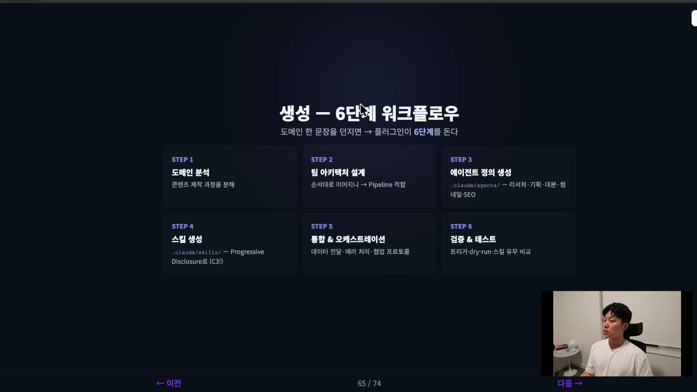

| 단계 | 하는 일 |
| --- | --- |
| 1. 도메인 분석 | 콘텐츠 제작 과정을 잘게 분해한다 |
| 2. 팀 아키텍처 설계 | 흐름을 보고 패턴을 고른다(웹툰은 Pipeline) |
| 3. 에이전트 정의 생성 | `.claude/agents/`에 역할별 에이전트를 만든다 |
| 4. 스킬 생성 | `.claude/skills/`에 에이전트가 쓸 매뉴얼을 만든다 |
| 5. 통합 및 오케스트레이션 | 데이터 전달, 에러 처리, 협업 프로토콜을 잇는다 |
| 6. 검증 및 테스트 | 트리거와 dry-run으로 제대로 도는지 확인한다 |

3단계와 4단계는 한 쌍이다. 에이전트는 일을 맡은 담당자이고, 스킬은 그 담당자가 펼쳐 보는 매뉴얼이다. 강사의 비유로 "스킬은 매뉴얼"이다. 그래서 에이전트마다 거의 일대일로 스킬이 하나씩 붙는다.

## 실제로 도는 모습, 현황 감사부터

"웹툰 만드는 하네스를 만들어 달라"고 하면 플러그인은 곧장 만들기 시작하지 않는다. 먼저 현황 감사를 한다. 기존 하네스가 있는지 본다. 없으니 신규 구축 시나리오로 들어간다.

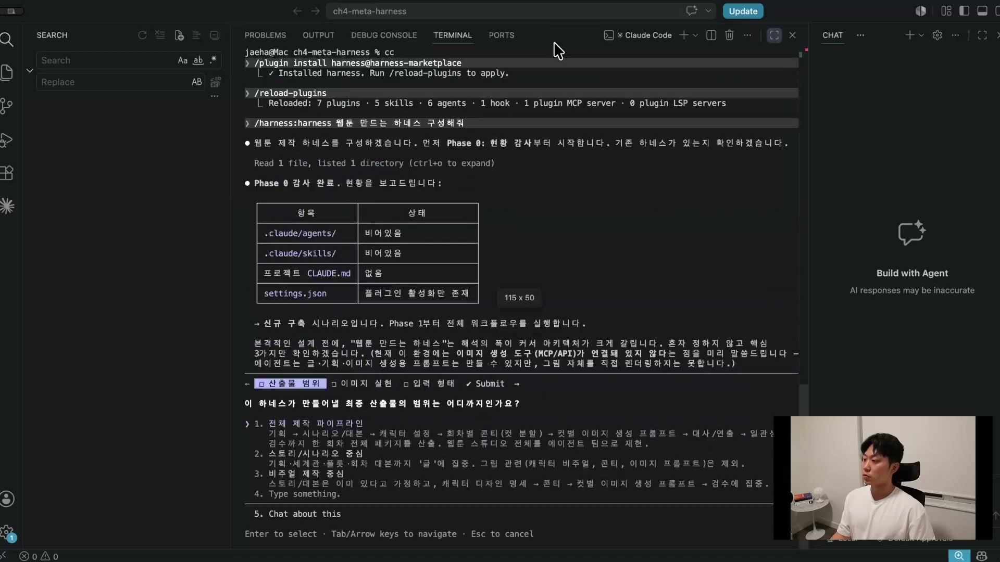

그다음 사람에게 몇 가지를 되묻는다. 최종 산출물 범위를 전체 제작 파이프라인으로 할지, 스토리 시나리오 중심으로 할지, 비주얼 제작 중심으로 할지. 그림은 이미지 생성 프롬프트까지만 뽑을지, 실제 이미지 렌더링까지 할지. 매번 넣을 입력은 어떤 형태일지. 강의에서는 전체 파이프라인, 실제 렌더링, 한 줄 아이디어 입력으로 답한다.

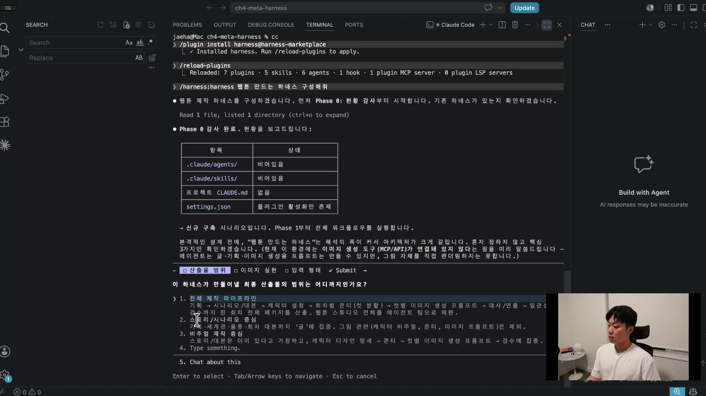

렌더링을 하기로 했으니 이미지 모델이 필요하다. 강의에서는 OpenAI의 gpt-image-2를 쓴다. 강사는 "제가 봤을 때는 제일 이미지 잘 생성해주는 모델인 것 같다"며 고른다. 이 모델을 부르려면 OpenAI API 키가 있어야 하고, 키는 OpenAI 플랫폼에서 Create API Key로 발급받는다. 여기서 발생하는 비용은 토큰과 별개로 이미지 생성 쪽에 붙는다.

## 에이전트 팀 6개가 만들어진다

질문에 답하고 나면 설계가 5개 페이즈로 나뉘어 실제 생성이 시작된다. 도메인은 웹툰 에피소드, 실행 모드는 하이브리드로 잡힌다. 그리고 에이전트 팀 6개가 한 번에 만들어진다.

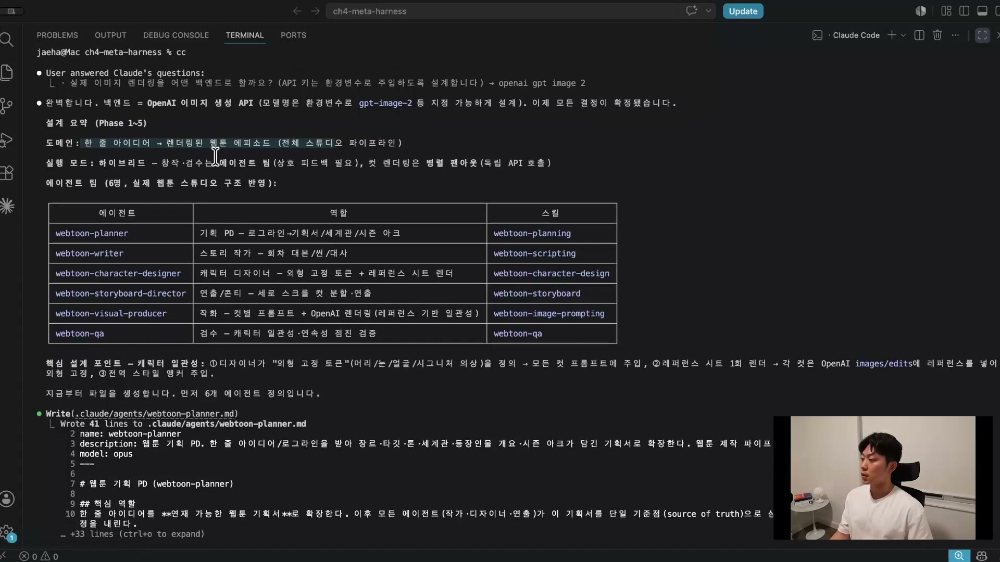

| 에이전트 | 역할 | 붙은 스킬 |
| --- | --- | --- |
| webtoon-planner | 기획 PD, 로그라인을 기획서로 확장 | webtoon-planning |
| webtoon-writer | 스토리 작가, 회차 대본 집필 | webtoon-scripting |
| webtoon-character-designer | 캐릭터 디자이너, 외형 고정과 레퍼런스 시트 렌더 | webtoon-character-design |
| webtoon-storyboard-director | 연출과 콘티, 세로 스크롤 컷 분할 | webtoon-storyboard |
| webtoon-visual-producer | 작화, 컷별 프롬프트와 OpenAI 렌더 | webtoon-image-prompting |
| webtoon-qa | 검수, 캐릭터 일관성과 연속성 정합 검증 | webtoon-qa |

만들어진 에이전트 정의는 전부 같은 포맷을 따른다. 핵심 역할, 작업 원칙, 입력, 출력, 프로토콜, 에러 핸들링, 협업, 호출 지침. 예를 들어 웹툰 플래너는 "한 줄 아이디어 로그라인을 받아 장르, 타겟, 톤, 세계관, 등장인물, 시즌 아크가 담긴 기획서로 확장한다"가 핵심 역할로 적힌다.

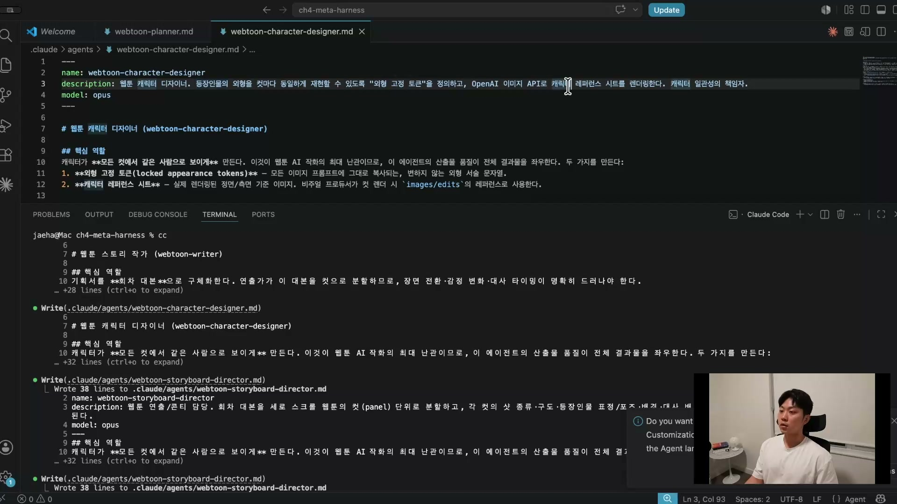

여기서 핵심 설계 포인트 하나가 캐릭터의 일관성이다. 웹툰은 같은 인물이 컷마다, 회차마다 똑같이 보여야 한다. 캐릭터 디자이너 에이전트는 등장인물의 외형을 컷마다 동일하게 유지하려고 외형 고정 토큰을 정의하고, 캐릭터 레퍼런스 시트를 렌더링한다. 이 일관성을 책임지는 에이전트가 따로 있다는 게 설계의 디테일이다.

에이전트 6개가 끝나면 핵심 실행 코드인 렌더링 스크립트를 만든다. OpenAI Image API를 부르는 render 스크립트다. 그 위에 스킬 7개를 얹는다. 스티치(이어붙이기) 스킬, 이미지 프롬프팅 스킬 같은 것들이다. 사이드바에 에이전트 6개와 스킬 트리가 차례로 쌓이는 게 보인다.

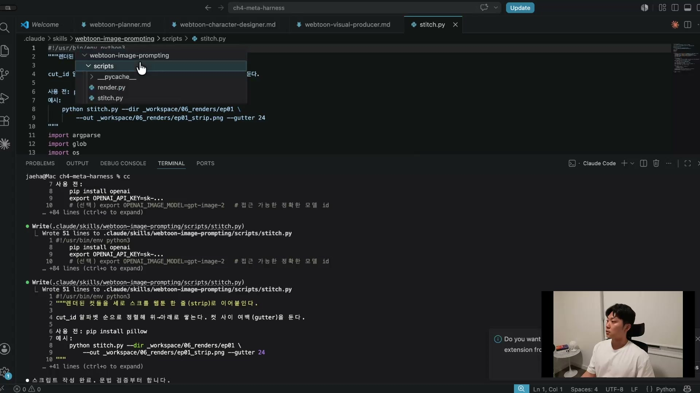

스킬 하나를 열어보면 매뉴얼답게 짜여 있다. 예를 들어 이미지 프롬프팅 스킬은 프롬프트를 4개의 블록으로 조합하는 방식을 정해둔다. 막연히 "이미지 잘 그려"가 아니라, 어떤 블록을 어떤 순서로 합쳐 프롬프트를 만들지를 디테일하게 규정한다.

마지막은 페이즈 6 검증이다. 검증이 100% 통과로 나오고, 개선점 한 가지를 스스로 찾아 고친다. 이 검증이 끝나는 순간이 곧 하네스가 완성되는 순간이다. 강사의 말처럼 "이게 하네스"다. 도메인 한 문장에서 에이전트 팀과 스킬, 스크립트가 붙은 웹툰 제작 스튜디오 하나가 통째로 생겼다.

## 만든 하네스로 웹툰을 돌린다

방금 만든 하네스로 먼저 smoke test를 돌린다. 파이프라인이 이미지를 정상으로 뽑는지만 빠르게 확인하는 테스트다. gpt-image-2가 PNG 한 장을 만들어내고, 1024x1024 PNG가 유효한지까지 확인한다.

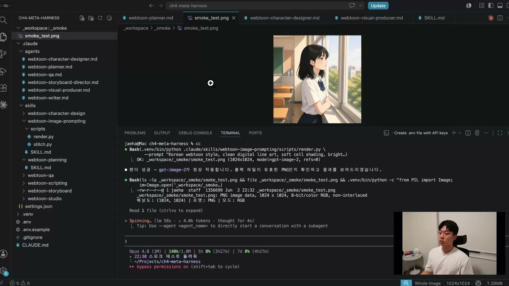

이미지가 제대로 나오는 걸 확인한 뒤 진짜 작업을 던진다. "클로드 코드 아이디어로 웹툰 1화, 3컷 티저를 만들어 달라." 그러면 페이즈 0 컨텍스트 확인을 거쳐 서브 에이전트 파이프라인으로 들어간다. 앞에서 만든 에이전트들이 순서대로, 또 일부는 나란히 호출된다.

첫 단계는 기획이다. 웹툰 플래너 에이전트와 웹툰 플래닝 스킬이 함께 불려 기획서를 쓴다. 이 에이전트가 오퍼스를 쓰는 걸 보고 강사는 잠깐 멈칫한다. "소넷을 써야 되는데" 하다가, 곧 "기획이라서 오퍼스 쓰는 게 맞는 것 같다"고 수긍한다. 기획, 계획처럼 제일 첫 단에 하는 일에는 오퍼스 4.8 같은 최고의 모델을 쓰는 게 맞다는 판단이다. 결과로 로그라인, 장르와 타겟, 톤 앤 무드, 아트 디렉션, 세계관 핵심 설정, 등장인물 개요, 시즌 아크, 1화 훅, 컷 1, 2, 3이 담긴 플래너 바이블(기획서)이 나온다.

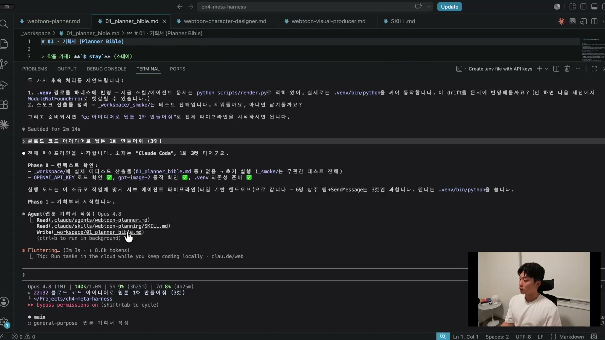

기획서가 생기면 그다음은 병렬로 갈라진다. 한쪽은 웹툰 라이터가 기획서를 읽어 대본을 쓰고, 다른 쪽은 캐릭터 디자이너가 캐릭터 레퍼런스를 렌더한다. 이 둘은 서로의 결과를 기다릴 필요가 없으니 동시에 돌리는 게 효율적이다. 여기서 Fan-out 패턴이 실제로 작동한다. 메인 에이전트가 위에 있고, 두 서브 에이전트가 아래에서 각자 돈다. 컨트롤 키로 펼치면 어떤 툴을 썼고 토큰과 시간을 얼마나 썼는지 들여다볼 수 있다.

대본에서 나온 1화 첫 장면은 이렇다. 주인공 도화가 "새벽 3시 텅 빈 사무실, 실패한 테스트 앞에 무너진" 채로 "시키지도 않았는데 혼자 코드를 고치고 말을 걸어오는 터미널을 목격한다".

캐릭터 디자이너 쪽에서는 도화의 레퍼런스 이미지가 나온다. 안경을 쓴 개발자 캐릭터를 정면과 측면 두 각도로 그린 시트 형식이다. 강사가 짚듯 개발자라서 다크서클이 진하고 에어팟을 끼고 있는 디테일까지 들어간다. 이 레퍼런스가 이후 모든 컷에서 같은 얼굴을 유지하는 기준이 된다.

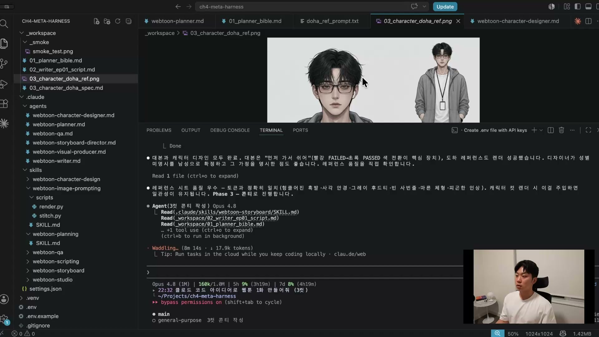

서브 에이전트에 일을 시키기 때문에 메인 컨텍스트는 별로 차지하지 않는다. 대본과 캐릭터 레퍼런스가 돌아가는 시점에도 메인의 컨텍스트 사용은 9%에 머문다. 무거운 작업을 서브 에이전트로 떼어내는 구조가 메인을 가볍게 유지한다.

그다음 웹툰 스토리보드 디렉터가 대본과 기획서를 읽어 3컷 콘티를 짠다. 이 콘티 작성도 서브 에이전트가 맡는데, 여기까지 와도 메인 컨텍스트는 16%밖에 차지하지 않는다. 콘티가 나오면 웹툰 비주얼 프로듀서가 그 콘티를 컷별 이미지 프롬프트로 바꾸고 실제로 렌더한다. 마지막으로 QA 에이전트가 검수한다.

## 결과, 3컷이 나온다

컷 3개가 렌더된다. 1컷은 새벽 사무실, 빨간 FAILED가 줄줄이 떠 있는 모니터 앞에 지쳐 엎드린 도화의 모습이다. 대본 첫 장면이 그대로 그림이 됐다.

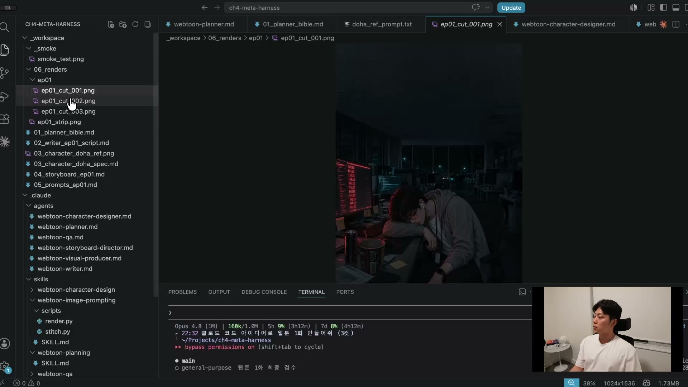

2컷은 도화가 고개를 들어 화면을 바라보는 장면이다. 모니터에 "editing main.py", "running tests"가 떠 있다. 터미널이 시키지도 않은 코드를 혼자 고치는 순간이다.

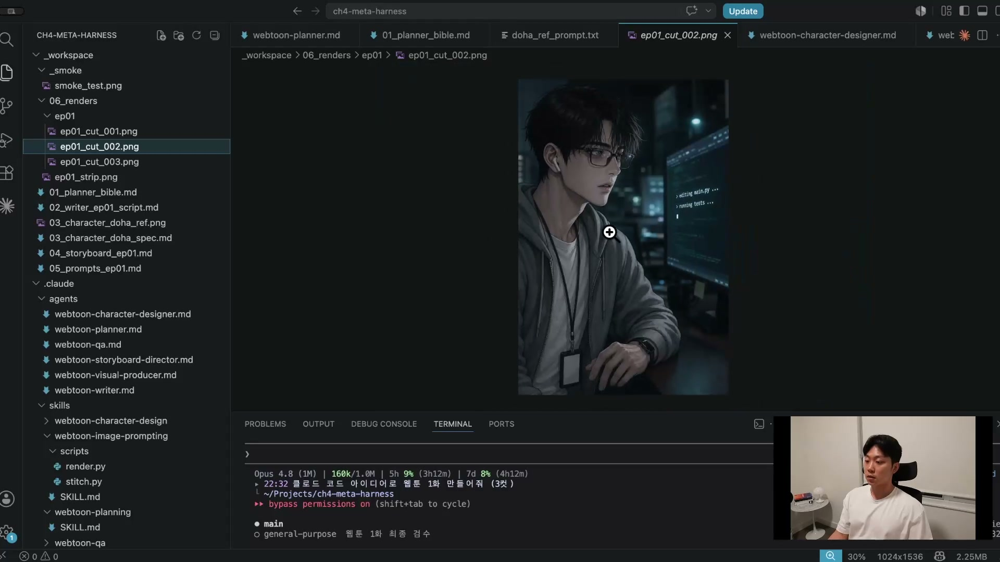

3컷은 모든 테스트가 초록 PASSED로 바뀐 로그를, 안경 너머로 응시하는 도화의 모습이다. 1컷의 빨간 FAILED와 정반대다.

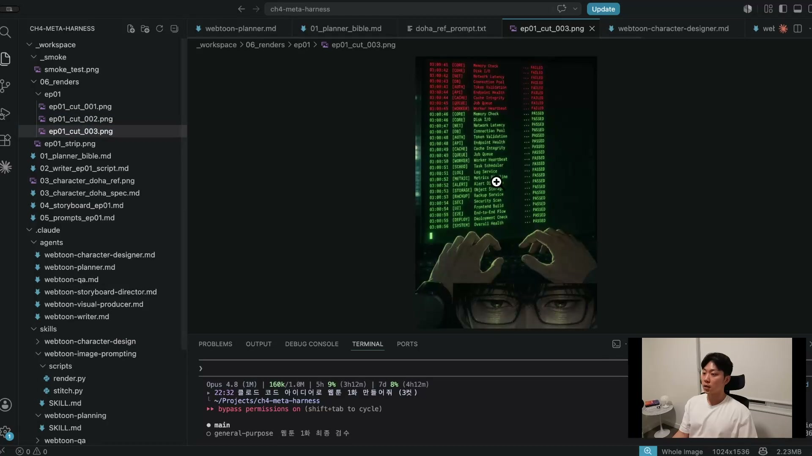

3컷이 다 나오면 스트립으로 이어붙여 한 장으로 만든다. 강사는 결과를 보고 "아직 딱히 엄청 특별한 건 없다"고 말한다. 무엇보다 말풍선이 하나도 없어서, 다음 작업은 "모든 컷에 말풍선을 넣어줘" 같은 지시로 이 하네스를 개선하는 것이다. 자동 생성된 하네스가 끝이 아니라, 결과를 보고 다듬어 나가는 게 실제 작업이라는 뜻이다.

비용 면에서 강사가 놀란 건 토큰을 생각보다 적게 썼다는 점이다. 하네스를 만드는 동안 usage는 7%에서 8%로 1%만 올랐고, 웹툰을 실제로 돌리기 시작한 뒤에도 9% 수준이었다. 강사 표현으로 컨텍스트, usage, 토큰을 "별로 그렇게 많이 쓰지 않았다". 다만 gpt-image-2로 실제 이미지를 만들기 때문에 OpenAI API 쪽에서 비용이 따로 붙는다는 점은 유의해야 한다.

## 강사의 두 포인트

이 실습이 결국 무엇을 말하려 했는지는 두 문장으로 모인다.

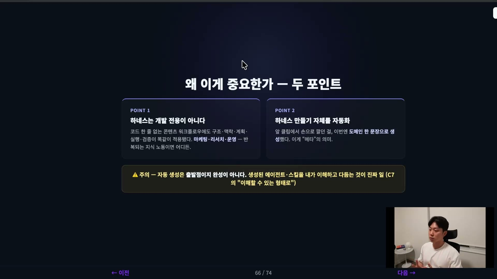

**첫째, 하네스는 개발 전용이 아니다.** 방금 짠 웹툰 파이프라인에는 코드가 한 줄도 없었다. 그런데도 구조, 맥락, 설계, 계획, 실행, 검증이 개발 하네스와 똑같이 적용됐다. 마케팅이든 리서치든 운영이든, 반복되는 지식 노동이라면 어디든 하네스로 설계할 수 있다. 콘텐츠 작업이라고 해서 구조와 검증이 면제되는 게 아니다.

**둘째, 하네스 만들기 자체를 하네스로 자동화할 수 있다.** 앞 실습에서 손으로 여섯 축을 깔던 일을, 이번엔 도메인 한 문장으로 생성했다. 자기 자신(하네스 만들기)에 하네스를 적용한 것, 이게 메타의 의미다.

다만 강사가 분명히 단서를 단다. 자동 생성은 출발점이지 완성이 아니다. 말풍선 없는 3컷이 그 증거다. 생성된 에이전트와 스킬을 내가 이해하고 다듬는 게 진짜 일이 된다.

여기서 강사는 한 발 더 나간 전망을 내놓는다. 클로드 코드와 코덱스 그 자체가 이미 하네스다. 모델이 더 좋아지면 그 도구들이 하네스를 알아서 생성하는 시대가 올 거라는 것이다. 그렇게 되면 우리는 하네스를 직접 만들 필요조차 없어지고, 하네스를 이해하고 쓸 줄만 알면 된다. 단, 이해하려면 지금 배우는 구조와 패턴을 알고 쓰는 것과 모르고 쓰는 것이 차원이 다르다.

## 정리

메타 하네스는 도메인 한 문장을 받아 에이전트 팀과 스킬을 자동으로 생성하는 하네스다. 여섯 가지 아키텍처 패턴 중에 맞는 걸 골라 깔고, 6단계 워크플로우(도메인 분석, 팀 설계, 에이전트 생성, 스킬 생성, 통합, 검증)를 돌아 하나의 작업 스튜디오를 만든다. 강의에서는 이걸로 에이전트 6개와 스킬 7개로 된 웹툰 파이프라인을 만들고, 그 파이프라인으로 실제 웹툰 3컷을 뽑았다. 코드 한 줄 없이도 하네스가 성립한다는 것, 그리고 하네스 만들기 자체가 자동화된다는 것. 이 두 가지가 이 실습이 남긴 핵심이다.

다음 클립에서는 시연 없이, 잘 만들어진 실전 하네스를 뜯어본다. 개발에 특화된 하네스 중 가장 유명한 슈퍼파워즈다. 앤트로픽 공식 플러그인으로도 자리 잡았다고 한다. 그 구조를 슬라이드로 살펴보며 하네스 엔지니어링 챕터를 마무리한다.
