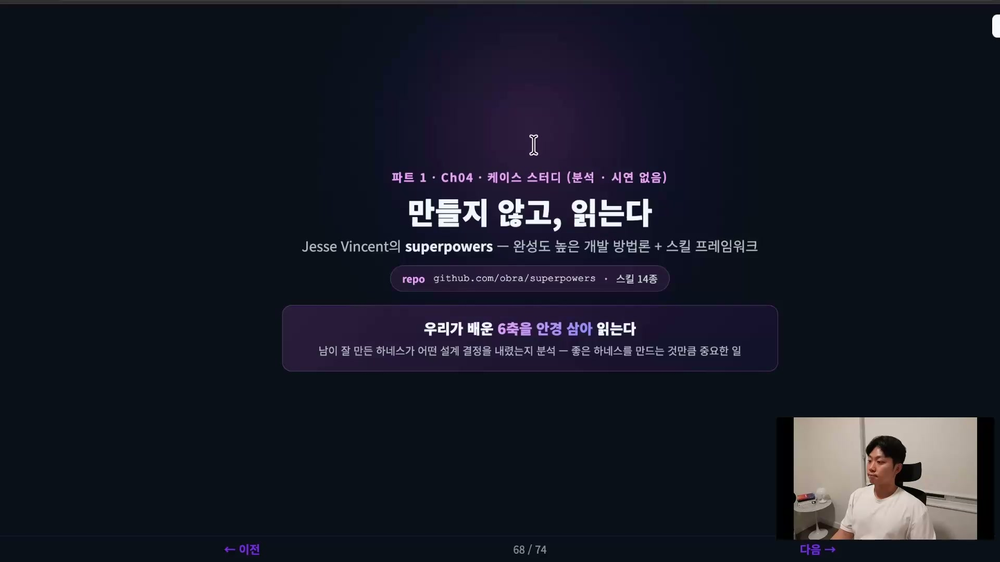
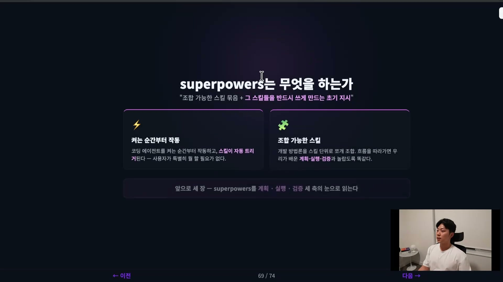
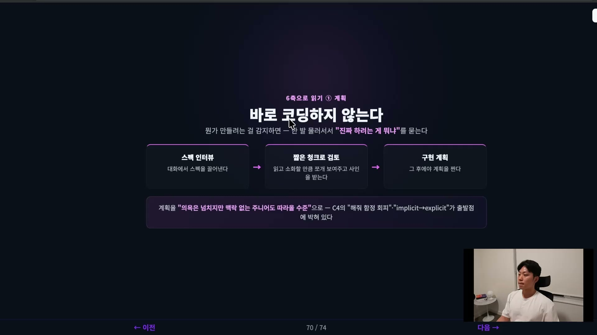
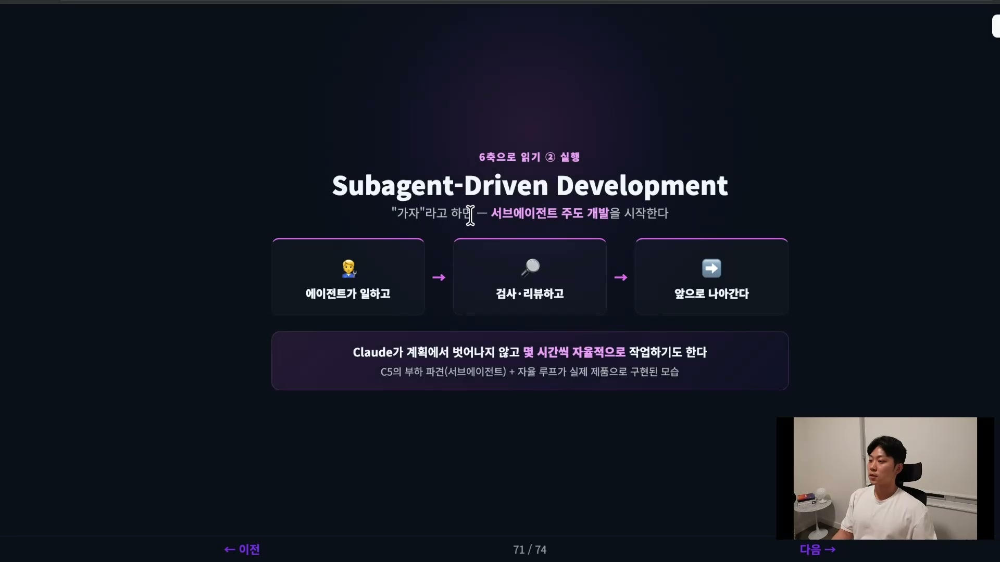
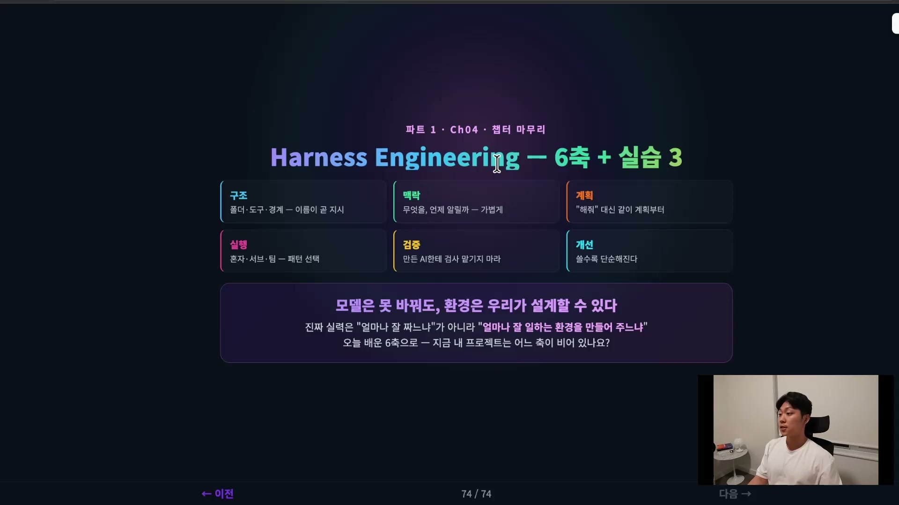

좋은 하네스를 직접 만드는 것만큼 중요한 게 하나 더 있다. 남이 잘 만든 하네스를 읽고 배우는 일이다. 이 강의가 시험 대신 마지막 클립에 케이스 스터디를 넣은 이유가 거기 있다. superpowers라는, 이미 유명하고 완성도 높은 실전 하네스 하나를 펼쳐 놓고, 앞에서 배운 6축을 안경 삼아 "이 하네스는 어떤 설계 결정을 내렸나"를 읽어내는 것이다.

superpowers는 코딩 에이전트를 위한 소프트웨어 개발 방법론이고, 그 위에 스킬들을 얹은 프레임워크다. 정의를 한 줄로 줄이면 이렇다. 조합 가능한 스킬 묶음, 그리고 그 스킬들을 반드시 쓰게 만드는 초기 지시. 이 두 덩어리가 합쳐져 하나의 방법론을 이룬다.

## 큰 그림, 두 개의 축

먼저 멀리서 본 구조를 잡고 들어가자. superpowers의 골격은 두 축으로 서 있다.

하나는 켜는 순간부터 작동한다는 점이다. 코딩 에이전트를 켜는 그 순간부터 superpowers가 돌기 시작하고, 스킬이 자동으로 트리거된다. 사용자가 "이 스킬 좀 불러줘"라고 따로 챙길 필요가 없다. 다른 하나는 스킬이 조합 가능하다는 점이다. 개발 방법론을 통째로 던지는 게 아니라, 스킬 단위로 잘게 쪼개 두고 상황에 맞게 조합해 쓴다.

여기서 흥미로운 건 그 흐름을 따라가 보면 우리가 배운 계획, 실행, 검증과 놀랍도록 똑같다는 점이다. 그래서 이 하네스를 6축으로 읽는 게 억지가 아니다. 실제로 잘 만들어진 하네스는 그 축들을 자기 방식으로 이미 구현해 두고 있다. 아래부터는 superpowers가 실제로 깊게 짚는 세 축, 계획과 실행과 검증을 차례로 들여다본다.

## 계획, 바로 코딩하지 않는다

superpowers의 첫 번째 설계 결정이 인상적이다. 사용자가 뭔가를 만들려는 것을 감지하면, 곧바로 코드를 쓰지 않는다.

대신 한 발 물러서서 사용자를 인터뷰한다. "당신이 진짜 하려는 게 뭐냐"를 대화로 물어 스펙을 이끌어낸다. 그렇게 끌어낸 스펙을 사용자가 읽고 소화할 수 있을 만큼 짧은 덩어리로 쪼개 보여주고, 사인을 받는다. 그 합의가 끝난 뒤에야 비로소 구현 계획을 짠다.

스펙 인터뷰 다음에 곧장 계획을 짜지 않고 짧은 청크 검토를 한 단계 끼워 넣은 게 핵심이다. 사람이 한 번에 다 읽고 판단할 수 있는 크기로 잘라 합의를 받아두면, 나중에 "이건 내가 원한 게 아닌데"가 줄어든다.

재밌는 디테일이 하나 더 있다. superpowers는 구현 계획을 어느 수준으로 쓰라고 강제하는데, 그 기준이 "의욕은 넘치지만 취향도 판단력도 맥락도 없고, 테스트를 싫어하는 주니어 엔지니어도 따라올 수 있을 만큼 명확하게"다. 사람이 읽을 계획이 아니라, 맥락이 0인 실행자가 그대로 따라도 굴러가는 계획을 쓰라는 것이다. 그래서 이 스킬을 잘 쓰면 처음에 던진 아이디어가 아무리 모호해도 결과물은 구체적인 계획으로 떨어진다.

## 실행, 서브에이전트 주도 개발

계획에 합의가 끝나고 사용자가 "이제 가자"라고 하면, superpowers는 서브에이전트 주도 개발(Subagent-Driven Development)을 시작한다.

에이전트들이 각 작업을 처리하고, 그 결과를 검사하고 리뷰하면서 앞으로 나아간다. 일하고, 검사하고, 계속 나아간다는 루프다. 우리가 앞에서 본 서브에이전트 패턴과 자율 루프가 실제 제품 안에 이렇게 구현되어 있는 셈이다.

보고에 따르면 Claude가 계획에서 벗어나지 않고 몇 시간씩 자율적으로 작업하기도 한다고 한다. 이게 가능한 건 앞 단계에서 계획을 "맥락 없는 주니어도 따라올 수준"으로 단단히 박아둔 덕이다. 계획이 자기 완결적이면 실행이 길게 자율로 돌아도 궤도를 잃지 않는다. 계획 축의 설계가 실행 축의 자율성을 떠받치는 구조다.

## 검증, 방법론에 박아 넣는다

검증은 어떻게 했을까. superpowers의 답이 이 케이스 스터디에서 가장 배울 점이 많다. 검증을 구현 계획 단계에서부터, 그러니까 코드를 쓰기 전부터 세 가지 원칙으로 강조한다.

| 원칙 | 풀어 쓰면 | 무슨 뜻 |
|---|---|---|
| TDD | Test-Driven Development | 테스트를 먼저 써서 실패시키고(Red), 그걸 통과시키는(Green) 식으로 개발한다 |
| YAGNI | You Aren't Gonna Need It | 필요해질 때까지 만들지 마라. 지금 필요한 것만 만든다 |
| DRY | Don't Repeat Yourself | 같은 것을 반복하지 마라 |

검증을 나중에 하는 일로 미루지 않은 게 핵심이다. superpowers는 이 세 원칙을 CLAUDE.md 같은 룰 파일에 박아 넣어, 맥락 자체로 검증을 강제한다. 검증이 사후 점검이 아니라 사전 규칙이 되는 것이다. 코드를 다 짜 놓고 "이제 테스트해볼까"가 아니라, 방법론 안에 검증의 기준을 미리 심어두고 그 위에서 코드를 쓰게 만든다.

## 내 하네스로 무엇을 훔쳐올까

superpowers를 읽으며 내 하네스로 훔쳐올 점은 네 가지다.

- **시작에 스펙 인터뷰를 박는다.** 바로 코딩하지 말고, 짧은 청크로 합의받는 단계를 기본값으로 둔다. 합의 없이 스펙 없이 코드부터 쓰는 흐름을 막는 것이다.
- **계획은 맥락 없는 주니어도 따라올 수준으로 쓴다.** 자기 완결적이고 구체적인 계획이 좋은 계획이다. 그래야 실행이 길게 자율로 돌아도 무너지지 않는다.
- **스킬이 자동으로 트리거되게 만든다.** 사용자가 기억해서 부르지 않아도 작동하게 한다.
- **검증을 방법론에 박는다.** CLAUDE.md, 룰 파일에 박아서 사후가 아니라 사전 규칙으로 만든다.

마지막 한 가지는 장점이면서 동시에 위험인 지점이다. superpowers는 자동으로 트리거되기 때문에 사용자가 특별히 할 게 없는데, 바로 그 점이 큰 장점이자 위험이다. 무엇이 왜 도는지 모르고 쓰면 통제권을 내준 것과 같다. 그래서 내가 이해할 수 있는 형태로 쓰는 게 중요하다. superpowers를 블랙박스로 쓰지 말고, 왜 이렇게 작동하는지 알고 쓰자는 것이다.

## 6축으로 돌아보며, 환경은 우리가 설계할 수 있다

이 케이스 스터디로 하네스 엔지니어링 챕터가 끝난다. 되짚어 보면 개념으로 여섯 가지 축(구조, 맥락, 계획, 실행, 검증, 개선)을 배웠고, 첫 실습에서 직접 그 축들을 깔아 애플리케이션을 개발하며 하네스 프레임워크를 써봤다. 두 번째 실습에서는 하네스로 하네스를 짓는 메타 하네스로 웹툰 파이프라인을 만들었다. 그리고 마지막 케이스 스터디에서 superpowers라는 실전 하네스가 지금 어떻게 구현되어 있는지 큰 그림을 읽었다.

기억할 한 줄로 마무리하면 이렇다. 모델은 우리가 바꾸지 못한다. 그러나 환경은 우리가 설계할 수 있고, 거기에 통제권을 쥐고 있다. AI가 코드를 쓰는 시대에 우리의 진짜 실력은 얼마나 코드를 잘 쓰느냐가 더 이상 아니다. 얼마나 하네스를 잘 설계하느냐로 드러난다.

그러니 오늘 배운 6축으로 자기 프로젝트를 진단해 보고, 어느 축이 비어 있는지 찾아 하네스를 조금씩 개선해 나가면 된다. superpowers를 읽은 것도 결국 그 진단을 위한 안경 하나를 더 얻은 일이다.
