하네스 엔지니어링은 개념으로 배울 때는 그럴듯하지만 손에 잡히지 않는다. 구조, 맥락, 계획, 실행, 검증, 개선이라는 여섯 가지 축을 머리로 이해하는 것과, 그 축이 실제 폴더 어디에 어떤 파일로 들어가는지를 아는 것은 다른 문제다. 이 강의는 그 간극을 메운다. 강사가 직접 만든 `harness_framework`라는 GitHub 뼈대를 가져다, 유튜브 채널을 분석해 다음에 찍을 콘텐츠를 추천해주는 앱을 처음부터 끝까지 만든다. 그 과정에서 여섯 축이 어떤 파일, 어떤 스크립트로 구현되는지가 그대로 드러난다.

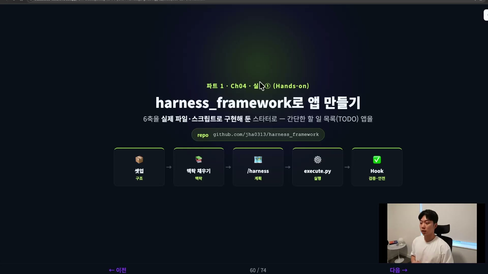

`harness_framework`는 그 자체가 여섯 축을 파일과 스크립트로 미리 구현해 둔 프로젝트 폴더다. 강사의 표현을 빌리면 "말 그대로 하네스 구조의 프레임워크"인 GitHub 뼈대다. 클론해서 쓰거나, 안의 파일을 자기 프로젝트에 복사해 쓰면 된다. 강의에서는 이미 만들어 둔 `ch4-harness-engineering`이라는 폴더에 이 repo 내용을 복사해 넣는 것으로 시작한다. 흐름 자체는 단순하다. 셋업하고, 맥락을 채우고, `/harness`라는 스킬로 계획을 짜고, `execute.py` 스크립트로 실행하고, 마지막에 훅으로 검증한다. 이 다섯 마디가 이번 실습의 전부다.

## 구조, 클론하면 폴더가 이미 깔려 있다

뼈대를 복사해 넣고 폴더를 열면, 구조가 먼저 눈에 들어온다. 하네스에서 구조가 그토록 중요하다고 강조했던 그 구조가 파일로 그대로 나와 있다.

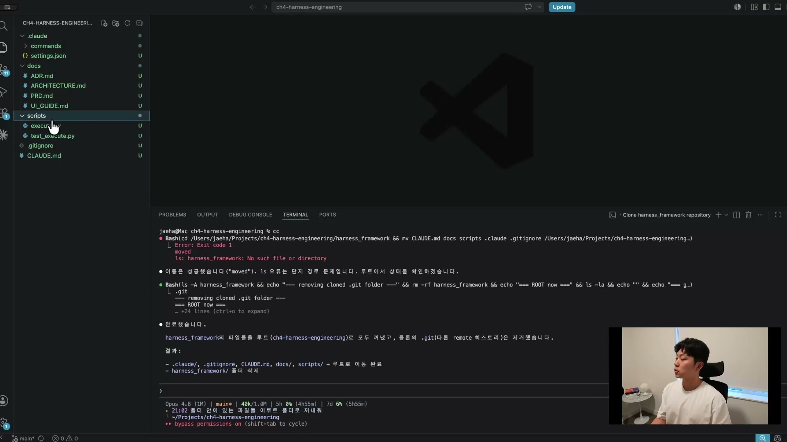

`.claude` 폴더 안에 `settings.json`이 있고, `commands` 안에 `harness` 커맨드가 들어 있다. `docs` 폴더에는 네 개의 문서가 준비돼 있다. PRD, ARCHITECTURE, ADR, 그리고 UI_GUIDE다. 이번 실습에서는 UI 가이드는 쓰지 않으니, 실제로 채울 문서는 세 개다. `scripts` 폴더에는 `execute.py`와 테스트 파일이 들어 있고, 루트에는 CLAUDE.md가 비어 있는 스캐폴딩으로 놓여 있다.

여기서 채워야 할 것은 네 개다. PRD, ARCHITECTURE, ADR, 그리고 CLAUDE.md. 이 네 개를 클로드와 대화하면서 채워나가는 것이 이번 작업의 절반이다. 나머지 절반은 그렇게 채운 내용을 클로드가 알아서 실행하는 것이다.

이 구조를 그대로 따를 필요는 없다. 강사도 "본인이 원하는 구조를 만들어 쓰면 된다"고 못 박는다. 다만 `docs` 폴더만은 꼭 넣어 그 안에 스펙을 관리하길 권한다. 스펙이 늘어나면 `docs` 안에서도 다시 구조화가 필요해진다. 스크립트는 있어도 되고 없어도 되지만, 강사는 더 깔끔하고 결정론적(deterministic)으로 돌리고 싶어 `execute.py`로 스크립트화해 둔 것이다.

## 맥락, 스펙이 source of truth고 코드는 부산물

구조를 깔았으면 맥락을 채울 차례다. 여기서 채우는 세 개의 문서가 이 프로젝트의 스펙이다.

PRD는 Product Requirement Document의 약자로, 프로젝트의 목표와 사용자, 기능을 정리한다. ARCHITECTURE는 말 그대로 이 프로젝트를 어떤 구조로 짤지를 담는다. ADR은 Architecture Decision Record의 약자인데, 강사는 이걸 따로 만든 이유를 분명히 짚는다. 어떤 결정을 했을 때 그 결정을 왜 했는지, 무엇을 포기했는지는 코드에서 찾을 수 없는 정보다. 단일 페이지로 가기로 했고 라우팅을 없애기로 했다면, 코드에는 그 결과만 남지 그 선택의 이유와 트레이드오프는 사라진다. ADR은 바로 그 사라지는 맥락을 붙들어 둔다. AI가 같은 코드를 보더라도 "왜 이렇게 됐는지"까지 이해하게 만드는 장치다.

강사가 거듭 강조하는 관점이 여기서 나온다.

> 이 스펙이 source of truth가 되는 겁니다. 이 스펙만 있으면 이 앱을 만들 수 있다, 그게 되는 거예요. 코드는 그냥 이 스펙의 부산물(artifact)일 뿐입니다.

코드가 옛날만큼 가치를 갖지 않는 시대라는 말이다. 코드 자체는 싸졌고("code is cheap"), 진짜 가치는 그 코드를 만들어내는 기획 문서에 있다. 단, 그 기획 문서 안에 중요한 내용이 다 들어가 있어야 한다는 전제가 붙는다. 그래서 스펙을 쓰는 것이고, 이 하네스 프레임워크 자체가 결국 스펙 드리븐 디벨로먼트(Spec Driven Development)인 셈이다.

맥락을 채우는 방식은 한 번에 완벽한 스펙을 써내는 게 아니다. 클로드와 티키타카로 굴리면서 채운다. 강사는 빈 프로젝트 상태에서 "프로젝트를 하나 만들 거야"라고 말을 건다. 자기 유튜브 채널을 분석해 어떤 콘텐츠를 하는지 알아낸 뒤, 비슷한 종류 중 요즘 핫하고 바이럴한 콘텐츠를 찾아 다음 콘텐츠를 추천해주는 앱. MVP고 프로토타입이니 간단할수록 좋다는 단서를 단다. 유튜브 API가 필요할 테니 환경 변수를 담을 폴더도 만들어 달라고 덧붙인다.

여기서 하네스 스킬이 이미 트리거된다. 프로젝트가 하네스 프레임워크를 쓰도록 설정돼 있으니 클로드는 일을 시작하기 전에 프로젝트 전체를 먼저 읽는다. 하네스 워크플로우의 첫 단계인 탐색에 들어가, 문서와 구조를 파악한다. 문서가 다 비어 있으니 "이걸 채워야 한다"는 걸 스스로 알아챈다. 그래서 다음 단계인 논의로 넘어가, 강사에게 인터뷰를 한다.

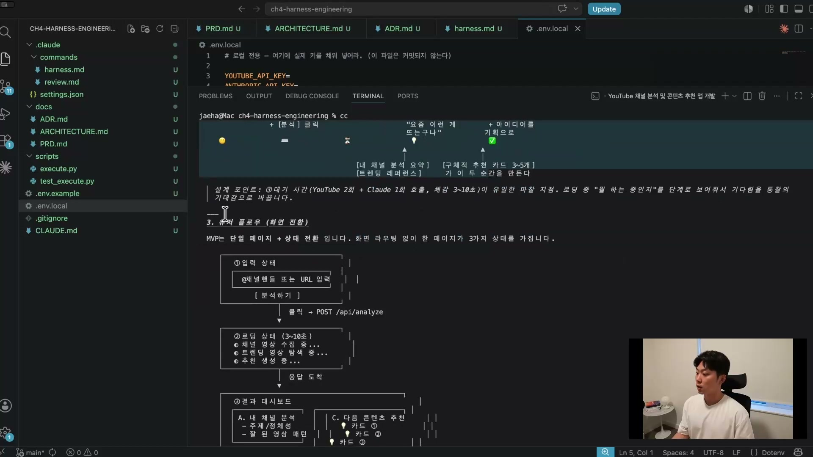

강사는 이 논의에서 "유저 저니와 유저 플로우에 집중해서, 가능하면 다이어그램으로 보여달라"고 요청한다. 무언가를 개발할 때는 그 앱을 쓰는 사람의 입장에서 출발해야 한다는 생각에서다. 클로드는 한 줄 컨셉을 잡는다. 채널 핸들 하나를 넣으면 무슨 채널인지 분석하고, 같은 주제에서 요즘 뜨는 영상을 찾아 콘텐츠 아이디어를 제안하는 도구. 사용자는 다음에 뭘 찍을지 막막한 1인 크리에이터. 그리고 단일 페이지에서 입력 상태, 로딩, 결과 대시보드로 이어지는 상태 전환을 다이어그램으로 그려낸다.

논의는 한 번에 끝나지 않는다. 강사는 같은 내용을 시선을 바꿔가며 두세 번 더 굴린다. 처음엔 유저의 시선으로, 다음엔 엔지니어와 아키텍처의 시선으로 봐달라고 한다. 시선을 쉬프트해주면서 클로드가 같은 스펙을 다른 각도에서 다듬게 하는 것이다. 이때 강사가 빼놓지 않는 지시가 하나 있다. "이건 MVP라는 걸 기억해. 절대 오버 엔지니어링 하지 말고 간단하게 만들어." LLM은 내버려두면 일을 많이 하려는 경향이 있어, 이 제약을 명시해줘야 원하는 것만 품질 좋게 만든다는 것이다.

## 계획, /harness가 작은 스텝으로 쪼갠다

맥락 설계가 끝나 세 스펙과 CLAUDE.md가 다 채워지면, 이제부터는 클로드가 알아서 하는 파트로 넘어간다.

PRD에는 앱 이름이 NextUp으로 붙었다. 목표는 다음에 뭘 찍을지 막막한 유튜브 크리에이터가 채널 핸들 하나로 내 채널 분석, 같은 주제의 트렌딩 영상, 다음 콘텐츠 아이디어를 한 화면에서 받게 하는 것이다. 사용자 플로우는 입력, 로딩, 결과 대시보드로 정리됐다. 강사가 특히 중요하다고 짚는 항목은 'MVP 제외 사항'이다. 무엇을 안 할지를 명시해두지 않으면 클로드가 일을 잔뜩 벌이기 때문이다. ARCHITECTURE에는 `src` 폴더 안의 컴포넌트와 서비스 구조, 데이터 흐름, 상태 관리가 잡혔고, ADR에는 단일 페이지에 라우팅을 두지 않기로 한 결정의 이유와 트레이드오프, 추천 생성을 클로드 API로 한다는 결정, 공식 SDK 외에 추상화를 두지 않는다는 결정이 기록됐다.

CLAUDE.md는 의외로 짧다. 프로젝트 시작이라 23줄밖에 안 된다. 아키텍처 규칙, 개발 프로세스, 그리고 명령어 섹션이 들어 있다. 강사는 이 명령어 섹션이 은근히 중요하다고 한다. 이게 없으면 클로드가 명령어를 찾느라 헤매고, 박혀 있으면 바로바로 실행해 효율적으로 일한다.

스펙이 다 갖춰지면 `/harness` 스킬이 계획 단계로 들어간다. 이 스킬의 정체는 단순하다. "이 프로젝트는 하네스 프레임워크를 사용한다, 아래 워크플로우에 따라 작업을 진행하라"는 지시다. 워크플로우는 탐색, 논의, 스펙 채우기, 스텝 설계, 구현, 검증으로 이어진다. 앞 단계까지가 탐색과 논의였고, 이제 스텝 설계 차례다.

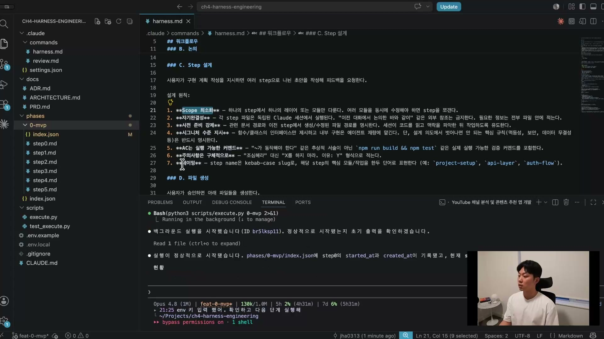

스텝 설계가 시작되면 `phases` 폴더가 만들어지고, 그 안에 `0-mvp` 폴더가 생긴다. 거기에 step0부터 step5까지 여섯 개의 스텝이 잘게 쪼개져 생성된다. 작은 단위의 스텝으로 설계하는 것이 핵심이다. 이 쪼개기는 일곱 가지 설계 원칙을 따르는데, 스코프 최소화가 그중 하나다.

스텝들과 함께 `index.json`이 먼저 생성된다. 전체 현황을 한눈에 보여주는 파일이다.

`index.json`은 스텝마다 status를 체크한다. `pending`이면 아직 안 된 것, `completed`면 끝난 것이다. `started_at`으로 언제 시작했는지까지 기록된다. 여러 태스크의 진행을 관리하는 일종의 플래닝 시트인 셈이다. 스텝 이름을 보면 project-setup, types-and-lib, youtube-service, recommend-service처럼 작업이 의미 단위로 갈려 있다. 전체 현황을 담는 이 `index.json` 외에, 스텝별 상세 인덱스도 따로 생성되는데 이건 해당 스텝이 끝났을 때만 만들어진다.

스텝 파일 하나를 열어보면 구조가 더 또렷하다.

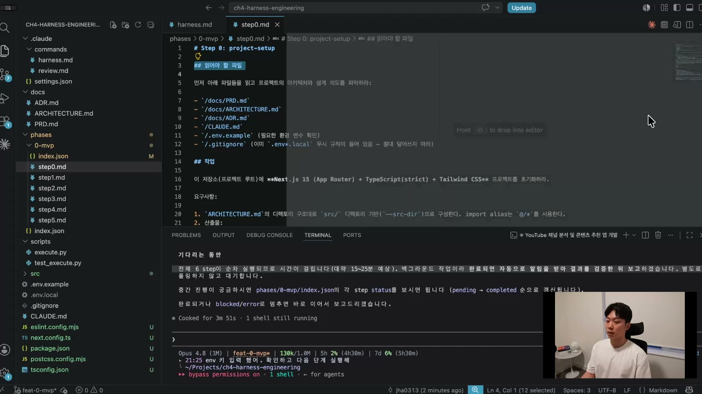

스텝 0 파일의 첫 섹션은 '읽어야 할 파일'이다. PRD, ARCHITECTURE, ADR, CLAUDE.md, `.env.example`, `.gitignore`를 읽고 프로젝트의 아키텍처와 설계 의도를 파악하라고 적혀 있다. 매 스텝마다 이걸 다시 읽으라고 돼 있다. 그 다음 '작업' 섹션에는 구체적 지시가 온다. 스텝 0이니 프로젝트를 초기화하는 단계라, 이 저장소에 Next.js 15(App Router) + TypeScript(strict) + Tailwind CSS 프로젝트를 ARCHITECTURE의 디렉토리 구조대로 초기화하라는 내용이다.

스텝 파일에서 가장 결정적인 부분은 그 다음이다.

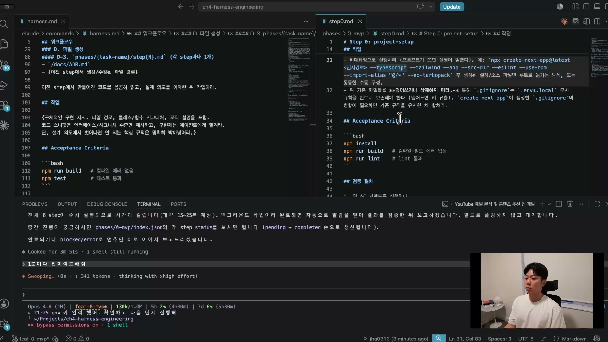

각 스텝에는 Acceptance Criteria(AC)가 붙는다. 스텝 0의 경우 `npm install`, `npm run build`(컴파일과 빌드 에러 없음), `npm run lint`(린트 통과) 세 개를 돌려서 통과해야 한다. 이 AC가 자율 실행의 엔진이다. 검증이 실패하면 클로드는 패스할 때까지 코드를 고쳐서 다시 시도한다. 사람이 옆에서 봐주지 않아도, 본인이 검증을 돌려보고 틀린 걸 알아채 스스로 고치는 루프가 여기서 돈다. 이게 가능한 이유는 강사가 하네스 스킬에 검증 절차를 넣어뒀기 때문이다. 스텝 파일에는 검증 절차와 아키텍처 체크리스트, 그리고 금지 사항까지 들어 있고, 이런 모양이 스텝 0부터 5까지 똑같이 반복된다.

## 실행, execute.py가 스텝마다 백지 세션으로 자율로 돌린다

스텝마다 따로 파일을 만들고 매번 첫 부분에서 같은 문서를 다시 읽게 하는 것은, 이미 읽은 파일을 또 읽는 낭비처럼 보이지만 `execute.py`가 스텝을 돌리는 방식 때문에 그래야만 한다.

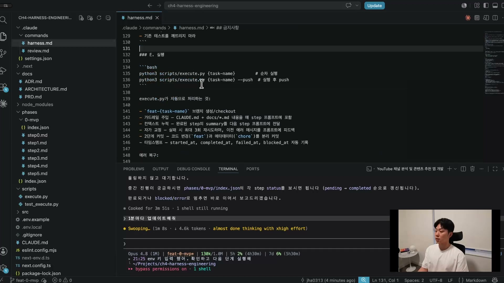

강사는 이런 일에는 서브 에이전트가 적합하다고 먼저 인정한다. MVP쯤 되면 그래도 규모가 있는 프로젝트라, 간단한 버그 수정이 아닌 이상 서브 에이전트를 부르는 게 효율적이라는 것이다. 그런데도 강사는 서브 에이전트를 쓰지 않는다. 대신 자기가 만든 `cloud-p` 류의 자동화 커맨드로 스텝마다 클로드의 새 세션을 열고, 그 위에서 하네스 루프를 `execute.py`로 돌린다. 새 세션은 앞의 컨텍스트가 모두 사라진 백지 상태다. 그래서 매 세션 시작 때 필요한 문서를 다 읽고 시작하라고 하는 것이고, 스텝 파일이 매번 '읽어야 할 파일'로 시작하는 이유도 이것이다.

서브 에이전트도 새 세션을 띄운다는 점에서는 같다. 차이는 보고에 있다. 서브 에이전트는 메인 세션에 계속 결과를 보고하기 때문에 메인 컨텍스트가 차오른다. 반면 스크립트로 새 세션을 관리하면 결과를 `index.json` 같은 출력 파일에 업데이트하는 식이라 메인 컨텍스트가 거의 영향을 받지 않는다. 스크립트로 여기까지 돌린 지금도 메인 컨텍스트가 12%에 그친다는 것이 강사가 드는 증거다. 작업이 길어질수록 이 차이는 더 벌어진다.

`execute.py`가 자동으로 처리하는 일은 여섯 가지다.

| 동작 | 하는 일 |
| --- | --- |
| 브랜치 생성 | `feat-{task-name}` 브랜치를 만들어 그 위에서 안전하게 작업 |
| 가드레일 주입 | CLAUDE.md와 스펙 내용을 매 스텝 프롬프트에 포함 |
| 컨텍스트 누적 | 완료된 스텝의 summary를 다음 스텝 프롬프트로 전달(바톤 터치) |
| 자가교정 | 실패 시 최대 3회 재시도, 이전 에러 메시지를 프롬프트에 피드백 |
| 2단계 커밋 | 코드 변경(`feat`)과 메타데이터(`chore`)를 분리해 커밋 |
| 타임스탬프 | started_at, completed_at, failed_at, blocked_at 자동 기록 |

가드레일 주입과 컨텍스트 누적이 자율 실행의 두 기둥이다. 매 스텝에 스펙과 규칙을 다시 박아주니 클로드가 궤도를 벗어나지 않고, 앞 스텝의 요약을 다음 스텝에 넘겨주니 백지에서 시작해도 흐름이 끊기지 않는다. 자가교정은 앞서 AC와 맞물린다. 검증이 실패하면 그 에러를 프롬프트에 피드백해 다시 고치게 한다. 강사는 이 모든 워크플로우가 150줄 남짓의 하네스 스킬에 다 들어 있다고 정리한다.

실행이 시작되면 `index.json`의 status가 하나씩 바뀌고, 터미널 진행 표시에도 스텝이 차례로 넘어가는 게 찍힌다.

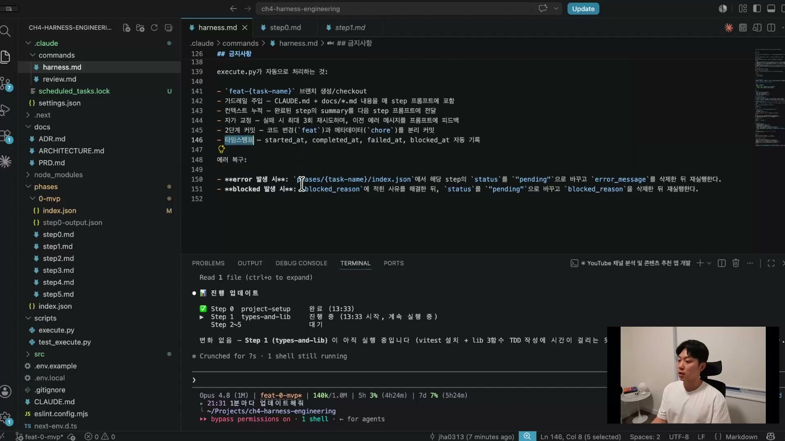

실행은 대략 15분에서 30분이 걸린다. 이 시간 동안 강사는 손을 대지 않는다. 다른 프로젝트를 하거나 커피를 마시거나 운동을 다녀와도 된다. 롱러닝 에이전트를 하네스로 잘 설계해두면, 믿고 맡겨놓고 다른 일을 할 수 있다는 게 핵심 장점이다.

여기서 토큰 소모 걱정에 대한 강사의 답이 나온다. 하네스를 잘 구축하면 오히려 토큰 소모가 적고, 그 차이는 복잡한 프로젝트일수록 크게 벌어진다. 강사가 인용하는 벤치마크는 프로젝트를 쉬움, 중간, 복잡으로 나눠 하네스 유무를 비교한 것이다.

쉬운 프로젝트에서는 품질 차이가 크지 않고 토큰도 비슷하거나 오히려 하네스가 조금 많았다. 중간 난도부터는 하네스가 확연히 앞선다. 복잡하고 오래 걸리는 작업에서는 LLM이 작성하는 코드 품질 자체가 훨씬 좋아진다. 그래서 강사는 하네스를 설계할지 말지 고민할 필요가 없다고 단언한다. 복잡한 프로젝트를 많이 하는 환경이라면 더더욱 그렇다.

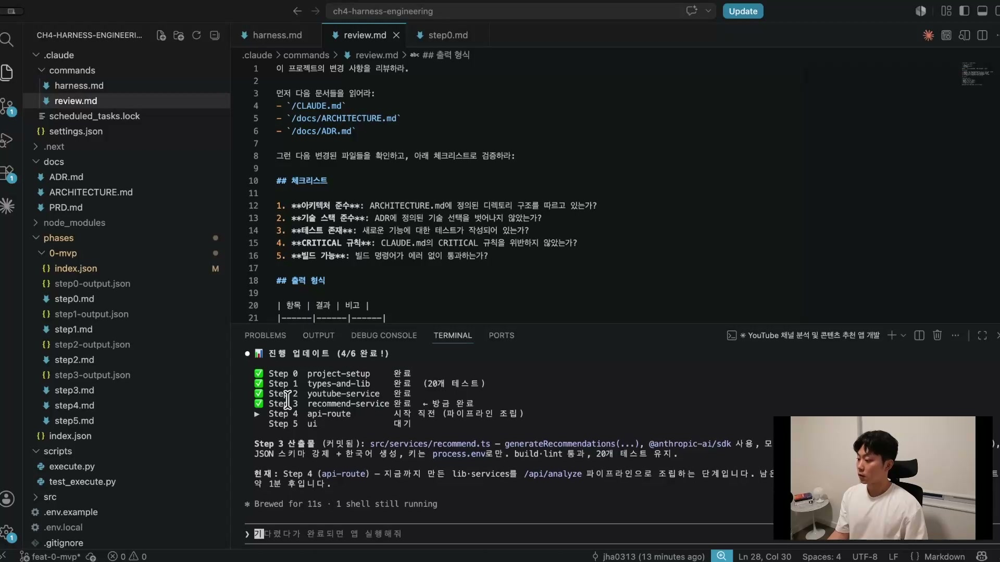

이렇게 스텝 3까지 완료된 진행 화면을 강사가 잠깐 들여다보는 동안에도 클로드는 계속 돌고 있었고, 약 22분 만에 모든 스텝이 완료됐다. 강사는 그 22분 동안 손을 하나도 대지 않았다고 강조한다. 중간에 클로드가 에러를 몇 번 만났겠지만, 본인이 그 에러를 보고 검증에 실패한 걸 확인한 뒤 다시 시도해 결국 일을 끝냈다. 가끔 스텝 사이를 넘어갈 때 에러가 나 사람이 고쳐줘야 할 때도 있지만, 이번에는 그런 일 없이 자율적으로 완주했다. 강사가 에이전트를 쓰는 이유가 여기에 있다. 하네스가 제대로 설계돼 있지 않으면 매번 들어가 고쳐줘야 하니 에이전트를 길게 자율로 돌릴 수 없다. 에이전트를 얼마나 길게, 얼마나 자율적으로 돌릴 수 있게 만드느냐가 곧 생산성이고, 좋은 엔지니어의 역량이라는 것이다.

## 검증, 실제로 동작하는지 띄워본다

코드가 빌드되고 AC를 통과했다고 끝이 아니다. 실제로 동작하는지 띄워봐야 한다. 강사는 평소엔 Playwright 같은 브라우저 테스팅 MCP를 돌리지만, 여기서는 직접 앱을 띄워 확인한다.

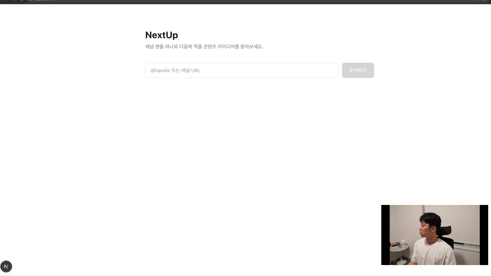

완성된 앱은 NextUp이라는 이름의 단일 페이지다. "채널 핸들 하나로 다음에 찍을 콘텐츠 아이디어를 받아보세요"라는 안내 아래, `@handle 또는 채널 URL` 입력창과 '분석하기' 버튼이 전부다. 디자인은 무채색의 미니멀한 모습이다. 강사는 디자인은 나중에 고치면 된다고 넘긴다.

채널 핸들을 넣고 분석하기를 누르면 API 라우트가 트리거된다. 개발자 도구의 네트워크 탭을 열면 `analyze` 요청이 200으로 떨어지는 게 보인다. 로딩 중에는 채널 수집, 트렌딩 탐색, 추천 생성 같은 단계가 차례로 표시된다.

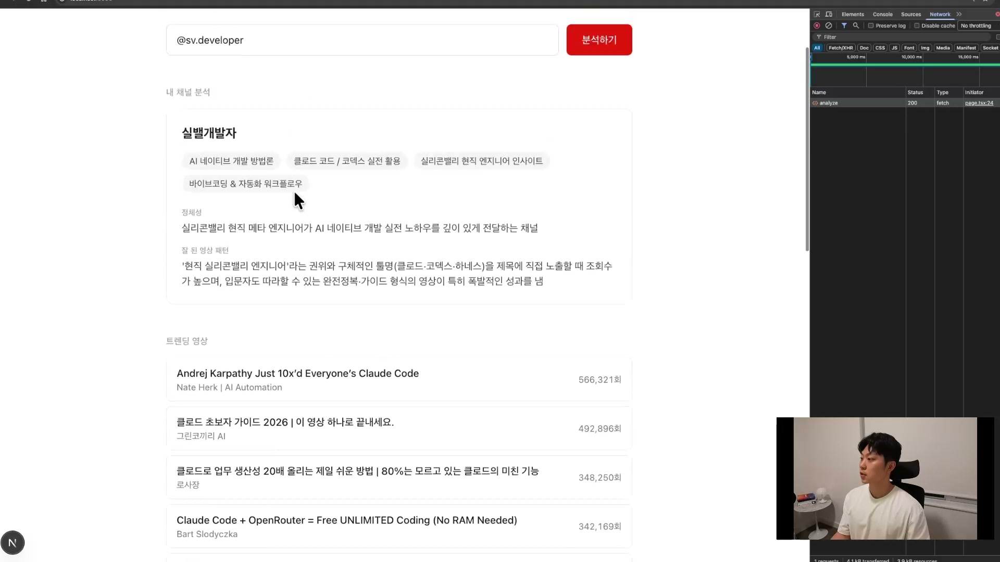

결과 화면에는 먼저 내 채널 분석이 나온다. 채널의 정체성과 잘 된 영상 패턴을 정리해준다. 그 아래 트렌딩 영상 목록이 조회수와 함께 뜬다. 안드레이 카르파티의 클로드 코드 영상이 56만 회, 클로드 초보자 가이드가 49만 회, 클로드로 업무 생산성 20배 올리는 법 같은 영상이 줄줄이 나온다.

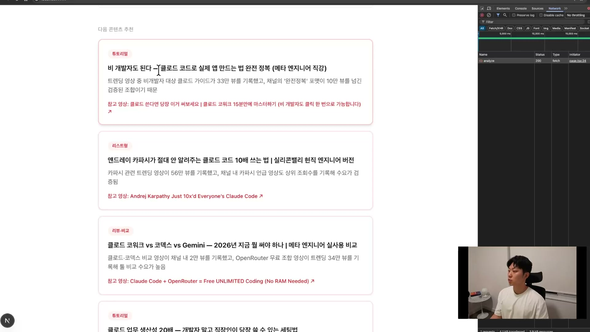

그리고 다음 콘텐츠 추천이 따라온다. 비개발자도 따라할 수 있는 튜토리얼형, "안드레이 카르파티가 안 알려주는 클로드 코드 10배로 쓰는 법" 같은 리스트형, 클로드와 코덱스와 제미나이를 비교하는 리뷰형 아이디어가 제안된다. 이 화면 뒤에서 일어난 일은 이렇다. 유튜브 데이터 API로 내 채널을 분석하고, 그 결과를 바탕으로 클로드 API가 트렌딩 영상을 찾고, 다음에 무엇을 찍으면 잘 될지를 판단해 추천을 생성했다.

## 개선, 환경을 계속 좋게 만든다

여섯 축 중 마지막 하나가 개선이다. 실행과 검증까지 끝낸 뒤, 강사는 클로드에게 간단히 묻는다. "지금 구조에서 개선할 점들을 알려줘." 클로드는 이 세션을 처음부터 끝까지 돌렸으니 모든 것을 알고 있어, 곧바로 개선점을 뽑아낸다.

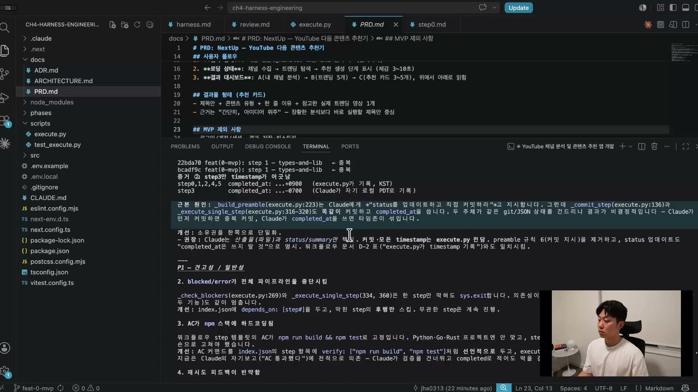

클로드가 뽑아낸 개선점은 12개 정도로, P0부터 P2까지 우선순위가 매겨졌다. 실제 발생한 버그도 들어 있다. 상태 변경 책임이 클로드와 `execute.py` 양쪽에 중복돼 있으니 소유권을 한쪽으로 단일화해야 한다거나, blocked 에러가 전체 파이프라인을 중단시켰다거나, AC가 npm 스택에 하드코딩돼 있다는 식이다. 이런 지적을 받으면 그대로 하네스 프레임워크를 고친다.

여기서 강사가 강조하는 사고방식이 나온다. 하네스는 한 번 돌리고 끝낼 것이 아니다. 그것은 환경이다. 모델이 돌아가는 환경. 환경을 좋게 만들어두면 내일 같은 작업을 하더라도 더 좋은 결과가 나온다. 그래서 하네스를 잘 개선하는 사람이 결국 대접받는다는 것이다.

## 정리, 여섯 축이 다 들어 있었다

앱 하나를 만들면서 여섯 축을 전부 한 바퀴 돌았다. 강사는 마무리로 여섯 축이 각각 어떤 파일로 구현됐는지를 한 장에 정리한 슬라이드를 보여준다.

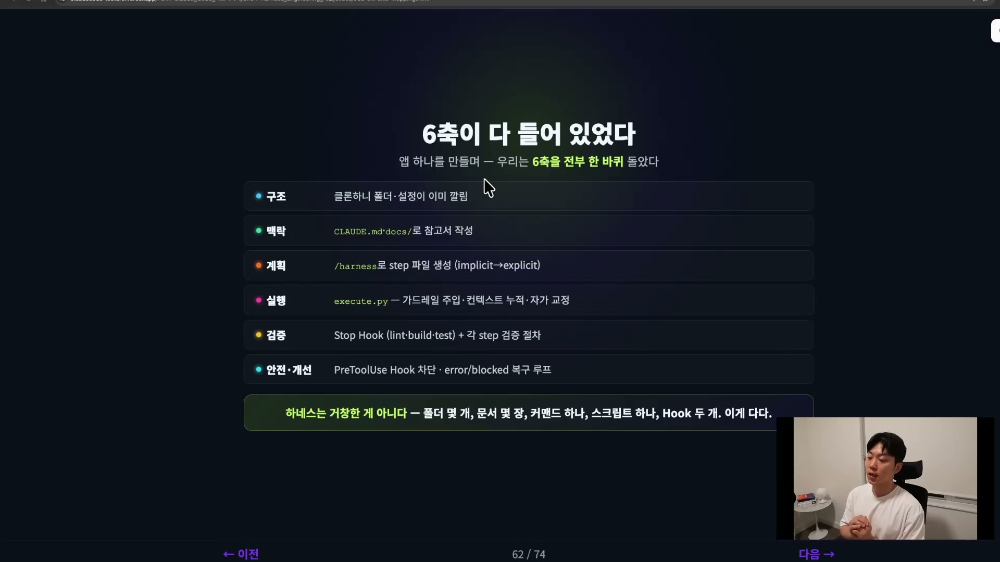

| 축 | 이번 실습에서 구현된 모습 |
| --- | --- |
| 구조 | 클론하니 폴더와 설정이 이미 깔림 |
| 맥락 | CLAUDE.md와 docs로 참고서(스펙) 작성 |
| 계획 | `/harness`로 스텝 파일 생성(implicit을 explicit으로) |
| 실행 | `execute.py`로 가드레일 주입, 컨텍스트 누적, 자가교정 |
| 검증 | Stop Hook(lint · build · test) + 각 스텝 검증 절차 |
| 안전 · 개선 | PreToolUse Hook 차단, error/blocked 복구 루프 |

구조는 클론으로 깔았고, 맥락은 docs와 CLAUDE.md로 채웠다. 이 둘은 사람이 한다. 계획부터는 클로드가 주도하고 사람은 보조로 넘어간다. 계획은 `/harness` 스킬이 스텝 파일을 생성하고, 실행은 `execute.py`가 돌리고, 검증까지 자동으로 끝난다. 마지막 개선만 다시 사람이 클로드에게 물어 환경을 다듬는다.

강사가 이 챕터에서 남기려는 핵심 메시지는 하나로 모인다.

> 하네스는 거창한 게 아니다. 폴더 몇 개, 문서 몇 장, 커맨드 하나, 스크립트 하나, Hook 두 개. 이게 다다.

여섯 축이라는 개념은 그럴듯하게 들리지만, 막상 파일로 펼쳐놓으면 이 정도다. 거대한 시스템이 아니라, 모델이 길게 자율로 일할 수 있는 환경을 만드는 최소한의 장치들이다. 그리고 이 정도라면 누구나 시작할 수 있다는 것이, 직접 앱 하나를 끝까지 만들어 보인 이 실습이 증명하려던 바다.
