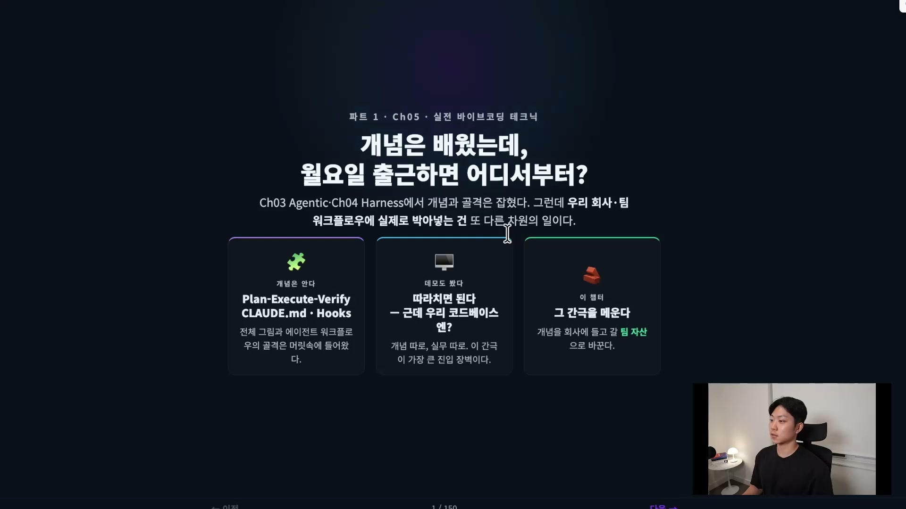
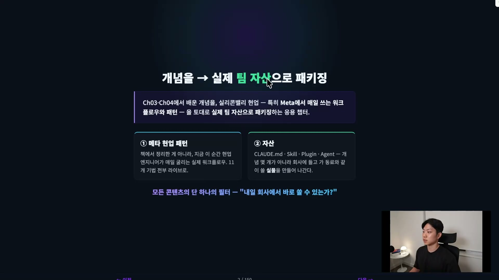
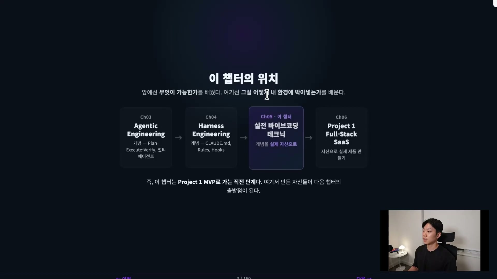

개념은 다 배웠다. 클로드 코드의 설치부터 명령어, MCP, 스킬, 훅까지 한 챕터를 통째로 들였고, 바이브 코딩이 어디까지 가능하고 어디서 한계가 오는지도 짚었다. 에이전틱 엔지니어링의 다섯 기둥(Plan, Execute, Verify, Cycle, Multi-Agent Pattern)을 배웠고, 하네스 엔지니어링에서 CLAUDE.md와 하네스의 거의 모든 것을 만져봤다. 여기까지 따라왔다면 클로드 코드의 전체 그림과 에이전트 워크플로우의 골격은 머릿속에 들어와 있다.

그런데 월요일에 출근하면 어디서부터 손대야 하나.

이 강의 인트로가 던지는 질문이 정확히 그것이다. 개념을 알아도, 데모를 따라 쳐서 돌아가는 걸 봤어도, 그걸 우리 회사 코드베이스와 팀 문화, 동료들이 같이 쓸 수 있는 환경으로 바꾸는 건 또 다른 차원의 일이다. 강사 본인도 막막했다고 말한다. 개념 따로 실무 따로, 그 사이의 간극을 메우는 게 이 챕터가 존재하는 이유다.

## 간극이 어디서 벌어지는가

슬라이드는 이 간극을 세 칸으로 쪼개 보여준다. 왼쪽은 **개념은 안다**, Plan-Execute-Verify와 CLAUDE.md, Hooks 같은 골격이 머릿속에 들어와 있는 상태다. 가운데는 **데모도 봤다**, 따라 치면 되긴 하는데 우리 코드베이스엔? 슬라이드는 바로 이 간극을 가장 큰 진입 장벽으로 적는다. 오른쪽이 이 챕터의 자리다. 그 간극을 메워, 개념을 회사에 들고 갈 **팀 자산으로 바꾼다**.

"개념을 안다"와 "우리 팀이 쓴다" 사이에는 생각보다 넓은 강이 있다. 혼자 데모를 돌리는 것과, 코드베이스에 박아 넣고 동료가 내일 그걸 쓰게 만드는 것은 종류가 다른 작업이다. 이 챕터는 그 강을 건너는 다리로 설계됐다.

## 두 축, 메타 현업 패턴과 자산

간극을 메우는 방식은 두 개의 키워드로 갈린다.

첫 번째 축은 **메타 현업 패턴**이다. 강사가 메타(Meta)에서 매일 굴리는 워크플로우와 기법을 가져온다. 책으로 정리한 이론이 아니라 지금 이 순간 현업 엔지니어가 쓰는 실물 워크플로우라는 점이 핵심이고, 이 챕터에서 다룰 10개가 넘는 패턴이 전부 거기서 나온다. 디테일까지 다 공개할 수는 없지만 개념은 최대한 풀어낸다. CLAUDE.md를 팀 단위로 관리하는 법, AI 레디(AI-ready) 코드베이스를 만들고 점검하는 법, 팀 플러그인을 배포해 동료가 그걸 쓰게 하는 법 같은 것들을 라이브로 보여줄 예정이다.

두 번째 축은 **자산**이다. CLAUDE.md, 스킬(Skill), 플러그인(Plugin), 에이전트(Agent). 챕터가 끝나면 머릿속에 개념만 남는 게 아니라, 회사에 들고 가서 동료와 같이 쓸 수 있는 실물 자산이 손에 남는다. 이게 이 챕터가 다른 챕터와 갈라지는 지점이다. 이해가 아니라 결과물이 목표다.

두 축을 하나로 묶는 필터가 있다. **"내일 회사에서 바로 쓸 수 있는가?"** 11개 섹션의 모든 콘텐츠를 이 한 질문으로 거른다. 이론은 멋진데 실무에서 쓸 일 없는 것들은 최대한 빼냈다. 그래서 챕터가 끝나는 시점에 두 가지 감각이 남는다. 하나는 "클로드 코드를 이렇게 쓰는구나" 하는 현업 패턴의 감각. 다른 하나는 "우리 회사 이 업무에 이걸 이렇게 적용하면 되겠다"가 듣자마자 떠오르는 적용의 감각. 강사는 두 번째 감각이 핵심이라고 못 박는다. 강의를 듣다가 "이거 우리 팀 PR 리뷰에 쓰면 되겠다" 싶으면 그 자리에서 메모해 다음 날 적용하라는 주문까지 붙는다.

## 전체 흐름 속 이 챕터의 자리

이 챕터는 강의 전체 흐름의 한가운데에 놓인다.

Ch03 에이전틱 엔지니어링과 Ch04 하네스 엔지니어링이 "무엇이 가능한가"를 가르쳤다면, 이 Ch05는 "그걸 어떻게 내 환경에 박아 넣는가"를 가르친다. 그리고 바로 다음 Ch06은 Project 1, 풀스택 SaaS를 처음부터 만드는 프로젝트 챕터다. 즉 이 챕터는 프로젝트로 가는 직전 단계다. 여기서 만든 자산들이 다음 챕터의 출발점이 된다. 앞 두 챕터가 재료를 쥐여줬다면, 이 챕터는 그 재료를 팀 환경에 심고, 그렇게 심은 걸 들고 다음 챕터에서 실제 제품을 짓는다.

## 끝나면 무엇을 할 수 있게 되는가

강의는 이 챕터의 목표를 "이해한다"가 아니라 "만들 수 있다"로 잡는다. 끝나면 할 수 있게 되는 일곱 가지는 이렇다.

| # | 할 수 있게 되는 것 |
| --- | --- |
| 1 | 회사 · 팀용 CLAUDE.md를 hierarchy(계층 구조)까지 고려해 작성하고 배포 |
| 2 | 코드베이스 AI-readiness를 점수로 측정하고 개선 우선순위를 잡는 grade 스킬 제작 |
| 3 | 흩어진 raw 문서를 LLM wiki · Obsidian으로 묶어 Second Brain v1 구축 |
| 4 | 조직 단위 Context Intelligence를 onboarding 스킬로 만들어 공유 지식 레이어 구축 |
| 5 | 1\~4의 자산을 팀 plugin 하나로 패키징 (`/plugin install` 한 줄로) |
| 6 | 팀 공유 TDD 가드 hook과 SDD harness, 자동 code review, risk-based merge |
| 7 | Agent Guardrails 3-Layer(Prevent / Detect / Contain) 설정과 Oncall agent prototype 구동 |

4번 조직 단위 컨텍스트 인텔리전스는 강의에서 직접 만들어보진 않는다. 회사마다 다르고 도메인 지식이 많이 필요해서다. 다만 개념 자체는 중요하게 다룬다. 6번에 묶인 TDD와 SDD는 요즘 핫한 키워드라 따로 배우고, 7번의 가드레일과 온콜 에이전트는 "추상적으로 이해한다"가 아니라 "이렇게 만들 수 있다"는 감각으로 가져간다.

## 무엇을 만들고 가는가, 11개 자산

위 일곱 가지 목표를 실물로 떨어뜨리면 11개의 자산이 된다. 챕터의 11개 섹션이 각각 하나씩 자산을 남긴다고 보면 된다.

| # | 자산 | 내용 |
| --- | --- | --- |
| 01 | CLAUDE.md | 회사 · 팀용 + 3-tier 구조 |
| 02 | AI-Ready Codebase | AI-readiness grade 스킬 + hook |
| 03 | Second Brain | wiki + Obsidian v1 |
| 04 | Context Intelligence | 회사용 CI onboarding 스킬 |
| 05 | Team Plugin | 01\~04를 한 패키지로 |
| 06 | TDD | 팀 공유 test-first 가드 hook |
| 07 | SDD | harness, `/harness/review·execute.py` |
| 08 | Token Efficiency | dashboard 스킬 + cost gate |
| 09 | AI Code Review | review 에이전트 + risk score + auto-merge |
| 10 | Agent Guardrails | Prevent / Detect / Contain |
| 11 | Oncall Agent | prototype (Slack / Discord 연동) |

여기서 결정적인 설계가 하나 보인다. 05번 Team Plugin이 앞의 01\~04를 한 패키지로 묶는다. 즉 챕터의 05번 시점부터 자산들은 흩어진 채로 남지 않고 **하나의 plugin 안으로 모여서** 존재한다. 새 팀원이 들어와도 `/plugin install` 한 줄이면 그 모든 자산이 한꺼번에 따라온다는 그림이다.

## 7개 그룹으로 묶으면

11개 자산은 다시 7개 그룹으로 정리된다. 이 그룹 분류가 챕터의 진행 순서이자 논리이기도 하다.

| 그룹 | 섹션 | 무엇을 |
| --- | --- | --- |
| A. Foundation | 01\~02 | 코드베이스를 AI 친화적으로 만든다 |
| B. Knowledge | 03\~04 | 지식 · 컨텍스트 시스템을 구축한다 |
| C. Team Scaling | 05 | 1\~4 자산을 plugin으로 패키징한다 |
| D. Dev Practice | 06\~07 | TDD 가드 hook과 SDD harness |
| E. Optimization | 08 | 토큰 · 비용 (dashboard · gate) |
| F. Quality | 09\~10 | 리뷰와 가드레일 |
| G. Beyond | 11 | Oncall (다음 챕터로 가는 다리) |

순서에는 이유가 있다. 먼저 코드베이스를 AI 친화적으로 만들어야(A) 에이전트가 더 빨리 일한다. 그 위에 에이전트를 위한 지식 · 컨텍스트 시스템을 깐다(B). 그걸 plugin으로 패키징해야(C) 새 팀원도 바로 업무에 쓸 수 있다. 그다음 개발 관행으로 TDD와 SDD를 익히고(D), 토큰과 비용을 최적화하고(E), 리뷰와 가드레일로 코드 품질을 잡고(F), 마지막으로 온콜 에이전트까지(G) 더해진다.

## 핵심은 누적이다

이 7개 그룹을 관통하는 한 단어가 **누적**이다. 01\~04의 자산이 05번 Team Plugin 안으로 들어가고, 거기에 06 · 07 · 08 · 10이 더해지면서 plugin이 계속 자란다. 자산들이 따로 노는 게 아니라 하나의 plugin 위에 쌓여 간다는 뜻이다. 그래서 챕터를 끝낼 무렵엔 흩어진 기법 11개가 아니라, 하나의 plugin으로 묶인 완성된 팀 표준 환경이 손에 남는다.

처음 질문으로 돌아가면, "개념은 배웠는데 월요일에 어디서부터?"의 답이 여기 있다. 어디서부터가 아니라, 챕터가 끝나면 이미 다 만들어져 있는 것이다. CLAUDE.md부터 시작해 11개 섹션을 지나면, 회사에 들고 가서 동료와 같이 쓸 plugin 하나가 결과물로 떨어진다. 이 인트로가 약속하는 건 그 한 가지다.
