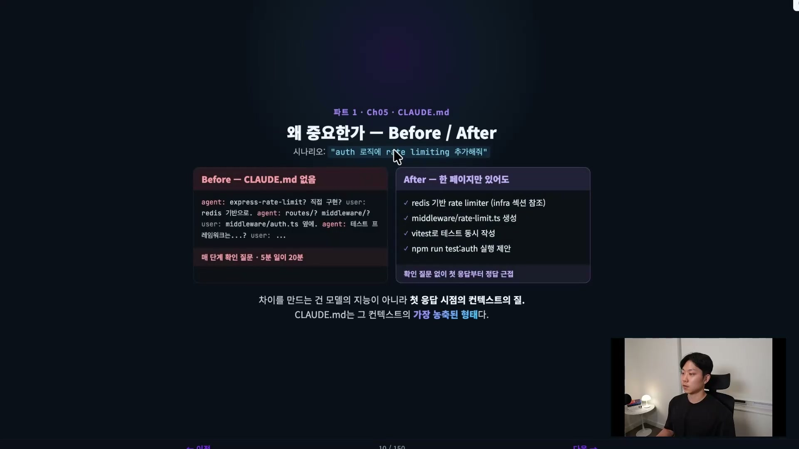
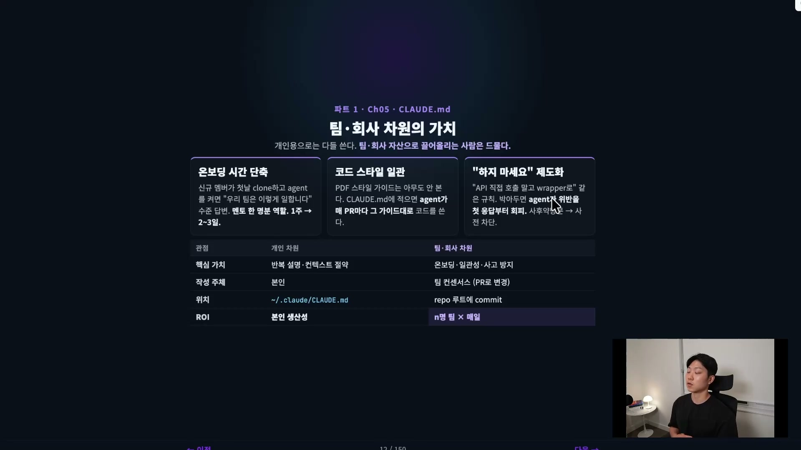
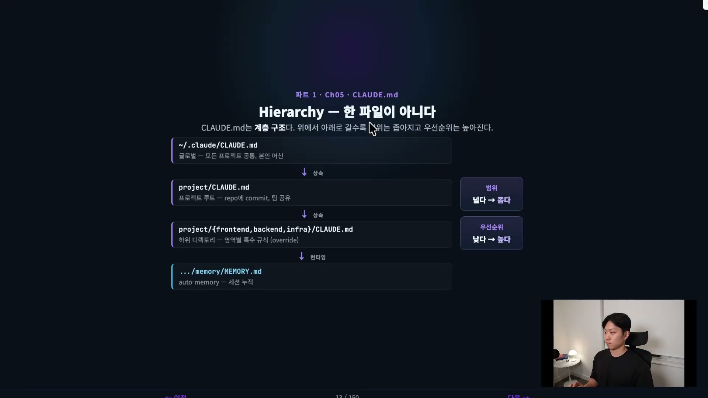
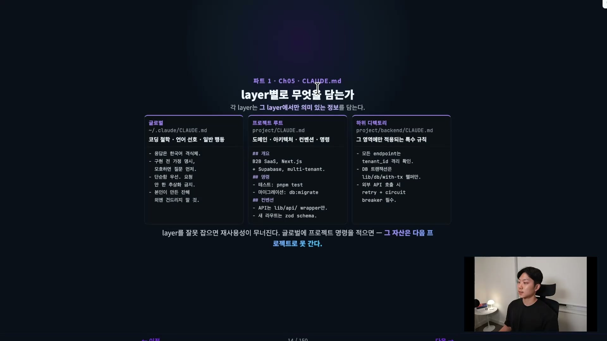
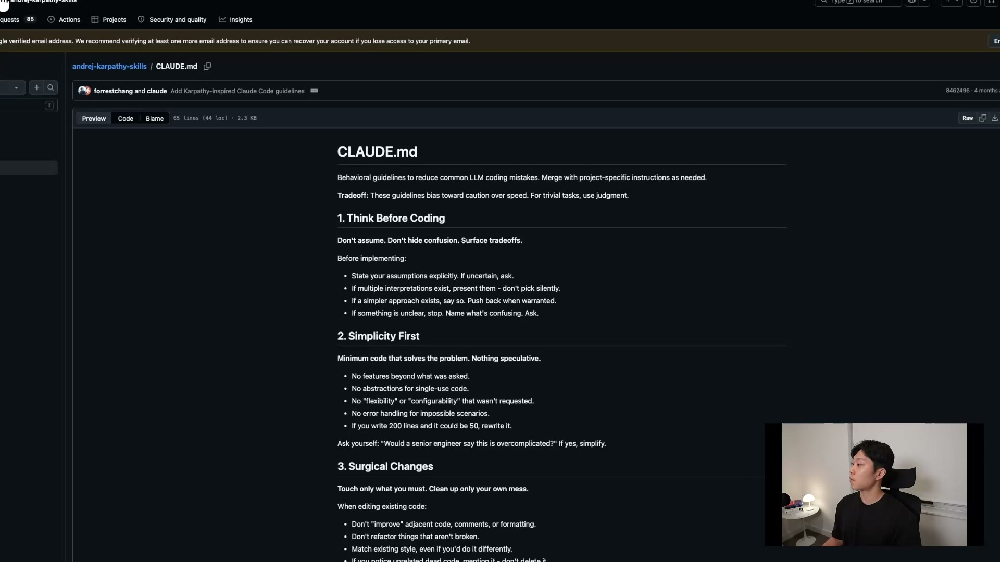
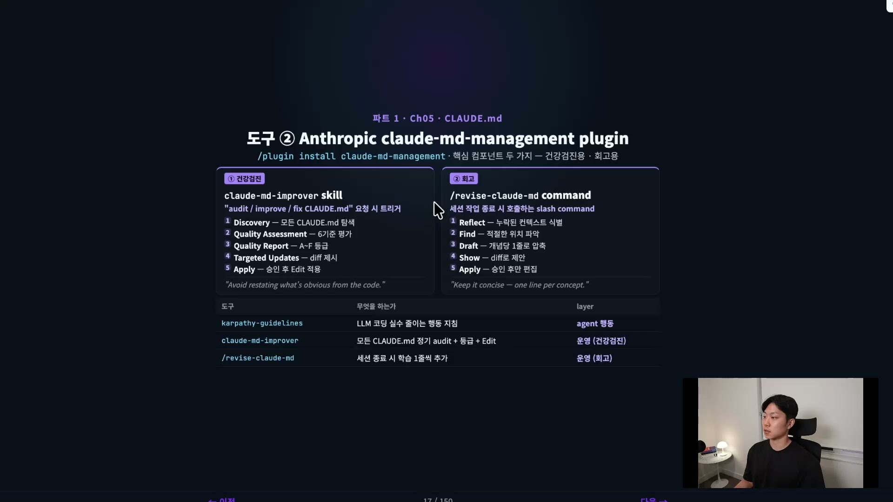
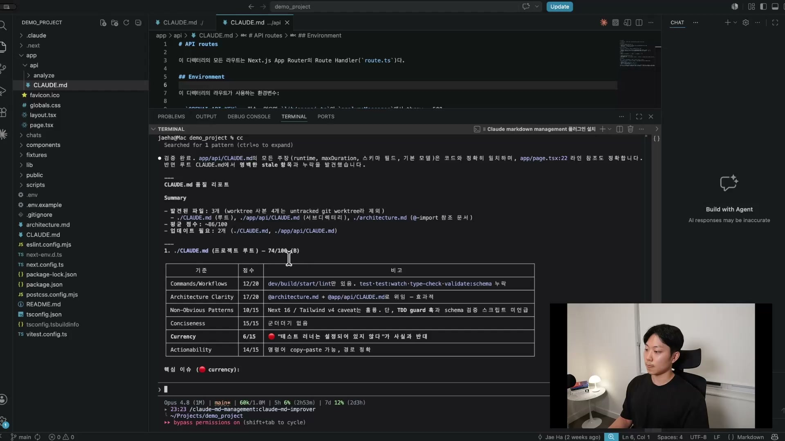
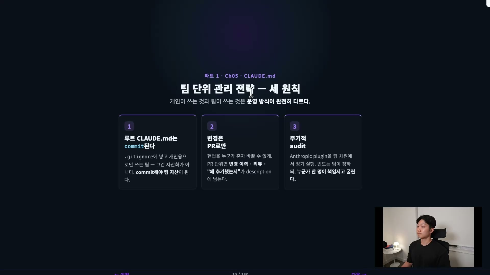

CLAUDE.md가 무엇이고 어떤 문법으로 쓰는지는 따로 정리해 둔 기본 개념이 있다. 여기서 정리하려는 건 그 다음 단계다. 개인의 메모장이던 CLAUDE.md를 회사와 팀의 자산으로 어떻게 굴릴 것인가. 왜 이게 개인을 넘어 팀 차원에서 결정적인지, 계층 구조를 실전에서 어떻게 설계하는지, 그리고 이걸 자동으로 관리해 주는 두 도구(안드레이 카르파티의 가이드라인 스킬, Anthropic 공식 플러그인)까지가 범위다.

## CLAUDE.md는 문서가 아니라 헌법이다

한 줄로 정의하면 이렇다. CLAUDE.md는 에이전트에게, Claude Code에게 주는 프로젝트의 헌법이다.

가이드도 문서도 아닌 헌법이라는 단어를 고른 이유가 있다. 이건 필요할 때 들춰 보는 참고 자료가 아니라, 에이전트의 모든 판단이 깔고 들어가는 최상위 규범이기 때문이다. 극단적으로 단 두 줄짜리 CLAUDE.md를 떠올려 보자.

```
- 한국어로 응답해줘.
- 코드 변경 전에 반드시 테스트를 먼저 작성해줘.
```

겨우 두 줄이다. 그런데 이 파일이 있는 프로젝트와 없는 프로젝트는 에이전트의 첫 응답부터 완전히 갈린다. 한쪽은 영어로 답하며 곧장 코드를 고치려 들고, 다른 한쪽은 한국어로 답하며 테스트부터 짜겠다고 한다. 같은 모델, 같은 질문인데 행동이 다르다. 그래서 헌법이라는 표현은 과장이 아니다.

## "rate limiting 추가해줘", 한 페이지의 차이

추상적인 말이니 시나리오 하나로 구체화해 보자. 인증(authentication) 로직이 있는 프로젝트에 rate limiting을 붙이는 상황이다.

rate limiting은 말 그대로 무언가를 제한하는 장치다. 왜 필요한지부터 보자. 카카오톡 대화를 분석해 주는 서비스를 배포했다고 하자. 누군가 이 서비스를 쓸 때마다 뒤에서는 Claude API가 호출되고, 토큰 사용량만큼 나에게 과금된다. 몇 센트에서 시작해 몇 달러, 수십 달러로 쌓인다. 그런데 악의를 품은 누군가가 이 서비스를 10만 번, 천만 번씩 두드린다면? 그만큼의 API 호출이 고스란히 내 청구서가 되어 10만 달러가 나갈 수도 있다. 그 공격으로부터 서비스를 지키는 메커니즘 중 하나가 rate limiting이다. "한 유저는 10분에 API를 10번까지만 부를 수 있다"처럼 제한을 걸어 두는 것이다.

이제 같은 요청을 CLAUDE.md가 있을 때와 없을 때로 나눠 보자.



CLAUDE.md가 없으면 에이전트는 꽤 헤맨다. 프로젝트 전체를 다 읽고, 아키텍처가 어떻게 생겼는지 파악하고, rate limiting을 어디에 어떻게 끼울지 매 단계 나에게 되묻는다. express의 rate-limit 라이브러리를 쓸지 직접 구현할지, 미들웨어는 어디 둘지, 테스트 프레임워크는 뭘 쓰는지. 반면 "이 아키텍처는 이런 이유로 이렇게 설계했다"가 CLAUDE.md에 문서화되어 있으면, 에이전트는 곧장 구조를 파악하고 그 결정의 결을 따라 "redis 기반 limiter를 쓰고, middleware/rate-limit.ts를 만들고, 테스트도 같이 작성하겠다"는 식으로 첫 응답부터 정답에 근접한다.

여기서 짚고 싶은 핵심이 있다. 차이를 만드는 건 모델의 지능이 아니라 첫 응답 시점의 컨텍스트다. 그리고 CLAUDE.md는 그 컨텍스트의 가장 농축된 형태다.

## 개인 차원의 가치 세 가지

이게 왜 결정적인지는 두 차원으로 나눠 보면 또렷해진다. 먼저 개인 차원, 세 가지로 정리된다.

첫째, 반복 설명이 사라진다. "이건 이렇게 해라", "이런 결정을 했으니 저렇게 해라", 심지어 "이 사람한테 PR 리뷰 받아라"까지, 매번 입으로 떠들던 것을 CLAUDE.md에 한 번 박아 두면 다시 말할 필요가 없다.

둘째, 컨텍스트를 매번 주입하지 않아도 된다. 좋은 컨텍스트를 매 세션 떠먹이는 건 사실 아주 비싼 작업이다. 문서를 복사해 붙여넣고, 파일을 드래그 앤 드롭하는 그 수고를 떠올려 보자. CLAUDE.md는 그 비용을 세션 시작 시점의 한 번으로 줄여 준다.

셋째, 자기 자신과의 일관성이다. 사람인지라 한 달 전에 정해 둔 방식을 오늘 까먹고 다른 식으로 짤 수 있다. CLAUDE.md에 컨벤션과 규칙을 적어 두면 에이전트가 그 규칙대로 작동하도록 어느 정도 강제해 준다. 과거의 내 결정을 미래의 내가 다시 따르게 만드는 장치인 셈이다.

## 팀·회사 차원, 여기서부터가 핵심

개인용으로는 다들 어느 정도 잘 쓴다. 정작 드문 건 CLAUDE.md를 팀과 회사의 자산으로 끌어올려 쓰는 경우다. 강의에서는 20명 규모 팀의 운영 사례를 들어 세 가지 효과를 짚는다.



첫째, 온보딩 시간이 줄어든다. 신규 멤버가 첫날 리포지터리를 클론하고 에이전트를 켰을 때, 그 에이전트가 첫 응답부터 "우리 팀은 이렇게 일합니다" 수준의 답을 준다면, 그건 이미 시니어 엔지니어 한 명이 옆에 붙어 멘토링하는 것과 같은 역할을 한다. 옆에 앉아 "이건 이 패턴대로 해야 돼" 하고 일일이 베이비시팅할 필요가 없으니, 멘토의 시간도 신규 멤버의 시간도 함께 줄어든다. 강의에서는 일주일에서 한 달 걸리던 온보딩이 며칠로 줄었다고 말한다.

둘째, 팀의 코드 스타일이 일관된다. 스타일 가이드가 위키 문서로만 존재하면 아무도 안 본다. 하지만 CLAUDE.md에 박아 두면, 에이전트가 알아서 PR마다 그 가이드대로 코드를 쓴다. 사람이 일일이 신경 쓰지 않아도 일관성이 유지된다.

셋째, "이렇게 하지 마세요"를 제도화할 수 있다. 서비스 장애를 일으켰던 패턴들이 있다고 하자. 보통은 "이렇게 하면 안 됩니다"를 프로세스로 만들어 막으려 하지만, CLAUDE.md에 "이 패턴은 장애가 났던 패턴이니 절대 이렇게 하지 마"라고 한 줄 적어 두는 것만으로 에이전트가 첫 응답부터 그 위반을 피한다. 같은 사고가 다시 날 확률이 급격히 낮아진다.

ROI의 차이가 여기서 분명해진다. 개인 차원의 ROI는 나 혼자의 생산성이지만, 팀 차원에서는 그 효과가 인원 수만큼, 매일 곱해진다. 20명일 수도, 부서 전체로는 100명, 200명일 수도 있다.

## CLAUDE.md는 한 파일이 아니다, 계층 구조다

CLAUDE.md는 하나의 파일이 아니라 계층 구조라는 점을 실전 설계 관점에서 다시 풀어 보자.



맨 위는 전역 CLAUDE.md, 즉 글로벌이다. `~/.claude/CLAUDE.md`에 놓이며 모든 프로젝트에 공통으로 적용된다. 그래서 여기에는 프로젝트별 규칙이 아니라 나를 위한 규칙을 넣는 게 좋다. "PR 리뷰는 이 사람들에게 꼭 받아라" 같은 나만의 규칙, 내가 즐겨 쓰는 스크립트, 내가 자주 저지르는 실수 같은 것들이다.

두 번째는 프로젝트 루트다. 여기서부터는 팀 컨벤션이다. 팀이 공유하는 영역이니 범위가 한 단계 좁아졌고, 우리 팀을 위한 규칙과 자주 잘못되는 패턴이 들어간다.

세 번째는 영역별 특수 규칙이다. 서비스별로 폴더가 나뉘어 있고 각 서비스를 두세 명이 나눠 관리한다면, 그 폴더의 CLAUDE.md는 그 멤버들이 관리하는 영역이다. 범위가 더 좁아졌다.

이렇게 아래로 내려갈수록 범위는 점점 좁아지고 우선순위는 조금씩 높아진다. 하위 디렉토리에서 작업할 때는 상위 레이어의 규칙을 상속받되, 같은 규칙이 충돌하면 무조건 하위 레이어가 이긴다. 더 좁은 곳의 규칙이 더 센 셈이다.

## 각 layer에는 그 layer에서만 의미 있는 것을 담는다

방금 말한 걸 한 단계 더 구체화하면, 무엇을 어느 레이어에 넣을지가 정해진다.



글로벌에는 나만의 코딩 철학, 선호하는 언어, 행동 방식을 넣는다. 프로젝트 루트에는 도메인, 아키텍처, 컨벤션, 프로젝트 명령을 넣는다. 영역별 폴더에는 "이 모듈의 모든 엔드포인트는 이걸 확인해라" 같은 그 영역에만 의미 있는 특수 규칙을 넣는다.

핵심은 각 레이어에 그 레이어에서만 의미 있는 정보를 담아야 한다는 것이다. 글로벌에 특정 프로젝트의 명령을 적거나, 프로젝트 루트에 내 개인 취향을 적어 버리면 그 자산은 다음 프로젝트로 넘어가지 못한다. 레이어를 잘못 잡으면 재사용성이 무너진다.

## 도구 ① 카르파티 가이드라인 스킬: 에이전트 행동을 잡는다

개념은 여기까지고, 이제 실제로 쓰는 도구로 넘어간다. 첫 번째는 안드레이 카르파티의 가이드라인 스킬이다.

이건 카르파티가 LLM에게 코딩을 시킬 때 자주 빠지는 함정들, 그러니까 코딩 행동 지침을 정리해 둔 것이다. 주의할 점이 있다. 이건 CLAUDE.md를 만들어 주거나 점검해 주는 도구가 아니다. 에이전트의 코딩 행동 자체를 잡는, 결이 다른 자산이다. 특정 프로젝트에 국한된 게 아니라 전역 코딩 지침에 가까워서, 보통은 전역으로 쓴다. 이름은 스킬이지만, CLAUDE.md는 필요할 때만 불러 쓰는 게 아니라 항상 모든 컨텍스트에 로드되는 것이라 스킬로 분류하기엔 애매하다. 그래서 그 내용을 전역 CLAUDE.md에 복사해 붙여넣어 쓰는 방식이 자연스럽다.

GitHub에서 `andrej-karpathy-skills`로 검색하면 바로 나온다. 별이 많이 붙어 있고, 카르파티가 X에 올린 내용을 바탕으로 정리한 저장소다. 그 안의 CLAUDE.md를 열면 이렇게 생겼다.



네 가지 정도의 원칙이 있다.

첫째, **코딩 전에 먼저 생각하라(Think Before Coding)**. 가정하지 말고 혼란을 숨기지 말라는 것이다. 에이전트는 혼란을 정말 많이 숨긴다. 틀렸는데 틀렸다고 말하지 않는 게 가장 큰 문제다. 그러니 네가 틀린 걸 드러내라고 지침을 내린다. 불확실하면 가정을 명시하고, 더 단순한 방법이 있으면 반대 의견을 내라는 항목들이 여기 들어간다.

둘째, **단순함 우선(Simplicity First)**. 에이전트는 오버 엔지니어링하려는 경향이 크고, 그러면 코드가 쓸데없이 복잡해진다. "200줄을 썼는데 50줄로 가능하면 다시 써라", "요청되지 않은 기능·추상화·유연성은 넣지 마라" 같은 지침으로 단순함을 강제한다.

셋째, **외과적 수정(Surgical Changes)**. 꼭 필요한 것만 건드리라는 것이다. 무언가를 고치라고 하면 에이전트가 갑자기 프로젝트 전체 디자인을 바꾸려 드는 경우가 있는데, 그럴 필요가 없다. 인접한 코드나 포맷팅을 "개선"하지 말고, 깨지지 않은 걸 리팩토링하지 말라고 미리 못 박는다.

넷째, **목표 중심(Goal Driven)**. Spec-Driven, Goal-Driven Development는 요즘 핫한 단어이자 결국 LLM의 목적 그 자체다. 성공 기준을 정의하고 검증될 때까지 반복하라는 것이다. 이 지침이 있으면 에이전트가 작업을 받았을 때 "이건 어떻게 검증할까요?"라고 먼저 물어 온다. 지침이 없으면 그렇게 묻지 않을 수도 있다.

이 네 가지를 전역에 넣어 두는 건, 워크숍에 온 엔지니어에게 행동 지침을 주는 것과 같다. 살짝 세뇌하는 셈이다. 강의에서는 이걸 넣은 뒤로 코딩 품질이 체감상 확실히 높아졌다고 말한다.

## 도구 ② Anthropic claude-md-management 플러그인: 관리를 자동화한다

두 번째 도구는 Anthropic이 공식으로 릴리즈한 플러그인, claude-md-management다. 핵심 컴포넌트가 두 개인데 용도가 다르다. 하나는 건강검진용, 하나는 회고용이라고 생각하면 된다.



`claude-md-improver` 스킬은 말 그대로 CLAUDE.md를 개선해 준다. "내 CLAUDE.md를 검사하고 개선해 줘"라고 하면, 프로젝트 안의 CLAUDE.md를 탐색하고, 여섯 가지 기준으로 등급을 매긴 뒤, 그 등급에 맞춰 개선안을 제시하고 적용까지 해 준다. 지금 있는 문서의 상태를 "건강 어때?" 하고 물어보는 건강검진에 가깝다.

`/revise-claude-md` 커맨드는 회고용이다. 세션 작업을 끝낼 때 호출한다. 어떤 세션에서 실수하거나 실패한 패턴이 많았다면, 이 커맨드가 누락된 컨텍스트를 식별한다. "아, CLAUDE.md에 이런 것들이 있었어야 했네. 이게 없어서 이런 실수를 했네"라고 파악하고, 그것들을 CLAUDE.md에 알아서 반영해 준다. 오답노트에 가까운 도구다. 카르파티 가이드라인이 에이전트의 행동 레이어를 다룬다면, 이 플러그인은 그 행동의 무대인 CLAUDE.md 자체를 관리한다.

실제로 improver를 돌려 보면 이렇게 등급표가 나온다.



카카오톡 채팅 CSV를 분석하는 데모 프로젝트에는 CLAUDE.md가 두 개 있다. 프로젝트 레벨 하나, API 레벨 하나다. 둘 다 improver에 걸어 보니 프로젝트 루트는 B, API 레벨은 A를 받았다. Conciseness(간결성)는 좋지만 Currency(최신성)는 떨어진다는 식으로 기준별 진단이 붙는다. 제안된 수정을 전부 적용하고 커밋·푸시한 뒤 다시 돌리면, 점수가 모두 A로 오르는 것을 확인할 수 있다.

여기서 강조하고 싶은 것이 있다. CLAUDE.md를 좋게 만드는 데 정말 신경을 많이 써야 한다. 이건 매 세션마다 쌓이고, 매 세션마다 에이전트가 어떻게 행동할지를 결정하는 핵심 문서다. 말 그대로 에이전트의 뇌다. 인간의 뇌가 잠을 얼마나 잘 자고 생각을 얼마나 잘하느냐로 달라지듯, 에이전트 시대에는 이 뇌를 얼마나 잘 관리하느냐가 더 중요해졌다. CLAUDE.md를 정성껏 깎은 에이전트와, 100번쯤 수정을 거친 에이전트의 행동은 차원이 다르다. 처음에는 모든 걸 담을 수 없으니 작게 시작하되, 점점 키워 나가는 것이다. Anthropic이 이런 플러그인까지 만든 이유도 결국 CLAUDE.md가 그만큼 중요하기 때문이다.

이 도구들을 적재적소에 쓰려면 자동화가 필요하다. 팀 CLAUDE.md를 위해서는 크론잡을 걸어 두고 주기적으로, 예컨대 일주일에 한 번씩 improver를 돌리는 방법이 있다. 20명이 일주일 동안 계속 코드를 추가하고 지우면 CLAUDE.md도 그만큼 손볼 게 많이 쌓인다. 크론잡 셋업 자체는 정말 쉬운데 팀에 미치는 임팩트는 크다. 들이는 노력 대비 효과가 큰, 로우 행잉 프루트다.

## 팀 단위 운영의 세 원칙

개인이 쓰는 방식과 팀이 쓰는 방식은 운영이 완전히 다르다. 세 원칙으로 정리된다.



첫째, 루트 CLAUDE.md는 커밋한다. 프로젝트 루트의 CLAUDE.md를 `.gitignore`에 넣어 개인용으로만 쓰면 자산화가 아니다. 커밋해야 팀의 코드, 팀의 자산이 된다.

둘째, 변경은 PR로만 한다. 헌법을 누군가 혼자 임의로 바꿀 수 없게, PR 단위로 가면 변경 이력과 리뷰가 남고 "왜 이걸 추가했는지"가 description에 남는다.

셋째, 주기적으로 audit한다. 이건 많은 팀이 빠뜨리는 부분이다. 크론잡을 돌리되 빈도는 자유다. 2주에 한 번이든 한 달에 한 번이든 상관없고, 한 명이 책임지고 주기를 정해 계속 돌리는 게 중요하다. 핵심은 주기적으로 건강검진을 해 주는 것이다.

이 원칙들을 실제 트리거 시점별 워크플로우로 옮기면 이렇게 된다. 일상적으로 PR을 올릴 때는 "이 변경으로 CLAUDE.md 업데이트가 필요한가?"를 체크리스트로 두고, 필요하면 같은 PR 안에 CLAUDE.md 변경을 함께 포함한다. 정기적으로는 2주마다 cron이나 GitHub Action으로 improver를 자동 실행해 결과를 리포트하고, 액션 아이템이 있으면 PR을 생성한다. 세션을 종료할 때 새로 배운 게 있으면 `/revise-claude-md`를 한 번 돌려 본인 CLAUDE.md에 박는다. 새 멤버가 합류한 첫날에는 클론 후 improver를 한 번 돌려 보게 하고, 그 개선안을 첫 PR로 제안하게 한다. 새 멤버의 첫 PR이 곧 CLAUDE.md 개선 제안이 되니, 코드베이스에 빠르게 입문하면서 문서도 다듬는 일석이조의 온보딩 태스크가 된다.

## 정리

정리하면 이렇다. CLAUDE.md는 에이전트에게 주는 헌법이다. 개인 차원에서는 반복 설명과 컨텍스트 주입을 절약해 주지만, 팀 차원에서는 온보딩·일관성·사고 방지로 ROI가 비교가 안 될 만큼 커진다. 그래서 계층 구조를 잘 이해하고 레이어마다 알맞은 것을 담아 설계해야 한다. 관리는 두 도구가 나눠 맡는다. 카르파티 가이드라인을 전역에 두어 에이전트의 코딩 행동에 지침을 주고, Anthropic의 claude-md-management 플러그인으로 건강검진과 회고를 팀에 주기적으로 돌린다.

결국 결론은 하나로 모인다. CLAUDE.md를 잘 깎고 잘 관리하자. 도구를 붙이고 스킬을 만드는 것도 다 좋지만, 에이전트를 우리 프로젝트에 최적화시키는 가장 확실한 길은 이 뇌를 관리하는 것이다.
