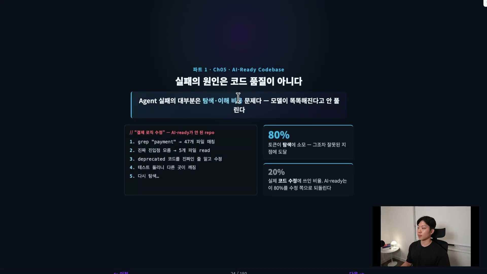
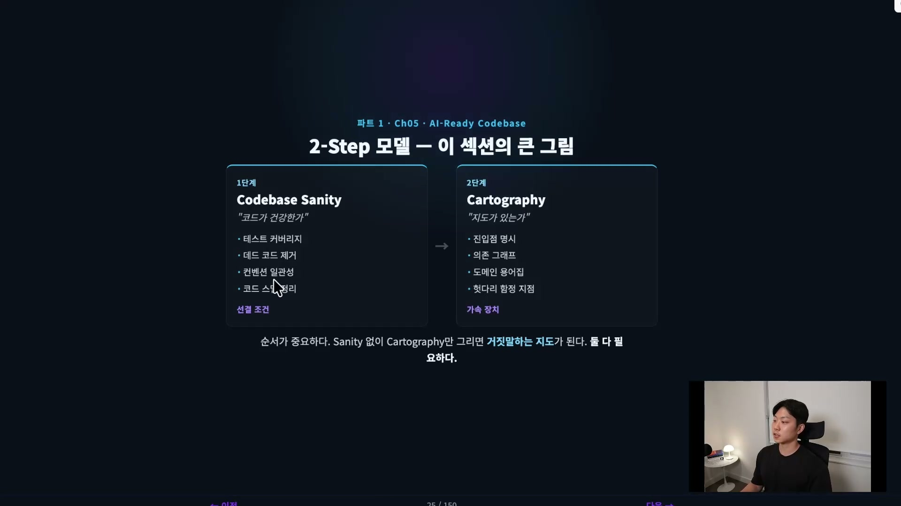
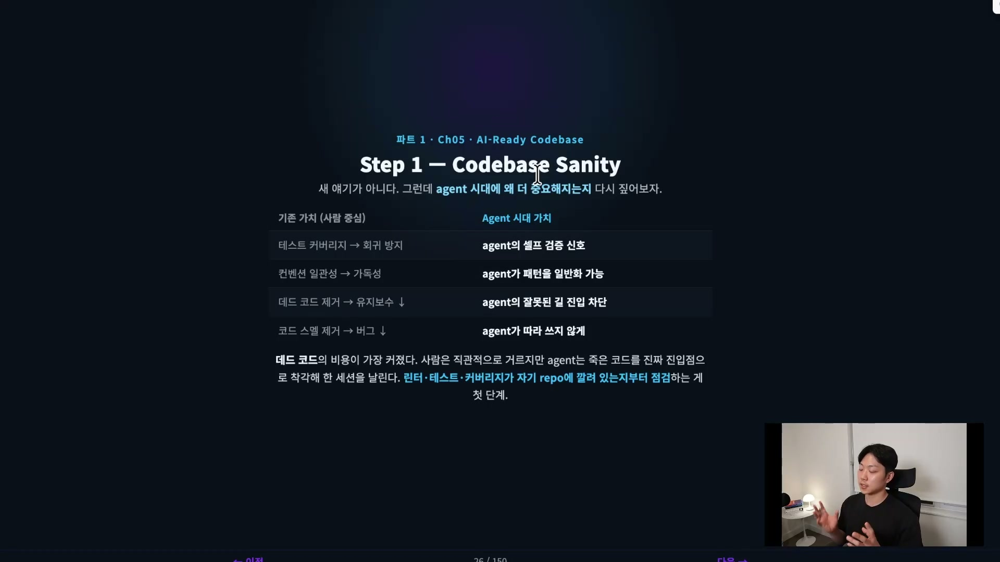
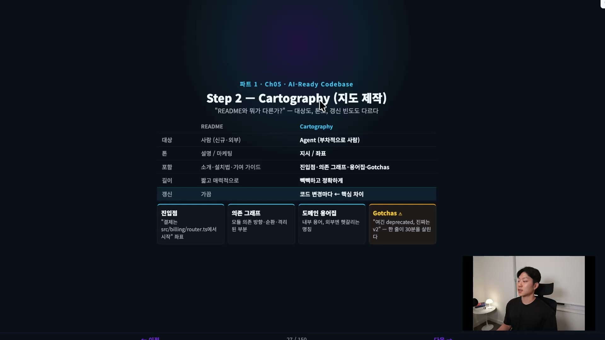
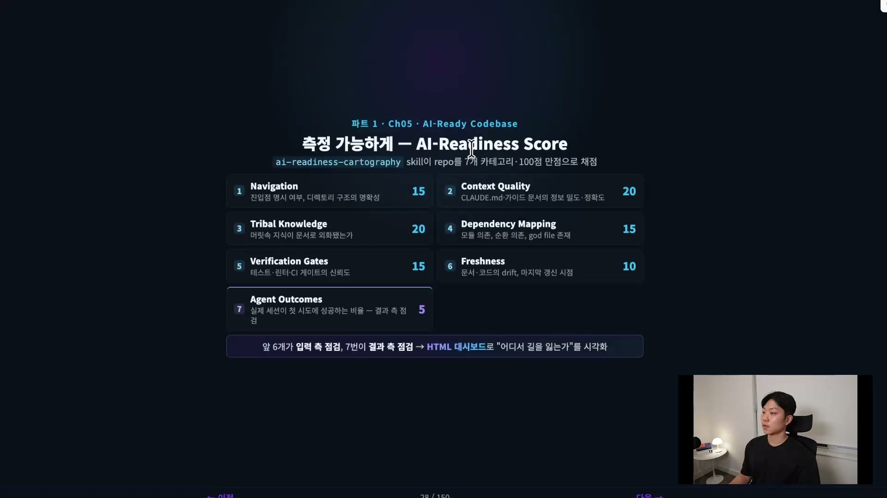
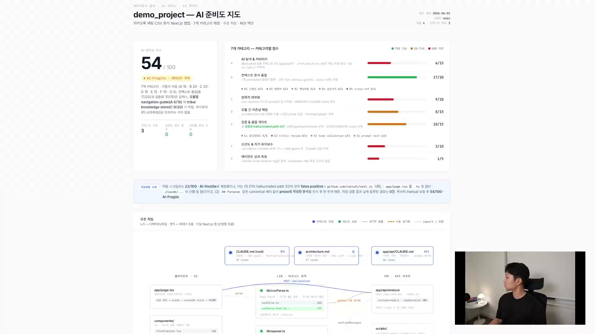
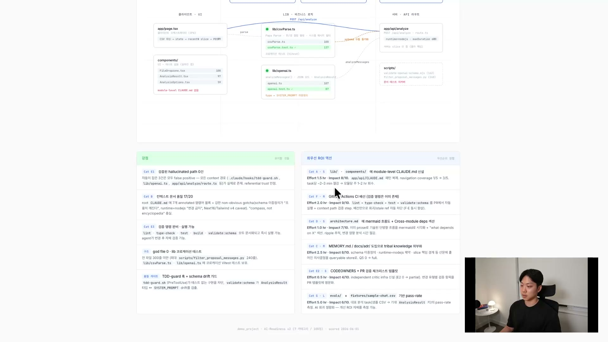
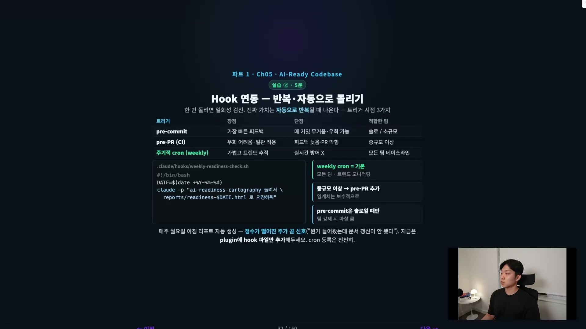

CLAUDE.md를 잘 써두면 에이전트가 일을 잘할 것 같다. 어떻게 행동해야 하는지, 무엇을 하면 안 되는지를 문서로 박아두면 에이전트는 그 규칙을 읽고 움직인다. 그래서 CLAUDE.md를 에이전트의 헌법이라고 부른다.

그런데 헌법을 아무리 잘 써도, 에이전트가 일하러 들어간 코드베이스 자체가 미로라면 무슨 일이 벌어질까. 엉뚱한 파일을 읽고, 이미 있는 함수를 또 만들고, 멀쩡히 존재하는 유틸 파일을 못 찾아서 새로 짠다. CLAUDE.md는 지침이고, 코드베이스는 지형이기 때문이다. 지침이 아무리 좋아도 지형이 험하면 에이전트는 헛다리를 짚는다.

AI-ready codebase는 이 지형 문제를 푸는 개념이다. 한 줄로 정의하면, 에이전트가 길을 잃지 않고 작업할 수 있는 코드베이스다. 그냥 "좋은 코드베이스"와는 미묘하게 다르다.

## 사람의 기준으로는 부족하다

사람은 한 번 출근해서 한 달 동안 코드를 읽고 쓰다 보면 머릿속에 코드베이스 지도가 저절로 그려진다. 이 파일이 진입점이고, 결제는 저쪽 모듈에서 시작하고, 이건 옛날 코드라 안 쓴다는 감각이 몸에 밴다. 우리가 탐색에 치르는 비용을 익숙해지는 걸로 메운다.

에이전트는 그게 안 된다. 매 세션마다 처음 들어온다고 생각해야 한다. 우리가 익숙함으로 메우던 비용을 에이전트는 매번 처음부터 새로 치른다. 그래서 기준이 더 빡빡해진다. 신규 입사자가 일주일이면 적응하는 코드베이스 품질로는 부족하고, 첫 1분 안에 어디로 가야 할지가 명확해야 에이전트가 헛다리를 짚지 않는다.

## 에이전트 실패의 80%는 코드 품질이 아니라 탐색 비용이다

현장에서 에이전트를 굴려 보면 흥미로운 패턴이 보인다. 에이전트 실패의 대부분은 코드를 잘못 짜서 생기는 게 아니다. 올바른 위치를 못 찾아서, 이미 있는 유틸 파일을 못 봐서, 진짜 진입점이 뭔지 몰라서 실패한다. 탐색과 이해 비용의 문제다. 모델이 더 똑똑해진다고 풀리는 종류의 문제가 아니다. 지형 자체가 정리돼야 한다.

"결제 로직을 수정해라"는 태스크를 예로 들어 보자. AI-ready가 안 된 리포지토리에서 에이전트는 payment를 찾느라 47개 파일을 뒤진다. 진입점이 뭔지 모르니 그중 5개를 읽고, deprecated된 코드가 진짜인 줄 알고 수정한다. 테스트를 돌리면 엉뚱한 곳이 깨지고, 그래서 다시 탐색한다. 이 태스크에 쓰인 토큰의 80%가 탐색에 들어가고, 실제 코드 수정은 20%밖에 안 된다. 게다가 그 탐색조차 잘못된 지점에 도달하는 경우가 많다.

AI-ready codebase를 만드는 작업은, 정리하면 이 80%를 다시 코드 수정 쪽으로 되돌려놓는 일이다.

## 두 단계, 건강한 코드 위에 지도를 얹는다

만드는 작업은 두 단계로 나뉜다. 첫 번째가 Codebase Sanity, 코드가 건강한지를 보는 단계다. 두 번째가 Cartography, 그 위에 지도를 그리는 단계다.

순서가 중요하다. 코드가 건강하지 않은데 지도부터 만들면 아무 효과가 없다. 병든 지형 위에 그린 지도는 거짓말을 한다. 죽은 길을 진짜 길처럼 안내하고, 중복된 함수 둘 중 어느 쪽이 진짜인지 알려주지 못한다. 그래서 Sanity가 무조건 선결 조건이고, Cartography는 그 위에서만 작동하는 가속 장치다. 둘 다 필요하다.

## 1단계 Codebase Sanity, 익숙한 덕목이 새 의미를 얻는다

테스트, 컨벤션, 데드 코드 제거는 엔지니어라면 다 아는 이야기다. 새로운 게 아니다. 다만 에이전트 시대에 와서 이것들의 가치가 미묘하게 달라진다.

| 항목 | 기존 가치 (사람 중심) | 에이전트 시대의 가치 |
| --- | --- | --- |
| 테스트 커버리지 | 회귀 방지 | 에이전트의 셀프 검증 신호 |
| 컨벤션 일관성 | 가독성 | 에이전트가 패턴을 일반화해 쓸 수 있음 |
| 데드 코드 제거 | 유지보수 부담 감소 | 에이전트의 잘못된 길 진입 차단 |
| 코드 스멜 제거 | 버그 감소 | 에이전트가 나쁜 코드를 따라 쓰지 않게 함 |

테스트 커버리지의 변화가 특히 흥미롭다. 사람에게 테스트는 그냥 안전망 같은 거였다. 에이전트에게는 이게 셀프 검증 신호가 된다. 에이전트는 기본적으로 루프를 돌면서 자기가 잘못한 걸 스스로 알아채고 고치는데, 그 능력이 작동하려면 테스트가 잘 깔려 있어야 한다. 커버리지가 촘촘한 코드베이스 위에서 일해야 에이전트가 본인의 실수를 잡아내고 더 좋은 결과를 낸다.

컨벤션이 여러 개로 갈려 있으면 에이전트가 헷갈려서 잘못된 패턴을 쓸 확률이 올라간다. 일관된 컨벤션은 에이전트가 따라 쓸 단일한 본보기다. 데드 코드의 비용은 사람보다 에이전트에게서 더 크다. 사람은 직관적으로 옛 코드를 피하지만, 에이전트는 죽은 코드를 진짜 진입점으로 착각해 한 세션을 통째로 날린다. 그래서 데드 코드를 제거하면 에이전트가 잘못된 길로 아예 들어갈 수 없게 막아주는 셈이다.

## 2단계 Cartography, 에이전트를 위한 지도

Sanity가 보장된 코드베이스 위에 지도를 얹어 탐색 비용을 한 번 더 떨어뜨리는 단계가 Cartography다. 한국말로 지도 제작이라는 뜻이다.

README와 뭐가 다른가. 가장 큰 차이는 대상이다. README는 사람을 위한 것이고, 지도는 에이전트를 위한 것이다. 그래서 톤과 갱신 주기까지 전부 달라진다.

| 구분 | README | Cartography |
| --- | --- | --- |
| 대상 | 사람 (신규 · 외부) | 에이전트 (부차적으로 사람) |
| 톤 | 설명 / 마케팅 | 지시 / 좌표 |
| 포함 | 소개, 설치법, 기여 가이드 | 진입점, 의존 그래프, 용어집, Gotchas |
| 길이 | 짧고 매력적으로 | 빽빽하고 정확하게 |
| 갱신 | 가끔 | 코드 변경마다 |

지도에 들어가는 핵심은 네 가지다. 진입점은 "결제는 src/billing/router.ts에서 시작"처럼 어디서부터 읽어야 하는지를 짚어주는 좌표다. 의존 그래프는 모듈이 어느 방향으로 의존하고 어디가 순환하는지를 보여준다. 도메인 용어집은 내부 용어와 외부에서 헷갈리는 명칭을 정리한다. 그리고 Gotchas, 잘못 짚기 쉬운 함정이다. "여긴 deprecated, 진짜는 v2" 같은 한 줄이 에이전트의 30분을 살린다.

갱신 주기가 "코드 변경마다"인 게 핵심 차이다. README는 가끔 손보지만, 지도는 코드가 바뀔 때마다 같이 갱신돼야 거짓말을 안 한다.

## 측정, AI-Readiness Score로 채점한다

내 코드베이스가 얼마나 AI-ready한지 먼저 점수를 매겨야 한다. 강의에서는 이걸 자동으로 채점하는 `ai-readiness-cartography`라는 스킬을 만들어 보여준다. 린트가 아니라, 이 프로젝트에서 에이전트가 어느 카테고리에서 가장 길을 잃는지를 짚어주는 리포트라고 생각하면 된다.

채점은 7개 카테고리, 100점 만점으로 나뉜다.

| # | 카테고리 | 배점 | 무엇을 보는가 |
| --- | --- | --- | --- |
| 1 | Navigation | 15 | 진입점 명시 여부, 디렉토리 구조의 명확성 |
| 2 | Context Quality | 20 | CLAUDE.md와 가이드 문서의 정보 밀도, 정확도 |
| 3 | Tribal Knowledge | 20 | 머릿속 암묵지가 문서로 외부화됐는가 |
| 4 | Dependency Mapping | 15 | 모듈 의존, 순환 의존, god file 존재 |
| 5 | Verification Gates | 15 | 테스트, 린터, CI 게이트의 신뢰도 |
| 6 | Freshness | 10 | 문서와 코드의 drift, 마지막 갱신 시점 |
| 7 | Agent Outcomes | 5 | 실제 세션이 첫 시도에 성공하는 비율 |

앞 6개가 입력을 보는 점검이고, 7번 Agent Outcomes만 결과를 보는 점검이다. 이 채점 결과를 HTML 대시보드로 뽑아 "어디서 길을 잃는가"를 시각화한다.

한 가지 짚어둘 점은, 이 루브릭이 절대적인 기준이 아니라는 것이다. 강의에서도 화자가 임의로 만든 채점지라고 분명히 말한다. 어떤 카테고리는 빼고 어떤 카테고리는 더하는 식으로, 팀이 자기 채점지를 만들어 스크립트에 갈아끼우면 된다.

## 데모, 54점이 나온 대시보드

강의에서는 카카오톡 채팅 CSV 분석 Next.js 웹앱을 대상으로 이 스킬을 실제로 돌린다. 파이썬 스크립트가 채점하고, 결과가 HTML 대시보드로 떨어진다. 데모에서 나온 점수는 54점, "AI-Fragile(에이전트 취약)" 등급이다.

카테고리별로 보면 컨텍스트 문서 품질은 17/20으로 꽤 괜찮은데, 탐색 커버리지(Navigation)는 6/15, 암묵지 외부화(Tribal Knowledge)는 9/20으로 약하다. 자가 유지보수(Freshness)와 성과 측정(Agent Outcomes)은 거의 바닥이다. 대시보드는 점수만 주는 게 아니라, CLAUDE.md와 Architecture.md 같은 문서가 어떤 파일들과 어떻게 연결되는지를 노드-링크 구조 지도로 같이 보여준다. 에이전트가 어떤 문서를 통해 어디로 찾아 들어가는지를 한눈에 보게 하는 것이다.

## 점수만으로는 의미가 없다, ROI 액션

대시보드에서 진짜 중요한 건 점수가 아니라 "뭘 바꿔야 하는가"다. 그래서 채점 결과는 최우선 ROI 액션 목록으로 이어진다.

데모에서 나온 제안들을 보면 이렇다. 라이브러리와 컴포넌트에 모듈 레벨 CLAUDE.md를 만들어라, 즉 루트 CLAUDE.md를 더 잘게 쪼개라는 말이다. GitHub Actions에서 Lint, TypeCheck, Test, Validate를 PR마다 자동 실행하게 만들어라. Mermaid 흐름도를 Architecture.md에 넣어 시각화해라. MEMORY.md에 ADR(아키텍처 결정 기록)을 도입해 암묵지를 외부화해라. CODEOWNERS와 PR 검증 체크리스트 템플릿을 만들어라. eval과 fixture를 두고 pass-rate를 측정해 AI 회귀를 정량화해라.

각 항목에는 들이는 노력과 기대 효과가 붙어 있어서, 어디부터 손대야 본전을 뽑는지를 가려준다. 점수가 낮은 카테고리를 효과 큰 순으로 메우는 식이다.

## 한 번 돌리는 건 의미가 없다, 주기화

여기까지가 측정과 개선인데, 진짜 핵심은 따로 있다. 한 번 돌려서 점수를 보는 건 일회성 검진이라 별 효과가 없다. 무조건 주기화를 해야 한다. 이 스킬을 크론잡으로 걸어 한 달에 한 번, 2주에 한 번 자동으로 돌리고, ROI가 있으면 PR까지 생성하게 만든다.

자동 실행 시점은 팀 규모에 따라 고른다.

| 트리거 | 장점 | 단점 | 적합한 팀 |
| --- | --- | --- | --- |
| pre-commit | 가장 빠른 피드백 | 매 커밋 무거움, 우회 가능 | 솔로 / 소규모 |
| pre-PR (CI) | 우회 어려움, 일관 적용 | 피드백 늦음, PR 막힘 | 중규모 이상 |
| 주기적 cron (weekly) | 가볍고 트렌드 추적 | 실시간 방어는 안 됨 | 모든 팀 베이스라인 |

weekly cron이 모든 팀의 기본이다. 매주 월요일 아침 리포트가 자동으로 생성되면, 점수가 떨어진 주가 곧 신호다. "뭔가 새로 들어왔는데 문서 갱신이 안 됐다"는 뜻이기 때문이다.

다만 리포트 자동 생성만으로는 아무 의미가 없다. 고쳐야 의미가 있다. 그래서 ROI에 맞는 PR을 자동으로 생성하고, 그 PR을 머지(merge)하는 데까지 가야 완성이다. PR을 만들어 놓고 머지하지 않으면 아무 효과가 없다.

## 정리

AI-ready codebase는 에이전트가 길을 잃지 않고 작업할 수 있는 코드베이스다. 사람의 기준보다 빡빡한데, 에이전트는 매 세션을 처음부터 다시 시작하기 때문이다. 만드는 작업은 두 단계다. 코드가 건강한지 보는 Codebase Sanity가 선결 조건이고, 그 위에 지도를 얹는 Cartography가 가속 장치다. 순서를 지켜야 지도가 거짓말을 하지 않는다.

측정은 7개 카테고리, 100점 만점의 루브릭으로 채점하되, 그 채점지는 팀이 자기 것으로 만들어 써야 한다. 점수에서 나온 ROI를 골라 적용하고, 한 번으로 끝내지 말고 주기적으로 돌려 PR 머지까지 가야 효과가 있다.

코드베이스 자체는 이걸로 정리된다. 다음 단계는 코드 밖의 지식이다. 회의록, ADR, Slab처럼 코드에 안 적힌 지식까지 에이전트가 참조할 수 있게 묶는 것, 이른바 세컨드 브레인의 영역이다.
