회사에서 진짜 중요한 지식은 코드 안에 거의 없다. 코드는 결과물일 뿐이고, 그 결과에 이르기까지의 판단은 전부 코드 바깥에 흩어져 있다. 석 달 전 누군가 디자인 문서에 "왜 Postgres가 아니라 DynamoDB를 골랐나" 하고 남긴 코멘트, 지난주 ADR(Architecture Decision Record)에 적힌 "이 라이브러리를 왜 deprecate 했는지", 두 달 전 슬랙 스레드에서 PM이 "이 기능은 PRD에 노출하지 않기로 했어"라고 못 박은 한 줄, 옛날 PR 리뷰에 달린 "이 패턴은 race condition 가능성이 있다"는 경고. 이런 지식은 코드에 없고, 솔직히 사람 머릿속에도 잘 안 남는다. 팀에서 이걸 아는 사람은 한두 명뿐이다.

그래서 에이전트한테 일을 시키면 매번 잘못된 가정에서 출발한다. 컨텍스트를 안 줬으니 당연하다. 이 코드 밖 지식, 그러니까 회의록과 디자인 문서와 ADR 같은 것들을 어떻게 에이전트에게 노출시켜 읽게 만들 것인가. 그 답이 세컨드 브레인(Second Brain)이다. 에이전트의 뇌를 따로 지어주는 일이다.

## 세컨드 브레인은 원래 사람을 위한 용어였다

세컨드 브레인은 새로 만든 말이 아니다. Tiago Forte라는 사람이 PKM(Personal Knowledge Management)이라는 방법론으로 이미 정리해둔 개념이고, 『Building a Second Brain』이라는 책도 있다. 원래 정의는 이렇다. 흩어진 지식과 경험을 외부 디지털 메모리에 저장, 연결, 재사용하는 시스템. 키워드 셋이 핵심이다. 저장 · 연결 · 재사용. 머릿속이 아니라 디지털 공간에 두 번째 뇌를 짓는 것이다.

여기까지는 개인 생산성 영역의 이야기다. Forte 본인은 에이전트 같은 단어를 쓴 적이 없고, PARA(Projects, Areas, Resources, Archives)라는 정식 분류 체계까지 갖춰뒀다. 사람이 자기 노트 시스템을 운영하기 위한 틀이다.

이 강의가 쓰는 정의는 그 원전이 아니라, 에이전틱 워크플로우 용어로 재해석한 확장판이다. 정의를 이렇게 바꾼다. 세컨드 브레인은 에이전트가 참조할 수 있는 사실, 맥락, 이력의 지식 레이어다. 한 군데가 달라졌다. 원래는 사람이 재사용하는 시스템이었는데, 여기서는 에이전트가 참조하는 레이어다. 같은 저장소를 사람과 에이전트가 함께 쓰되, 에이전트가 거의 1급 소비자가 된다. 이 확장은 안드레이 카파시가 자신의 LLM 위키에서 정리한 패턴과 같은 맥락이다.

## 핵심 문제는 한 줄로 줄어든다

회사 지식이 너무 흩어져 있다. 그래서 검색도, 연결도, 재사용도 다 어렵다. 이게 전부다.

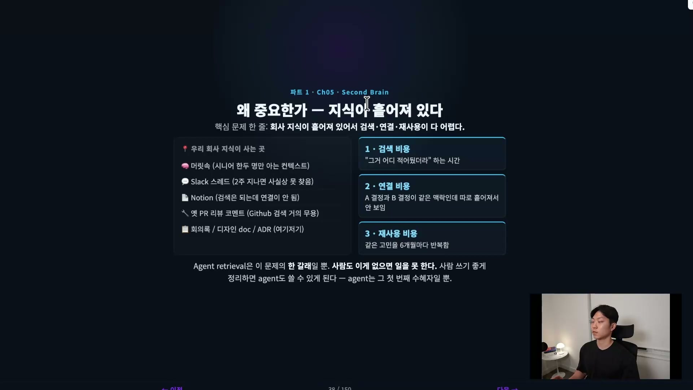

지식이 실제로 어디에 사는지 보면 이렇다. 시니어 한두 명만 아는 머릿속 컨텍스트, 2주만 지나면 사실상 못 찾는 슬랙 스레드, 검색은 되는데 연결은 안 되는 노션 페이지, 검색이 거의 무용한 옛 PR 리뷰 코멘트, 여기저기 흩어진 회의록과 디자인 문서와 ADR. 따로 노는 이것들이 세 가지 비용을 만든다.

- 검색 비용. "그거 어디 적어뒀더라" 하고 찾는 데 드는 시간이다.
- 연결 비용. A 결정과 B 결정이 같은 맥락인데 하나는 회의에서 나왔고 하나는 문서에 있어서, 둘을 잇기가 힘들다.
- 재사용 비용. 같은 고민을 6개월마다 또 한다. 찾기 힘들고 연결도 안 되니까.

한 가지는 분명히 해두는 게 좋다. 에이전트한테 잘 검색시키는 건 이 문제의 한 갈래일 뿐이고, 그걸 메인으로 세컨드 브레인을 만드는 게 아니다. 사람도 이게 없으면 일을 못 한다. 사람이 쓰기 좋게 정리해두면 에이전트도 잘 쓸 수 있게 되는 것이고, 에이전트는 그 정리된 결과의 수혜자일 뿐이다.

## RAG와 뭐가 다른가, 누적되느냐

비슷해 보이지만 결정적 차이가 있다. RAG는 매 질문마다 raw에서 처음부터 검색한다. 그래서 같은 질문이 또 와도 처음부터 다시 발견해야 하고, 아무것도 누적되지 않는다.

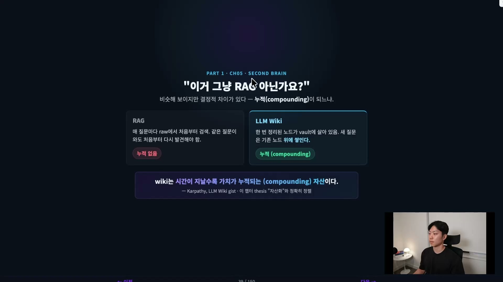

LLM 위키 기반 세컨드 브레인은 누적된다. 한 번 정리된 노드가 vault(옵시디언에서 노트 저장소를 가리키는 단위)에 살아 있다. 새 질문이 오면 그 노드 위에 쌓인다. 카파시의 표현을 빌리면, LLM 위키는 시간이 지날수록 가치가 누적되는 자산이다. 이게 전통 RAG와의 결정적 차이고, 지식을 자산화한다는 이 챕터의 논지와 정확히 이어진다.

## 세 개의 레이어로 쪼개면 CLAUDE.md와의 관계가 보인다

자주 나오는 질문이 또 있다. CLAUDE.md와 세컨드 브레인은 뭐가 다른가. 정확히 답하려면 레이어를 셋으로 쪼개야 한다. 카파시의 LLM 위키가 정리한 모델이 깔끔하다.

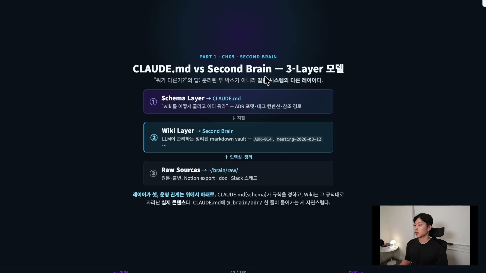

- 스키마 레이어 → CLAUDE.md. 위키를 어떻게 굴리고 어디에 둘지를 규칙으로 적어둔다. ADR 포맷, 태그 컨벤션, 참조 경로 같은 메타 지침이다.
- 위키 레이어 → 세컨드 브레인. LLM이 관리하는 정리된 마크다운들로, 검색 · 연결 · 재사용이 실제로 일어나는 곳이다. 사람이 정리하는 게 아니라 LLM이 정리한다.
- raw 소스 레이어 → 원본. 회의록, 노션, 사내 위키, 슬랙 스레드 같은 모든 원본 파일이다. 우리가 손대는 출발점이다.

운영 관계는 위에서 아래로 흐른다. CLAUDE.md(스키마)가 규칙을 정하면, 위키는 그 규칙대로 에이전트가 자라게 만든다. 그러니까 CLAUDE.md와 세컨드 브레인은 분리된 두 박스가 아니다. 같은 시스템 안의 다른 레이어다. CLAUDE.md는 "이 지식 시스템을 이렇게 운영해라"는 스키마고, 위키 레이어는 그 규칙대로 자라난 실제 콘텐츠다.

## 잘 동작하는 세컨드 브레인의 네 가지 조건

실무에서 무엇을 신경 써야 하는지를 네 가지 설계 목표로 정리할 수 있다. 정식 분류 체계는 아니다. 어느 책에나 이 네 개가 있는 게 아니라, 에이전틱 워크플로우에 맞춰 실무에서 관찰한 것들이다.

| 목표 | 의미 | 안 지키면 |
| --- | --- | --- |
| Searchable | 키워드 · 시맨틱 검색 · 임베딩으로 찾을 수 있어야 한다 | 있는데 못 찾아서 안 쓰인다 |
| Linked | 노드끼리 명시적 링크로 맥락이 이어져야 한다 | 맥락이 단절돼 타고 들어갈 수 없다 |
| Refreshable | 오래된 노드를 감지하고 갱신 · 아카이브한다 | 6개월 지나면 위키가 거짓말이 된다 |
| Multimodal | 텍스트뿐 아니라 다이어그램 · 코드 · 링크를 섞어 담는다 | 시각 정보가 손실된다 |

특히 세 번째, refreshable이 사람이 만든 위키가 죽는 이유다. 아무도 업데이트를 안 한다. 그래서 1년, 2년 묵은 위키가 수두룩하고, 결국 아무도 안 본다. 6개월만 지나도 내용이 거짓이 되는데, 오래된 노드를 감지하고 갱신해주는 메커니즘이 없으면 나머지 셋이 다 무의미하다.

## 무엇을 채워 넣나, 전부 마크다운으로

세컨드 브레인에 뭘 넣을지가 고민이라면, 답은 단순하다. 코드 밖에 흩어져 있던 그 지식들을 전부 넣되, 포맷을 마크다운 하나로 통일한다.

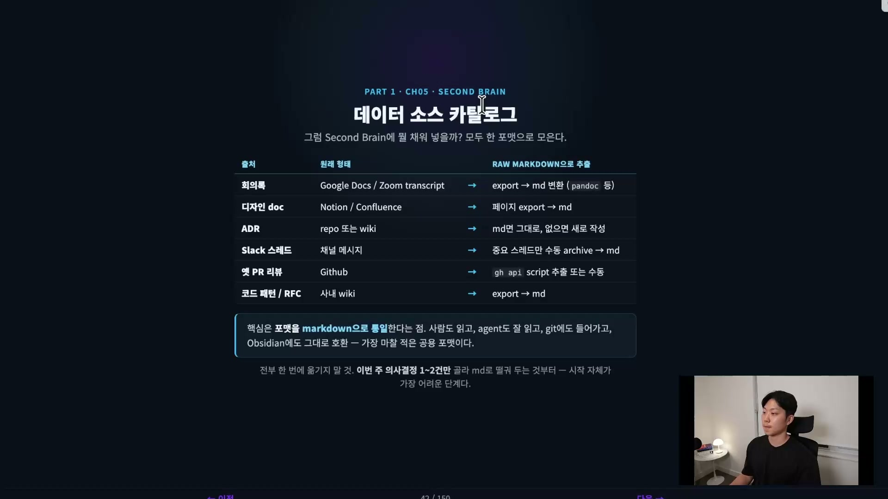

- 회의록. 요즘은 구글 밋이나 줌의 AI 생성 노트를 그냥 통째로 마크다운으로 붙여 넣는다.
- 디자인 문서. 노션이든 컨플루언스든, 페이지를 export해서 마크다운으로.
- ADR. 마크다운이면 그대로, 없으면 새로 작성.
- 슬랙 스레드. 중요한 스레드만 골라 수동으로 archive해서 마크다운으로.
- 옛 PR 리뷰. `gh api` 스크립트로 추출하거나 수동으로.
- 코드 패턴 · 사내 위키. export해서 마크다운으로.

포맷을 마크다운으로 통일하는 게 꽤 중요하다. 사람도 읽고, 에이전트도 잘 읽고, git에도 들어가고, 옵시디언과도 그대로 호환된다. 마찰이 가장 적은 공용 포맷이다.

시작할 때 전부를 한 번에 옮기려 하면 안 된다. 시작이 정말 어렵기 때문이다. 이번 주에 의사결정한 것 한두 건만 골라서 마크다운으로 차곡차곡 쌓는다고 생각하면 된다. 오늘 한 디자인 하나, 올린 PR 두 개, 슬랙 스레드 열 개쯤, 미팅 다섯 개쯤. 그것만 넣고 하루하루 쌓는다.

## 손으로 만든 그릇 하나, 실습 v1

더미가 다 모였다고 치고, 이걸 LLM 위키로 어떻게 만드느냐. 핵심은 LLM이 만들어준다는 것이다. 우리가 던지면 끝이고 나머지는 에이전트가 한다. 다만 그 전에, 에이전트가 자라날 "그릇"이 어떻게 생겼는지를 손으로 한 번 만들어본다.

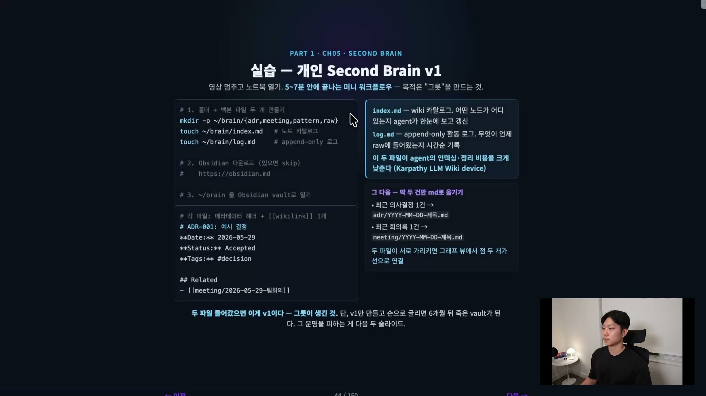

그릇은 단순하다. `~/brain` 아래 `adr`, `meeting`, `pattern`, `raw` 폴더를 만들고, 파일 두 개를 둔다.

```bash
mkdir -p ~/brain/{adr,meeting,pattern,raw}
touch ~/brain/index.md   # 노드 카탈로그
touch ~/brain/log.md     # append-only 로그
```

`index.md`는 위키 카탈로그다. 어떤 노드가 어디 있는지 에이전트가 한눈에 보고 갱신한다. `log.md`는 무엇이 언제 raw에 들어왔는지 시간순으로 기록하는 append-only 로그다. 이 두 파일이 에이전트의 인덱싱 · 정리 비용을 크게 낮춘다.

그다음 최근 의사결정 한 건, 최근 회의록 한 건만 마크다운으로 옮긴다. 각 파일에는 메타데이터 헤더와 위키링크 하나씩을 붙인다.

```markdown
# ADR-001: 예시 결정
**Date:** 2026-05-29
**Status:** Accepted
**Tags:** #decision

## Related
- [[meeting/2026-05-29-팀회의]]
```

두 파일이 서로를 가리키면 옵시디언 그래프 뷰에서 점 두 개가 선으로 연결된다. 이 두 파일이 들어갔으면 v1이 생긴 것이다. 그릇이 만들어졌다. 단, v1만 만들어두고 손으로 굴리면 6개월 뒤 죽은 vault가 된다.

## 던지면 끝, 에이전트가 위키를 짓는다

전통적인 PKM은 우리가 다 했다. 분류하고, 연결하고, 갱신하고. LLM 위키는 에이전트가 해준다. 그래서 유지보수가 0에 수렴하고, 매일이 살아 있는 위키가 된다. 이게 핵심이다.

강의 시연에서는 옵시디언을 받고, 그 안에서 직접 위키를 짓는 과정을 보여준다. 먼저 옵시디언을 설치한 뒤 New Vault가 아니라 Open Folder as Vault로 빈 폴더를 연다. 그리고 Settings → Community Plugins에서 Terminal 플러그인을 설치한다. 옵시디언 안에서 터미널을 쓰기 위해서다. 이 통합 터미널에서 Claude Code를 띄우고, 카파시의 LLM 위키 링크를 복사해 붙여 "이 LLM 위키 셋업으로 세컨드 브레인 만들어줘"라고 지시한다.

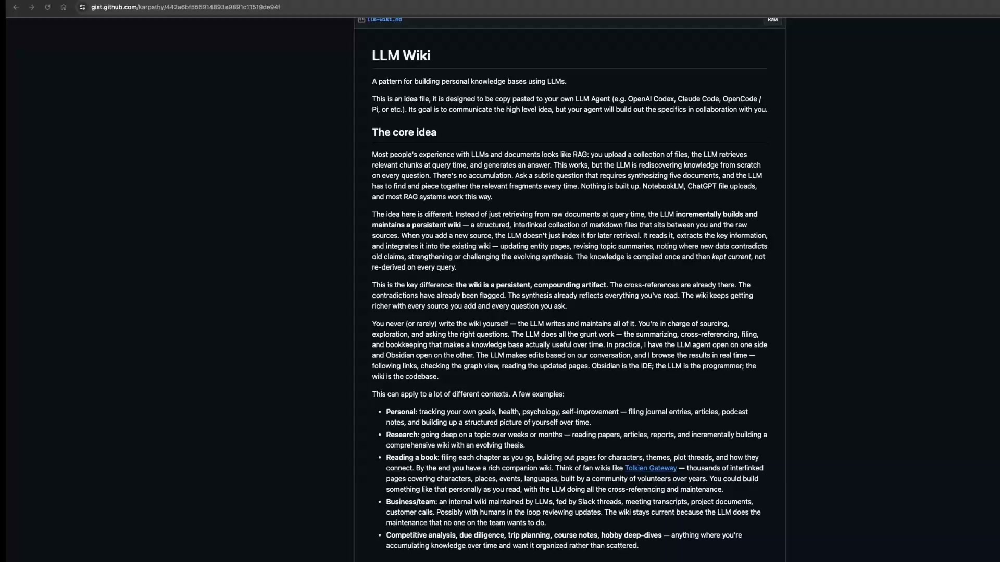

여기서 던진 LLM 위키는 카파시가 공개한 gist로, "개인 지식 베이스를 LLM으로 짓는 패턴"을 담고 있다. 핵심 아이디어는 위키 레이어의 정의와 같다. RAG가 매번 raw를 다시 뒤지는 것과 달리, LLM 위키는 한 번 이해한 걸 정리해 점진적으로 쌓아가는 지속적 위키다. 강의에서는 회의록이나 채팅이 따로 없으니, 시연용으로 유튜브 대본 스크립트를 raw로 던진다.

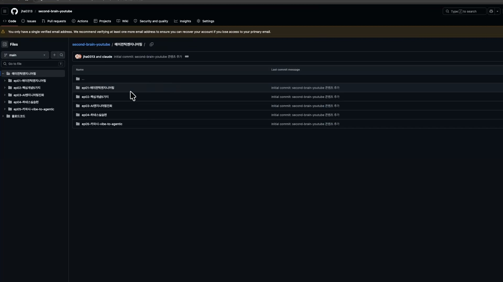

에이전트는 raw를 읽어 위키화하고 index를 만든다. 여기서 동작 세 가지를 알아야 한다.

- ingest(수집). raw에 새 자료를 넣으면, 그 원본을 읽어 위키 페이지로 나눠 통합한다. 우리가 할 일은 없다.
- query(질의). 에이전트한테 일을 시키면 위키에서 답을 찾고, 새로 발견한 가치 있는 정보는 다시 위키에 반영한다.
- lint(점검). 건강검진이다. 모순이나 오래된 주장을 찾아낸다. refreshable을 지키는 장치이고, 이걸 안 하면 앞의 모든 게 무의미하다.

이 세 동작을 스킬로 만들어 계속 돌리는 게 세컨드 브레인 관리의 핵심이다. 시연에서는 에이전트가 LLM 위키 링크만 보고 `wiki-ingest`, `wiki-query`, `wiki-lint` 스킬 셋을 알아서 만들어낸다. 화자가 만든 게 아니라 LLM 위키가 자기 패턴대로 생성한 것이다.

왜 이게 작동하느냐. 핵심 통찰은 유지보수에 있다. 카파시의 말처럼 지식 베이스 유지의 진짜 병목은 읽기나 생각하기가 아니라 유지보수, 즉 북키핑(bookkeeping)이다. 사람은 이걸 잘 못한다. 지겨워하니까. 그런데 에이전트는 북키핑을 힘들어하지도, 지루해하지도, 지치지도 않고 24시간 일한다. 그래서 위키가 갈수록 부패하지 않고 누적된다.

## 그래프 뷰, 링크가 관계도를 만든다

ingest가 끝나면 옵시디언 그래프 뷰를 연다. 옵시디언이 유명한 건 이 그래프 뷰 때문이다.

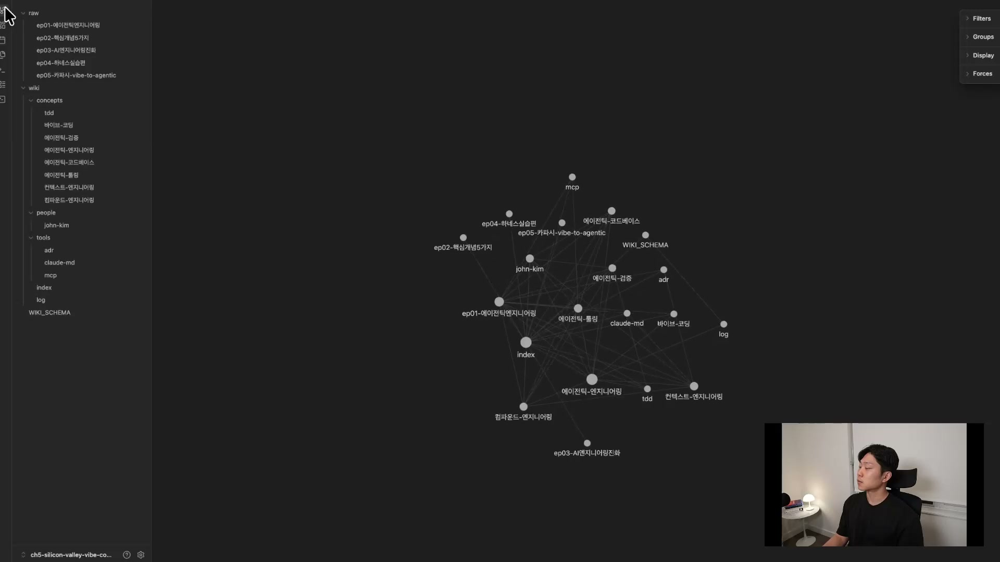

아무것도 없던 자리에 관계도가 생긴다. 이 관계도는 링크에 의해 만들어진다. 노드 하나를 열어보면 그 구조가 보인다.

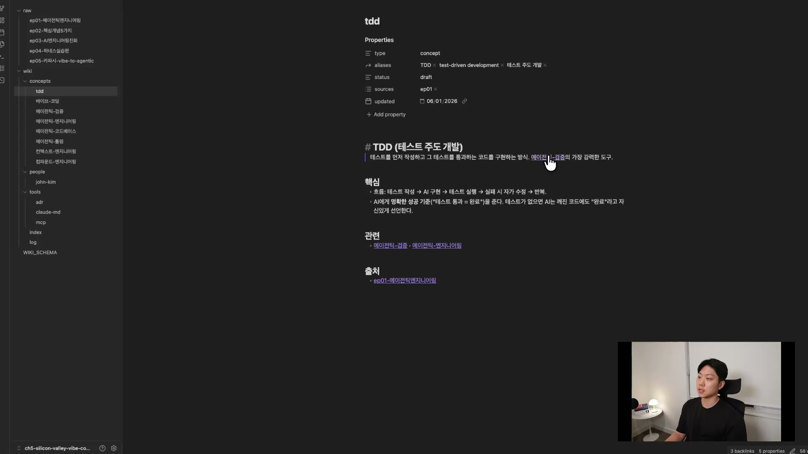

예를 들어 TDD 노드에는 Type, Alias, Status, Source 같은 태그가 붙어 있고, "에이전틱 검증" 같은 다른 노드로 가는 링크가 있다. 이미 만들어진 "에이전틱 엔지니어링" 노드로 이어지고, 출처도 달려 있다. 이런 링크와 태그로 노드끼리 연결되면서 그래프 뷰의 관계도가 생긴다. 이게 앞서 말한 linked 조건의 실체다.

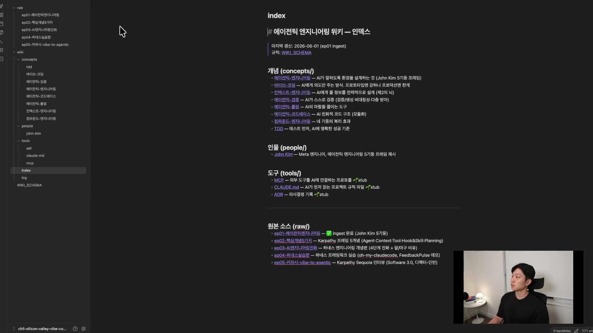

index를 보면 개념(concepts), 인물(people), 도구(tools) 세 섹션으로 정리된 목차가 나온다. 말 그대로 위키 전체의 카탈로그다.

여기서 짚을 게 있다. 옵시디언은 필수가 아니다. 옵시디언은 그냥 IDE라고 생각하면 된다. 그래프와 링킹을 잘 보여주는 비주얼라이저일 뿐이고, VS Code에서 해도 똑같이 동작한다. 옵시디언을 IDE처럼 쓰면서 git으로 버전 관리를 한다. raw 파일이 정말 많아지면 링킹과 시맨틱 검색만으로는 부족해지는데, 그때는 임베딩과 벡터 DB로 넘어간다. 그건 코드베이스와 회사 규모가 커질수록 고도화하는 영역이다.

## 세컨드 브레인이 있으면 무엇이 달라지나

세컨드 브레인이 없는, 컨텍스트가 텅 빈 에이전트에게 "내가 지금까지 한 에이전트 엔지니어링 대본들 스타일대로 새 주제 만들어줘"라고 시키면, 에이전트는 내가 뭘 했는지 모른다. 컨텍스트를 안 줬으니 다뤄야 할 주제를 못 찾는다. 반면 세컨드 브레인을 구축해두면 에이전트가 인덱스와 대본들을 병렬로 읽어 좋은 주제를 다 끌어온다.

이게 컨텍스트 엔지니어링이 중요한 이유다. 팀에서 일할 때를 생각해보면 더 분명하다. 내가 디자인 문서를 하나 작성했고, 비슷하게 변형해 다른 프로젝트에 쓰려 한다. 첫 번째 디자인을 할 때 나온 회의록, ADR, 채팅 기록, 메일, PR 기록이 전부 세컨드 브레인에 저장돼 있다면, 두 번째 디자인은 훨씬 수월하다. 반대로 그게 잘 구축돼 있지 않으면 에이전트는 좋은 답을 줄 수 없다. 세컨드 브레인을 잘 구축하는 것, 컨텍스트 엔지니어링을 잘하는 것이 에이전트의 성능, 나아가 회사의 성능을 가르는 큰 결정 요인이 된다.

쓸모는 유튜브 대본에 국한되지 않는다. 작년 세금보고를 토대로 올해 보고를 하거나, 예전에 떠올린 아이디어 중 좋았던 패턴을 찾아 분석하게 하는 식으로, 무궁무진하게 쓸 수 있다.

## 거버넌스, 시스템이 굴린다

세컨드 브레인을 팀 단위로 운영하다 보면 자주 깨지는 곳이 거버넌스다. 세 가지 질문에 미리 답을 정해둬야 한다.

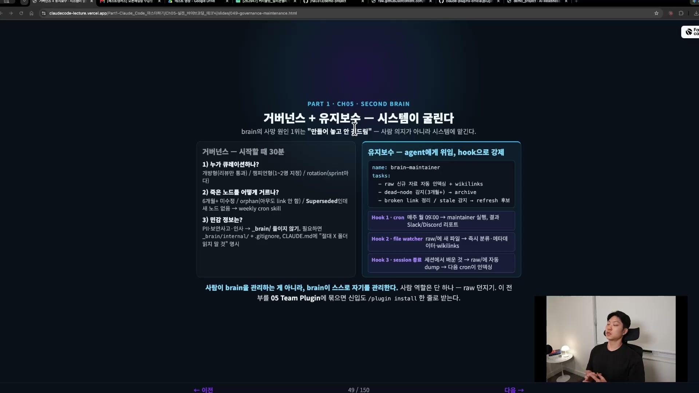

- 누가 큐레이션하나. 누가 세컨드 브레인을 관리하느냐다. 개방형(누구나), 챔피언형(한두 명 오너 지정), 로테이션(스프린트마다 돌아가며) 셋 중 하나로 정한다.
- 죽은 노드를 어떻게 거르나. 6개월 넘게 미수정이거나, 아무도 링크하지 않는 orphan이거나, superseded인데 새 노드가 없는 것들이다. 위클리 크론 스킬로 lint를 돌려 거른다.
- 민감 정보. 이게 정말 중요하다. PII, 보안사고, 인사 정보 같은 것은 브레인에 절대 넣으면 안 된다. `.gitignore`로 빼거나 본인 것만 두고, 절대 커밋하거나 공개하지 않는다.

여기서 개인 브레인과 팀 브레인이 갈린다. 내 브레인에는 프라이버시에 민감한 자료가 많다. 누구와 무슨 얘기를 했는지, 나만 아는 정보 같은 것은 내 브레인에 넣어야지 팀 브레인에 넣으면 큰일 난다. 그래서 개인을 위한 브레인과 팀을 위한 브레인을 따로 둔다.

유지보수의 결론은 하나다. 사람이 brain을 관리하는 게 아니라 brain이 스스로를 관리하게 만든다. 사람의 역할은 raw를 던지는 것 하나로 줄인다. raw가 들어올 때마다 ingest를 돌리고, 주기적으로 lint로 건강검진을 한다. 이걸 사람 의지에 맡기지 말고 크론과 hook으로 강제한다. CLAUDE.md를 계속 갱신하는 것과 똑같다. 가만히 두면 개선되지 않는다. 에이전트는 지치지 않으니, 크론을 걸어 "오늘도 업데이트해라, 내일도 업데이트해라" 하고 시킨다.

## 정리

세컨드 브레인은 에이전트가 참조할 수 있는 사실, 맥락, 이력의 지식 레이어다. 왜 중요한가. 회사 지식은 코드 안이 아니라 바깥에 더 많이 흩어져 있고, 그래서 검색 · 연결 · 재사용이 다 어렵다. 그 결과 에이전트가 쓸 수가 없다. 에이전트가 쓸 수 있도록 한 군데 모아주는 게 핵심이다.

잘 굴러가는 세컨드 브레인은 searchable, linked, refreshable, multimodal 네 조건을 만족한다. 구축은 우리가 raw만 던지고 에이전트가 알아서 한다. 그래서 더 이상 유지보수 병목이 안 생긴다. 개인 레벨과 팀 레벨의 브레인을 따로 두되, PII나 보안사고 날 만한 것은 절대 넣지 않는다. 이건 hook으로 막는다.

여기까지는 지식을 저장하는 데 집중했다. 진짜 어려운 건 다음 단계다. 브레인에 노드가 천 개 있어도 오늘 작업에 필요한 건 다섯 개뿐인데, 그 다섯 개를 어떻게 적시에 골라올 것인가. 라이브러리는 만들었으니, 다음은 사서를 만드는 일이다.
