세컨브레인을 한번 만들어 봤다고 치자. 사람과 팀 사이에 흩어져 있던 날것의 자료가 위키로 정리됐고, 에이전트가 호출할 수 있는 형태가 됐다. 거기까지는 좋다. 그런데 한 단계만 올라가서 생각해 보면 금세 한계가 보인다. 회사는 한 팀이 아니다. 수십 개의 팀, 수백 개의 시스템, 각 팀이 따로 굴리는 코드베이스, 거기서 나오는 실험과 문서와 인시던트와 이력들이 있다. 세컨브레인이 아무리 잘 정리돼 있어도 그건 결국 한 팀의 브레인일 뿐이다. 옆 팀의 변경이 우리에게 어떻게 흘러왔는지, 다른 시스템과 어떻게 연결됐는지, 두 분기 전에 다른 팀이 해결한 이슈가 무엇이었는지, 그런 건 에이전트가 보지 못한다.

Context Intelligence는 바로 이 빈틈을 메우는 개념이다. 한 줄로 정의하면 **AI 에이전트를 위한 조직 단위의 공유 지식 레이어**다. 코드, config, 문서, 위키, 과거 인시던트 같은 점들을 연결해서, Claude Code나 Codex 같은 모든 에이전트가 여러 시스템을 가로지르는 질문에도 답할 수 있게 만드는 인프라다. 강의를 진행하는 메타 엔지니어는 이걸 직접 구현해 보여주진 않는다. 다만 메타 내부에서도 이 인프라를 아주 열심히 만들고 있다는 것, 그리고 에이전트에게 컨텍스트를 어떻게 주느냐가 에이전트 능력의 큰 핵심을 차지한다는 것을 짚어 준다.

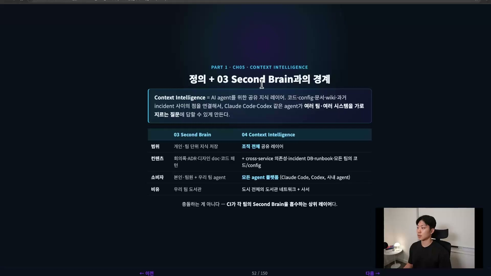

세컨브레인과 비슷해 보일 수 있다. 큰 그림으로 보면 거의 똑같다고 봐도 된다. 어떻게 보면 세컨브레인이 Context Intelligence를 포함한다고 볼 수도 있고, 반대로 Context Intelligence가 각 팀의 세컨브레인을 흡수하는 상위 레이어라고 볼 수도 있다. 충돌하는 개념이 아니라는 뜻이다. 차이는 다루는 범위와 콘텐츠에 있다. 세컨브레인이 개인 단위, 팀 단위의 브레인이라면 Context Intelligence는 조직 전체 단위의 브레인이다. 안에는 크로스 서비스 의존성, 인시던트, DB, 런북, 모든 팀의 코드베이스가 들어간다. 그리고 모든 에이전트 플랫폼이 이걸 사용해야 한다. 비유하자면 세컨브레인이 우리 팀 도서관이라면, Context Intelligence는 도시 전체의 도서관 네트워크다.

## 왜 이게 필요한가, 회사는 하나의 시스템이 아니다

회사는 하나의 시스템이 아니다. 수십 개, 수백 개의 부분이 있고 각각 다른 팀이 있다. 하나의 프로세스조차 단계마다 다른 팀이 소유하고, 코드베이스도 다르고 실험도 다르다. 사람도 AI도 전체를 다 알 수 없다. 그런데도 우리는 시스템을 가로지르는 질문을 할 수밖에 없다.

"왜 결제가 실패했나?"라고 물었다고 해보자. 결제 API 문제일 수도, 인증이 실패했을 수도, DB 문제일 수도, 알림 문제일 수도, 대시보드 문제일 수도 있다. 한 질문에 다섯, 여섯 개 팀이 걸린다. 누구 하나에게 물어도 자기 영역 안에서밖에 답을 못 한다. 에이전트는 한술 더 떠 더 좁게 답한다. 이게 Context Intelligence라는 인프라가 풀려는 문제의 출발점이다.

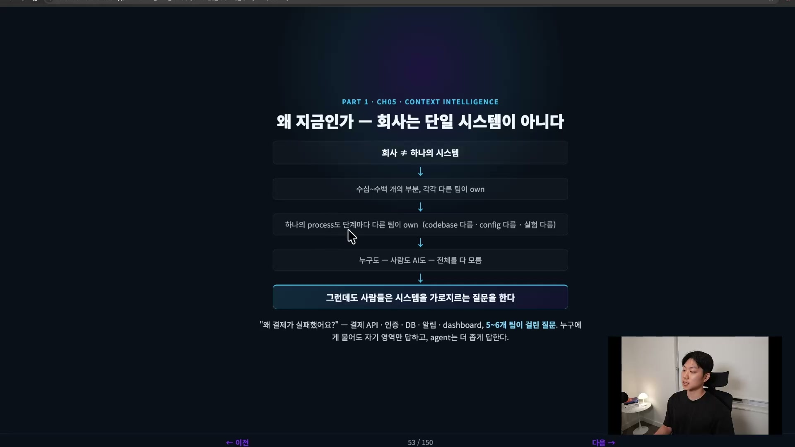

오늘 우리가 매일 쓰는 에이전트가 정확히 어디서 막히는지를 셋으로 정리할 수 있다.

첫째, **여러 시스템에 걸친 그림을 못 본다.** 에이전트는 지금 보고 있는 코드베이스, 지금 프로젝트는 아주 잘 이해한다. 하지만 서비스 간 연결, 여러 리포지터리와 여러 깃에 걸친 변경, 다른 팀 시니어가 머릿속에 가진 노하우 같은 건 따라오지 못한다. 예를 들어 팀 A가 자기 코드에서 retry 설정을 바꿨는데, 그게 팀 B의 알림 시스템을 망가뜨린다고 하자. 에이전트는 팀 A의 코드만 보이니 이걸 보기 힘들다. 팀 B에 그런 의존성이 있는지, 팀 B가 어떤 가정으로 코드를 짰는지는 보이지 않거나, 보더라도 오래 걸리고 효율이 나쁘다.

둘째, **조직 지식을 놓친다.** 디자인 문서, 회사 위키, 런북, 과거 인시던트 같은 건 누군가 직접 정리해 넣기 전엔 에이전트 눈에 안 보인다. 이 조직 지식을 에이전트에 쥐여 주려면 팀을 넘어 부서 단위까지 확장한 세컨브레인, 곧 Third Brain이 필요하다.

셋째, **매번 처음부터 시작한다.** 공유 컨텍스트 레이어가 없으면 에이전트마다 자기 방식대로 grep을 돌리고 자체 RAG를 굴리고 사람한테 물어본다. 같은 회사인데도 어떤 에이전트를 썼느냐에 따라 답이 달라진다. 매번 처음부터 시작하는 건 결국 컨텍스트 엔지니어링과 같은 문제다.

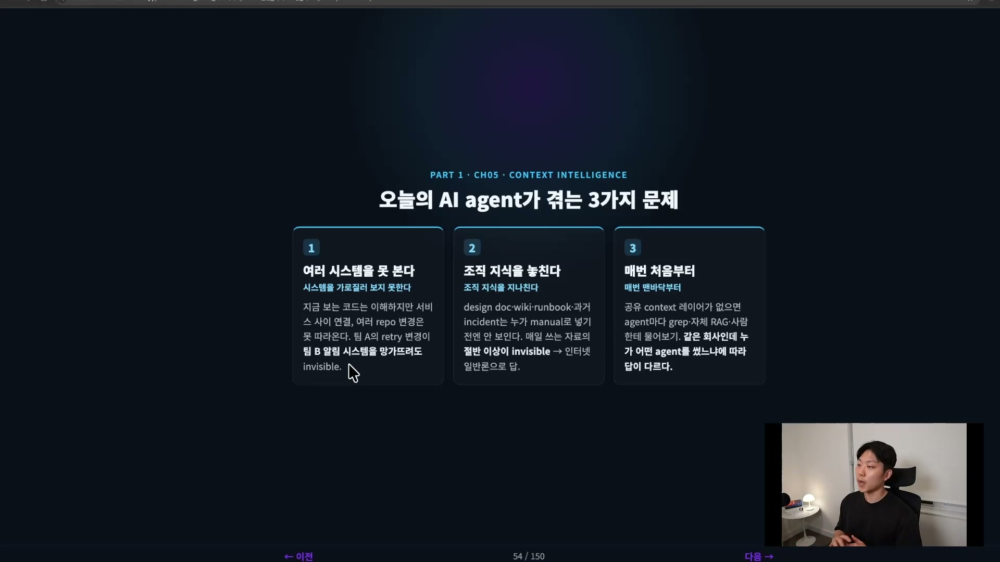

## 성과, 측정 가능한 향상으로

Context Intelligence가 없는 조직에는 비용이 계속 발생한다. 에이전트의 hallucination과 놓친 컨텍스트 때문에 사람이 교정하는 비용이 끊이지 않고, 여러 팀에 걸친 버그는 첫 진단부터 어긋나며, 대형 인시던트의 root cause를 찾는 데 며칠에서 몇 주가 걸린다.

메타 엔지니어가 든 실험은 이렇다. 똑같은 프롬프트를 주되 난이도를 Easy, Medium, Hard로 나눴다. 나누는 기준은 에이전트가 그 프롬프트를 처리하는 데 걸리는 시간이다. 1시간이 걸리면 Hard, 30분이면 Medium, 5분에서 10분이면 Easy. 이렇게 나눠 각각의 latency, 그러니까 에이전트가 프롬프트를 실행하는 데 걸리는 시간을 비교했더니, Context Intelligence 인프라가 있을 때 훨씬 더 잘 처리하고 더 좋은 성과를 보였다.

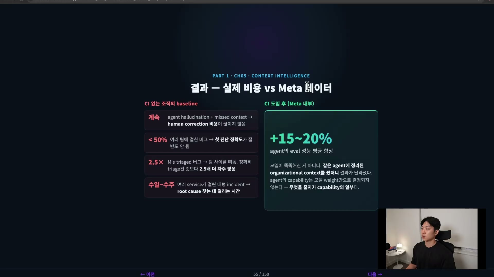

핵심은 모델이 똑똑해진 게 아니라는 점이다. 같은 에이전트에 정리된 조직 컨텍스트를 줬더니 결과가 달라졌다. 에이전트의 역량은 모델 가중치만으로 결정되지 않는다. 무엇을 주느냐가 역량의 일부다.

## 구성, 네 가지 컴포넌트

조금 더 기술적으로 들어가 보자. Context Intelligence는 네 가지 컴포넌트로 본다.

첫째는 <strong>의미 기반 검색(Semantic Search)</strong>이다. 가장 핵심이 되는 검색 엔진이다. 코드와 문서 사이의 임베딩을 전부 저장해 두는 데이터베이스라고 생각하면 된다. 이걸로 similarity search가 가능해지고, 에이전트가 키워드가 아니라 의미로 관련 정보를 찾게 된다. 예를 들어 "재시도 로직"이라고 검색하면 키워드가 똑같지 않아도 의미가 같은 retry 문서까지 함께 묶여 나온다.

둘째는 <strong>관계 그래프(Relationship Graph)</strong>다. 클래스와 파일과 서비스 사이의 관계를 매핑한다. 가장 중요한 건 크로스 서비스 의존성을 보여준다는 것이다. 에이전트가 많이 실수하는 지점이 바로 크로스 바운더리, 즉 팀 경계나 시스템 경계를 가로지르는 의존성이 있을 때다. 관계 그래프가 있으면 이런 의존성 체인을 따라갈 수 있다. API에서 이벤트 핸들러로, 다시 화면으로 이어지는 흐름이 그래프 안에 명시적으로 잡혀 있다.

셋째는 **원문 저장소**다. .md 같은 raw 소스를 저장해 두는 스토리지다. 원본을 직접 읽어야 할 때가 있으니, 팀 지식을 Markdown 파일로 저장해 두고 grep도 그대로 작동하게 만든다. 빠르게 파일을 가져올 수 있게 하는 게 목적이다.

넷째가 핵심인 **통합 검색**이다. 위의 세 가지, 그러니까 의미 기반 검색 데이터베이스, 관계 그래프, 원문 저장소를 한꺼번에 조회한다. 그리고 관련도 순으로 통합한다. 즉 re-rank를 한다. 이건 LLM이 하는 일이다. 그렇게 노이즈를 걸러내고 실제로 중요한 것만 반환한다.

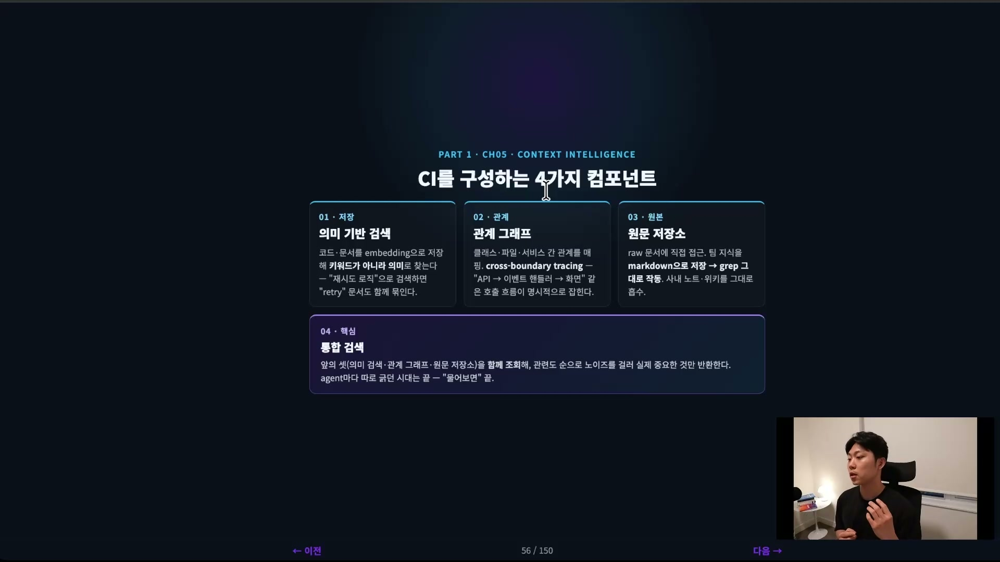

이 통합 검색 덕분에 에이전트마다 자기 방식대로 컨텍스트를 긁어모으던 시대가 끝난다. 하나의 통합 레이어를 두고, Claude면 Claude, Codex면 Codex, 다른 하네스나 다른 LLM이든 모든 플랫폼이 같은 엔진을 통해 접근하게 만드는 게 핵심이다. 컨텍스트가 하나로 모이면 single source of truth가 생긴다. 중복된 소스가 여기저기 있으면 뭐가 진짜인지 헷갈리기 시작하고, 사람한테 물어보러 다녀야 한다. 에이전트도 똑같다. 하나의 source of truth를 두고 데이터 사일로 없이 만들어 주면, 클로드 코드도 코덱스도 같은 컨텍스트를 본다. 어느 도구를 쓰느냐가 답의 품질을 좌우하지 않게 된다.

## 전체 모양, 3-Layer 아키텍처

온보딩까지 합쳐 전체를 한 장으로 보면 세 개의 레이어로 그려진다.

**Layer 1은 Onboarding Skills**다. 사람이 한 번만 설정하면 되도록 스킬로 자동화하는 층이다. code repos, config files, 문서와 Docs, 위키, 내부 게시물, incident reports, 런북을 다 끌어모은다. **Layer 2는 Context Intelligence Engine**으로, 한 번 만들어 두면 모든 에이전트가 호출하는 엔진이다. 의미 기반 검색, 관계 그래프, 원문 저장소, 그리고 이 셋을 함께 조회해 관련도 순으로 묶는 통합 검색이 여기 들어간다. **Layer 3은 Context-Aware Retrieval**이다. Claude Code, Codex 같은 모든 플랫폼이 같은 엔진을 호출하는 층이다.

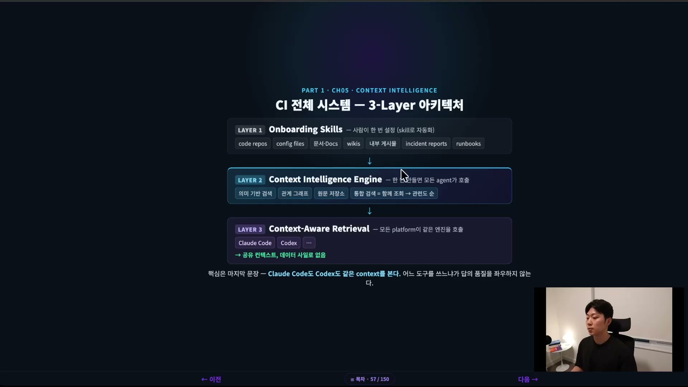

여기서 온보딩을 스킬로 만드는 건 그냥 편의가 아니다. 온보딩은 스킬로 자동화해 두지 않으면 아무도 안 한다. raw source만 다 던져 넣으면 바로 온보딩되도록 만들어 둬야 한다. 그래야 사람들이 쓴다. 코드 리포를 인덱싱하고, config 파일을 전부 스캔하고, Google Docs와 위키와 슬랙 채널을 MD로 변환하고, 인시던트 데이터베이스까지 연결하는 일을 한 번에 끝낼 수 있도록 온보딩 스킬을 만든다.

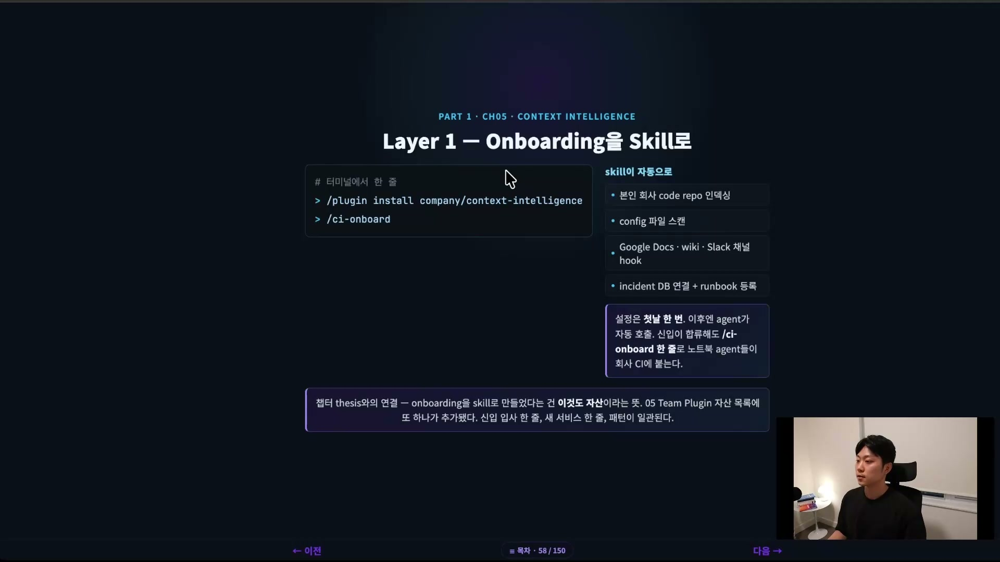

그 온보딩 스킬 안을 들여다보면, 무엇을 인덱싱할지가 하나의 YAML 파일에 들어 있다. 리포지토리, docs, 슬랙 같은 것들이 이 source 파일 하나에 정의된다. 이게 앞서 말한 single source of truth다. 새 서비스가 생기면 이 파일에 한 줄을 추가하면 된다.

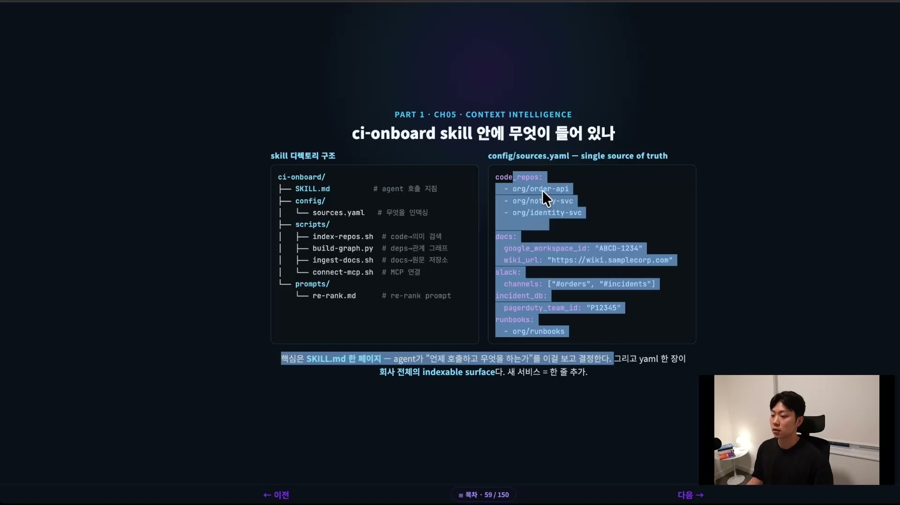

실제로 온보딩을 돌린다고 해보자. 누군가 `/ci-onboard`라고 친다. 먼저 아까 그 YAML 파일, 구글 닥스와 위키 같은 것들이 들어 있는 6 sources와 32 repositories를 확인한다. 이걸 chunk로 나눠 의미 검색용 벡터 인덱스를 만든다. 그다음 관계 그래프로 edge를 만든다. 원문 저장소에는 raw 파일, 그러니까 342개의 docs와 1201개의 위키를 넣는다. 여기에 MCP 커넥터를 연결하고 나면, 마지막으로 통합 검색까지 ready가 된다. 한 번 온보딩해 두면 그 이후로 인덱스 비용이 효율적으로 낮아진다.

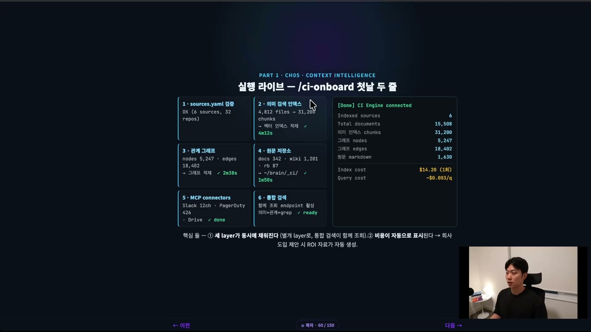

## 작동, 통합 검색으로 첫 질문

온보딩이 끝났으니 실제로 한번 작동시켜 보자. "재시도 로직이 어떻게 동작하고, 어떤 서비스가 이 로직에 의존하나요?"라고 물어본다. 이 재시도 로직이 크로스 리포지터리로 많이 얽혀 있으면 에이전트가 시간과 토큰을 많이 쓰고 헷갈리기 쉽다. 하지만 Context Intelligence는 다르게 푼다.

먼저 의미 기반 검색이 관련 코드를 찾아 준다. retry라는 키워드가 아니라 의미 기반으로 검색했기 때문에 order-api와 notify-svc 같은 결과가 나온다. 그 결과를 가지고 관계 그래프를 통해 의존 서비스를 찾는다. 그다음 원문 저장소에서 아키텍처 디시전 레코드(ADR)와 인시던트 기록을 끌어온다. 작년에 같은 패턴의 인시던트가 있었다는 것까지 나온다. 이렇게 관계 그래프, 의미 기반 검색, 원문 저장소 세 소스에서 각각 retry 로직에 대한 결과를 다 뽑아낸 다음, 관련도 순으로 마지막에 통합한다. 12개 히트 중 상위 5개를 선별해 노이즈를 제거한다.

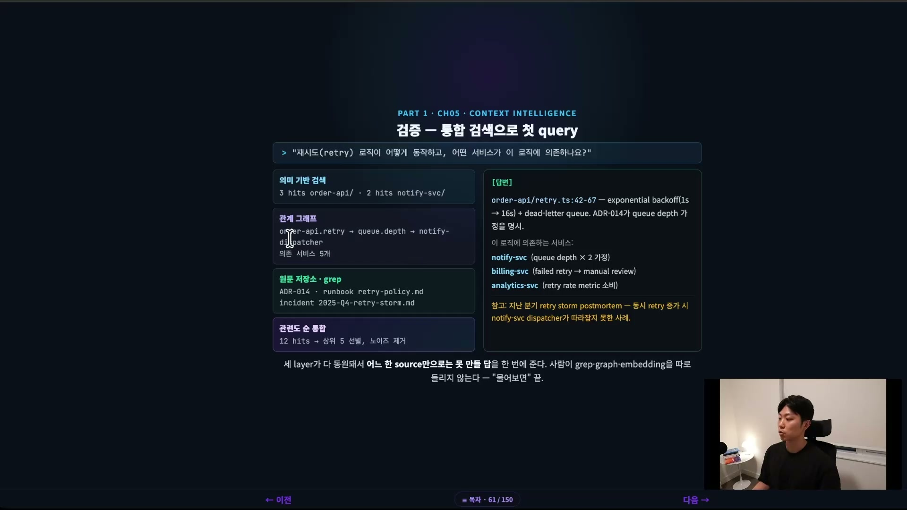

답변을 보면 retry 로직이 어떻게 작동하는지 코드 포인터가 나오고, 이 로직에 의존하는 서비스가 셋이라고 알려 준다. 거기에 참고할 아키텍처 디시전과 과거 인시던트에서 나왔던 것까지 함께 붙는다. 포인트는 세 개의 레이어가 다 함께 동원돼 답이 만들어졌다는 것이다. 관계 그래프 하나만으로도, 원문 하나만으로도 못 만들 답을 통합 검색이 묶어서 한 번에 종합해 준다. 사람이 직접 grep traversal이나 임베딩 서치를 따로 돌릴 필요가 없다. 에이전트한테 물어보면 끝이다.

이 효과를 가장 직관적으로 보여주는 게 같은 질문을 두 가지 방식으로 답하게 한 비교다. Context Intelligence 없이 사람이 4\~5개 repo를 직접 뒤져 컨텍스트를 주입하면 30분이 걸리던 답이, Context Intelligence로 호출하면 3분에 끝났다.

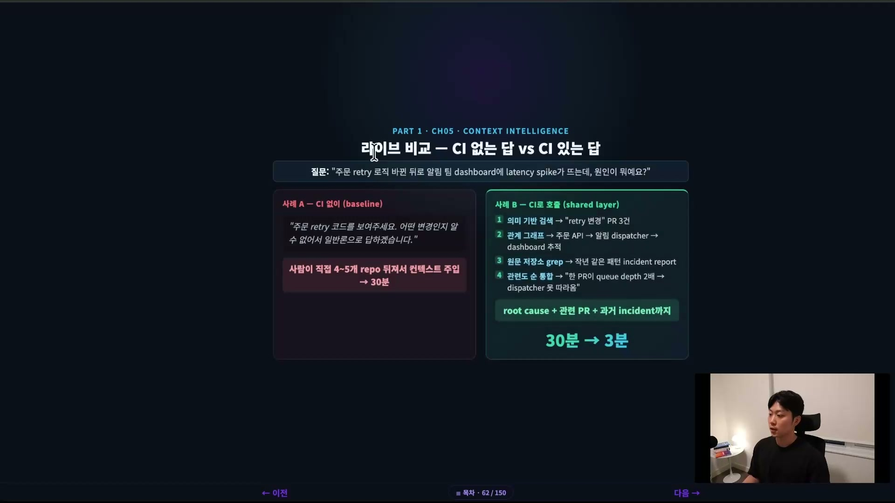

오히려 더 오래 걸릴 것 같지만 더 빠르다. 세 검색이 병렬로 돌기 때문이다. 처음 셋업하는 건 오래 걸리겠지만, 일단 만들어 두면 그래프는 트래버설이 아주 빠르고, 의미 기반 검색도 벡터 DB에 있으면 빠르고, 원문 저장소도 말 그대로 MD 파일이라 금방 훑는다. 셋업이 까다롭고 오래 걸린다는 게 유일한 단점인데, 그건 인프라의 속성이다. 한번 셋업해 두면 ROI가 아주 높은 투자다.

## 측정, 정성을 넘어 지표로

"정성적으로 좋아진다"는 말만으로는 부족하다. 측정 가능한 지표가 있어야 한다. 메타 엔지니어는 세 가지를 본다.

| 지표 | 무엇을 재나 | 좋아진다는 건 |
| --- | --- | --- |
| 작업당 token 수 | 에이전트가 답을 내기까지 쓰는 토큰 수 | 줄어들수록 효율이 좋다 |
| 첫 정답까지 turn 수 | 사람 교정 없이 정답에 도달하기까지 몇 turn 걸리나 | 줄어들수록 한 번에 잘 답한다 |
| Eval 성능 | 정해진 question set에 대한 정확도 | 에이전트가 정말 맞게 답하는가 |

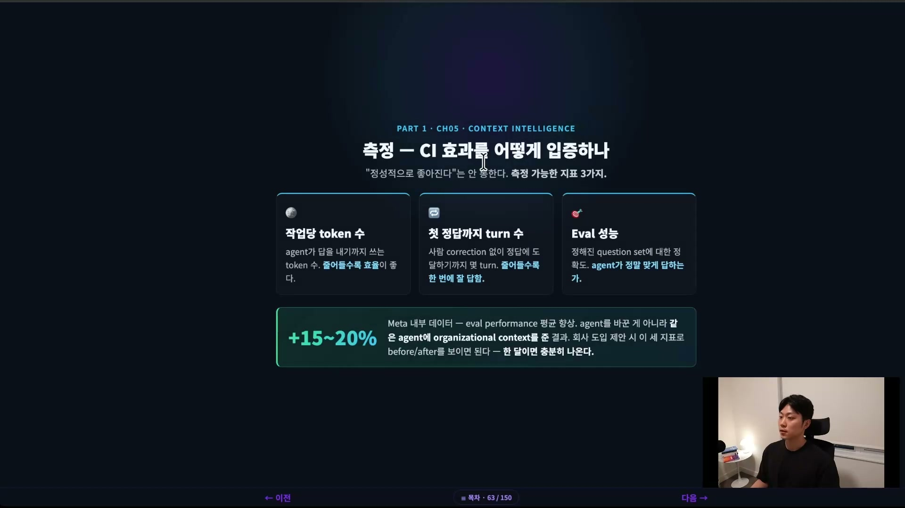

마지막 eval은 에이전트의 아웃풋이 실제로 맞는 아웃풋인지를 비교하는 것이다. 이 세 지표로 도입 전후를 비교해 보이면, 회사에 Context Intelligence 도입을 제안할 때 그대로 ROI 근거가 된다.

정리하면 이렇다. 개인 자산에서 시작해 팀 자산으로, 다시 조직 자산으로 올라왔다. 점점 더 많은 사람, 점점 더 넓은 범위에 영향을 미치는 자산을 쌓아 올린 셈이다. Context Intelligence는 그 흐름의 가장 위, 조직 전체를 잇는 공유 지식 레이어에 해당한다. 컨텍스트를 어떻게 주느냐가 에이전트 능력을 좌우한다는 명제를, 조직 규모로 끌어올린 인프라다.
