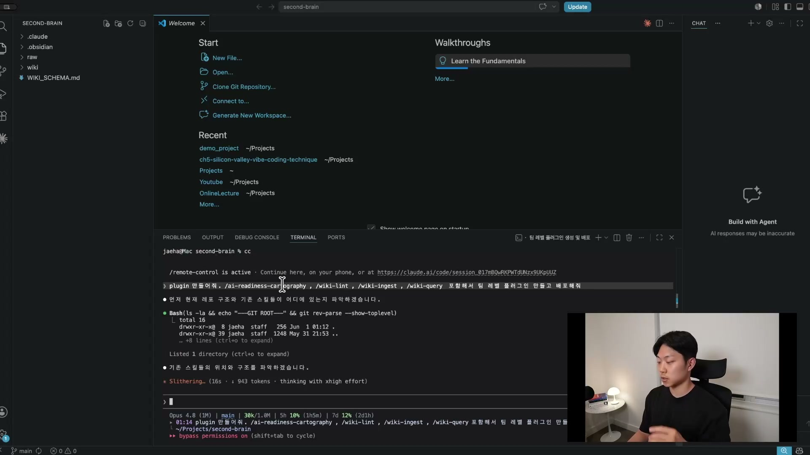
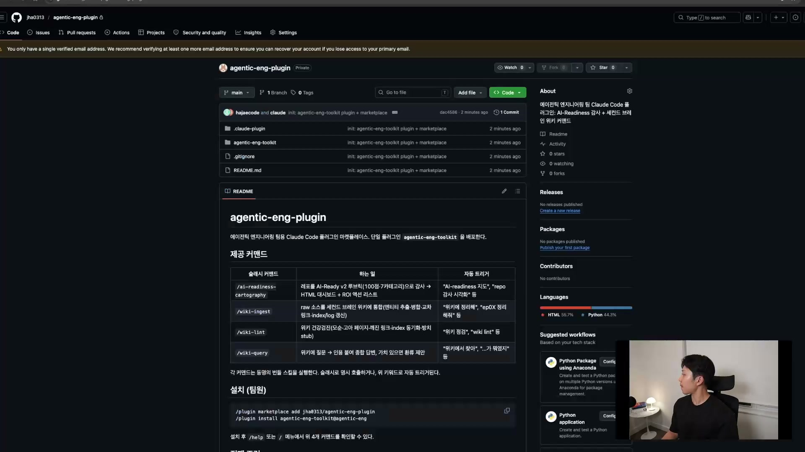

지금까지 네 개 섹션을 거치며 만든 게 적지 않다. CLAUDE.md, AI-Ready Codebase, Second Brain, Context Intelligence. 각 섹션마다 스킬과 커맨드가 쌓였다. 그런데 이 모든 자산에는 공통된 한 가지 약점이 있다. 전부 내 노트북 안에만 있다는 것이다.

동료가 월요일에 출근해서 "그 CLAUDE.md랑 AI-Ready Codebase 채점하는 스킬, 어떻게 받나요?"라고 물으면 마땅한 답이 없다. 스킬이 두세 개면 그 두세 개를 따로따로 받아야 하고, 받은 뒤에도 각자 알아서 제자리에 놔야 한다. 자산이 많아질수록 이 전달 비용은 커진다. 팀 플러그인은 바로 이 문제를 푸는 도구다.

## 팀 플러그인이란 무엇인가

팀 플러그인은 CLAUDE.md, Skills, Hooks, slash command를 한 패키지로 묶어 `/plugin install` 한 줄로 배포하고 설치할 수 있게 만든 것이다. 라이브러리를 떠올리면 가깝다. 흩어진 파일을 하나씩 챙기는 대신, 패키지 하나를 받으면 그 안의 모든 것이 따라온다.

한 패키지로 묶이는 것과 한 줄로 설치되는 것, 이 둘이 안 되면 사실 플러그인이라 부를 이유가 없다. 그냥 설정 파일을 모아둔 폴더(dotfiles repo)와 다를 게 없어진다.

## 왜 굳이 플러그인으로 묶는가

스킬을 그냥 전역에 깔아 쓰면 되는데 왜 패키지로 묶느냐는 물음이 자연스럽다. 이유는 세 가지로 나뉜다.

첫째, 온보딩이다. 새로 합류한 팀원은 플러그인 하나만 설치하면 CLAUDE.md, 훅, 스킬을 첫날부터 바로 쓴다. 실제로 강의자의 팀에는 스킬과 커맨드가 마흔아홉 개쯤 묶인 팀 플러그인이 있고, 그걸 깐 팀원은 그 모든 자산을 즉시 쓸 수 있다. 둘째, 팀 표준이 강제된다. 같은 패키지를 쓰니 같은 규칙, 같은 스킬, 같은 동작을 공유한다. 셋째, 버전 관리가 된다. 롤백할 수 있고, 새 기능을 더하고, 업데이트할 수 있다.

이 차이는 생각보다 크다. 팀 코드베이스에서 플러그인을 깔고 작업하는 것과 안 깔고 작업하는 것은 천차만별이다. 플러그인 안의 스킬들이 손이 가는 자리에서 알아서 떠오르기 때문이다.

## 플러그인의 구조

플러그인은 결국 약속된 모양의 폴더 하나다. 골격은 이렇게 생겼다.

```
team-plugin/
├── .claude-plugin/
│   └── plugin.json      ← 메타데이터 (이름·버전·설명)
├── CLAUDE.md            ← 01번에서 만든 것
├── skills/
│   ├── grade-codebase/  ← 02 grade skill
│   └── ci-onboard/      ← 04 CI onboarding (06·07·10에서 채움)
├── hooks/
├── commands/
│   └── ci-onboard.md    ← 04 slash command
└── README.md            ← 입사자용 1페이지
```

핵심은 `.claude-plugin/plugin.json` 하나다. 이 파일이 있어야 Claude Code가 "이건 플러그인이구나" 하고 인식한다. 나머지 `skills/`, `hooks/`, `commands/`는 앞 챕터에서 본 구조를 그대로 가져온 것이고, `README.md`는 입사자가 한 페이지로 읽을 안내문이다. 새로운 기술이 아니라 흩어져 있던 것을 한 폴더에 모으는 컨벤션일 뿐이라, 진입 장벽이 낮다.

## 만들기

플러그인을 만드는 일 자체는 간단하다. Claude Code에게 묶고 싶은 스킬을 일러주며 "플러그인 만들어줘"라고 하면, Claude가 새 폴더를 만들고 그 스킬들을 패키지에 넣는다. 스킬을 전역으로 지정해 둔 상태라면 어느 폴더에서 시작하든 상관없다.

강의에서는 이미 만들어 둔 스킬들, AI-Ready Codebase 채점 스킬(ai-readiness-cartography)과 Second Brain 계열의 위키 스킬들(wiki-lint, wiki-ingest, wiki-query)을 포함해 팀 레벨 플러그인을 만들게 했다.



```
plugin 만들어줘. /ai-readiness-cartography, /wiki-lint, /wiki-ingest, /wiki-query 포함해서 팀 레벨 플러그인 만들고 배포해줘
```

이 한 줄로 Claude Code가 기존 스킬들의 위치와 구조를 먼저 파악한 뒤, 알아서 플러그인을 만들어 스킬을 더한다.

## 배포

배포는 GitHub repo를 하나 만드는 것이라고 생각하면 된다. 플러그인 전용 repo를 만들고, 그 안에 `marketplace.json`을 둔다. 필요한 사람은 그 repo를 `install`해서 쓴다.

결과물은 `agentic-eng-toolkit`이라는 이름의 플러그인으로 배포됐다. repo에는 `.claude-plugin` 폴더와 플러그인 본체 폴더, `marketplace.json`, README가 자리잡았고, 스킬 네 개가 들어 있다.



`marketplace.json`은 이 패키지가 무엇이고 어떤 플러그인을 담고 있는지를 적은 메타데이터다. 크게 두 덩어리로 나뉜다. 바깥쪽엔 스키마(`marketplace.schema.json`)와 마켓플레이스 이름(`agentic-eng`), 소유자가 있다. 안쪽 `plugins` 배열에는 담긴 플러그인이 하나씩 들어가는데, 여기 든 `agentic-eng-toolkit`은 플러그인 이름, 소스 경로, 설명, 버전(`0.1.0`), 그리고 키워드(`ai-readiness`, `second-brain`, `wiki`, `knowledge-base`, `codebase-audit`, `agentic-engineering`)를 적어 둔다.

설치하는 쪽은 두 줄이면 된다.

```
/plugin marketplace add jha0313/agentic-eng-plugin
/plugin install agentic-eng-toolkit@agentic-eng
```

먼저 마켓플레이스를 등록하고, 그 마켓플레이스에서 원하는 플러그인을 설치한다. 설치 후 `/help`나 `/` 메뉴에서 제공되는 커맨드를 확인할 수 있다. 이 플러그인은 슬래시 커맨드 네 개를 제공하고, 각 커맨드는 명시적으로 호출하거나 위 키워드로 자동 트리거된다.

| 슬래시 커맨드 | 하는 일 | 자동 트리거 |
| --- | --- | --- |
| `/ai-readiness-cartography` | repo를 AI-Ready v2 루브릭(100점·7카테고리)으로 감사해 HTML 대시보드와 ROI 액션 리스트를 낸다 | "AI-readiness 지도", "repo 감사 시각화" 등 |
| `/wiki-ingest` | raw 소스를 Second Brain 위키에 통합한다(엔티티 추출·병합·교차 링크·index/log 갱신) | "위키에 정리해", "ep0X 정리해줘" 등 |
| `/wiki-lint` | 위키 건강검진(모순·고아 페이지·깨진 링크 index 동기화·방치 stub) | "위키 점검", "wiki lint" 등 |
| `/wiki-query` | 위키에 질문하면 인용을 붙여 종합 답변하고, 가치 있으면 환류를 제안한다 | "위키에서 찾아", "...가 뭐였지" 등 |

배포된 직후의 버전은 `0.1.0`이다. 여기서부터 새 스킬을 더하거나 기존 스킬을 고치면서 버전을 올려간다.

## 버저닝, 세 가지 패턴

배포 자체보다 더 중요한 게 버저닝이다. 패턴은 세 가지이고 각각 트레이드오프가 다르다.

| 패턴 | 장점 | 단점 | 추천 시나리오 |
| --- | --- | --- | --- |
| 메인만 (`main` 추적) | 단순하고 항상 최신 | 깨지면 전 팀이 동시에 영향 | 초기 1\~5명, plugin이 단순할 때 |
| 브랜치 기반 (`stable` / `dev`) | 안정과 실험 분리, 점진 롤아웃 | 두 브랜치 관리 부담 | 5\~20명, 얼리어답터가 dev 먼저 |
| 태그 기반 (`v1.2.3`) | 명시적 버전, 롤백 용이 | 매번 태그·릴리즈 노트 부담 | 20명 이상이거나 사내 표준으로 굳었을 때 |

메인만 쓰는 방식은 버저닝이 없는 셈이다. 늘 최신을 유지해 단순하지만, 한 번 깨지면 그걸 쓰는 모두가 영향을 받는다. 그래서 플러그인이 단순하고 인원이 적은 초기에 적합하다. 굳이 버저닝을 붙이면 오버 엔지니어링이 된다.

다음 단계는 브랜치 기반이다. `dev`와 `stable` 같은 브랜치를 한두 개 나눠, 실험적인 작업은 `dev`에서 하고 안정화되면 `stable`로 넘긴다. 얼리어답터가 `dev`를 먼저 써보고, 검증되면 모두가 쓰는 `stable`로 옮기는 흐름이다. 대신 브랜치를 두 개 관리해야 하는 부담이 생긴다.

결국 도달하는 곳은 태그 기반이다. `v1.2.3`처럼 명시적으로 버전을 박으니 롤백이 쉽다. 대신 릴리즈마다 태그를 달고 릴리즈 노트를 쓰는 부담이 있다. 강의자의 팀은 사내 표준으로 굳어진 지금 태그 기반을 쓴다. 규칙은 "한 번에 너무 멀리 가지 마세요"다. 처음엔 메인만으로 시작하고, 영향이 커지면 브랜치로, 사내 표준이 되면 태그로 간다. 처음부터 semver와 태그를 도입하면 관리 부담 때문에 결국 업데이트가 멎는다. 자주 업데이트되는 게 정교한 버저닝보다 중요하다.

## 동료가 최신을 쓰게 만들기

배포해 놓아도 아무도 안 쓰면 의미가 없다. 진짜 문제는 동료가 실제로 최신 버전을 쓰고 있느냐다. 이걸 만드는 방법도 세 단계로 강도가 올라간다.

첫째, 주기적 업데이트 알림이다. Claude Code가 업데이트를 알려주니, 그걸 무시하지 말자는 팀 문화로 만든다. "월요일 오전은 update 시간" 같은 위키 한 줄이면 충분하다. 둘째, 정기 audit이다. 분기에 한 번씩 팀원의 plugin 버전을 점검해 누가 옛 버전을 쓰는지 빠르게 잡는다. 대부분의 팀은 이 1번과 2번 조합으로 충분하다.

셋째는 안정화 이후의 강제다. GitHub Actions 같은 CI에서 플러그인이 최소 버전 미만이면 빌드가 실패하도록 만든다. 가장 강력하지만, plugin이 충분히 안정화된 뒤에 써야 한다. 너무 일찍 강제하면 동료가 plugin 자체를 피하게 된다. 그래서 1번과 2번으로 가다가, 표준으로 굳은 뒤에 3번까지 더하는 순서를 권한다.

## 시작일 뿐이다

지금 만든 버전 1은 끝이 아니라 시작이다. 세 줄로 정리하면 이렇다. 툴킷은 스킬·훅·커맨드를 한 통에 묶은 것이고, 팀 단위로 배포하기 쉽게 만든 것이며, 버저닝은 점진적으로 진화시키는 게 좋다.

이 플러그인은 챕터가 진행되며 계속 자란다. 각 세션이 끝날 때마다 새로 만든 것을 플러그인에 더하면, 그때마다 패키지가 채워지는 걸 보게 된다. 그렇게 쌓이다 보면 한 팀의 표준 환경이 된다. 팀 플러그인을 잘 만들고 거기에 잘 기여하는 일이, 앞으로 점점 더 중요해질 것이다.
