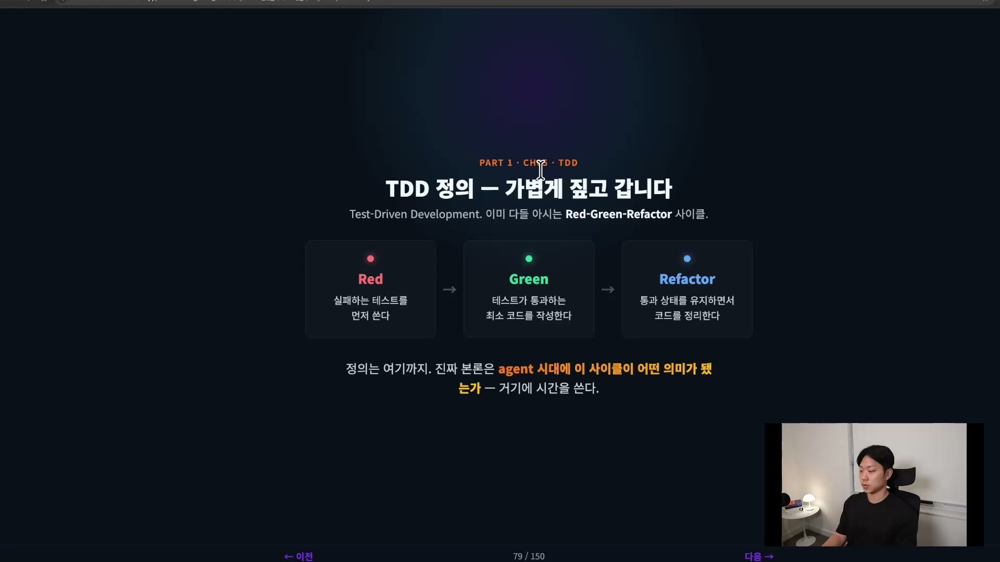
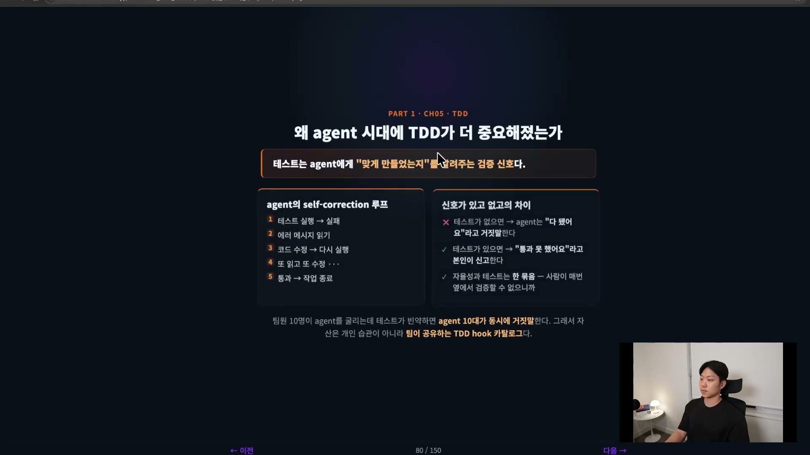
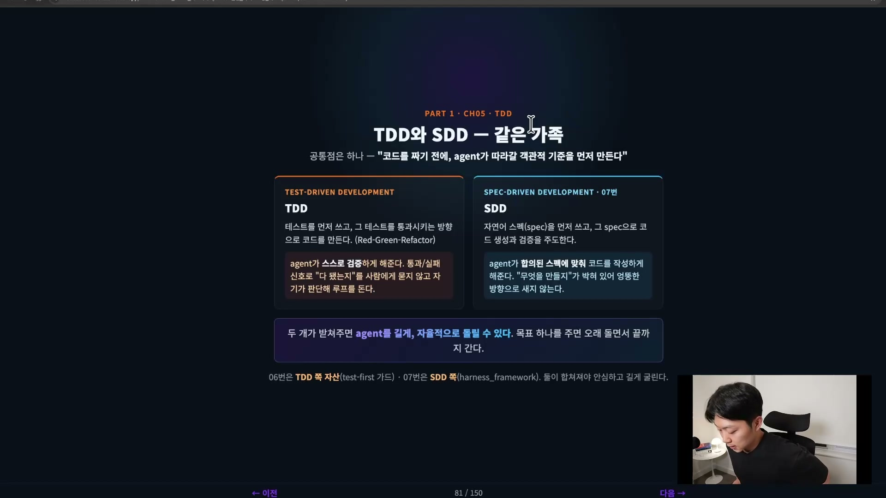
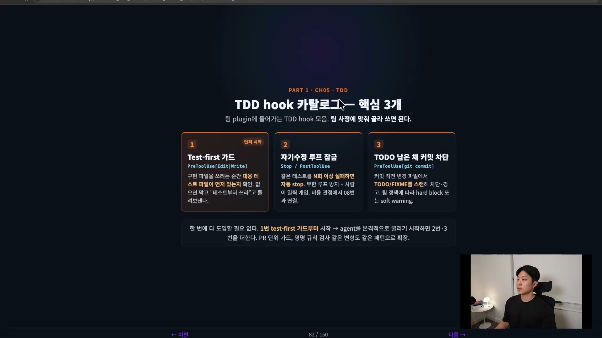
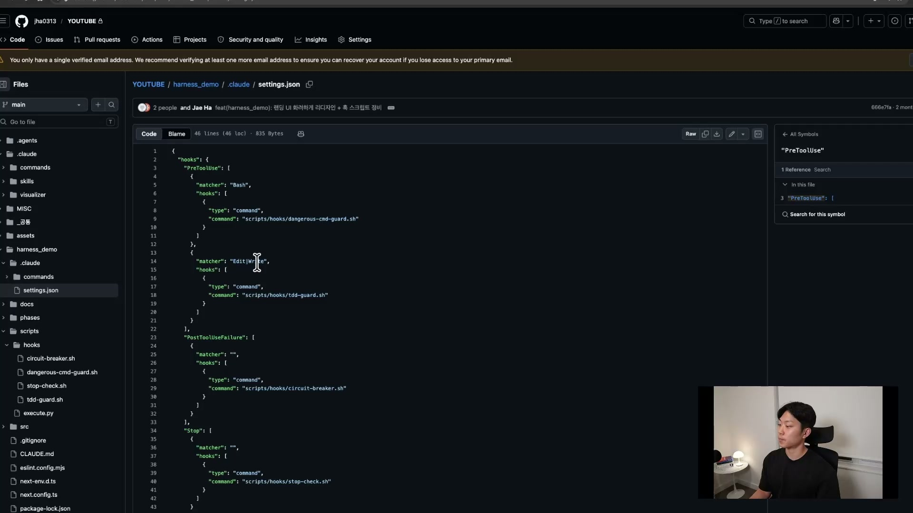
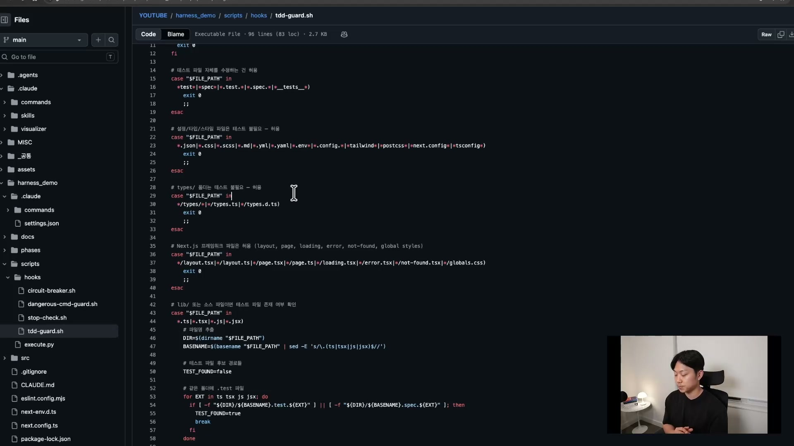
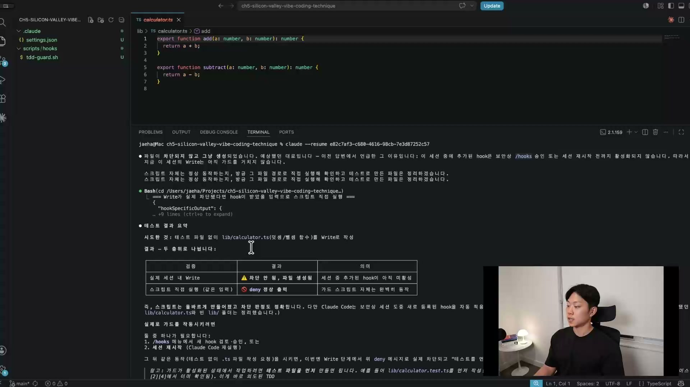
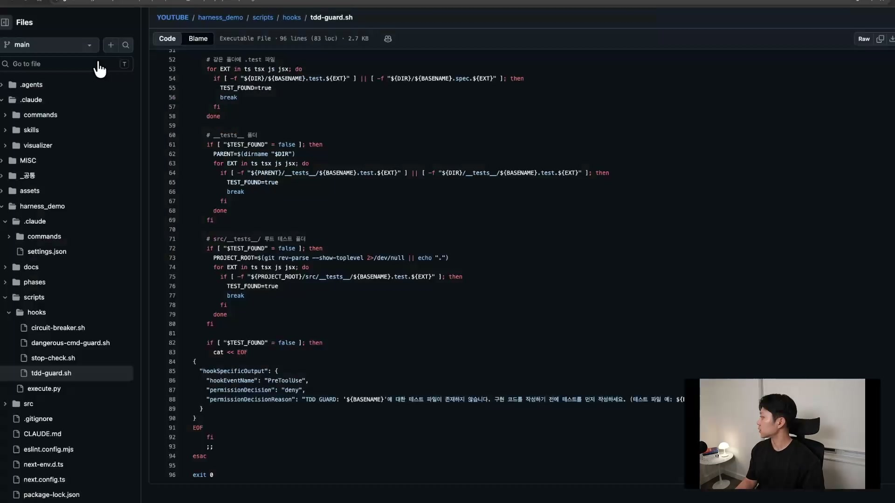
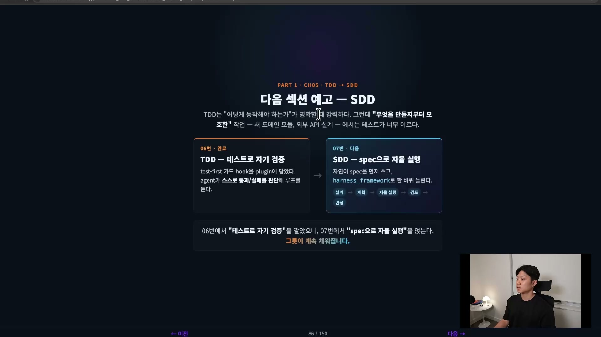

테스트 주도 개발(TDD, Test-Driven Development)은 오래된 기법이다. 그런데 사람이 코드를 짜던 시절과 agent가 코드를 짜는 시절에서, 이 기법의 무게가 완전히 달라졌다. 예전에는 "쓰면 좋은 습관"이었다면, 지금은 agent를 자율적으로 굴리기 위한 전제 조건에 가깝다. 이 차이가 어디서 오는지부터 정리한다.

## TDD가 무엇인지 먼저

TDD는 말 그대로 테스트를 먼저 쓰고, 그 테스트를 통과시키는 방향으로 코드를 작성하는 방식이다. 흔히 Red-Green-Refactor 사이클이라고 부른다. Red는 테스트가 실패한 상태, Green은 통과한 상태를 뜻한다.

구체적인 예가 이해를 빠르게 한다. Calculator라는 서비스에 덧셈 함수를 만든다고 하자. 순서는 이렇다.

1. 덧셈 함수가 아직 없는 상태에서, `1 + 1 == 2`를 확인하는 테스트를 먼저 쓴다. 함수가 존재하지 않으니 이 테스트는 당연히 실패한다. 이게 Red다.
2. 그다음 덧셈 함수를 구현하고 테스트를 다시 돌린다. 제대로 만들었다면 이번엔 통과한다. 이게 Green이다.
3. 통과 상태를 유지하면서 코드를 정리한다. 이게 Refactor다.

정의 자체는 여기까지다. 진짜 본론은 이 사이클이 agent 시대에 어떤 의미가 됐느냐다.

## 왜 agent 시대에 더 중요해졌는가

사람만 코드를 짜던 시절에도 TDD는 쓰였다. 다만 필수는 아니었다. 버그를 막아준다, 설계를 강제한다 같은 가치로 정당화됐고, 그래서 쓰는 사람도 있고 안 쓰는 사람도 있었다. 테스트 커버리지는 늘 골칫거리였다. 테스트는 "있으면 좋은 것"의 자리에 있었다.

agent 시대로 오면 테스트의 정체가 바뀐다. 테스트는 agent에게 "맞게 만들었는지"를 알려주는 객관적인 검증 신호가 된다.

이유는 agent가 일하는 방식에 있다. agent가 코드를 한 번 만들었다고 하자. 그 코드를 사람이 한 줄씩 읽어서 검증하는 일은 사실상 일어나지 않는다. 시간 낭비이기 때문이다. 결국 검증도 agent에게 위임하게 되는데, 이상적으로는 "테스트 통과시켜"라는 한 줄로 위임이 끝나야 한다.

그러면 agent는 스스로 루프를 돈다. 테스트를 실행하고, 실패하면 에러 메시지를 읽고, 코드를 고치고, 다시 돌린다. 또 실패하면 또 읽고 또 고친다. 통과할 때까지 이걸 반복하다가 통과하는 순간 작업을 끝낸다. 이게 agent의 자기수정 루프다.

이 루프가 돌려면 "됐다 / 안 됐다"를 가르는 객관적 신호가 있어야 하고, 그 신호 역할을 하는 게 유닛 테스트다. 테스트가 없으면 agent는 "다 됐습니다"라고 거짓말을 한다. 테스트가 있으면 "아직 통과 못 했습니다"라고 본인이 신고하고 고친다. 매번 사람이 옆에서 검증해 줄 수 없고, 그래서도 안 되는 이상, 자율성과 테스트는 한 묶음이다.

이건 개인보다 팀 단위에서 차이가 더 크게 벌어진다. 팀원 10명이 각자 agent를 굴리는데 테스트가 빈약하면, agent 10대가 동시에 거짓말을 하는 셈이다. 반대로 테스트가 단단하면 agent 10대가 자율적으로 일하면서 자기 검증까지 알아서 한다. 그래서 이 강의가 만들려는 자산은 "테스트 작성 습관"이 아니라 팀이 공유하는 TDD hook이다.

## TDD와 SDD는 같은 가족이다

hook을 만들기 전에 용어 하나를 같이 짚어 둔다. TDD 옆에는 SDD(Spec-Driven Development, 스펙 주도 개발)가 있다.

TDD는 테스트를 먼저 쓰고 그 테스트를 통과시키는 방향으로 코드를 만든다. SDD는 자연어 스펙을 먼저 쓰고, 그 스펙으로 코드 생성과 검증을 주도한다. 여기서 스펙이란 requirement나 PRD 같은 문서를 뜻한다.

둘은 대립 관계가 아니라 같은 가족이다. 공통점이 하나 있다. 코드를 짜기 전에, agent가 따라갈 객관적 기준을 먼저 만든다는 것이다. 역할만 다르다. TDD는 테스트가 통과·실패 신호를 주니까 agent가 다 됐는지를 사람에게 묻지 않고 스스로 판단해 루프를 돈다. SDD는 무엇을 만들지가 자연어로 이미 정의돼 있으니 agent가 엉뚱한 방향으로 새지 않는다.

이 둘이 받쳐 주면 사람이 매 단계 끼어들지 않아도 agent가 스펙을 보고 코드를 쓰고 테스트로 스스로 검증하면서 알아서 굴러간다. 코드는 결국 artifact에 불과해지고, 사람이 보고 고치는 건 스펙 쪽으로 옮겨 간다. 이게 하네스(harness) 루프다. 단발성 질문-응답으로 agent를 쓰는 게 아니라, 목표 하나를 주면 오래 돌면서 끝까지 가게 하는 방향. 요즘 AI를 잘 쓰는 팀들이 다 이쪽으로 움직이고 있다.

## 만들 hook은 세 종류, 일단 하나부터

본격적으로 만들 자산은 TDD hook이다. 한 번에 다 만들 필요는 없고, 후보는 세 개다.

| hook | 트리거 시점 | 하는 일 |
| --- | --- | --- |
| Test-first 가드 | PreToolUse (Edit·Write) | 구현 파일을 쓰려는 순간, 대응하는 테스트 파일이 먼저 있는지 확인한다. 없으면 막고 "테스트부터 써라"고 돌려보낸다 |
| 자기수정 루프 잠금 | Stop · PostToolUse | 같은 테스트를 N회 이상 실패하면 자동으로 멈춘다. 무한 루프 방지이자 비용 방어다 |
| TODO 남은 채 커밋 차단 | PreToolUse (git commit) | 커밋 직전 변경 파일에서 TODO·FIXME를 스캔해 차단하거나 경고한다 |

2번을 조금 더 보면, agent가 테스트를 통과시키려다 무한 루프에 빠질 수 있다. 토큰이 곧 비용이라, 무한 루프는 비용이 계속 새는 것과 같다. 그래서 일정 횟수 실패하면 빨리 실패하게 끊어 주는 게 Circuit Breaker 같은 역할을 한다.

여기서는 1번 Test-first 가드부터 만든다. 이게 가장 먼저 깔아야 할 가드이기 때문이다.

## Test-first 가드를 코드로 들여다보기

이 hook은 두 부분으로 나뉜다. 하나는 실제 검사를 수행하는 `tdd-guard` 스크립트, 다른 하나는 그 스크립트를 실행시키는 hook 설정이다.

hook 설정은 Claude 설정의 PreToolUse에 붙는다. 어떤 파일을 Edit하거나 Write하려고 할 때, 그 동작이 일어나기 전에 이 스크립트를 무조건 실행시키도록 묶어 둔다.

스크립트 안쪽이 이 hook의 핵심이다. 강의에서는 코드 주석만 읽어도 흐름이 잡히게 짜 두었다. 흐름은 "먼저 걸러내고, 남은 것만 검사한다"로 요약된다.

가장 먼저 하는 건 테스트가 필요 없는 파일을 통과시키는 일이다.

- 파일 경로가 없으면 통과시킨다(엣지 케이스).
- 테스트 파일(`*test*`, `*spec*`, `*.test.*` 등)을 수정하는 건 당연히 허용한다. 가드가 테스트 파일 자체를 막으면 안 된다.
- 설정·타입·스타일 파일(`*.json`, `*.css`, `*.yml`, `*.config.*`, types 폴더 등)도 테스트가 필요 없으니 통과시킨다.

이 화이트리스트(white list)가 강의에서 강조하는 지점이다. TDD 가드를 모든 파일에 들이대면 개발이 안 된다. 테스트도 잘 쓰는 게 실력이라, 진짜 필요한 모든 줄에 다 테스트를 쓰려는 건 옳지 않다. 사소한 것 하나를 바꿀 때마다 테스트가 깨져 그것까지 고쳐야 한다면, 유지보수 부담만 하나 더 느는 셈이다. 오히려 개발이 느려진다. 그래서 가치 있는 비즈니스 로직, 장애나 큰 버그로 이어질 수 있는 로직에만 테스트를 강제하고, 나머지는 먼저 걸러 준다.

이 필터를 다 통과하고 나서야, 즉 라이브러리나 소스 파일일 때만 테스트 파일 존재 여부를 본다. 검사는 두 군데를 본다. 같은 폴더에 `.test`·`.spec` 파일이 있는지, 그리고 별도 테스트 폴더에 있는지. 테스트가 어디 있을지 모르니 둘 다 확인하는 것이다. 어느 쪽에서든 찾으면(`TEST_FOUND=true`) 스킵하고 통과시킨다. 끝까지 못 찾으면 그때 deny한다.

deny되면 이런 메시지가 나간다.

> 테스트 파일이 존재하지 않습니다. 구현 코드를 작성하기 전에 테스트를 먼저 작성하세요.

메시지에는 어떤 테스트 파일을 만들면 되는지 예시 경로까지 붙는다.

## 실제로 막히는 장면

강의에서는 이 가드가 실제로 차단하는 걸 보여 준다. 테스트 없이 `lib/calculator.ts`에 덧셈과 뺄셈 함수를 쓰게 시키는 시나리오다.

여기서 한 가지 함정이 드러난다. hook을 만든 바로 그 세션에서는 hook이 아직 활성화되어 있지 않다. 그래서 처음 시도에서는 차단되지 않고 파일이 그냥 생성됐다.

Claude Code는 이때 두 가지 중 하나를 요구한다. Hooks 메뉴에서 새 hook을 검토·승인하거나, 세션을 재시작하는 것이다. 세션을 다시 시작해 hook이 활성화된 상태로 만든 뒤 같은 작업을 다시 시키면, 이번엔 Write 단계에서 위 deny 메시지가 뜨면서 "차단됐습니다"로 멈춘다.

여기서 짚을 점은 개입하는 시점이다. 이 hook은 커밋하는 시점이 아니라 코드를 쓰는 시점에 끼어든다. agent가 애초에 테스트를 쓰지 않으면 다음 단계로 가지 못하게 만든다. 사후에 잡는 게 아니라 입구에서 막는 가드레일이다.

## 개인 습관이 아니라 시스템이 되는 지점

이 가드와 스크립트를 팀 플러그인(plugin)에 그대로 넣으면, hook은 팀의 자산이 된다.

이게 끝나는 시점에 팀 플러그인에는 TDD 가드 스크립트와 hook이 들어가 있다. 아무것도 아닌 작은 hook처럼 보이지만, 이 하나가 팀에 들어가면 팀원 누구의 노트북에서든 agent가 테스트 없이 구현부터 쓰는 일이 애초에 차단된다. 테스트 없는 코드가 만들어지지 않는다.

핵심은 강제의 주체가 바뀐다는 데 있다. 개인의 의지가 아니라 시스템으로 테스트 퍼스트가 강제된다. 신규 멤버도 첫날부터 같은 룰 안에서 일한다. 개인 습관 차원이었다면 표준화할 수 없었을 일이다. plugin과 hook이 가드레일로 강제하기에 가능해진다. 결국 우리가 되어야 할 건 좋은 코드를 직접 쓰는 사람이 아니라, 이런 시스템을 설계하는 사람이라는 이야기다.

## TDD의 한계와 다음 자리

TDD는 "어떻게 동작해야 하는가"가 명확한 작업에 강력하다. 덧셈 함수처럼 입력과 기대 출력이 분명한 경우다.

그런데 무엇을 만들지가 모호한 작업, 예를 들어 새로운 도메인을 짜거나 외부 API를 설계하는 경우에는 테스트가 너무 이르다. 무엇을 만들지 합의가 안 된 상태에서 통과·실패 신호를 먼저 정의할 수 없기 때문이다.

그 빈자리를 채우는 게 SDD다. 자연어 스펙을 먼저 쓰고, 그 스펙을 agent가 자율적으로 끝까지 실행하게 만든다. 단순히 스펙을 잘 쓰는 법이 아니라, Harness Framework라는 GitHub 리포로 설계, 계획, 자율 실행, 검토, 반성까지 다섯 단계를 한 바퀴 돌리는 방식이다. 테스트로 자기 검증을 먼저 깔아 두었으니, 그 위에 스펙으로 자율 실행을 얹는 순서다.
