바로 앞 챕터에서 다룬 TDD(Test Driven Development)는 테스트를 먼저 쓰게 강제하는 가드를 plugin 훅에 넣어, 에이전트가 테스트 없이 구현부터 쓰는 걸 막는 방식이었다. 버그 수정이나 작은 함수처럼 "어떻게 동작해야 하는가"가 비교적 명확한 작업에는 잘 맞는다. 그런데 새 도메인 모듈을 설계하거나, 새 SaaS를 디자인하거나, 프로젝트를 처음 시작하는 자리에서는 테스트가 너무 이르다. 무엇을 만들지부터 모호하면 거기에 맞춰 테스트를 쓸 수가 없기 때문이다. 이런 자리에서는 테스트보다 먼저 "무엇을 만들지"를 합의하는 게 중요하다. 그 합의의 도구가 SDD다.

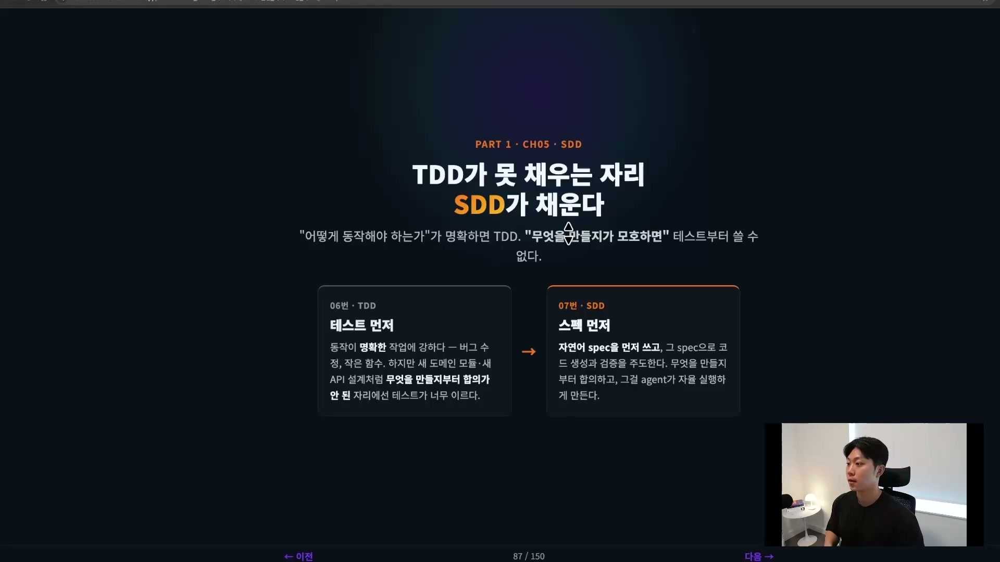

SDD는 Spec-Driven Development, 스펙 주도 개발이다. 자연어로 된 스펙을 먼저 쓰고, 그 스펙으로 코드의 생성과 검증을 주도하는 개발 방식이라고 정리하면 된다. 한 가지 오해를 먼저 풀어둘 필요가 있다. 스펙을 잘 쓰는 법 자체는 사실 크게 새롭지 않고, 요즘 LLM들이 스펙 문장을 잘 써준다. 그래서 이 글에서 다루는 핵심은 두 가지다. 좋은 스펙의 기준이 무엇인지, 그리고 그 스펙을 에이전트가 끝까지 자율적으로 실행하게 만드는 장치(harness)가 무엇인지인데, 무게는 후자에 더 실린다. 강의에서는 강사가 직접 만든 harness_framework라는 도구로 스펙 하나를 끝까지 돌리는 과정을 보여준다.

## 도구보다 머릿속을 먼저 바꾼다

SDD가 작동하려면 도구보다 사고방식의 전환이 먼저다. 이게 안 된 상태로는 어떤 도구를 줘도 옛날 방식으로 쓰게 된다. 강의는 다섯 가지 전환을 든다.

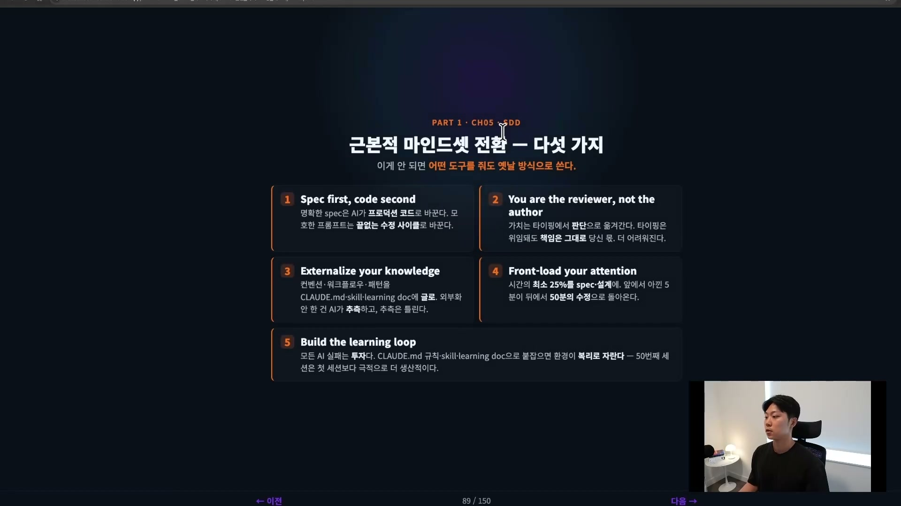

첫째, spec first, code second. 코드를 건드리기 전에 명확한 스펙을 쓴다. AI는 명확한 스펙을 프로덕션 코드로 바꿔주지만, 모호한 스펙은 끝없는 수정 사이클을 낳는다. 어느 쪽에 시간을 쓸지가 이 스펙에서 갈린다.

둘째, 나는 작성자가 아니라 리뷰어다. 더 이상 코드를 쓰는 사람이 아니라 판단을 내리는 사람이다. 아키텍처, 엣지 케이스, 도메인 맥락은 AI가 알지 못하는 영역이다. 짚어둘 점은, 이 영역들은 코딩보다 쉬운 게 아니라 더 어려운 영역이라는 것이다. 상대적으로 쉬운 코딩을 AI에 위임하고, 사람은 더 어려운 판단의 자리로 옮겨간다.

셋째, 머릿속 지식을 밖으로 꺼낸다. 컨벤션, 워크플로우, 패턴은 CLAUDE.md나 스킬에 글로 적고, 설계하려는 아키텍처도 문서로 꺼낸다. 외부화하지 않은 지식은 AI가 알 수 없다.

넷째, 주의력을 앞단에 싣는다. 설계에 시간을 제일 많이 쏟아야 하고, 이제 병목은 설계다. 예전에는 코드 작성, 리뷰, 테스트가 모두 병목이라 엔지니어를 많이 고용해 사람 수로 그 병목을 메웠다. 그런데 코딩은 더 이상 병목이 아니다. 하나의 AI가 수많은 엔지니어보다 더 많은 코드를 쓸 수 있는 상황이라, 사람의 시간은 스펙 설계로 옮겨가야 한다.

다섯째, 학습 루프를 만든다. AI는 실패한다. 그 실패에서 끝나면 안 되고, 실패를 기회로 본다. 실패를 CLAUDE.md 규칙이나 스킬, learning doc 같은 걸로 되돌려 시스템을 개선하면 환경이 복리로 자란다. 50번째 세션이 첫 번째 세션보다 더 생산적이게 만드는 게 목표다.

다섯의 핵심은 키보드 워리어(코드를 직접 치는 사람)에서 의사결정자로 역할이 바뀐다는 것이다. 전통적 방식에서는 작성자로서 코드를 쓰고 테스트하고 배포했고, 시간 대부분이 작성과 테스트에 들어가 그게 병목이었다. AI 중심 방식에서는 리뷰어로 옮겨가 AI 출력을 리뷰하고 스펙을 작성하는 데 시간을 쓴다. 시간 배분이 거꾸로 뒤집히면서 스펙은 거들면 좋은 것이 아니라 결과를 가르는 결정적 자리가 된다.

## 다섯 단계 루프, 누가 주도하느냐

SDD는 다섯 단계의 루프로 돌아가는데, 단계마다 누가 주도하고 누가 검토하는지가 달라지고 이 분업이 SDD를 떠받친다.

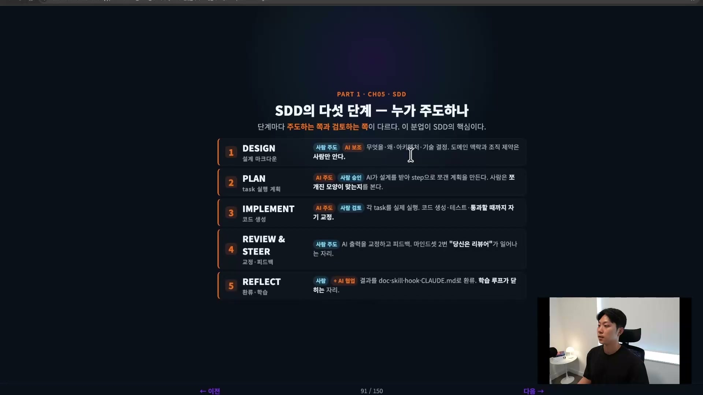

DESIGN(설계)은 사람이 주도하고 AI가 보조한다. 무엇을, 왜, 어떤 아키텍처와 기술 결정으로 만들지, 도메인 맥락과 조직 제약은 사람만 아는 영역이라 사람이 끌고 간다. 이걸 PRD, 아키텍처 문서, ADR(Architecture Decision Record) 같은 문서로 꺼내 둔다. AI가 그 문서를 읽고 일하도록 만드는 단계이고, 시간을 제일 많이 쏟아야 하는 곳이다.

PLAN(계획)은 AI가 주도하고 사람이 승인한다. AI가 문서와 스펙을 바탕으로 작업을 스텝으로 쪼갠 계획을 만들고, 사람은 그 쪼개진 모양이 맞는지 리뷰하고 승인한다.

IMPLEMENT(구현)도 AI가 주도하고 사람이 검토한다. 승인된 계획을 가지고 AI가 각 task를 실제로 실행하며, 스펙에 맞춰 통과할 때까지 스스로 루프를 돌려 코드를 작성한다.

REVIEW & STEER(교정과 피드백)는 다시 사람이 주도한다. AI 출력에 피드백을 주고 교정한다. 마인드셋 둘째인 "나는 리뷰어"가 일어나는 자리이고, 여기서 받은 피드백으로 시스템을 다시 설계해 두 번째, 세 번째 돌릴 때 더 나은 결과를 기대한다.

REFLECT(환류)에서 결과를 learning doc, 메모리, CLAUDE.md 같은 걸로 되돌려 시스템을 개선한다. 학습 루프가 닫히는 자리다.

## 좋은 스펙은 다섯 질문에 답한다

가장 중요한 DESIGN의 결과물이 스펙인데, 좋은 스펙의 기준은 하나다. 길 필요는 없고, 다른 엔지니어나 AI가 읽고 올바른 결과를 만들 수 있을 만큼 다섯 질문에 명시적으로 답하면 된다.

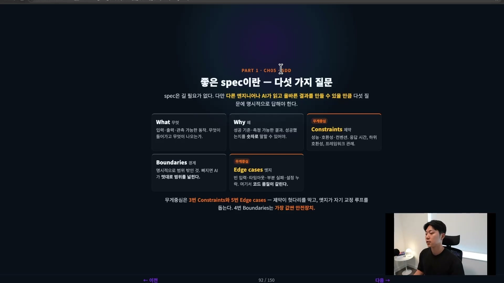

- What(무엇): 입력, 출력, 관측 가능한 동작. 무엇이 들어가고 무엇이 나오는가.
- Why(왜): 이게 제일 중요하다. 왜 만드는지와 성공 기준. 성공했는지를 숫자로 말할 수 있어야 한다.
- Constraints(제약): 지켜야 할 응답 시간, 호환성, 프레임워크 관례 같은 경계.
- Boundaries(경계): 범위 밖, 이번엔 하지 않을 것. AI는 많은 것을 하려 들기 때문에, 범위를 딱 정해주면 AI가 더 똑똑하게 일하고 토큰도 아낀다.
- Edge cases(엣지 케이스): 빈 입력, 타임아웃, 부분 실패, 설정 누락 같은 처리. 제약이 명확하고 엣지 케이스가 잘 깔려 있어야 AI가 중간에 실수할 확률이 줄어든다.

무게중심은 3번 Constraints와 5번 Edge cases다. 제약이 헛다리를 막고, 엣지 케이스가 자기 교정 루프를 돕는다. 4번 Boundaries는 가장 값싼 안전장치다.

처음부터 이 다섯에 완벽하게 답하는 스펙을 쓸 수는 없다. 그래서 AI와 티키타카를 한다. 10줄짜리 초안을 쓰고 AI에 프롬프트로 던지면 AI가 확장해주고, 그걸 비판적으로 검토해 다시 확장한다. 3\~4번 반복하면 촘촘한 스펙이 나온다.

이렇게 만든 스펙이 준비됐는지는 체크리스트로 점검한다. 하나라도 비면 AI가 그 빈칸을 추측으로 채우기 때문에, 비는 항목을 AI한테 채워달라고 하는 게 좋다.

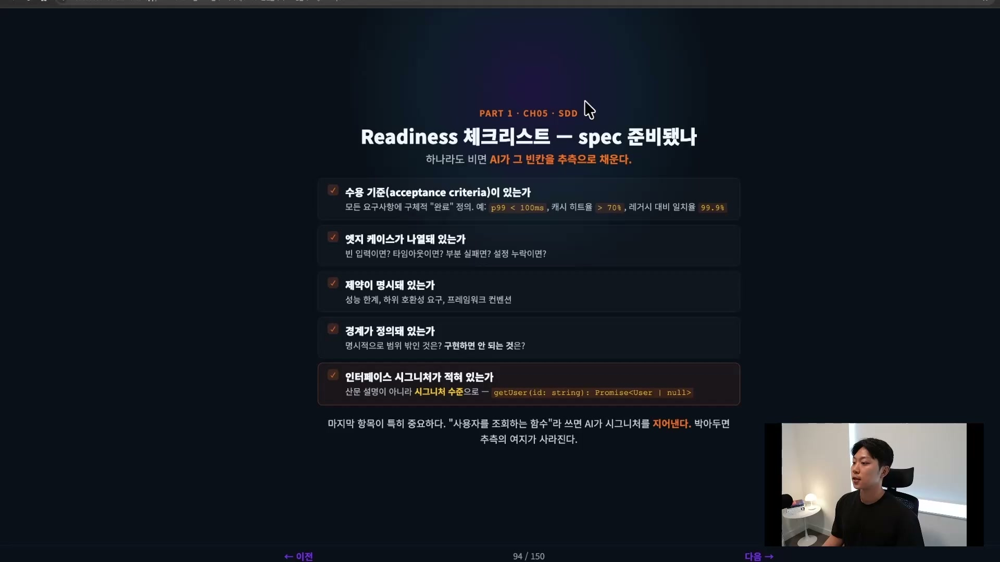

수용 기준(acceptance criteria)이 있는가. 예를 들어 `p99 < 100ms`, 캐시 히트율 `> 70%`처럼 구체적인 "완료" 정의가 붙어 있어야 한다. 엣지 케이스가 나열돼 있는가, 제약이 명시돼 있는가, 경계가 정의돼 있는가. 마지막으로 인터페이스 시그니처가 적혀 있는가가 특히 중요하다. "사용자를 조회하는 함수"라고 산문으로 쓰면 AI가 시그니처를 지어내지만, `getUser(id: string): Promise<User | null>`처럼 코드 수준으로 박아두면 추측의 여지가 사라진다. 인터페이스를 블록 단위로 나눠두면, AI가 작은 조각 100개를 읽는 대신 큰 블록 서너 개를 읽고 그중 하나로 들어가 또 읽는 식으로 일할 수 있어 훨씬 효율적이다. 이건 AI 이전부터 좋은 설계 원칙이었지만 AI 시대에 더 중요해졌다.

프로젝트가 커지면 스펙을 하나에 다 넣지 말고 계층형으로 쪼갠다.

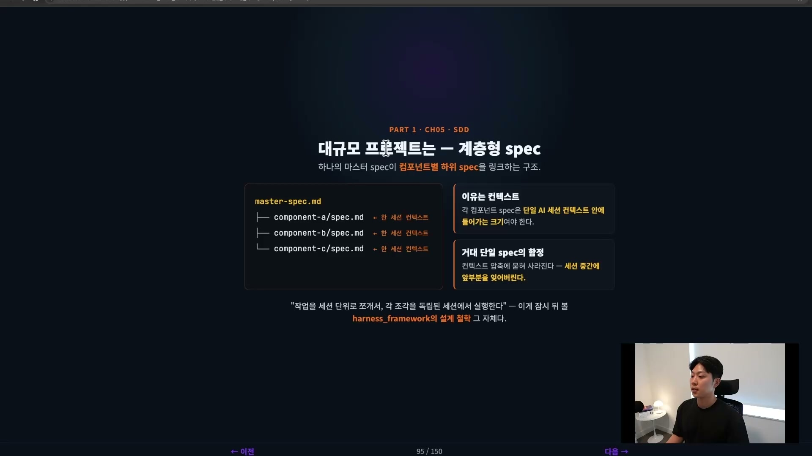

하나의 마스터 스펙이 컴포넌트별 하위 스펙을 링크하는 구조다. 각 컴포넌트 스펙은 단일 AI 세션 컨텍스트 안에 들어가는 크기로 나눈다. 거대한 단일 스펙은 컨텍스트 압축에 묻혀 세션 중간에 앞부분을 잊어버릴 수 있다. MVP를 만들 때 마스터 스펙에 MVP를 두고, 두 번째 컴포넌트, 세 번째 피처를 만들 때 하나씩 추가하는 식으로 간다. "작업을 세션 단위로 쪼개서 각 조각을 독립된 세션에서 실행한다"는 것, 이게 잠시 뒤 볼 harness_framework의 설계 철학 그 자체다.

## harness_framework, 스펙을 끝까지 돌리는 도구

강사가 만든 harness_framework는 공개 저장소로 올라가 있다.

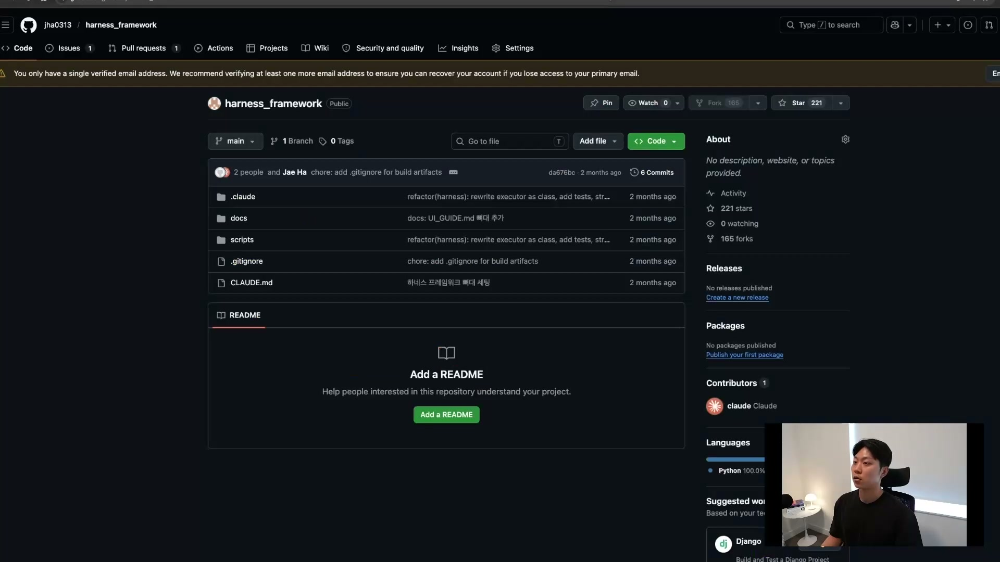

star 221, fork 165개가 달려 있다. 사용 방법은 이 저장소 구조를 내 프로젝트에 복사해 넣는 것이다. 강의에서는 GitHub 링크를 Claude에게 주고 "이 구조를 이 프로젝트에 복붙해줘"라고 시킨다. 이때 앞 챕터에서 셋업한 TDD Guard 훅이 이미 있는데, 그것도 같이 쓸 거라 그대로 두고 병합한다. SDD는 스펙만 잘 작성해두면 나머지는 AI가 다 해주는 작업이라, 그 루프가 길게는 한 시간 넘게 돌기도 한다. 그래서 루프를 먼저 돌려놓고 구조를 살핀다.

구조의 핵심은 docs 폴더다. 이 안의 문서들이 스펙이고, 에이전트가 이걸 읽고 구현을 시작한다.

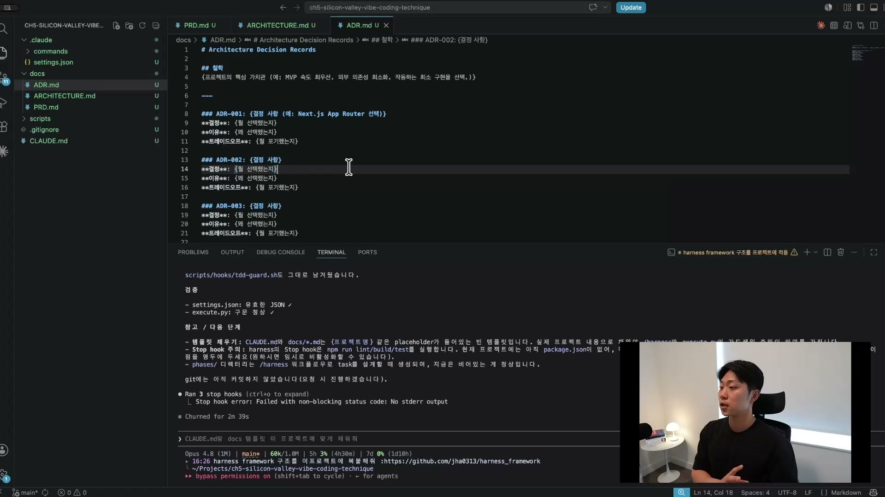

PRD(Product Requirement Document)는 제품 설명서다. 목표, 이 프로젝트가 해결하는 문제, 사용자(누가 쓰는지), 핵심 기능, MVP 제외 사항, 디자인 같은 뼈대가 들어간다. ARCHITECTURE는 디렉토리 구조, 패턴, 데이터 흐름, 상태 관리를 담는다. ADR이 특히 중요하다. 모든 결정에는 이유가 있는데, 그 이유는 보통 머릿속에만 있고 코드에는 주석을 달지 않는 한 담기지 않는다. 에이전트가 이유를 모르고 작업하면, 가령 어떤 이유로 정한 구조를 영문도 모른 채 갑자기 바꿔버릴 수 있다. 그래서 ADR에 무엇을 선택했는지, 왜 선택했는지, 무엇을 포기했는지(트레이드오프)까지 적어 둔다. 그리고 CLAUDE.md. 이 네 문서가 에이전트가 스펙을 읽고 구현을 시작하기에 필수적인 것들이다.

데모에서는 GPT Image API로 유튜브 썸네일을 만드는 서비스를 예시로 잡는다. 시작은 말로 던지는 짧은 초안이다. 인풋은 이미지(옵셔널)와 프롬프트(필수), 아웃풋은 이미지, 타깃은 유튜브 하는 사람, 만든 이유는 썸네일 제작이 힘들어서. 다섯 줄짜리 초안을 Claude에게 던지고 티키타카를 시작한다. 처음 나온 PRD 초안은 목표, 사용자, 핵심 기능 정도만 채워진 매우 빈약한 상태였다. 여기서 "특히 유저 플로우와 전이를 잘 설계해줘, 유저가 어떻게 들어와서 무엇을 실행하고 에러가 날 때 어떻게 할지 디테일하게"라고 한 번 더 돌린다.

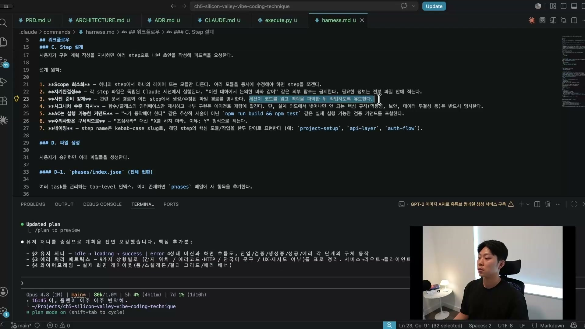

한 번 더 돌리니 유저 페르소나(누가, 언제, 무엇을, 원하는 결과), 상태 전이 다이어그램(폼 작성 → 검증 → 실패 시 처음으로, 성공 시 생성), 에러 처리 매트릭스, 와이어프레임까지 나온다. 여기에 "오버 엔지니어링 하지 마, MVP니까 최소한의 변화로 최대 아웃풋"이라는 제약을 한 번 더 걸어 아키텍처를 다듬는다. 이렇게 3\~4번 돌리면 스펙이 촘촘해진다.

## execute.py, claude -p로 일을 바깥에 시킨다

스펙(docs)이 준비되면 harness.md라는 slash command가 워크플로우를 끌고 간다. 먼저 탐색(하위 문서를 읽고 의도 파악), 다음 논의(구체화할 게 있으면 사람에게 돌아오고, 스펙이 잘 짜여 있으면 건너뛴다). 그 다음부터는 전부 AI가 한다. AI가 작업을 스텝으로 쪼개되, 설계 원칙을 따른다. 스코프는 최소화하고, 각 스텝 파일은 독립된 세션에서 실행되므로 필요한 정보를 전부 그 안에 넣어 자기완결적으로 만들고, 세션이 코드를 읽고 맥락을 파악한 뒤 작업하도록 사전 준비를 강제한다.

이 "독립된 세션에서 실행"이 harness의 심장이고, 그 메커니즘이 execute.py다.

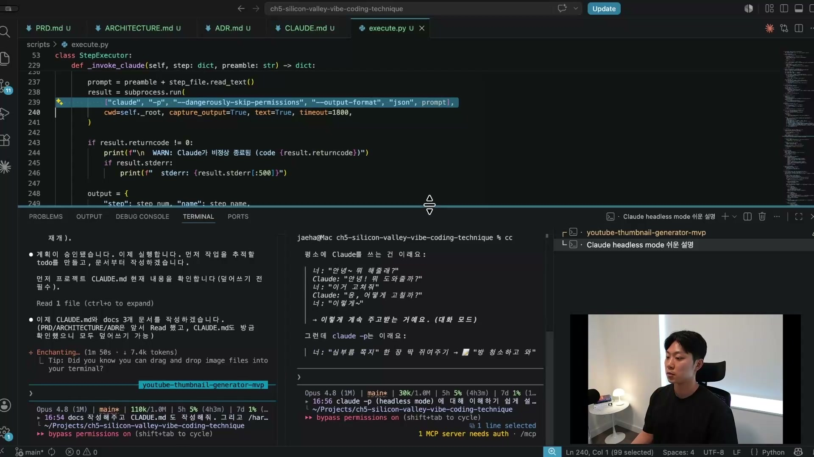

코드를 보면 한 줄이 핵심이다.

```python
result = subprocess.run(
    ["claude", "-p", "--dangerously-skip-permissions", "--output-format", "json", prompt],
    cwd=self._root, capture_output=True, text=True, timeout=1800,
)
```

여기서 `claude -p`가 헤드리스 모드다. 평소 Claude Code는 사람과 대화를 주고받지만, `claude -p`는 심부름 쪽지를 한 장 쥐여주는 것에 가깝다. "방 청소하고 와"라는 쪽지를 주면 Claude가 말을 걸지 않고 혼자 다 한 뒤 "끝났어"라고만 한다. 프롬프트를 Claude 서버에 넘기면 알아서 돌고 결과만 반환된다. 채팅 화면이 뜨지 않는다. 매일 밤 12시에 코드를 검사하게 하는 식의 자동화에 쓰던 모드다.

왜 구현에 이걸 쓰느냐가 핵심이다. 메인 컨텍스트가 커지는 걸 두려워하기 때문이다. 메인 세션의 컨텍스트가 커질수록 Claude의 성능이 급격히 떨어진다. 강의의 표현으로는 30\~40%를 넘어가면 거의 못 쓰는 수준이다. 만약 스텝 1부터 6까지 전부 메인 세션에서 돌리면, 스텝 1\~2는 괜찮아도 스텝 3부터 컨텍스트가 쌓이기 시작해 스텝 7쯤 가면 그 구현은 거의 버리는 거나 다름없다. 그래서 각 스텝을 메인 세션이 아니라 바깥 세션에서 돌리되, 그 세션이 필요로 하는 모든 정보를 스텝 프롬프트로 통째로 준다. 메인 세션의 컨텍스트는 유지되면서 각 스텝은 자기 컨텍스트에서 깨끗하게 실행된다. 여섯 명의 엔지니어에게 "너는 이거, 너는 이거"를 순차로 시키되, 앞 사람이 끝낸 결과를 다음 사람에게 넘겨주는 것과 같다. 그 인수인계가 끊기지 않게 하는 바톤이 summary 필드다.

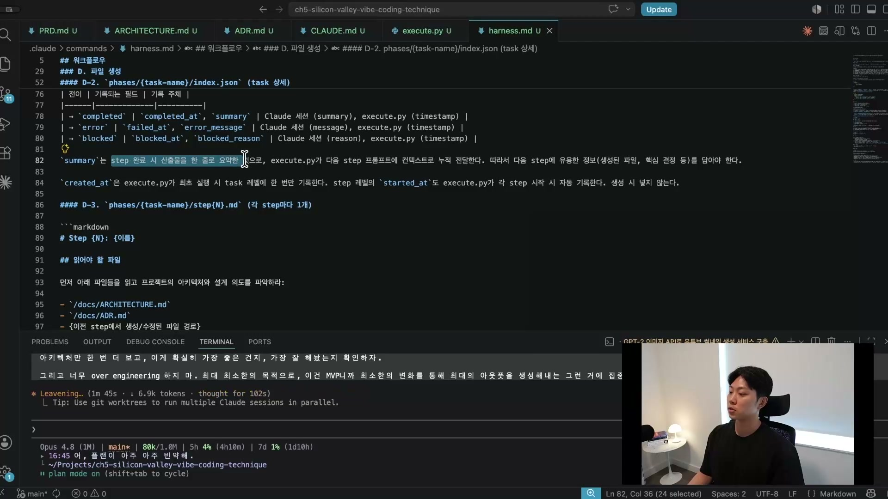

각 스텝은 completed면 summary, error면 error_message, blocked면 blocked_reason을 기록한다. summary는 스텝 완료 시 산출물을 요약한 것으로, execute.py가 다음 스텝 프롬프트의 컨텍스트로 누적 전달한다. 독립된 세션은 이전 세션의 기억이 없으니, 이런 상태 표시를 명시적으로 문서화해 둬야 "지금 스텝 3까지 끝났고 다음은 페이즈 4 차례"라는 걸 다음 세션이 안다. 세션에 대충 얹어두면 컴팩트될 때 그 정보를 잃어버린다.

## 자율 실행, 스펙만 써두면 알아서 돈다

데모에서 한 가지 함정이 등장한다. `claude -p`가 최근에 과금제로 바뀌어, 쓸 때마다 API 비용이 따로 든다는 것이다. 원래 구독 플랜의 사용량 한도 안에서 자유롭게 돌릴 수 있었는데 별도 크레딧으로 바뀌었다. 강사는 이 데모는 그냥 자기 돈을 조금 써서 `claude -p`로 돌리지만, 실제 프로젝트에서는 같은 워크플로우를 코덱스 헤드리스 세션으로 쓴다고 말한다. 코덱스에도 같은 기능이 있고, 아직 이렇게 과금되진 않는다. `claude -p`를 쓸 때는 비용을 조심하라는 당부다.

스펙을 승인하면 AI가 docs를 작성하고, CLAUDE.md를 만들고, harness를 실행한다. 한 가지 사람이 직접 해야 하는 게 있다. OpenAI API 키 같은 환경 변수다. 강사가 강하게 못 박는 부분이 있는데, API 키는 절대 터미널에 붙여넣지 말라는 것이다. 터미널 세션 히스토리에 키가 남고, 그 히스토리를 해킹해 키를 훔쳐갈 수 있다. 키는 환경 변수 파일에 직접 넣어야 한다. 키만 넣고 재개하면 스텝 0부터 실행된다.

실행이 시작되면 phases와 step들이 폴더와 파일로 생성되고, AI가 하나씩 자율로 진행한다.

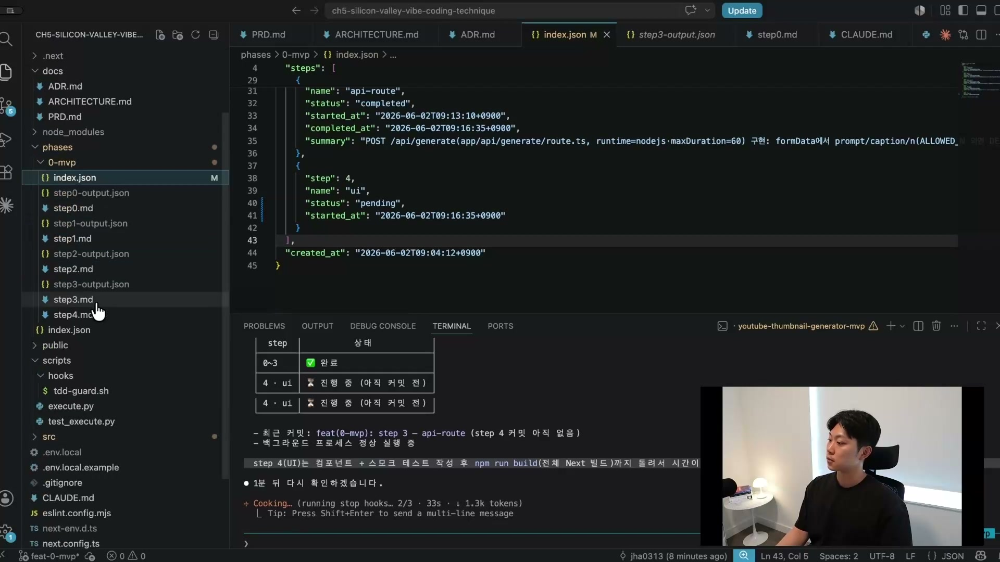

phases/0-mvp 아래로 step0부터 step4까지의 스텝 파일(.md)이 생기고, 스텝이 끝나면 그 산출물인 output.json이 따로 붙는다. 그림 속 폴더를 보면 output.json은 step0부터 step3까지 네 스텝에 다 있고, 마지막 step4(UI)에만 없다. 아직 진행 중이라 커밋 전이기 때문이다. 전체는 index.json이 관리한다. index.json에는 각 스텝의 status(completed/pending), started_at, completed_at, 그리고 summary가 기록된다. 강의에서 본 진행은 스텝 0(프로젝트 셋업)부터 시작해 도메인, OpenAI 서비스, API 라우트, UI 순으로 넘어갔다. 이 과정에서 AI는 알아서 브랜치를 만들고 커밋한다. 재시도가 실패하면 자동으로 알림이 와서 보고한다. "한두 시간짜리 돌려놓고 왔다"는 말이 바로 이 루프를 돌렸다는 뜻이다. 스펙을 잘 써두고 커피를 마시거나 운동을 하고 오면, 어려운 기획과 설계를 사람이 해둔 만큼 AI가 구현을 채워 둔다.

마지막 스텝은 테스트와 `npm run build`까지 돌리는 검증 단계라 시간이 더 걸린다. 검증에서 뭔가 실패하면 AI가 또 알아서 고친다. TDD Guard 덕분에 테스트도 알아서 생성됐다. 검증이 끝나면 서비스가 완성된다.

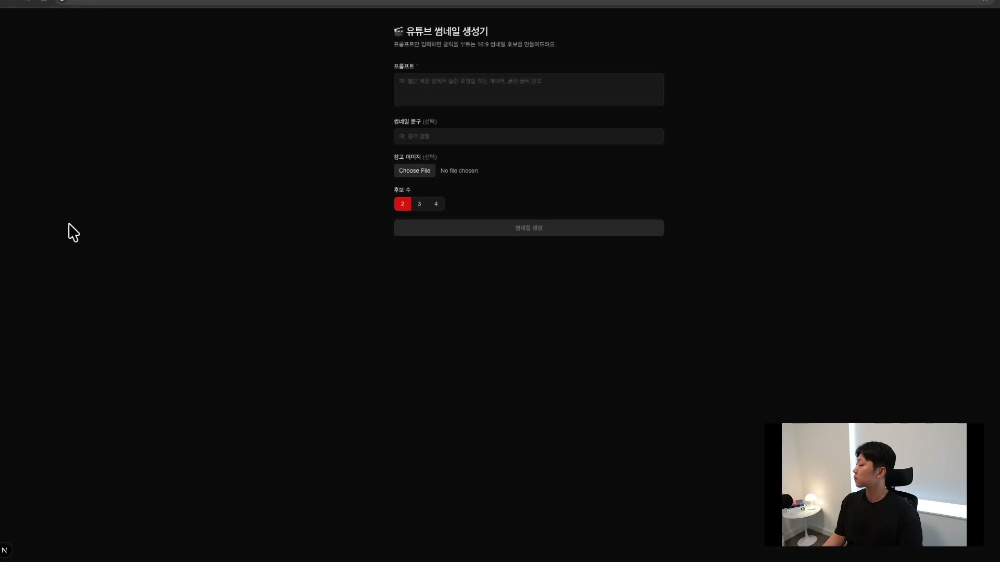

`npm run dev`로 로컬 서버를 띄우면 프롬프트(필수), 썸네일 문구(선택), 참고 이미지(선택), 후보 수(2/3/4)를 받는 폼이 뜬다. 실제로 사진을 골라 후보 두 개로 생성을 돌리니 썸네일이 나왔다. 사람이 한 일은 스펙을 만든 것뿐이고, 스펙을 잘 만들어두니 30분 만에 앱이 나온 셈이다.

한 가지 분명히 해둘 한계가 있다. 스펙을 잘 짤수록 에러와 버그의 확률이 줄어든다는 것이지, 버그 없는 제품이 보장되는 건 아니다. 서비스를 돌려보고 안 되는 점이 있으면 다시 버그 수정을 해야 한다. 사람이 짜도 에러는 많이 나오고, AI가 사람보다 똑똑해도 마찬가지다.

## 정리, 가벼운 harness가 좋은 harness다

강의가 보여준 건 아주 간단한 형태의 SDD다. harness에 대해 강사가 강조하는 결론은, 복잡할수록 좋은 게 아니라 간단할수록 좋다는 것이다. 딱 내가 원하는 걸 만들어내는 가벼운 harness가 진짜 좋은 harness다. 처음에는 사람들이 스킬을 30개, 40개씩 만들며 오버 엔지니어링을 하지만, 결국 harness는 작을수록 좋다는 걸 깨닫고 웬만한 경우엔 이 정도로 충분하다는 데 이른다.

전체를 다시 묶으면, SDD는 사람의 역할을 작성자에서 리뷰어로 옮긴다. 좋은 스펙은 What, Why, Constraints, Boundaries, Edge cases 다섯 질문에 답하고, 그 스펙은 DESIGN → PLAN → IMPLEMENT → REVIEW & STEER → REFLECT의 다섯 단계 루프를 돈다. harness_framework는 docs(PRD, ARCHITECTURE, ADR, CLAUDE.md)로 설계를 받아, execute.py가 `claude -p` 헤드리스 세션으로 스텝을 하나씩 독립 실행하고, summary로 컨텍스트를 바톤터치하며, 상태를 index.json에 추적한다. 작업이 너무 크면 스펙을 계층화해 쪼개면 된다. 이 챕터의 목적은 스펙으로 자율 실행이 가능하다는 걸 보여주는 데 있었다.
