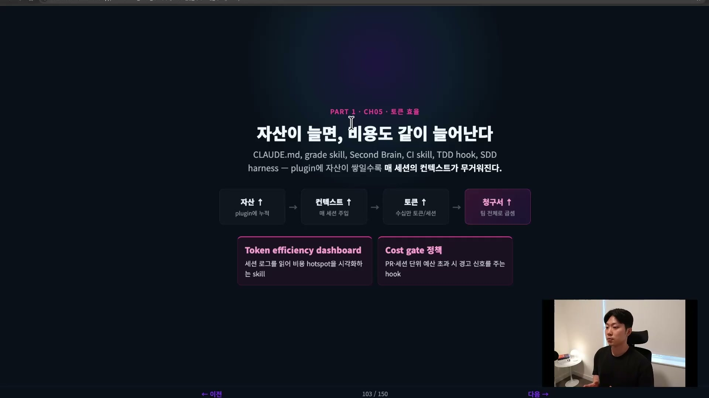
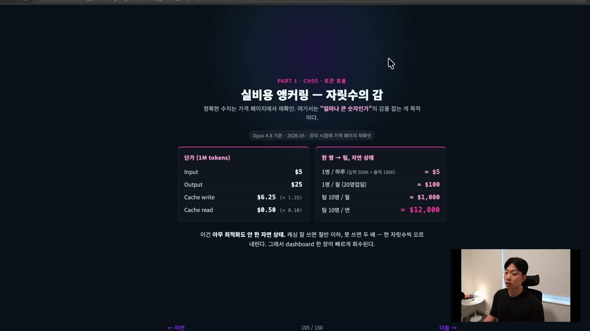
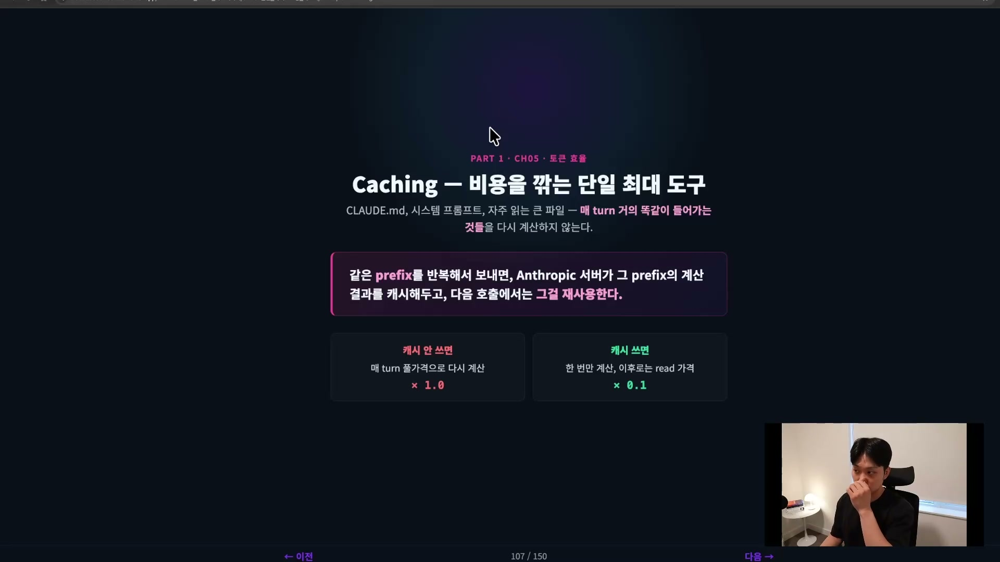
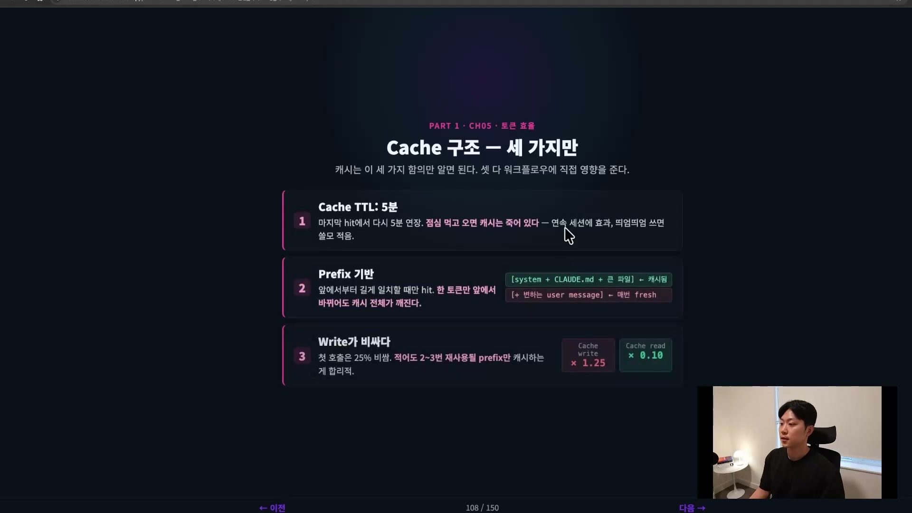
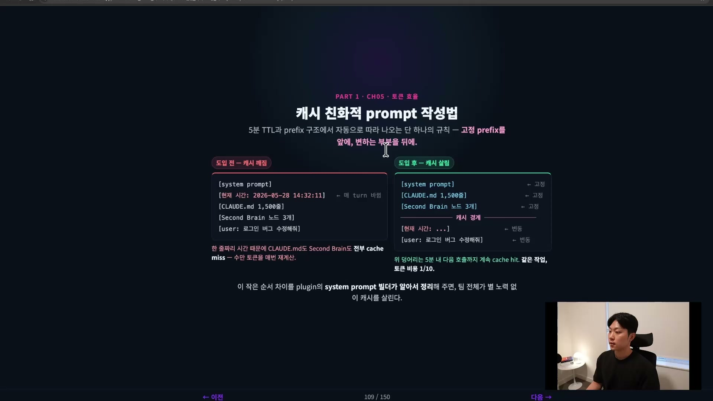
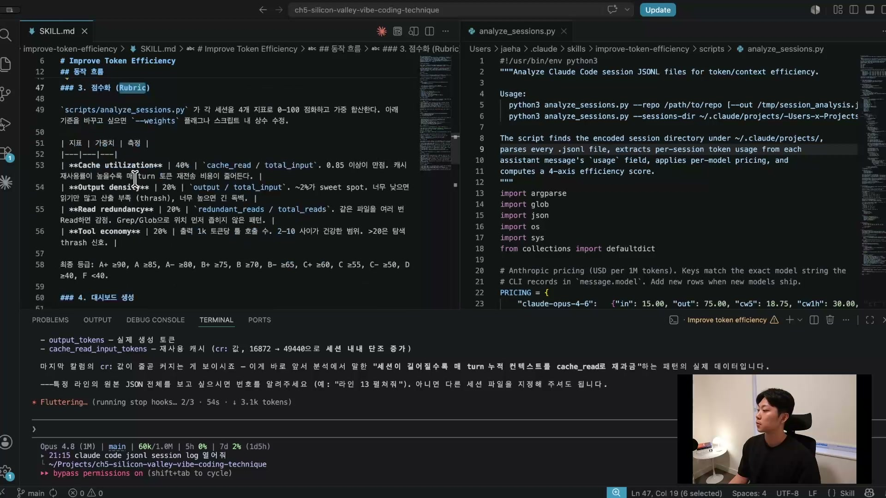
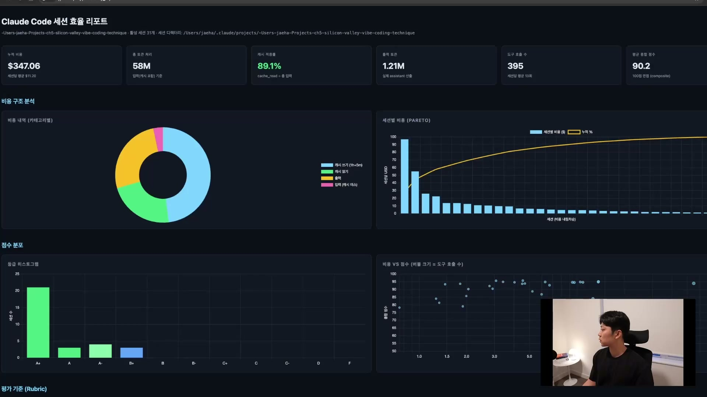
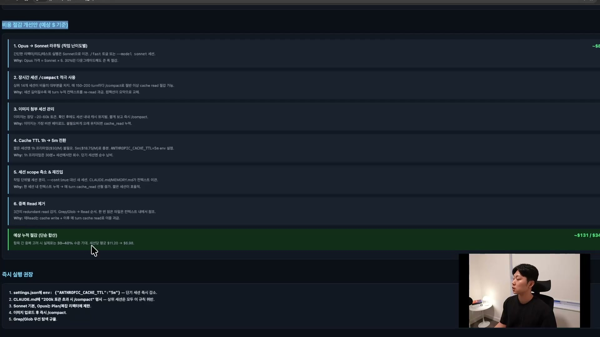
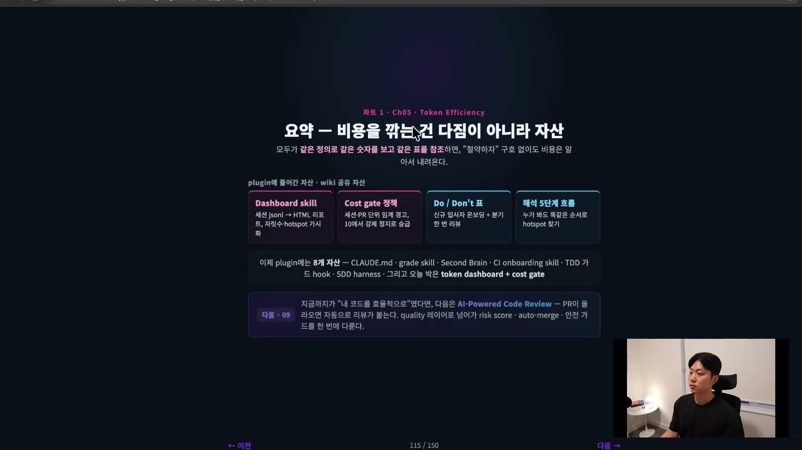

자산이 쌓이면 비용도 쌓인다. CLAUDE.md를 만들고, 세컨드브레인을 구축하고, TDD 훅을 박고, 플러그인을 붙이는 식으로 작업 자산이 하나씩 늘어난다. 좋은 일이다. 그런데 그 자산은 전부 컨텍스트에 들어간다. 컨텍스트가 늘면 토큰이 늘고, 토큰이 늘면 청구서가 늘어난다.

규모를 한번 그려보면 감이 온다. 팀 플러그인에 CLAUDE.md를 천 줄쯤 박아두면, 팀원 한 명이 세션을 열 때마다 그 천 줄이 매번 컨텍스트에 실린다. 거기에 세컨드브레인, 스펙 같은 큰 파일들까지 한 세션에 같이 따라 들어가면 수십만 토큰은 우습게 나온다. 이 글은 그렇게 불어난 토큰을 어떻게 깎는지에 대한 정리다. 끝에는 토큰 사용을 점수로 보여주는 대시보드 스킬과, 비용이 새기 전에 막는 코스트 게이트까지 다룬다.

## 토큰이 뭔가

토큰은 모델이 텍스트를 처리하는 최소 단위다. 헷갈리기 쉬운 게, 영어 단어 하나가 토큰 하나가 아니다. BPE(byte pair encoding)라는 방식이 쓰이는데, 자주 나오는 문자열 덩어리를 미리 사전에 묶어두고 그 사전에 맞춰 텍스트를 토큰 시퀀스로 자른다. 예를 들어 `tokenizer`는 원래 한 단어지만 토큰으로는 두 조각, `subwords`는 세 조각으로 쪼개지는 식이다.

대략적인 비율은 이렇다. 영어는 한 토큰이 보통 네 글자, 단어로 치면 약 0.75개다. 한국어는 한 토큰이 1.5에서 2글자라, 같은 내용을 쓰면 영어보다 2배쯤 더 들어간다고 보면 된다. 코드는 영어와 비슷한 수준이다. 그래서 토큰을 정말 끝까지 최적화하고 싶다면 CLAUDE.md 같은 걸 영어로 쓰는 게 유리하다. 한국어로 써도 되지만, 이런 결정도 비용 차원에서 한 번 검토해볼 만하다는 정도로 알아두면 된다.

## 단가, 추상이 아니라 숫자로

"토큰 많이 먹어요"는 막연하다. 숫자로 계산해보면 다르게 와닿는다. 단가는 강의 시점 기준이고 바뀔 수 있으니 정확한 값은 Anthropic 가격 페이지에서 확인하고, 여기서는 자릿수의 감만 잡는 용도로 본다.

| 항목 | 1M 토큰당 단가 | 비고 |
| --- | --- | --- |
| Input | $5 | 기준 |
| Output | $25 | 입력보다 비싸다 |
| Cache write | $6.25 | 캐시에 새 정보를 넣을 때 (input × 1.25) |
| Cache read | $0.50 | 이미 캐시된 걸 읽을 때 (input × 0.1) |

여기서 캐시 읽기가 입력의 거의 10분의 1이라는 점을 눈여겨봐 둔다.

이 단가를 사람 단위로 확장해보자. 한 명이 하루에 입력 500K, 출력 100K를 쓴다고 치면 대략 $5다. 한 달에 영업일 20일을 곱하면 한 사람당 $100. 이걸 10명 팀으로 보면 월 $1,000, 연으로는 $12,000이 된다. 작은 단위로 시작했는데 조직 단위로 가면 이렇게 빨리 커진다. 메타처럼 인원이 수만 명인 조직이면 토큰 값은 기하급수적으로 든다. 아무 최적화도 안 한 자연 상태가 이 정도다.

## 누구의 청구서를 줄이는가

최적화 이야기로 들어가기 전에 짚을 게 하나 있다. 누구의 청구서를 줄이는가가 사실 의사결정의 절반이다.

개인 청구서 관점에서는 내 카드로 결제하니까 토큰이 곧 내 돈이다. 비용이 눈에 보이니 자연스럽게 보수적으로 쓰게 된다. 반대로 팀이나 회사 청구서 관점에서는 비용이 잘 느껴지지 않는다. 회사 차원에서 다 나가니까 아무도 크게 신경 쓰지 않고 마음껏 쓰게 된다. 그러다 위에서 토큰 최적화 가이드라인이 내려오기 시작하는 식이다. 두 관점은 서로 다른 문제라, 둘 다 염두에 두고 봐야 한다.

## 캐싱, 비용을 깎는 단일 최대 도구

비용을 진짜로 깎는 가장 큰 도구 하나만 꼽으라면 프롬프트 캐싱이다.

정의는 간단하다. 같은 prefix를 반복해서 보내면, Anthropic 서버가 그 prefix의 계산 결과를 캐시에 저장해둔다. 그래서 다음 호출에서 같은 prefix가 필요할 때, 그걸 다시 input 토큰으로 풀가격에 계산하지 않고 cache read로 받아 약 10분의 1 가격에 읽는다. 캐시를 안 쓰면 매번 풀가격이고, 캐시를 쓰면 첫 호출만 계산하고 이후로는 read 가격이다. 그러니 CLAUDE.md나 시스템 프롬프트처럼 매 턴 거의 똑같이 들어가는 파일은 반드시 캐시를 잘 살려야 한다.

### 캐시 구조 세 가지

캐시는 세 가지만 알면 워크플로에 바로 영향을 준다.

첫째, TTL(time to live)이다. 강의 화자도 5분이 맞는지는 확실치 않으니 Anthropic 공식 페이지에서 확인하라고 했는데, 대략 5분으로 보면 된다. 5분이 지나면 캐시가 리셋된다는 뜻이다. 잠깐 저장해두는 것이고 영구 보관이 아니다. 마지막 히트에서 5분이 연장되는 구조라, 계속 작업하면 캐시가 살아 있지만 잠깐 밥 먹거나 커피 마시러 가서 5분이 넘어가면 캐시는 죽는다. 그래서 쭉 이어서 하는 게 좋고, 우리가 앞서 배운 SDD(Spec-Driven Development) 같은 롱러닝 방식이 실제로 토큰 효율이 꽤 좋다.

둘째, prefix 기반이라는 점이다. 시스템 프롬프트, CLAUDE.md처럼 앞에 오는 고정 부분이 캐시되고, "이거 고쳐 저거 고쳐" 하는 유저 메시지는 매번 새로 write된다. 문제는 앞쪽 prefix가 바뀌면 캐시가 통째로 날아간다는 것이다. 세션 중간에 CLAUDE.md를 업데이트하면 대참사가 난다. 저장해둔 값이 A였는데 갑자기 A-1로 바뀌면 그건 다시 못 쓰니, 캐시를 날리고 새로 write해야 한다. 그래서 세션 중간에 CLAUDE.md를 고치지 말고 작업이 다 끝난 뒤에 고쳐야 한다. 같은 이유로 세션 중간에 모델을 바꾸는 것도 금물이다. 모델도 시스템 프롬프트에 들어가는 정보라, Opus를 쓰다가 중간에 Sonnet으로 바꾸면 앞에서 쌓아둔 캐시가 전부 날아가 처음부터 input 토큰으로 다시 들어간다.

셋째, write가 read보다 비싸다. 새 정보를 캐시에 넣는 첫 호출은 25% 비싸다. 그러니 적어도 두세 번은 재사용될 prefix만 캐시하는 게 합리적이다.

이 prefix 구조를 알면 세션을 리줌할 때 Claude Code가 왜 그런 걸 묻는지도 이해된다. 세션을 껐다가 한참 뒤에 다시 열면 "이 세션 토큰이 너무 큰데 처음부터 다시 할까, 컴팩트할까" 하고 물어볼 때가 있다. 이유는 캐시다. 작업 중엔 캐시가 살아 있어 괜찮지만, 리줌 시점엔 이미 TTL이 지나 캐시가 죽어 있다. 그 큰 input을 전부 다시 캐시에 넣어야 하니 비용이 어마어마해진다. 그래서 Claude Code가 알아서 비용을 경고하며 컴팩트를 제안하는 것이다. 이걸 알고 작업하는 것과 모르고 하는 것은 LLM과 일하는 감각 자체가 다르다.

### 캐시 친화적으로 prompt 짜기

prefix가 바뀌면 캐시가 깨진다는 원리에서 실전 규칙 하나가 곧장 나온다. 고정값은 앞에, 매번 바뀌는 값은 뒤에 둔다.

나쁜 배치를 먼저 보자. 시스템 프롬프트, 현재 시간, CLAUDE.md, 세컨드브레인, 유저 메시지 순으로 놓으면 어떻게 될까. 현재 시간은 매 턴 바뀐다. 그러면 그 한 줄 앞부분까지만 캐시되고, 그 뒤에 오는 CLAUDE.md와 세컨드브레인은 매번 캐시 미스가 난다. 바뀌지 않는 정보인데도 한 줄짜리 시간 때문에 수만 토큰을 매 턴 재계산하게 되는 것이다.

반대로 현재 시간을 뒤로 빼서 시스템 프롬프트, CLAUDE.md, 세컨드브레인 세 개를 앞쪽 고정값으로 두면, 이 세 덩어리가 5분 내 다음 호출까지 cache hit로 살아남는다. 같은 작업인데 토큰 비용이 10분의 1이다. Claude Code는 시스템 프롬프트가 이미 어느 정도 짜여 있지만, 파이 에이전트 같은 오픈소스 LLM 하네스에서는 이 캐시 배치를 우리가 커스터마이징해줄 수 있다.

## 최적화 기법과 안티패턴

핵심은 이미 다 나왔다. 실전 최적화 기법을 정리하면 여섯 가지다.

- 큰 파일은 한 번 읽고 캐시한다.
- CLAUDE.md를 컨텍스트 상단에 둔다. (이 둘은 Claude Code가 알아서 해주는 부분이라 알아두기만 하면 된다.)
- 무거운 탐색은 무조건 서브에이전트에 맡긴다. 탐색은 input보다 output 토큰이 엄청 크고, 그 과정에서 쓸데없는 정보가 메인 컨텍스트에 다 들어와 메인 세션 컨텍스트를 망가뜨리기 때문이다. 메인 세션의 컨텍스트를 지키는 게 정말 중요하다.
- 장기 세션은 컴팩트로 적시 압축하되, 사실 컴팩트보다 새 세션을 여는 게 대체로 낫다.
- 작업 성격에 맞게 모델을 다운그레이드한다(단, 세션 중간에는 절대 바꾸지 않는다).
- CI 엔진 호출 결과는 task별로 재사용한다. 호출 결과가 같으면 다시 쓰는 게 좋고, 이것도 결국 캐시와 같은 얘기다.

반대로 하면 안 되는 안티패턴이 있다. 한 시간 만에 세션을 다 써버리는 사람은 거의 이것들 때문이다.

| 지양 | 무엇이 문제인가 |
| --- | --- |
| 대용량 파일을 매 턴 read | 매번 풀가격 input. 한 번 read 후 캐시해야 한다 |
| 같은 컨텍스트를 user message에 반복 주입 | 이미 캐시된 걸 또 input 토큰으로 쓰는 셈. 캐시가 무의미해진다 |
| 5분 안에 쓸 일 없는 prefix를 캐시 | cache write(×1.25)만 쓰고 read는 못 해 손해 |
| 막힐 때마다 /clear 후 새 세션 | 캐시 0에서 다시 시작, 매번 풀 비용 |
| 매번 새 세션 = 매번 fresh CLAUDE.md 로딩 | TTL 활용이 0 |
| 설계든 typo 수정이든 항상 Opus | Opus는 훨씬 비싸다. 서브에이전트는 Sonnet·Haiku 권장 |
| 끝난 작업의 노드를 컨텍스트에 계속 남김 | 끝난 작업인데 누적 컨텍스트가 매 호출 비용으로 환산된다 |

다만 "막힐 때마다 /clear 후 새 세션"은 양날의 검이다. 지금 작업과 관계없는 컨텍스트라면 클리어하는 게 오히려 낫다. 컨텍스트가 적을수록 Claude Code가 퍼포먼스를 더 잘 내기 때문이다. 돈을 아끼려다 품질이 떨어져 결국 돈을 더 쓰는 경우가 있으니, 무조건 나쁜 패턴이라고 단정할 건 아니라는 정도로 알아두면 된다.

이 표들은 슬라이드용 장식이 아니다. 팀 wiki에 박고 온보딩 자료에 넣어 분기마다 같이 보는 게 핵심이다. 자산화란 이런 기준이 누군가의 머릿속이 아니라 repo 안에 있게 만드는 일이다.

## 비용 대시보드, 토큰을 점수로 본다

여기까지가 원리라면, 이걸 실제로 측정하는 게 토큰 효율 대시보드 스킬이다. 회사에서 이런 스킬로 대시보드를 계속 모니터링하는 팀이 있고, 그 사람들에게 배운 전체적인 그림을 옮긴 것이다.

동작은 이렇다. Claude Code는 세션마다 jsonl 로그를 남긴다. Anthropic CLI가 세션당 usage를 기록해두는데, input 토큰, output 토큰, cache creation input 토큰 같은 게 다 들어 있다. 스킬은 이 로그를 전수 파싱해서 모델별 단가로 비용을 환산하고, 세션별로 토큰·캐시 효율·비용을 집계한 뒤 HTML 대시보드를 만든다. 단일 세션이 아니라 여러 세션 전체에 대한 집계와 점수화, 시각화가 필요한 경우에 쓰는 도구다. 회사라면 이 세션 로그를 반드시 읽어야 한다. 읽는 회사와 안 읽는 회사는 차원이 다르다.

스크립트(`analyze_sessions.py`)가 세션별로 계산하는 항목은 input 토큰, cache create, cache read, output 토큰, cache hit ratio, redundant reads, tool use count, cost USD다. 이 중 cache hit ratio가 낮으면 뭔가 잘못됐다는 신호다.

### 4축 루브릭

핵심은 점수표, 즉 루브릭이다. 어떤 기준으로 점수를 매기느냐가 전부다. 회사나 모델, 하네스마다 조금씩 다를 수 있지만 토큰 효율을 보는 한 대체로 비슷하다.

| 축 | 가중치 | 무엇을 보나 |
| --- | --- | --- |
| Cache utilization | 40% | cache_read ÷ total_input. 비율 0.85 이상이 만점. 재사용률이 높을수록 매 턴 토큰 재전송 비용이 줄어든다 |
| Output density | 20% | output ÷ total_input. 낮으면 읽기만 많고 산출이 없다는 뜻 |
| Read redundancy | 20% | 같은 파일을 여러 번 읽으면 감점. 지도(카토그래피)를 그려두면 어느 정도 해결된다 |
| Tool economy | 20% | output 1k 토큰당 도구 호출 수. 건강한 범위 안에 들면 좋고, 20이면 탐색에 토큰을 너무 쓴다는 뜻 |

캐시 활용도가 40%로 가장 무겁다. 캐싱을 그토록 강조한 이유가 여기 있다. cache read와 total read의 비율이 0.85 이상이면 40점 만점이다. 나머지 세 축은 각 20%씩이다. output density는 읽기만 많고 결과가 안 나오는 상태를 잡고, read redundancy는 같은 파일을 반복해 읽는 낭비를 잡고, tool economy는 탐색에 토큰을 과하게 쓰는 걸 잡는다. tool economy의 건강한 범위는 자료끼리 조금 어긋나는데, 강의 화자는 2에서 14라고 말했고 루브릭 슬라이드에는 2\~10으로 적혀 있다. 어느 쪽이든 한 자릿수 안팎이 정상이고 20이면 과하다는 감만 잡으면 된다.

### 대시보드가 보여주는 것

루브릭으로 점수를 매기면 HTML 대시보드가 나온다. 강의에서 돌린 예시는 거의 작업하지 않은 프로젝트라 점수가 후하게 나왔는데, 작업을 많이 한 프로젝트일수록 점수는 내려가고 문제가 더 드러난다.

상단 KPI를 보면 활성 세션 31개, 누적 비용 $347(세션당 평균 약 $11), 캐시 적중률 89%, 도구 호출 세션당 평균 13회, 평균 종합 점수 90점이다. 캐시 적중률 89%는 좋은 편이다. 캐시 미스가 많으면 안 좋은데 여기서는 꽤 적다.

차트로 내려가면 비용 구조가 카테고리별 도넛(캐시 쓰기·읽기·출력·캐시 미스)으로, 세션별 비용이 파레토 차트로 나온다. 비용이 한쪽 세션에 크게 쏠려 있는데, 강의에서는 앞서 돌린 SDD 세션이 $100쯤 들어간 것으로 추정했다. 등급 분포를 보면 A+ 세션이 21개로 대부분을 차지한다.

### 절감안, 보는 게 아니라 반영하는 것

대시보드의 마지막이자 가장 중요한 부분은 비용 절감안이다. 리포트를 백 번 들여다봐도 소용없다. 반영하느냐 안 하느냐가 전부다. 강의 예시에서 나온 절감안은 이런 식이었다.

- 작업 난이도별로 Opus를 Sonnet으로 라우팅한다. Opus 가격이 Sonnet의 약 5배라 30%만 다운그레이드해도 큰 폭으로 절감된다.
- 장기 세션은 /compact를 적극 쓴다. 세션이 길수록 매 턴 누적 컨텍스트를 다시 읽는 비용이 커진다.
- 이미지 첨부 세션을 관리한다. 이미지는 장당 약 20\~60k 토큰으로 가장 비싼 페이로드라, 확인 후엔 바로 컴팩트한다.
- Cache TTL을 1h에서 5m로 바꾼다. 단기 세션에 1h 프리미엄은 회수가 안 된다.
- CLAUDE.md에 200k 토큰 초과 시 컴팩트하라고 명시한다. 더 빨리, 즉 20%쯤 찼을 때 압축하라는 뜻이다.
- Grep/Glob 우선 탐색 규율을 넣는다. 중복 read를 cache write에 이후 매 턴 cache read까지 이중으로 무는 걸 막는다.

이 스킬은 완성품이 아니다. 가중치를 바꾸고 싶으면 바꾸고, 항목을 더하거나 빼도 된다. 그리고 진짜 숙제는 따로 있다. 이 스킬을 돌려 절감안을 자동으로 적용하는 것까지 만드는 것이다.

## 코스트 게이트, 사후가 아니라 사전

마지막으로 짚을 게 코스트 게이트다. 대시보드와는 결이 다르다.

대시보드는 이미 쓴 세션의 비용을 보여주는 사후 도구다. 세션에서 $1,000을 이미 썼다면 그 천 달러는 이미 지나간 돈이다. 게이트는 반대로 사전 예방과 실시간 모니터링이다. 둘 다 있으면 좋다. 예산 초과 직전에 신호를 줄 수 있는 메커니즘이 필요하다.

세션 단위 게이트는 한 세션이 일정 토큰을 넘으면 경고를 준다. 세션 시작 훅 같은 걸로 누적 토큰을 추적하다가 임계를 넘으면 "이번 세션 비용이 초과됐습니다, 계속 진행하시겠습니까?" 하고 강제하는 식이다. 앞서 절감안에서 본 "200K 넘으면 오토 컴팩트"를 CLAUDE.md에 명시하는 것도 같은 맥락이다.

PR 단위 게이트는 한 PR을 만드는 데 들어간 누적 세션 비용이 임계를 넘으면 그 PR에 라벨을 붙인다. 나중에 라벨이 붙은 PR들을 따로 모아 분석하고 최적화할 수 있다. 훅으로 누적 토큰을 추적하고 임계점을 넘으면 강제하는 이런 사전·실시간 장치는 그대로 팀 워크플로에 적용할 수 있다.

## 정리, 절약 구호가 아니라 공유 자산

이 섹션에서 토큰 효율 대시보드 스킬을 만들었고, 코스트 게이트 정책에 어떤 훅을 쓸 수 있는지 예시를 다뤘다. 이런 것들을 플러그인에 더해 팀의 플러그인을 키워가는 게 이 챕터의 목적이다.

핵심 메시지는 하나다. API 토큰 청구서를 깎는 가장 빠른 길은 개인이 아껴 쓰는 게 아니다. 혼자 절약해서는 한계가 있다. 이 공유 자산을 팀 레벨에 박아 돌리는 것이다. 그러면 나 혼자가 아니라 팀 모두가 캐시 최적화와 토큰 효율의 혜택을 받고, 그 효율이 팀에서 부서로, 부서에서 회사로 올라간다. "절약하자"라는 구호는 쓸데가 없다. 같은 정의로 같은 숫자를 보고 같은 표를 참조하게 만들면, 구호 없이도 비용은 알아서 내려온다. 그걸 자동으로 강제하는 훅과, 사후에 개선하게 해주는 대시보드가 필요한 이유다.

