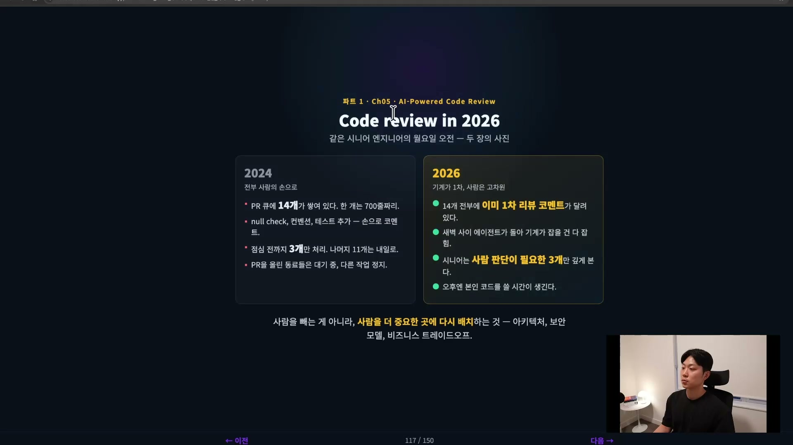
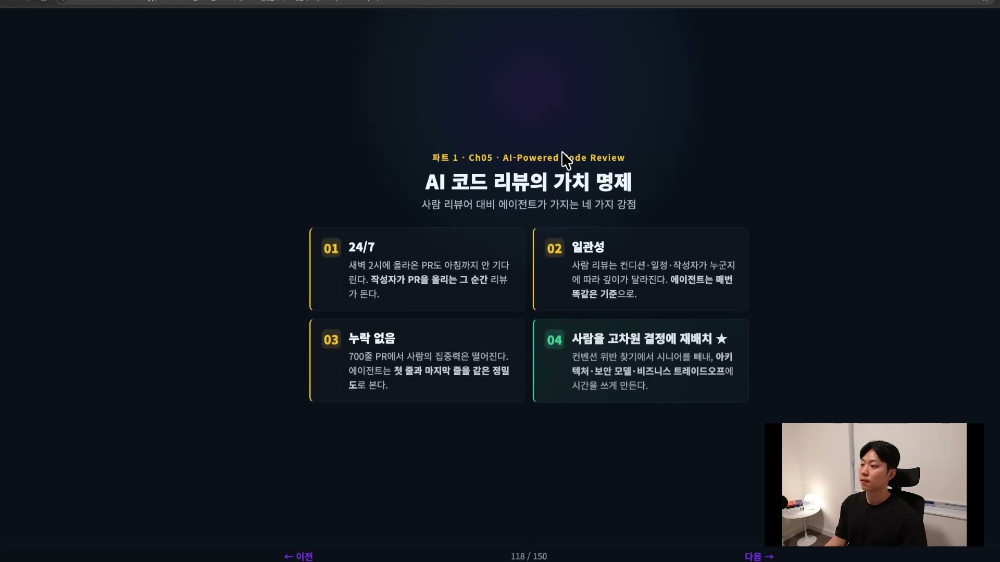
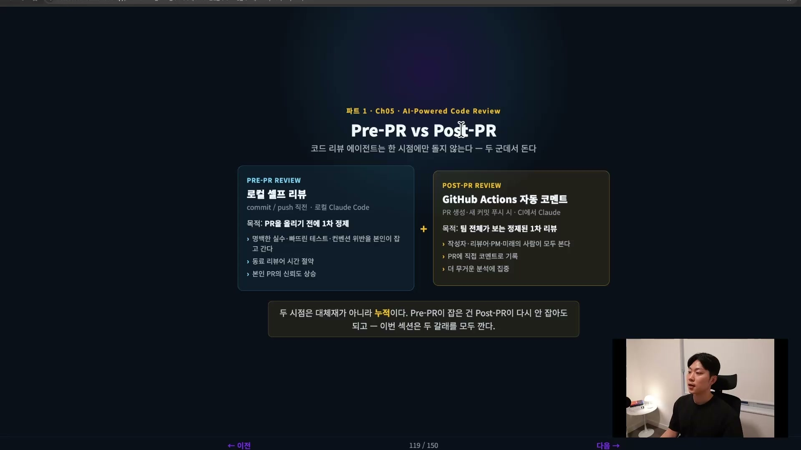
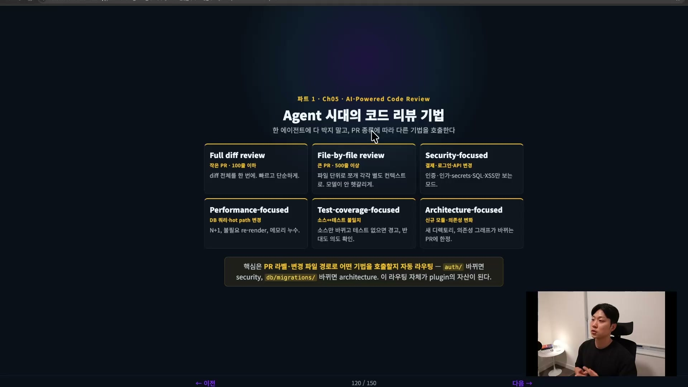
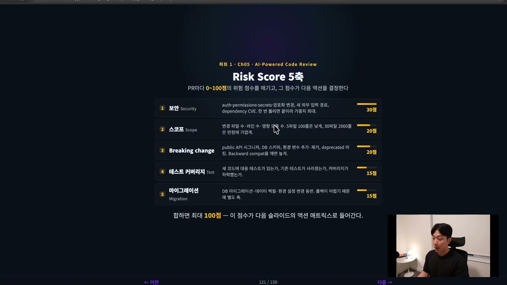
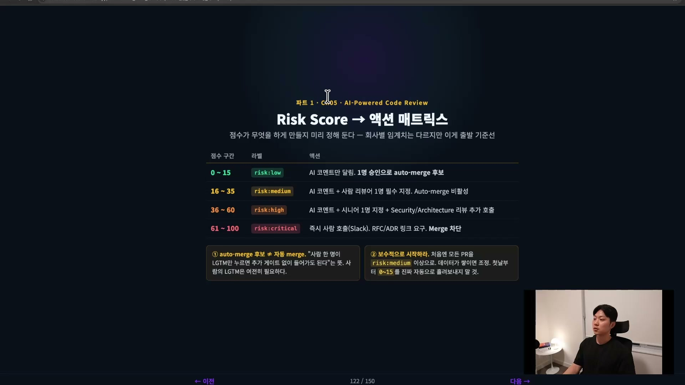
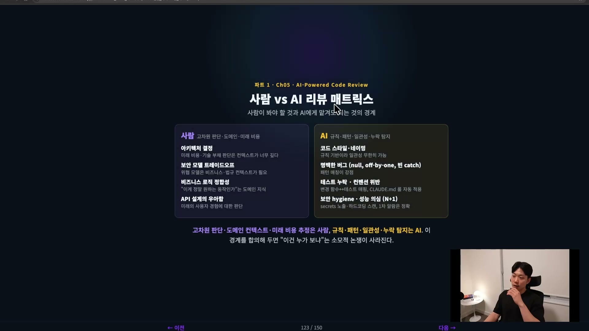
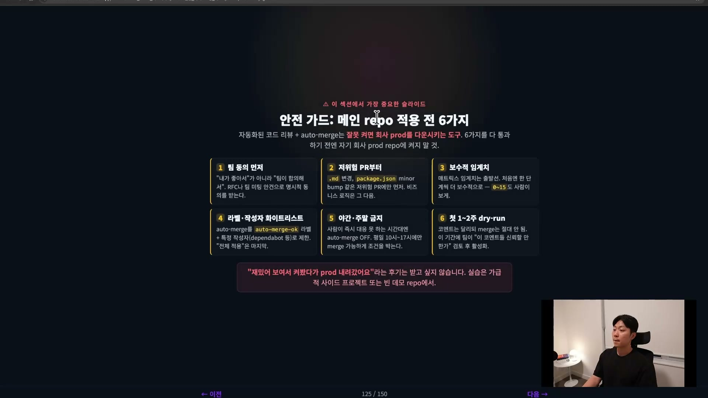
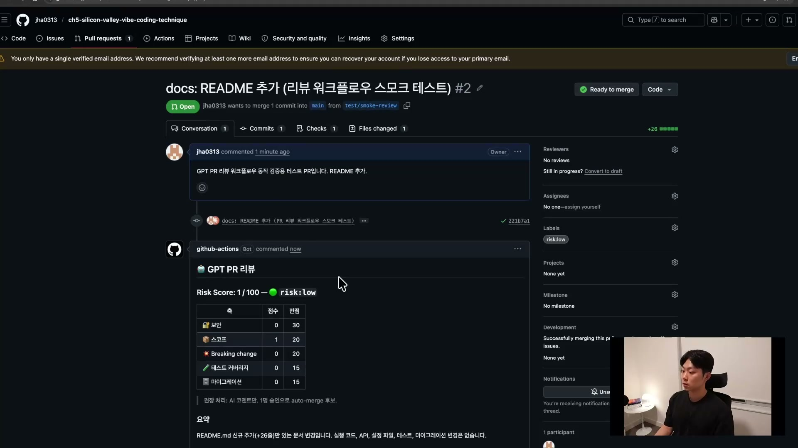

코드 리뷰는 늘 사람의 일이었다. 동료가 올린 PR을 열어, 한 줄씩 읽고, 빠진 테스트와 어긋난 컨벤션을 짚고, 괜찮으면 승인을 누른다. 이 일이 막히면 팀 전체가 막힌다. PR을 올린 사람은 리뷰어가 시간을 낼 때까지 기다리고, 리뷰어는 자기 일과 남의 코드 사이에서 쪼개진다.

2024년의 시니어 엔지니어는 월요일 아침 노트북을 열고 PR 큐에 쌓인 14개를 본다. 그중 하나는 700줄짜리다. null 체크, 컨벤션, 테스트 추가 같은 코멘트를 손으로 달다 보면 점심 전까지 처리한 건 3개. 나머지 11개는 내일로 밀린다. 그동안 PR을 올린 동료들은 대기 상태고, 자기 일은 멈춰 있다.

2026년의 같은 사람은 출근하니 14개 전부에 이미 1차 리뷰 코멘트가 달려 있다. 새벽 사이 에이전트가 돌아 기계가 잡을 수 있는 건 다 잡아놨다. 사람이 깊게 봐야 할 건 판단이 필요한 3개뿐이고, 오후엔 자기 코드를 쓸 시간이 생긴다.

핵심은 사람을 빼는 게 아니라는 점이다. 사람을 더 중요한 곳, 그러니까 아키텍처나 보안 모델, 비즈니스 트레이드오프 같은 결정으로 다시 배치하는 것이다. 그 재배치를 가능하게 만드는 게 자동 코드 리뷰 워크플로우다.

## 왜 사람만으로는 안 되는가

AI 리뷰어가 사람 리뷰어와 견줘 갖는 강점은 네 가지로 갈린다.

**첫째, 24/7로 돈다.** 새벽 2시에 올라온 PR도 다음 날 아침까지 기다리지 않는다. 작성자가 PR을 올리는 그 순간 리뷰가 들어간다.

**둘째, 일관성이다.** 사람 리뷰는 그날의 컨디션, 일정, 심지어 작성자가 누구인지에 따라 깊이가 흔들린다. 에이전트는 매번 같은 기준으로 본다.

셋째, 누락이 없다. 700줄짜리 긴 PR을 사람이 보면 마지막 3분의 1쯤에서 집중력이 떨어진다. 에이전트는 첫 줄과 마지막 줄을 같은 정밀도로 본다. (PR을 길게 만들지 않는 게 먼저지만, 부득이하게 길어지는 경우는 있다.)

넷째가 가장 중요하다. 사람을 고차원 결정에 재배치할 수 있다. 컨벤션 위반을 찾는 데 시니어의 시간을 쓰는 대신, 아키텍처 결정이나 보안 모델, 비즈니스 트레이드오프처럼 어렵고 중요한 일에 그 시간을 쓰게 만든다.

## 두 시점에서 리뷰한다: Pre-PR과 Post-PR

이 워크플로우의 뼈대는 리뷰가 한 시점에만 도는 게 아니라는 데 있다. 두 군데서 돈다. PR을 만들기 전 로컬에서 한 번, PR이 올라간 뒤 GitHub에서 한 번.

**Pre-PR은 로컬 셀프 리뷰다.** 코드를 작성하고 PR을 올리기 전에, 로컬에서 클로드 코드든 코덱스든 에이전트에게 "한번 리뷰해줘"라고 시킨다. 코드 리뷰 스킬은 클로드 코드에도 코덱스에도 이미 들어 있으니 따로 만들 것도 없다. AI를 한 번 거쳐 올린 PR과 아무것도 안 하고 올린 PR은 품질이 다르다. 명백한 실수, 빠뜨린 테스트, 컨벤션 위반 같은 건 PR을 올리기 전에 본인 선에서 걸러야 한다. 그래야 동료 리뷰어의 시간을 아끼고 내 PR의 신뢰도가 올라간다. 이걸 사람의 의지에 맡기지 말고 훅으로 강제하는 게 좋다.

Post-PR은 GitHub에서 도는 자동 리뷰다. PR이 생성되거나 새 커밋이 푸시되면 CI에서 에이전트가 돌면서 PR에 직접 코멘트를 단다. 이게 팀 전체가 보는 정제된 1차 리뷰이고, 앞서 말한 "새벽에 돌아가는 리뷰"가 바로 이것이다. 이런 PR 자동 리뷰를 대신 해주는 SaaS도 늘고 있다. Greptile 같은 서비스가 그 예인데, 1인 개발자용 무료 플랜이 있어 직접 써본 사람들이 편하다고 입을 모은다.

두 시점은 대체재가 아니라 누적이다. Pre-PR에서 잡은 건 Post-PR에서 다시 잡을 필요가 없으니, Post-PR은 더 무거운 분석에 집중할 수 있다. 앞 단계에서 기본적인 걸 다 걸러야 뒷 단계가 자잘한 것에 매달리지 않고 진짜 중요한 걸 잡는다.

## 무엇을 보게 할까: 리뷰 기법과 라우팅

리뷰를 돌릴 때 무엇을 보게 할지는 기법별로 나눠볼 수 있다. 실제로 PR마다 이 분류를 그대로 쓰지는 않지만, 이런 갈래가 있다는 감각은 알아둘 만하다.

- **Full diff review**: PR 전체를 한 번에 빠르고 단순하게 훑는다. 작은 PR에 맞다.
- **File-by-file review**: 파일 단위로 쪼개 서브 에이전트를 돌린다. 큰 PR을 파일별 컨텍스트로 본다.
- **Security-focused**: 인증, 인가, 결제, 로그인, API, secrets 같은 변경에 특화한다.
- **Performance-focused**: 레이턴시, 리그레션, 메모리 누수, N+1 같은 성능 문제를 본다.
- **Test-coverage-focused**: 소스만 바뀌고 테스트가 없는지, 기존 테스트가 사라졌는지를 본다.
- **Architecture-focused**: 신규 모듈, 새 디렉토리, 의존성 그래프가 바뀌는 PR에 돌린다.

여기서 한 단계 더 나아간 게 리뷰 라우팅이다. PR에 라벨을 달아두면, 바뀐 파일 경로에 따라 어떤 기법을 부를지 자동으로 갈라낼 수 있다. `auth/` 디렉토리가 바뀌면 Security-focused 리뷰가 무조건 돌게 하고, `db/migrations/`가 바뀌면 Architecture-focused 리뷰가 돌게 하는 식이다. 라벨링도 에이전트가 한다. 이 라우팅 자체가 팀이 깎아 만드는 자산이 된다.

## 위험을 점수로: Risk Score 루브릭

PR마다 0에서 100 사이의 위험 점수를 매긴다. 이건 절대적인 점수표가 아니라 루브릭이고, 각자 자기 상황에 맞게 고쳐 써야 한다. 아래는 다섯 개 축에 가중치를 어떻게 배분했는지의 한 예다.

가장 무거운 축은 <strong>보안(30점)</strong>이다. auth, permissions, secrets, 암호화 변경, dependency CVE처럼 한 번 뚫리면 끝나는 영역이라 가중치를 최대로 잡는다. 다음은 스코프(20점)인데, 변경 파일 수와 라인 수가 클수록 점수가 높아지게 해서 작은 PR을 선호하도록 유도한다. Breaking change(20점)는 public API 시그니처, DB 스키마, 환경 변수의 추가나 제거처럼 하위 호환을 깨는 변경을 본다. 테스트 커버리지(15점)는 새 코드에 대응 테스트가 있는지, 기존 테스트가 사라졌는지를 본다. 마이그레이션(15점)은 롤백이 어려워 에러가 잦은 영역이라 별도 축으로 뒀다.

이 다섯을 합치면 최대 100점이다. 점수가 90점이면 위험도가 90이라는 뜻이고, 이 diff는 무조건 사람이 봐야 한다는 신호다. 반대로 10점이면 위험이 거의 없으니, 그 순간에는 사람이 검토할 필요가 없다고 볼 수 있다. 단 이건 리스크 스코어링이 정말 잘 되어 있다는 전제 위에서다. 과거 서비스 장애 패턴이 점수표에 잘 반영돼 있어야 한다.

## 점수가 행동을 결정한다: 액션 매트릭스

점수를 매기는 이유는 그 점수가 다음 행동을 미리 정해두기 때문이다.

리스크가 낮으면(risk:low) AI 코멘트만 달고, 사람 한 명 승인으로 auto-merge 후보가 된다. 미디움(risk:medium)이면 AI 코멘트에 더해 사람 리뷰어 한 명을 필수로 지정하고 auto-merge는 비활성한다. 하이(risk:high)면 시니어를 지정하고 Security나 Architecture 리뷰를 추가로 부른다. 크리티컬(risk:critical)이면 즉시 사람을 부르고 Merge를 차단한다.

여기서 오해하기 쉬운 두 가지가 있다. 하나는 "auto-merge 후보"가 자동 merge라는 뜻이 아니라는 것이다. 사람 한 명이 승인만 누르면 추가 게이트 없이 바로 들어갈 수 있다는 뜻이고, 사람의 승인 자체는 여전히 필요하다. 다른 하나는 임계치를 보수적으로 시작해야 한다는 것이다. 잘못 켠 auto-merge는 프로덕션을 내리기 때문에, 처음엔 모든 PR을 risk:medium 이상으로 분류해 사람이 반드시 보게 하다가, 데이터가 쌓이면 그때 임계치를 조정하는 게 안전하다.

리뷰가 병목이 되면 안 된다는 게 이 모든 설계의 동기다. AI가 만들어내는 PR 개수는 너무 많아서, 결국 리스크 스코어 기반 리뷰가 merge까지 갈 수 있는 정도의 신뢰도로 가야 한다는 게 방향이다. 개인 프로젝트라면 30점 이하를 그냥 merge해버리는 식의 과감한 운영도 가능하다. 다만 그건 브레이킹 체인지가 섞여 있을 수 있다는 트레이드오프를 안고 가는 선택이고, 사고가 나면 그때마다 점수표와 하네스를 더 좋게 고쳐 나간다.

## 사람과 AI의 경계

그래서 결국 사람이 봐야 할 것과 AI에게 맡겨도 되는 것의 경계가 어디인지가 남는다.

사람이 봐야 할 것은 고차원 판단이 필요하고 도메인 컨텍스트가 깊은 영역이다. 아키텍처 결정, 보안 모델의 트레이드오프, "이게 정말 우리가 원하는 동작인가"라는 비즈니스 로직 정합성, 미래의 사용자 경험을 가늠하는 API 설계. 이런 건 미래 비용에 대한 추정이라 컨텍스트가 너무 깊어 기계에 넘기기 어렵다.

AI가 봐도 되는 것은 규칙과 패턴, 일관성, 누락 탐지다. 코드 스타일과 네이밍은 규칙 기반이라 일관성을 무한히 유지할 수 있고, null이나 off-by-one, 빈 catch 같은 명백한 버그는 패턴 매칭이 강점인 영역이다. 변경된 함수와 테스트의 대응 관계, secrets 노출이나 하드코딩 스캔 같은 1차 알람도 정확하다. 사람은 이런 데 시간을 쓸 여유가 없다. 이 경계를 팀 안에서 합의해 두면 "이건 누가 보냐"는 소모적 논쟁이 사라진다.

도구 쪽에서는 클로드 코드의 `/code-review` 슬래시 커맨드가 작은 PR에는 충분하다. 더 디테일하게 보는 ultrareview도 있는데, 5불쯤 더 내고 몇 분에 걸쳐 훨씬 꼼꼼하게 봐주는 쪽이다. 몇 번은 공짜로 쓸 수 있어 아껴두는 사람도 있다.

그리고 크로스 리뷰가 효과적이다. 클로드로 작업하고 같은 클로드에게 리뷰를 시키면 확증 편향이 생겨 잘 못 잡는다. 새 세션을 열어도 같은 모델이면 놓치는 게 비슷하다. 코덱스의 GPT 모델로 클로드(오퍼스 모델)가 한 작업을 리뷰하면 두 모델이 서로를 보완한다. 그래서 코덱스로 코딩한 다음 클로드에게 리뷰를 시키고, 다시 코덱스로 고친다. 이렇게 오가는 게 하나의 패턴이다.

## 켜기 전에: 안전 가드

지금까지의 내용을 듣고 내일 출근하자마자 회사 메인 repo에 켜겠다고 하면, 그게 가장 위험하다.

자동화된 코드 리뷰와 auto-merge는 잘못 켜면 프로덕션을 내리는 도구다. 적용 전에 통과할 여섯 가지는 이렇다.

- 팀 동의 먼저. "내가 좋아서"가 아니라 "팀이 합의해서"다. RFC나 팀 미팅 안건으로 명시적 동의를 받는다.
- 저위험 PR부터. `.md` 변경, `package.json` minor bump처럼 프로덕션 코드에 영향이 없는 PR에만 먼저 도입한다. 비즈니스 로직은 그 다음이다.
- 보수적 임계치. 매트릭스 임계치는 출발선일 뿐이다. 처음엔 한 단계씩 더 보수적으로, 0\~15 구간도 사람이 보게 한다.
- 라벨과 작성자 화이트리스트. auto-merge를 특정 라벨과 특정 작성자(예: dependabot)로 제한한다. "전체 적용"은 마지막이다.
- 야간 · 주말 금지. 사람이 즉시 대응 못 하는 시간대엔 auto-merge를 끈다. 평일 업무 시간에만 merge되도록 조건을 박는다.
- **첫 1\~2주는 dry-run.** merge는 절대 하지 않고 코멘트만 달게 한다. 이 기간에 팀이 "이 코멘트들을 신뢰할 만한가"를 검토한 뒤 활성화한다.

"재밌어 보여서 켰다가 prod 내려갔어요"라는 후기를 만들지 않으려면, 실습은 사이드 프로젝트나 빈 데모 repo에서 하는 게 맞다.

## 실제로 도는 모습

이 모든 부품이 맞물리면 PR 하나에서 어떻게 보이는지가 가장 분명한 증거다. README를 추가한 작은 PR을 올리면, GitHub Actions가 자동으로 리뷰 코멘트를 단다.

문서만 추가한 변경이라 다섯 축의 점수가 거의 0에 가깝게 채워지고, 총점은 100점 만점에 1점, 라벨은 risk:low로 붙는다. 코멘트에는 "실행 코드, API, 설정 파일, 테스트, 마이그레이션 변경은 없다"는 요약과 함께 "1명 승인으로 auto-merge 후보"라는 권장 처리가 달린다. 이 워크플로우는 클로드가 아니라 GPT API(GPT-5.5)로 리뷰를 돌리도록 셋업한 것이고, Risk가 Low일 때 auto-merge되게 워크플로우를 한 줄 더 붙이는 건 자연스러운 다음 단계다.

이걸 실제로 도는 시스템으로 세우는 데 필요한 두 개의 부품이 있다. Pre-PR 쪽은 git의 pre-push 훅이다. 클로드 코드 훅과 git 훅은 다른 물건인데, git pre-commit/pre-push 훅이 GitHub과 더 잘 연동되므로 이쪽을 쓴다. PR 생성은 git 라이프사이클 이벤트가 아니라서 pre-commit이 아니라 pre-push 시점에 거는 게 맞고, 리뷰는 `claude -p`로 돌려 문제를 발견하면 push를 중단시킨다. 리뷰하고도 그냥 통과시키면 리뷰할 이유가 없으니, 차단이 곧 리뷰의 의미다. (커밋마다 리뷰하면 토큰 소비와 속도 모두 부담이라, PR 생성 직전인 pre-push가 적절한 빈도다.)

Post-PR 쪽은 GitHub Actions 워크플로우다. PR이 열리거나 업데이트될 때 자동으로 도는 액션을 두고, 리스크 점수를 계산해 단일 요약 코멘트를 단다. 여기서 GPT API 같은 외부 모델을 쓴다면 API 키를 환경 변수로 빼고, 코드에 박지 말고 `gh secret set OPENAI_API_KEY "..."`로 repo 시크릿에 등록한다. 워크플로우 스크립트는 메인 브랜치에 있어야 새 PR이 그 스크립트를 트리거하므로, 스크립트를 추가한 PR을 먼저 메인에 merge한 뒤 테스트 PR을 올려 동작을 확인한다.

LLM이 일관되게 채점하게 하려면, 루브릭의 각 축에 0부터 만점까지의 명시적 점수 구간을 붙이고 총점을 정해 다듬는다. 같은 PR을 매번 비슷한 점수로 평가하게 만드는 게 자동 판단의 신뢰도를 받치는 토대다.

## 정리

자동 코드 리뷰의 핵심은 두 가지다. AI로 무조건 리뷰를 하되, Pre-PR과 Post-PR 두 단계에서 해야 한다는 것. 그리고 위험을 점수로 환산해 그 점수가 행동을 결정하게 하되, 보수적으로 시작해 데이터가 쌓이는 만큼만 자동화를 늘려야 한다는 것.

자동화를 늘리면 따라오는 대가가 있다. 에이전트가 잘못 판단하거나, 권한이 너무 풀려 있거나, 어딘가에서 위험한 명령이 실행될 확률이 함께 올라간다. 이건 피할 수 없는 트레이드오프이고, 그래서 자동화가 늘수록 안전망은 더 정교해져야 한다. 리뷰 에이전트를 자기 팀 스타일대로 얼마나 잘 깎아내느냐, 그리고 그만큼 안전망을 단단히 받치느냐가 다음 과제로 남는다.
