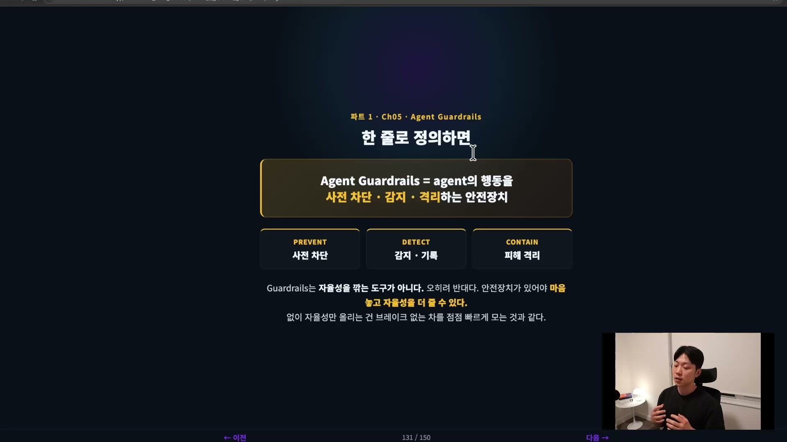
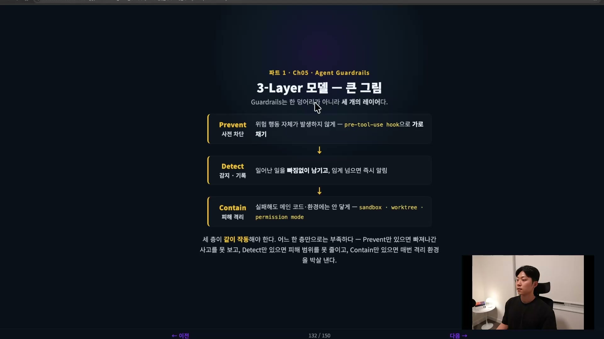
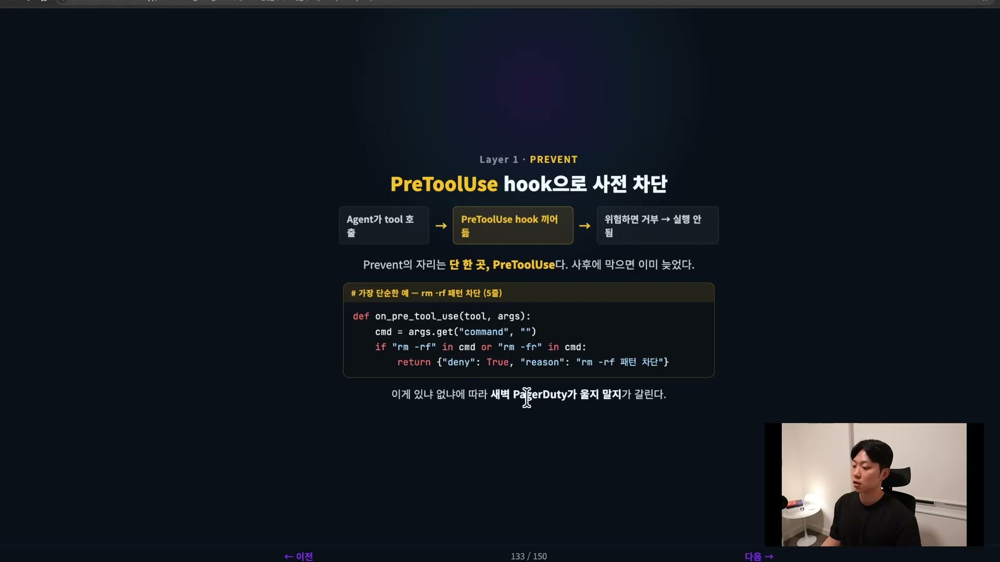
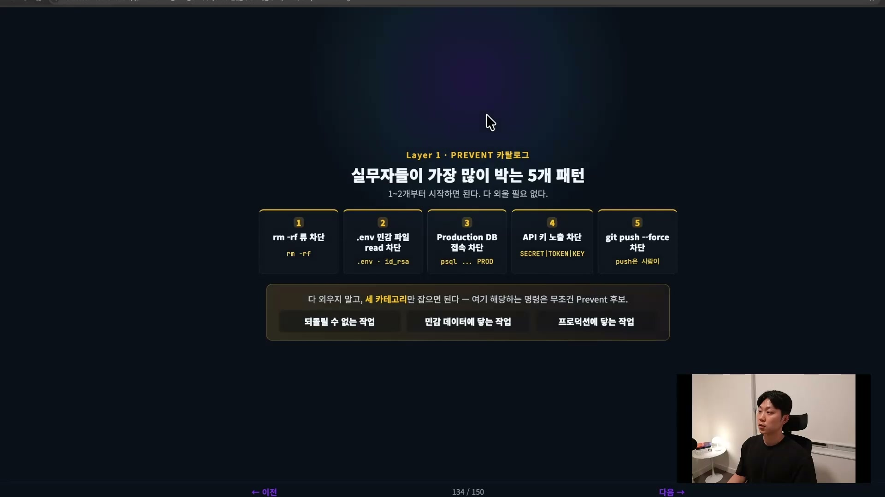
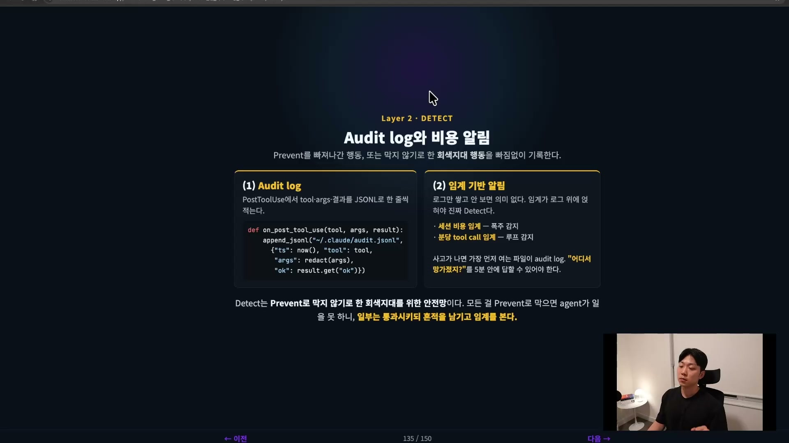
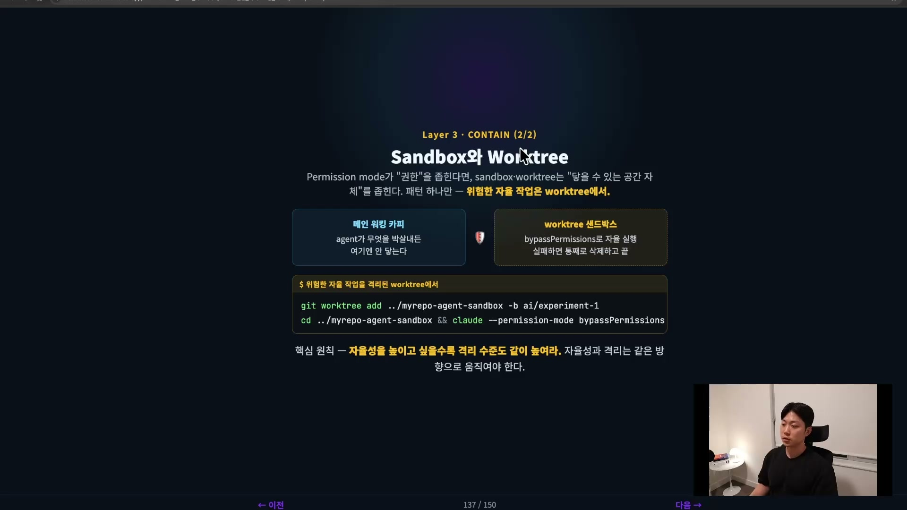
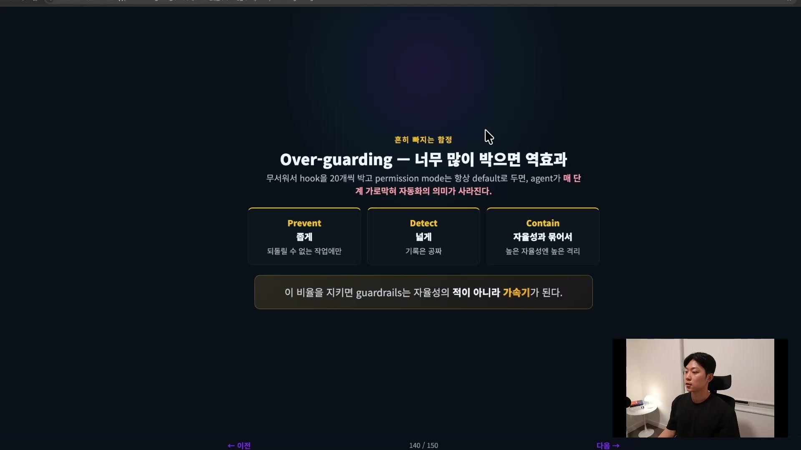

"클로드 코드나 코덱스가 프로젝트를 통째로 날려본 적 있는 사람?" 농담처럼 들리지만 농담이 아니다. 오픈 카톡방에서도, 주변에서도 비일비재하게 일어나는 일이다. AI 코딩 에이전트에게 자율성을 한 칸 줄 때마다 사고 가능성도 같이 한 칸 올라간다. PR 리뷰를 자동화하면 생산성은 늘지만, 그만큼 사람 손을 거치지 않고 일이 진행되니 사고가 날 확률도 늘어난다. 자동화 곡선을 올릴수록 따라 올라가는 이 사고 곡선을, 막을 수 있는 지점에서 막아주는 장치가 가드레일(guardrail)이다.

가드레일은 에이전트의 행동을 사전 차단하고, 감지하고, 격리하는 안전장치다. 여기서 핵심 단어 셋이 나온다. 사전 차단(Prevent), 감지 기록(Detect), 피해 격리(Contain). 이 세 단어가 오늘 내용을 관통하는 3 레이어 모델이다.



먼저 오해 하나를 풀고 가야 한다. 가드레일은 자율성을 깎는 도구가 아니다. 오히려 반대다. 자동화 곡선을 올려온 만큼 사고 가능성도 올라간 상태인데, 바로 그 상태이기 때문에 가드레일이 있어야 마음 놓고 자율성을 더 줄 수 있다. 에이전트의 발목을 묶는 게 아니라, 에이전트가 더 거리낌 없이 날뛸 수 있게 만들어주는 안전장치다. 안전장치 없이 자율성만 올리는 건 브레이크 없이 차를 점점 빠르게 모는 것과 같다.

## 세 개의 레이어가 함께 작동해야 한다

가드레일은 한 덩어리가 아니라 세 개의 층이다. 위험한 행동 자체가 일어나지 않게 차단하는 Prevent, 일어난 일을 빠짐없이 기록하고 임계점을 넘으면 알리는 Detect, 그리고 실패하더라도 메인 코드나 프로덕션에는 닿지 않게 공간을 나눠두는 Contain.



중요한 건 이 셋이 같이 돌아가야 한다는 점이다. 어느 한 층만으로는 부족하다. Prevent만 있고 Detect가 없으면 차단을 빠져나간 사고를 알아챌 수가 없다. 반대로 Detect만 있고 Contain이 없으면 사고가 났다는 건 알아도 피해 범위를 줄일 방법이 없다. 세 층이 서로의 구멍을 메우는 구조다.

## Prevent, 위험한 행동을 일어나기 전에 가로채기

첫 번째 층은 이미 익숙한 PreToolUse 훅이다. 클로드 코드에는 에이전트가 어떤 툴을 호출하기 직전에 훅이 한 번 끼어들 수 있는 지점이 있다. 여기서 "이건 위험하다"고 판단되면 그 툴 호출을 거부할 수 있고, 거부당한 에이전트는 그 뒤 작업을 진행하지 못한다.



핵심은 Prevent의 자리가 이 PreToolUse 단 한 곳이라는 것이다. 툴 콜이 이미 일어난 다음에 막으면 늦다. `rm -rf`가 실행되고 나서 막아봐야 파일은 이미 사라진 뒤다. 그래서 차단은 행동이 일어나기 전 단계에 있어야 한다. 가장 단순한 형태는 몇 줄짜리 훅이면 충분하다.

```python
def on_pre_tool_use(tool, args):
    cmd = args.get("command", "")
    if "rm -rf" in cmd or "rm -fr" in cmd:
        return {"deny": True, "reason": "rm -rf 패턴 차단"}
```

이런 짧은 훅이 있냐 없냐에 따라 새벽에 PagerDuty가 울릴지 말지가 갈린다. 큰일을 막아주는 장치치고는 코드가 허무할 만큼 짧다.

그러면 무엇을 차단할 것인가. 여기서 회사에 쌓인 서비스 장애 문서가 금(金)이 된다. 장애가 났을 때 "이거 고쳐야지" 하고 끝내지 말고, 그 장애 패턴들을 문서로 모아둬야 한다. 1인 개발이라도 마찬가지다. 그 패턴을 AI에게 분석시켜 자주 일어나는 것부터 훅으로 만들면, 한 번 겪은 사고가 다시 일어나지 않게 하는 사후 프리벤션이 된다.

실무자들이 가장 많이 박는 패턴 다섯 개로 시작하면 된다. 무언가를 삭제하는 패턴(`rm -rf`), 환경 변수나 민감 파일을 읽는 패턴(`.env`, `id_rsa`), 프로덕션 데이터베이스 접속, API 키 노출(`SECRET` · `TOKEN` · `KEY`), 그리고 브랜치에 바로 밀어 넣는 `git push --force`.



다 외울 필요는 없다. 카테고리 셋만 기억하면 된다. 되돌릴 수 없는 작업, 민감한 데이터에 닿는 작업, 프로덕션에 닿는 작업. 이 셋 중 하나에 해당하는 명령은 무조건 Prevent 후보다. 프로덕션 데이터베이스는 특히 위험하니, 다른 걸 떠나 접속 자체를 차단하는 게 제일 확실하다.

## Detect, 빠져나간 행동을 기록하고 임계점에서 알린다

차단을 빠져나간 행동이 있을 수 있다. Prevent에 걸리지 않았거나, 일부러 막지 않고 통과시킨 회색지대 행동이다. 막지 못했다고 끝이 아니다. 두 번째 층은 그것을 감지해서 알려주는 일을 한다.



Detect는 두 부분으로 나뉜다. 하나는 audit log다. PostToolUse 훅에서 어떤 툴을, 어떤 인자로, 어떤 결과로 호출했는지를 JSONL로 한 줄씩 적어둔다.

```python
def on_post_tool_use(tool, args, result):
    append_jsonl("~/.claude/audit.jsonl",
        {"ts": now(), "tool": tool,
         "args": redact(args),
         "ok": result.get("ok")})
```

`redact(args)`로 민감 정보를 가린 채 기록한다는 점에 주목할 만하다. 로그 자체가 또 다른 유출 통로가 되면 안 되기 때문이다. 사고가 나면 가장 먼저 여는 파일이 이 audit log다. 세션 로그를 쭉 펼쳐놓고 클로드에게 "루트 코즈 찾아줘"라고 하면, 어느 지점에서 무엇이 잘못됐는지 클로드가 로그를 훑어 짚어낸다. "어디서 망가졌지?"라는 질문에 5분 안에 답할 수 있어야 한다.

다른 하나는 임계 기반 알림이다. 로그만 쌓아두고 들여다보지 않으면 의미가 없다. 임계값이 로그 위에 얹혀야 진짜 Detect가 된다. 세션 비용이 평소의 몇 배로 튀면 폭주를 감지하고, 분당 툴 콜 수가 비정상적으로 많으면 무한 루프를 감지하는 식이다. 이건 클로드 레벨의 알림이지만, 같은 원리를 서비스 레벨에도 적용할 수 있다. 어떤 서비스의 레이턴시가 떨어지거나 가용성이 내려갔을 때 알림을 받아 빠르게 찾아내는 것, 그것도 Detect다.

Detect가 넓게 깔려야 하는 이유가 여기 있다. 모든 걸 Prevent로 막아버리면 에이전트가 아무 일도 못 한다. 그래서 일부는 통과시키되 흔적을 남기고 임계를 지켜본다. Detect는 Prevent로 막지 않기로 한 회색지대를 위한 안전망이다.

## Contain, 사고가 나도 피해 범위를 좁힌다

세 번째 층은 사고가 났을 때 피해가 번지는 범위를 좁히는 일이다. 첫 번째 도구는 클로드 코드의 permission mode다.

| Mode | 동작 | 언제 쓰는가 |
| --- | --- | --- |
| `default` | 위험한 툴마다 사람에게 물어봄 | 평소 작업, 익숙하지 않은 영역 |
| `acceptEdits` | 파일 수정은 자동 승인, 그 외는 확인 | 익숙한 리팩토링 · 테스트 추가 |
| `bypassPermissions` | 거의 다 자동 승인 | 격리된 sandbox · worktree 안에서만 |
| `plan` | 코드 수정 금지, 계획만 | Plan 단계, 리뷰, 탐색 |

여기서 `bypassPermissions`는 정말 위험하다. 말 그대로 모든 권한이 열리기 때문이다. 그래서 격리된 샌드박스나 워크트리 안에서만 켜는 걸 권한다. 회사 환경이라면 더더욱 그렇다. CLAUDE.md에 "이건 하지 마"라고 아무리 잘 박아둬도, CLAUDE.md는 말 그대로 인스트럭션일 뿐이라 강제력이 없다. 진짜로 막으려면 훅으로 막아야 한다. 훅으로 잘 막아둔 회사라면 `bypassPermissions`를 어느 정도 써도 괜찮지만, 그렇지 않은 환경에서 이걸 잘못 쓰다가는 프로덕션 DB를 날릴 수 있다. 메인 repo에서 bypass를 켜는 건 안전벨트 풀고 고속도로를 타는 것과 같다.

permission mode가 에이전트의 "권한"을 좁히는 거라면, sandbox와 worktree는 에이전트가 닿을 수 있는 "공간" 자체를 좁힌다. 패턴은 하나만 기억하면 된다. 위험한 자율 작업은 worktree에서 한다.

```bash
# 위험한 자율 작업을 격리된 worktree에서
git worktree add ../myrepo-agent-sandbox -b ai/experiment-1
cd ../myrepo-agent-sandbox && claude --permission-mode bypassPermissions
```

메인 워킹 카피에는 에이전트의 영역이 없으니, 에이전트가 그 안에서 무엇을 박살내든 메인에는 닿지 않는다. 실패하면 워크트리를 통째로 삭제하고 끝이다. 그래서 핵심 원칙은 이렇게 묶인다. 자율성을 높이고 싶을수록 격리 수준도 같이 높여라. 자율성과 격리는 같은 방향으로 움직여야 한다. 높은 자율성에는 강한 격리를 붙이고, 낮은 자율성은 굳이 격리할 필요가 없다.



## Cost guardrail, 같은 비용이지만 다른 목적

비용을 줄이는 일과 비용으로 사고를 끊는 일은 닮았지만 목적이 다르다. 토큰을 아끼는 절약은 평소에 토큰을 줄여 매달 청구서를 낮추는 연비 최적화이고, 가드레일의 비용 차단은 폭주 상황에 자동으로 멈춰 사고를 끊는 비상 브레이크다. 평소엔 잠자고 있다가 임계를 넘는 순간에만 작동한다.

```python
# 가장 단순한 cost guardrail
if session_cost_usd() > BUDGET_HARD_LIMIT:
    notify_slack("세션 비용 초과 — auto-stop")
    sys.exit(0)
```

`BUDGET_HARD_LIMIT`은 평소 세션 비용의 3\~5배쯤에 둔다. 평소 운영은 방해하지 않으면서, 갑자기 평소의 3배에서 5배로 비용이 튀는 무한 루프나 폭주만 끊는 수준이다. 평소랑은 좀 다른(abnormal) 행동이 보이면 폭주 루프를 끊도록 훅을 걸어두는 것이다. 연비 최적화와 비상 브레이크는 둘 다 필요하다.

## 가드레일이 너무 많으면 역효과

마지막으로 짚을 함정이 있다. 가드레일이 너무 많으면 오히려 역효과다. 무서워서 훅을 20개씩 박고 permission mode는 항상 default로만 두면, 에이전트가 매 단계마다 가로막혀 아무것도 못 하게 된다. 그러면 자동화의 의미가 사라지고, 우리는 에이전트를 믿고 맡길 수가 없게 된다.



그래서 층마다 다른 원칙을 적용한다. Prevent는 좁게, 되돌릴 수 없는 작업에만 건다. Detect는 넓게, 기록은 공짜에 가까우니 일단 다 남긴다. Contain은 자율성과 묶어서, 높은 자율성에는 강한 격리를 붙이고 낮은 자율성에는 격리를 덜어낸다. 이 비율을 지키면 가드레일은 자율성의 적이 아니라 가속기가 된다.

## 정리

오늘의 핵심은 한 문장으로 모인다. 가드레일은 자율성을 깎는 게 아니라, 자율성을 더 줄 수 있게 만드는 안전장치다. PreToolUse 훅으로 되돌릴 수 없는 작업을 좁게 차단하고(Prevent), audit log와 임계 알림으로 넓게 기록하고(Detect), permission mode와 worktree로 자율성에 맞는 환경에 격리한다(Contain).

여기까지가 방어다. 사고가 나도 메인은 안전하고, 폭주하면 자동으로 멈춘다. 그런데 한 가지가 남는다. 사고가 실제로 났을 때 1차 대응은 누가 하는가. 새벽에 PagerDuty가 울렸을 때, 사람이 일어나기 전에 누가 1차 진단을 하고 있어야 한다. 소프트웨어 개발에는 on-call이라는 게 있는데, 에이전트 시대에 그 on-call을 에이전트로 어떻게 설계할 것인가가 다음 이야기다.
