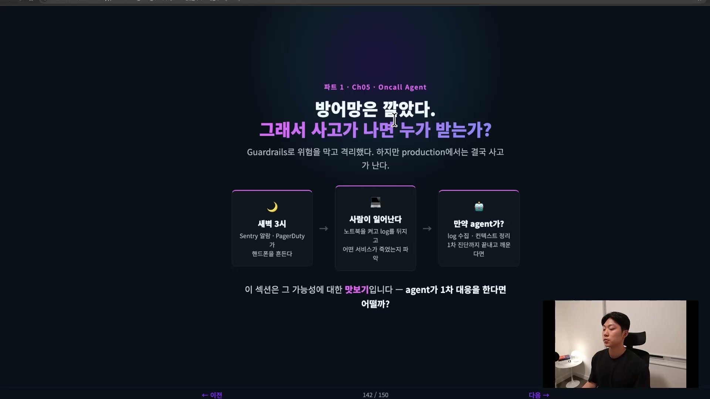
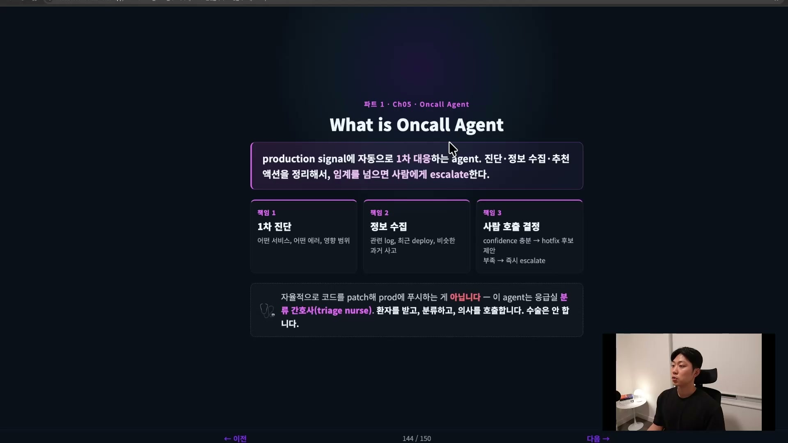
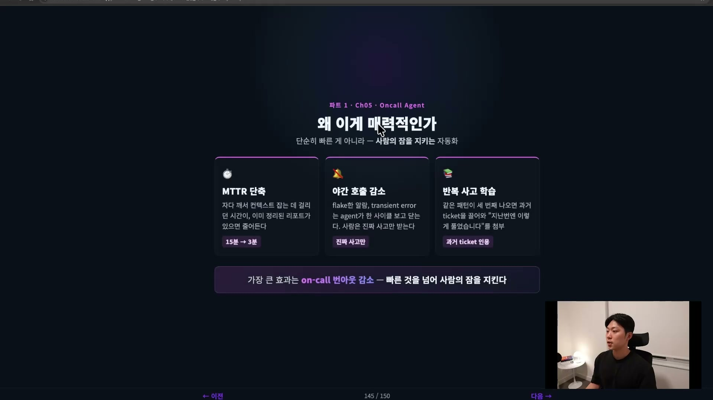
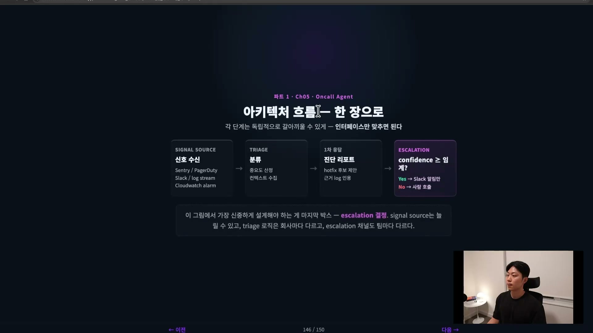
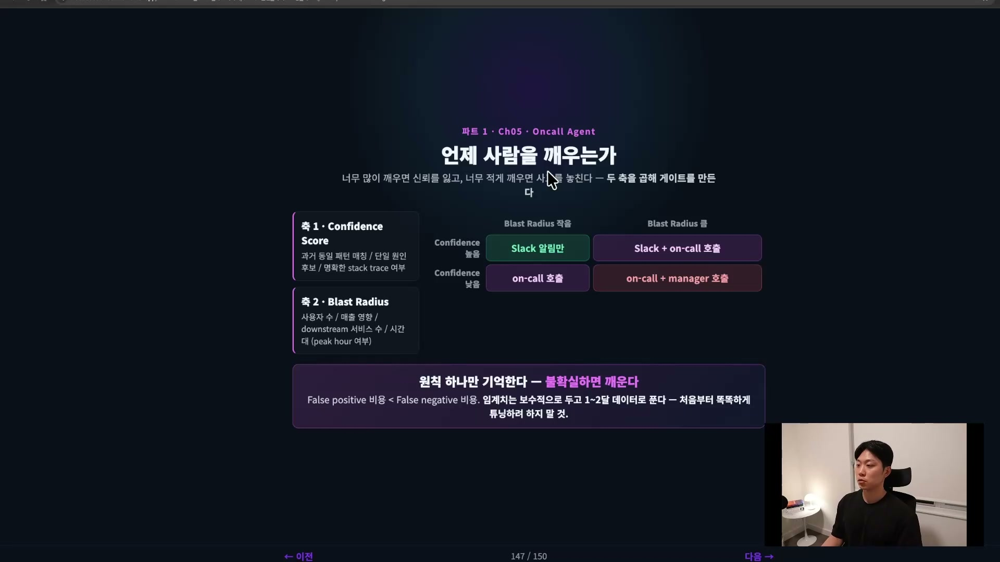
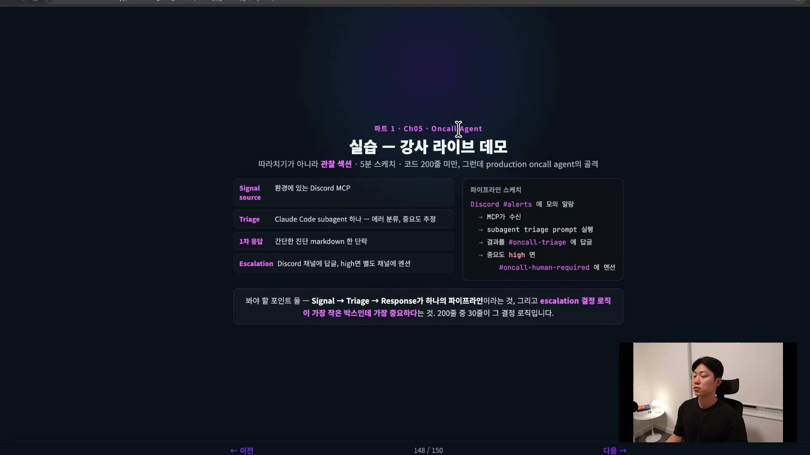

가드레일을 아무리 잘 깔아도 프로덕션에서는 결국 사고가 난다. 위험한 명령을 prevent로 막고, 이상을 detect하고, 위험한 작업을 컨테이너로 격리해도, 막아낸 것은 "막을 수 있는 사고"일 뿐이다. 남는 질문은 하나다. 그래서 사고가 실제로 터지면, 누가 받는가.

새벽 3시에 Sentry 알람이 울리고 PagerDuty가 핸드폰을 흔든다. 그때 일어나서 노트북을 켜고, 로그를 뒤지고, 어떤 서비스에 무슨 이슈가 났는지 파악하는 일은 지금까지 사람의 몫이었다. 온콜(on-call) 에이전트는 바로 이 1차 대응을 사람 대신 받는 에이전트다. 로그를 모으고 컨텍스트를 정리해서 "이건 데이터베이스 커넥션 풀 이슈로 보입니다. 5분 전 배포와 연관이 있어 보입니다"까지 정리해 둔 다음, 그제야 사람을 깨운다.

## 온콜 에이전트는 일반 에이전트와 운영 모델이 다르다

먼저 짚어야 할 것이 있다. 온콜 에이전트는 지금까지 다뤄 온 다른 에이전트, 코드 리뷰어나 리팩터 에이전트, 플래너와는 운영 모델 자체가 다르다.

일반 에이전트는 사람이 호출한다. 사람이 세션을 열고, 프롬프트로 입력을 넣으면, 그 세션이 도는 동안 가동된다. 출력은 코드나 답변이고, 가장 중요한 결정은 "이 문제를 어떻게 풀까"다. 온콜 에이전트는 정반대 지점에서 시작한다. 호출하는 주체가 사람이 아니라 신호(signal)다. Sentry, PagerDuty, Vercel 같은 곳에 연동돼 있다가, 그쪽에서 신호가 오면 깨어난다. 사람이 부를 때만 도는 게 아니라 24시간 7일 대기한다. 온콜이니까 당연히 그렇다. 입력은 자연어 프롬프트가 아니라 웹훅 페이로드, 메트릭, 로그 라인이고, 출력은 진단 리포트와 사람 호출이다.

가장 결정적인 차이는 "가장 중요한 결정"이 무엇이냐에 있다. 일반 에이전트의 KPI가 "얼마나 잘 푸는가"라면, 온콜 에이전트의 KPI는 **언제 손을 떼고 사람을 부르는가**다. 잘 푸는 게 목표가 아니라, 언제 자기 손을 멈추고 사람에게 넘길지를 잘 판단하는 게 목표다.

| 구분 | 일반 에이전트 | 온콜 에이전트 |
| --- | --- | --- |
| 트리거 | 사람이 호출 | 신호가 호출 (Sentry, PagerDuty, 로그) |
| 가동 시간 | 세션 중 | 24/7 대기 |
| 입력 | 자연어 프롬프트 | 웹훅 페이로드, 메트릭, 로그 라인 |
| 출력 | 코드, 답변 | 진단 리포트 + 사람 호출 결정 |
| 가장 중요한 결정 | 어떻게 풀까 | 사람을 깨울까 말까 |

## 책임은 세 가지, 그리고 넘지 않는 선 하나

온콜 에이전트가 하는 일은 세 단계로 나뉜다.

첫째, 1차 진단이다. 어떤 서비스에서 어떤 에러가 났는지, 그 영향 범위는 어디까지인지 본다. 둘째, 정보 수집이다. 관련 로그를 모으고, 최근 배포 히스토리를 훑고, 비슷한 과거 사고가 있었는지까지 끌어모은다. 셋째, 가장 중요한 사람 호출 결정이다. 컨피던스(confidence) 레벨을 매겨서, 충분하면 핫픽스 후보를 제안하고, 부족하면 즉시 에스컬레이트해서 사람을 깨운다.

여기서 넘지 않는 선이 분명하다. 에이전트가 자율적으로 코드를 패치해서 프로덕션에 푸시하는 일은 절대 없다. 그건 진짜로 위험하다. 이 경계를 한 번에 잡아 주는 비유가 응급실 분류 간호사(triage nurse)다. 환자를 받고, 상태를 분류하고, 그제야 의사를 호출한다. 수술은 절대 하지 않는다. 온콜 에이전트도 똑같다. 받고, 분류하고, 사람을 부르는 데까지가 책임이고, 직접 손을 대 고치는 건 사람의 영역으로 남겨 둔다.

팀에 처음 합류한 신입이 온콜을 서는 상황을 떠올리면 이해가 더 쉽다. 아무것도 모르니, 일단 상황을 파악해서 정리한 뒤 시니어 엔지니어에게 에스컬레이트한다. 온콜 에이전트의 동작이 딱 그렇다.

## 왜 매력적인가, 빠른 게 아니라 잠을 지킨다

이 구조가 매력적인 이유는 세 가지다.

첫째는 MTTR(Mean Time To Resolve) 단축이다. 회사마다 부르는 이름은 조금씩 다르고, Time To Detect나 Time To Mitigate로 쪼개 표현하기도 한다. 핵심은 시간을 줄인다는 것이다. 사람이 자다 깨서 컨텍스트를 잡는 데 15분 걸리던 일이, 이미 정리된 리포트가 손에 있으면 2\~3분으로 줄어든다.

둘째는 야간 호출 빈도 감소다. 이게 특히 중요하다. 온콜이 빡센 팀은 새벽 2시에 일어나고 3시에 또 일어나고 4시에 다시 일어나는 일이 흔하다. 그 원인의 상당수가 플래키(flaky)한 알람과 일시적 에러(transient error)다. 플래키 알람은 튜닝으로 줄일 수는 있어도 완전히 없앨 수는 없다. 문제는, 사람이 새벽에 일어나서 확인하고 "아 괜히 일어났네" 하고 다시 자야 한다는 데 있다. 에이전트는 한 사이클을 지켜보고 기다렸다가 "아 이건 일시적인 거구나" 하고 판단해 넘기므로, 사람은 진짜 이슈만 받게 된다.

셋째는 반복 사고 학습이다. 같은 패턴이 세 번째 나오면 과거 티켓을 끌어와서 "지난번엔 이렇게 풀었습니다"를 첨부한다. 사람도 사고가 나면 "이거 지난번에 있었던 것 같은데" 하고 패턴부터 찾는데, 그 작업을 대신 해 주는 셈이다.

이 셋을 관통하는 가장 큰 효과는 온콜의 번아웃 감소다. 그래서 온콜 에이전트는 단순히 빠른 자동화가 아니라, 사람의 효율과 사람의 잠을 지키는 자동화다.

## 아키텍처는 갈아 끼울 수 있는 파이프라인이다

흐름을 한 장으로 펼치면 네 단계다. 신호 수신, 분류(triage), 1차 응답, 그리고 에스컬레이션이다.

신호 수신은 Sentry, PagerDuty, Slack, CloudWatch 알람 같은 소스에서 신호를 받는 단계다. 분류는 중요도를 산정하고 컨텍스트를 모은다. 1차 응답은 리포트를 작성하고 핫픽스 후보를 제안한다. "이런 루트 코즈가 의심돼서 이런 핫픽스 후보가 있을 것 같습니다, 근거는 이런 것들입니다" 하는 식이다. 마지막으로 컨피던스에 따라 Slack 알림만 줄지, 사람을 호출할지 정한다.

설계의 핵심 원칙은 각 단계를 독립적으로 갈아 끼울 수 있게 만드는 것이다. 팀마다 신호 소스가 다르고, 분류 로직도 회사마다 다르다. 그래서 단계 사이의 인터페이스만 맞추면 내부 구현은 자유롭게 바꿀 수 있도록 둔다. 그리고 이 그림에서 가장 신중하게 설계해야 하는 박스는 마지막, 에스컬레이션이다.

## 에스컬레이션 게이트, 컨피던스 × 블래스트 반경

사람을 언제 개입시킬 것인가. 이건 자동화에서 가장 어려운 결정이라고 봐도 무방하다. 너무 많이 깨우면 신뢰를 잃고, 너무 적게 깨우면 사고를 놓친다.

그래서 게이트를 두 축의 곱으로 만든다. 하나는 컨피던스 스코어(Confidence Score), 다른 하나는 블래스트 반경(Blast Radius)이다.

컨피던스 스코어는 과거의 동일 패턴과 매칭되는지, 단일 원인 후보로 좁혀지는지, 명확한 스택 트레이스가 있는지 같은 것들로 측정한다. 블래스트 반경은 영향 범위다. 사용자 수, 매출 영향, 다운스트림 서비스 수, 시간대(피크 타임 여부)로 잰다. 매출이 사실 가장 중요한데, 인프라팀에서는 매출만 보기도 한다. 다운스트림 서비스 수도 결국 매출에 영향을 주기 때문에 중요하다.

이 두 축을 곱하면 네 칸이 나온다.

| | 블래스트 반경 작음 | 블래스트 반경 큼 |
| --- | --- | --- |
| **컨피던스 높음** | Slack 알림만 | Slack 알림 + 온콜 호출 |
| **컨피던스 낮음** | 온콜 호출 | 온콜 + 시니어 호출 |

컨피던스가 높은데 블래스트 반경이 작으면, 굳이 사람을 깨울 필요가 없으니 알림만 준다. 블래스트 반경이 크면 무조건 호출한다. 그런데 컨피던스가 낮으면 블래스트 반경이 작아도 호출한다. 확신이 없기 때문이다. 컨피던스가 낮고 블래스트 반경까지 크면 온콜만으로 부족할 수 있어, 온콜에 시니어 한 명을 더해 둘 다 부르는 것도 나쁘지 않다.

원칙은 하나만 기억하면 된다. **불확실하면 깨운다.** 컨피던스가 낮으면 깨운다. 이유는 False Positive의 비용이 False Negative의 비용보다 낮기 때문이다. 자다 깬 짜증보다 사고를 놓치는 비용이 훨씬 크다. 그래서 헷갈리면 항상 깨우는 쪽을 택한다. 임계치는 처음엔 보수적으로 두고, 한두 달 운영하면서 데이터로 풀어 나가는 게 좋다. 처음부터 완벽하게 튜닝할 수는 없다.

## 가장 가벼운 프로토타입의 골격

프로덕션급 구현은 다음 챕터의 몫이고, 여기서는 사고 모델만 잡고 간다. 가장 가벼운 구성을 그려 보면 이렇다.

신호 소스로는 디스코드 MCP를 연결한다. 분류는 클로드 코드 서브에이전트 하나를 띄워서, 받은 메시지로 에러를 분류하고 중요도를 측정하게 한다. 1차 응답으로는 간단한 진단 마크다운 한 단락을 만들어 둔다. 에스컬레이션은 디스코드 채널에 답글을 달고, 중요도가 높으면 별도 채널에 멘션을 거는 식으로 처리한다.

전체를 이어 보면, 디스코드에서 알람이 오면 MCP가 triage 프롬프트를 실행하고, 그 결과를 댓글로 달고, 그렇게 온콜을 깨운다. 이게 프로덕션 온콜 에이전트의 간단한 골격이다. 나머지는 여기에 살을 붙이는 작업일 뿐이다.
