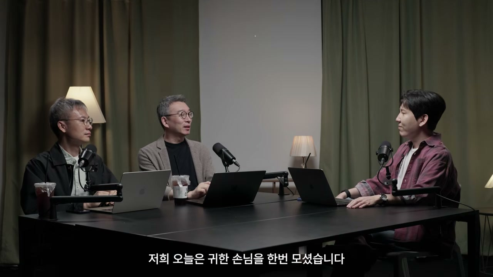
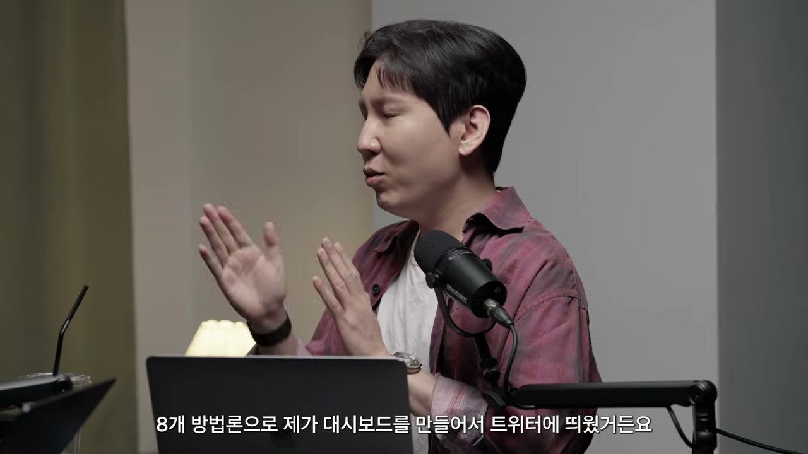
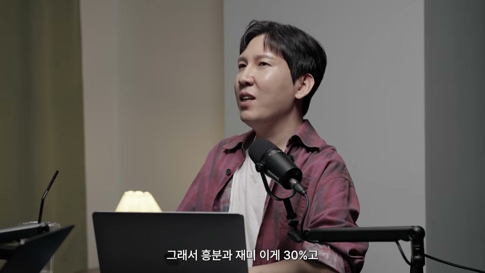
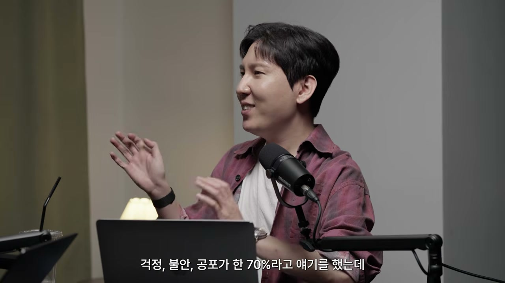
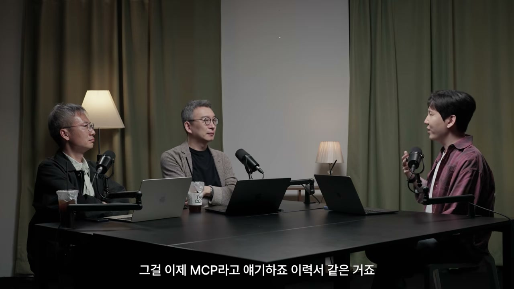
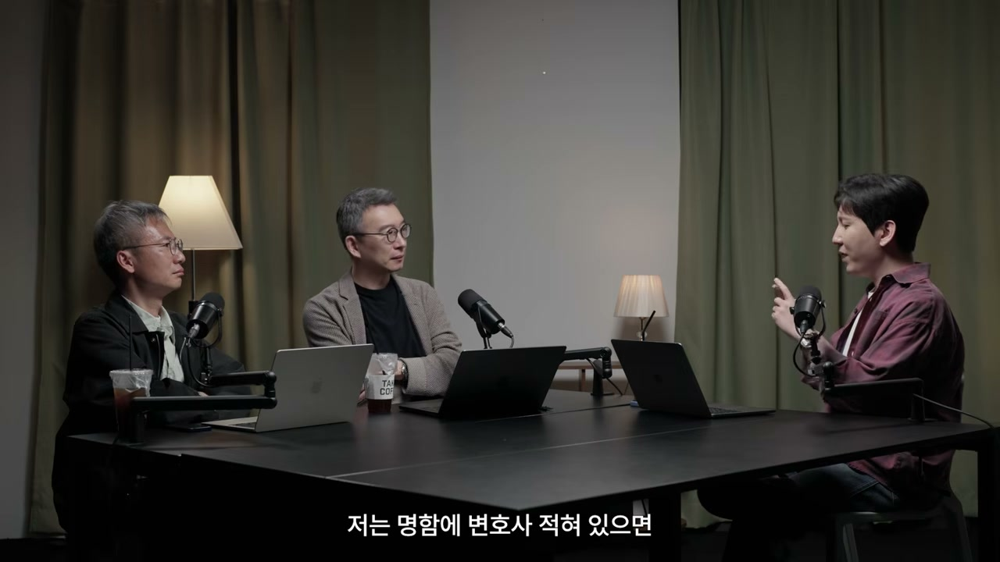
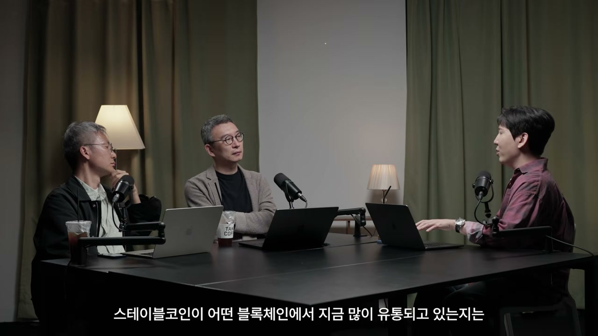
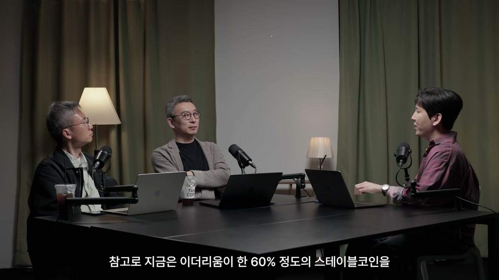
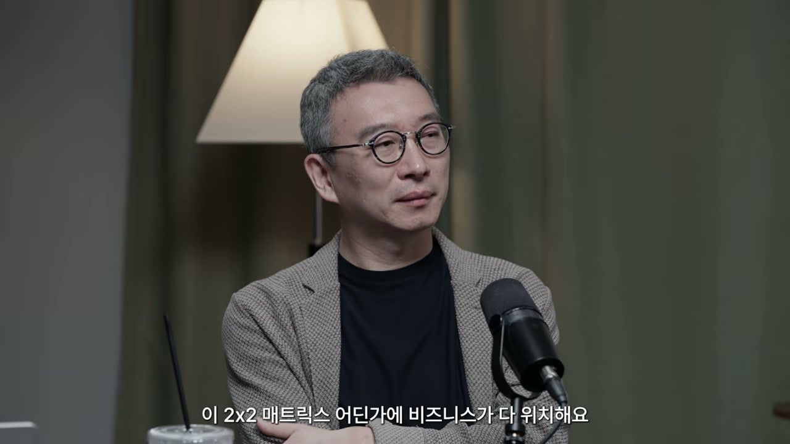

해시드 김서준 대표가 노정석 대표의 방송에 나와 두 시간 가까이 이야기를 풀었다. 주제는 거창하게 잡으면 "AI가 바꾸는 세계"지만, 정작 대화를 끌고 가는 건 훨씬 작고 구체적인 장면들이다. 화장실에 다녀온 사이에 만들어진 대시보드, 비행기 좌석에서 네 시간 만에 만든 관광 앱, 200억에 팔린 포켓몬 카드 한 장. 이 장면들을 따라가다 보면 그가 반복해서 돌아오는 한 단어가 있다. 의도.

## "딸깍"이 일어난 순간

김 대표는 컴퓨터공학을 전공했고 개발자로 일한 적도 있다. 그런데 "실질적으로 터미널에 앉아서 코딩을 한 지는 10년보다도 더 긴 시간이 지났"다. 바이브 코딩이라는 말이 나온 작년 2월부터 관심은 있었지만, 두세 달에 한 번씩 시도하다가 그냥 손을 놨다. "내가 이거를 시간 들여서 다시 공부하는 건 ROI가 안 나오겠다." 그의 결론은 "아직은 타이밍이 아니다"였다.

판단을 뒤집은 건 기술 뉴스가 아니라 사람이었다. 10년 만에 다시 만난 비개발자 출신의 이재용 대표. 카이스트를 나왔지만 줄곧 기획과 마케팅만 하던 사람이 한국에서 사라지더니, 발리·말레이시아·싱가포르를 떠돌며 2년간 개발을 독학했다. 그가 만든 건 GEO(생성형 엔진 최적화) 서비스였다. 사람들이 구글 검색을 떠나 AI에게 묻기 시작하면 — "AI한테 물어보면 많아야 5개 추천하는데, 거기에 못 들면 이제 아예 선택의 여지가 없어져 버리는" 세계가 온다. SEO를 둘러싼 거대한 광고 시장이 통째로 이동하는 길목이었다.

흥미로운 건 그가 그걸 **어떻게** 만들었는가다. LLM이 검색 순위를 어떻게 매기는지는 공개되지 않는다. 그래서 이재용 대표는 역프롬프팅을 했다. 챗GPT에게 답을 받은 뒤 "너 왜 이걸 찾았어? 뭘로 검색했어?"라고 캐물어 자기가 돌린 툴콜을 다 토해내게 만들고, LLM별 웹서치 선호도를 리버스 엔지니어링했다. 김 대표는 이걸 헨젤과 그레텔에 비유한다. "LLM이 쫓아올 만한 길목에다가 그 쿠키를 계속 깔아놓는 거죠."

천재 엔지니어가 할 법한 일을, 2년 전까지 개발을 하나도 모르던 사람이, 혼자서, 돈까지 벌면서 하고 있었다. 김 대표가 받은 충격은 두 갈래였다. 비개발자도 이런 걸 푼다는 것, 그리고 회사를 만들었는데 백엔드·프론트·iOS·안드로이드·디자이너·마케터를 전부 혼자 한다는 것. 엔젤투자부터 VC까지 수많은 창업을 봐온 그에게 이건 공식의 붕괴였다. "아, 큰일 났다. 이제 VC 망했구나."

## 화장실에 다녀온 사이에

그러다 제미나이 3가 나왔고, 일주일 뒤 오퍼스 4.5가 나왔다. 작년 11월 초. 그는 둘 다 출시 첫날부터 써봤다. 본인의 표현으로 "바이브 코딩 역사는 11월 중순부터" 시작됐으니, 이 인터뷰 시점 기준으로 고작 6개월이다.

그가 처음 푼 문제는 오랫동안 미뤄두던 것이었다. 이더리움의 가치를 평가하는 사이트. 그는 블록체인 업계에서 일하며 "모든 토큰의 가치는 없다, 사람들이 사면 오르고 팔면 떨어지는 거다"라는 싸잡힘에 늘 스트레스를 받았다. 내재 가치 없는 토큰이 많은 건 사실이지만, 이더리움처럼 분명한 비즈니스 모델을 가진 것까지 한데 묶이는 건 억울했다. 그래서 기준점을 만들고 싶었다.

방식은 이랬다. 이더리움 생태계에서 추적할 만한 지표 30개를 오퍼스 웹 인터페이스에 쭉 나열하고 "데이터를 찾고 그래프로 한번 그려봐"라고 시킨 뒤, 화장실에 갔다. 돌아오니 HTML 파일이 하나 만들어져 있었다. 켜보니 30개 중 20개가 멀쩡하게 실시간 데이터로 돌아가고 있었다. 어디서 가져오라고 시키지도 않았는데 LLM이 알아서 바이낸스, 코인마켓캡을 뒤져 라이브 데이터를 붙여놓은 것이다. "이 정도까지 한다고?"

그는 내심 AI가 "이걸 만들려면 이런 정보가 더 필요합니다"라며 자기에게 숙제를 시킬 거라 예상했다. 그런데 한 번에 나왔다. 충격을 받은 그는 그날 네 시간을 연달아 달려 — 프로 요금제로 시작했다가 한 시간 만에 맥스로 바꿔가며 — 끊긴 API를 다 연결하고 자본시장의 밸류에이션 공식들을 넣어, 8개 방법론의 대시보드를 만들어 트위터에 올렸다.

하루 이틀 만에 그 글은 크립토 업계 트위터 파워랭킹 플랫폼 카이토에서 전 세계 1등까지 올라갔다. 몇 년 전부터 만들고 싶었지만 "컨트(quant) 같은 사람도 있어야 하고, 개발자도 두세 명, 적게 잡아도 두어 달"이 걸릴 일이라 미뤄두던 프로젝트였다. 그게 네 시간 만에 됐다. "그냥 그때 딸깍을 느낀 거죠. 딸깍으로 다 만들 수 있는 세상이 되어버렸구나."

그다음은 아부다비행 비행기였다. 좌석 스크린의 "아부다비에서 즐길 101가지" 사이트가 엉망인 걸 보고, 그는 비행 중에 직접 더 나은 걸 만들었다. 101개 리스트를 찾고, 구글 맵스를 스크래핑하고(어떤 베뉴는 리뷰가 10만 개였다), LLM으로 리뷰를 자연어 분석해 "가족용·연인용·사진 찍기 좋은 곳·릴렉스할 곳"으로 분류하고, 지도에 동선까지 얹었다. 본인 평으로 "트립어드바이저보다 더 좋은 UX"를 비행기 안에서. 빌 게이츠의 책 『생각의 속도』를 읽고 컴퓨터공학과에 갔다는 그는 말한다. "그건 그냥 생각하고 끝이었는데, 생각하는 속도로 이제 실행이 진짜 되는구나."

## "VC가 망했다"는 말의 진짜 의미

"VC가 망했다"는 도발적인 문장을 노정석 대표가 붙잡고 늘어진다. 가치 창조에는 시간·자원·소수의 인재가 필요했고, 그걸 먼저 알아보고 자본으로 굳혀주는 게 VC가 누리던 1위 자리였는데, 그게 무의미해졌다는 거냐고.

김 대표의 설명은 한 발 더 구체적이다. 소프트웨어 스타트업이 펀딩을 받으러 오는 가장 큰 이유는 개발자 월급이다. "구글의 재무제표를 까봐도 전체 비용의 절반 이상이 개발자 연봉"이고, 스타트업은 보통 인건비가 비용의 3분의 2다. 그런데 바이브 코딩하는 한 명이 그 초기 단계를 다 건너뛰고 돈까지 벌기 시작하면 — VC를 찾아올 이유가 사라진다. "확실하게 새로운 창업자 종(種)이 생겼다."

여기서 역설이 생긴다. 이런 사람들에게야말로 투자하고 싶은데, 정작 이들은 돈이 필요 없다. "이런 사람들이 우리 돈을 받게 만들려면 어떻게 해야 될까." 그래서 그는 싱가포르의 심사역을 호출해 이틀간 브레인스토밍을 했고, 해시드(나이트로)가 줄 수 있는 세 가지 가치를 정리했다.

**첫째, 멘토십.** 단 그냥 멘토십으로는 부족하다. 이들은 에이전트 기반 빌딩에 미쳐 있는 사람들이라, 같은 언어로 대화하며 멘토링할 수 있어야 한다. 그래서 해시드는 심사역 포함 전 직원에게 바이브 코딩을 의무화했다.

**둘째, 신뢰의 숏컷.** 그는 "눈에 보이는 건 다 오픈소스다"라는 말을 자주 쓴다. 프론트엔드 베끼는 스킬이 등장해 화려한 웹사이트를 5~10분이면 거의 똑같이 만드는 시대다. 웬만한 제품이 딸깍으로 복제된다면, B2B 비즈니스의 본질은 "누가 그걸 연결해주냐"로 옮겨간다. 그가 만든 아부다비 관광 앱이 만약 진짜 스타트업이었다면, 에티하드 회장에게 연결해줄 수 있느냐 없느냐는 전혀 다른 얘기다. 웹3 시절 쌓은 글로벌 네트워크가 여기서 무기가 된다.

**셋째, 피어 그룹.** 그가 가장 중요하다고 말한 부분이다. 명문대에서 배우는 것의 상당수는 선생이 아니라 또래에게서 온다. 그런데 에이전틱 개발에 빠진 사람들은 "다른 사람들과 대화를 못하는 병에 걸"린다. 트위터를 한 번 새로고침할 때마다 무서운 게 떠 있고, "내가 지금 만들던 게 내일 과연 의미가 있을까"라는 초조함에 시달린다. 이 들뜸과 불안을 공유할 최고 수준의 빌더들을 모아놓는 것 자체가 가치라는 것이다. 그 자신부터 "이런 거 얘기하고 싶은 사람이 작년 말만 해도 그렇게 많지 않았"다.

연초에 그가 한 인터뷰 제목으로 나간 문장이 이 분위기를 압축한다. "흥분과 재미가 30%, 걱정·불안·공포가 70%." 생태계에 온전히 빠진 사람들의 감정 비율도 대체로 비슷하다고 그는 말한다. "나는 이제 쓸모없어지나? 내가 할 수 있는 일은 이제 다 AI한테 뺏기나? 그러면 이 종말이 오기 전에 나는 뭘 만들어놔야 되나?" — 빌더들이 진지하게 하는 고민들이다. 새로운 도구 앞의 흥분만 떠올리기 쉽지만, 그 안쪽이 70%의 공포로 차 있다는 건 곱씹을 만하다.

## 대학이 해체되고 있다

해시드가 모은 빌더들의 출신을 보니 개발자 중에 특성화고 출신이 유난히 많았다. 과학고가 아니라 개발 특성화고 — 설림, 한세정보고처럼 과거 공고·상고로 불리던 계보다. "사회적 통념으로는 불과 몇 년 전까지 최고 수준의 개발자와는 거리가 멀다고 생각했던 부류"가 최근 1~2년 사이 폭발하고 있다.

여기서 노정석 대표가 던진 관찰이 대화를 한 단계 끌어올린다. 해시드가 창업가에게 주려는 세 가지 가치가, 대학이 해주던 세 가지 역할과 정확히 겹친다는 것이다.

김 대표가 보는 대학의 세 기능은 **선발, 교육, 커뮤니티**다. 그리고 셋 다 언번들링되고 있다. 선발은 — 좋은 학교 나왔다고 개발 잘하는 게 아니다. 요즘은 깃허브의 스타 수가 졸업장보다 강한 증거다. 교육은 — 한때 스탠퍼드·버클리 CS 강의가 답이었지만, "요즘에 그거 안 들을 것 같"다. 그냥 오퍼스랑 대화하면 다 가르쳐준다. 커뮤니티는 — 밋업이 폭증하고 있다.

핵심은 다시 의도다. "대학은 의도를 가지고 들어가는 곳이 아니"다. 부모의 의도와 사회적 압박이 반쯤 들어가 있다. 반면 개방형 커뮤니티에 나가 네트워킹하고 발표하는 건 "100% 의도를 가지고 하는 것들"이다. 그래서 의도로 묶인 커뮤니티가 같은 과 친구보다 더 강한 결속을 만든다. 노 대표는 미국에선 와이콤비네이터가 이미 대학의 자리를 가져가고 있다고 거든다. 명문대생들이 1·2학년 때부터 YC 배치에 목을 매고, "합법적으로 부모의 프레셔 없이 대학을 그만둘 수 있는 트랙"이 유행이라는 것이다.

김 대표는 자기가 흐름을 만든 게 아니라 이미 일어나던 흐름을 봤을 뿐이라고 선을 긋는다. 다만 제도권 회사 — 대기업을 LP로 둔 펀드 — 가 이 아웃사이더 빌더들을 "정말 가치 있고 존중받아야 되는 플레이어로" 대접해준 적이 별로 없었다. 찾아가서 존중하고 같이 하자고 청했더니 그들도 마음을 열었다고 한다.

## 실행이 공짜가 되면 의도만 남는다

대화의 척추를 이루는 건 이 한 문장이다. "한 5년 뒤, 10년 뒤에 우리의 삶을 생각했을 때, 저는 거의 의도만 남는다고 생각하거든요."

그가 든 예는 일상적이라 오히려 선명하다. 부모님 생신에 해외여행을 보내드리고 싶다는 의도가 있어도, 지금은 국가를 알아보고 항공권을 찾고 호텔을 예약하는 실무를 직접 해야 한다. 그런데 5~10년 안에 — 어쩌면 더 짧게 — 본인과 부모님 모두에게 에이전트가 깔리면, 부모님의 취향·건강·평소 가고 싶어 한 키워드를 종합해 나머지를 다 해버린다. "저는 그 의도만 있으면 돼요."

조직에 적용하면 이렇게 된다. 대기업에서 일하는 모습을 보면 대부분 "위에서 내려오는 의도에 따라 실행"하고 있다. 의도의 공간이 좁다. 스타트업이 직급 체계를 3~4단계로 줄인 건 의사결정의 레이턴시를 줄이려는 노력이었고, 그만큼 "의도의 공간이 커진다." 노 대표가 "너무 좋은 표현"이라며 받은 대목이다. 극단적으로 에이전틱 네이티브한 회사로 가면, 각자가 팀원이 아니라 에이전트를 100개씩 데리고 자기 영역 전체를 커버한다. 그러면 사람에게 남는 건 "판단의 밀도, 판단의 정확성, 판단에 따르는 책임"뿐이다. 실무는 물론, 실무의 조율조차 에이전트가 한다.

그 결과 일하는 사람은 더 편해진 게 아니라 더 피곤해졌다. 예전엔 물리적 실행이 병목이었는데, 이제 세팅만 잘하면 에이전트가 동시에 10개, 100개를 돌리니까. 김 대표는 자기 글에서 "20명짜리 투자사가 연말엔 1,000명 규모의 퍼포먼스를 지향한다"고 썼다. 직원들에게 입버릇처럼 하는 말은 "지금 하고 있는 일을 다음 달에 반복하면 안 된다"이다. 회사 일의 상당수는 반복이고, 반복은 이제 에이전트에게 압축해 넘길 수 있으니, 한 사람이 두 사람, 세 사람 몫을 하고 그게 복제되면 여섯 사람 몫이 된다는 논리다. 올해 말까지 20명을 1,000명으로 스케일링한다는 건 본인도 "너무 공격적"이라고 인정하지만, 방향은 그쪽이라는 것이다.

이 지점에서 그는 'AI 네이티브'의 정의를 다시 긋는다. 기존 제품을 빨리 만드는 건 네이티브가 아니다. "이미 인간이 하던 워크플로우를 완전히 리플레이스할 수 있으면" 네이티브다. 더 나아가 그는 AI를 도구가 아니라 종(種)으로 본다. "인류 역사에 드디어 인간보다 많은 영역에서 우월한 새로운 종이 등장했다, 우리랑 같이 사는." 샌프란시스코에서 반려견을 등록하듯, 이 새로운 종과 어떻게 함께 살며 생산성을 늘릴지를 능동적으로 고민하며 의도를 가지고 하루하루를 발전시키는 사람 — 그게 그가 말하는 AI 네이티브다.

## 에이전트에게도 신분증이 필요하다

노 대표는 여기서 한 겹을 더 벗긴다. 오픈클로드 같은 비서 레이어를 쓰다 보면 메모리.md, 소울.md 같은 파일이 쌓이는데, "이게 자산이네, 알고 보니 이게 나의 안목지였고 나의 의도였고, 얘는 또 다른 나네"라는 느낌을 받는다는 것이다. 그리고 모두가 에이전트를 하나씩 갖게 되면, 그 에이전트들이 내가 의도하지 않아도 뒤에서 엄청난 트랜잭션을 한다. 그럼 에이전트에게는 무엇을 줘야 하나 — 법인격 같은 '에이전트격'?

김 대표의 답은 역사에서 출발한다. 법인이라는 개념의 시초는 1604년경 네덜란드 동인도회사다. 그 전엔 경제 공동체를 만들고 투자·배분할 글로벌 프로토콜이 없었다. 법인은 인격체로 취급되기에, 100% 내 회사여도 법인 돈을 함부로 쓰면 처벌받는다 — 권한과 책임이 따로 등록되기 때문이다. 에이전트도 같은 기반이 필요하다. 디지털 네이티브하게 생겼으니 신원·평판을 쌓을 프로토콜 표준이 논의되고 있고, 가장 앞선 게 이더리움 기반 **ERC-8004**다.

비유가 친절하다. 사람이 태어나면 출생 등록을 하듯, NFT 표준에 맞춰 에이전트의 출생을 등록한다. 물건 살 때 리뷰 4.7인지 4.3인지 보듯, 에이전트가 해온 일의 평판을 본다. 사람 채용할 때 주민등록등본을, 법인과 거래할 때 사업자등록증을 받듯, 에이전트와 거래할 때도 신원 증명이 필요하다. 지금 텔레그램·페이스북에 넘쳐나는 가짜 계정들이 다 에이전트인 마당에, 이들이 올바르게 일해왔다는 걸 기록할 디지털 레이어가 필요한데 — "여기에서 블록체인 이상의 답은 아직까지는 없는 것 같"다. 자기 서버에 인증했다고 하면 바꿔버릴 수 있지만, 퍼블릭 블록체인에 남기면 못 바꾼다. 구글·코인베이스·메타마스크 같은 회사들이 함께 표준을 만드는 이유도 거기 있다. 구글조차 자기 서버 대신 ERC-8004나 X402에 참여하는 건, "그거에 대한 신뢰는 구글 서버보다 사람들은 블록체인을 믿을 거"라는 계산이다.

여기엔 곱씹을 긴장이 있다. 랭킹·신원 같은 시스템을 소유하는 건 곧 권력이다. 빅테크가 다 쥘 것 같지만, 신뢰를 얻으려면 오히려 자기가 통제하지 않는 퍼블릭 블록체인에 얹어야 한다는 역설. 권력을 가지려면 권력을 분산시켜야 하는 구조다.

## 그래서 뭘 사라는 말인가

"구독자들이 항상 하는 마지막 질문이 '그래서 우리 뭐 하란 말이야'"라며 노 대표가 실용적인 답을 청한다. 김 대표는 조심스럽게 운을 뗀다. 삼성전자·하이닉스·LLM 회사들은 이미 다들 보고 있으니, 다른 관점을 주겠다고.

에이전트 세상이 오면 기둥 세 개가 필요하다. 에이전트 간 언어, 에이전트 간 결제 수단, 그리고 에이전트가 자기 능력을 증명하는 수단 — 그게 MCP다. "명함에 변호사라고 적혀 있으면 법무 일을 할 수 있는 사람이라는 걸 증명하는 것처럼", MCP로 "저는 웹서치를 할 수 있습니다, 크롤링을 할 수 있습니다, 결제할 수 있습니다"를 증명한다. 이력서인 셈이다.

그가 상대적으로 덜 주목받는다고 본 영역은 퍼블릭 블록체인, 특히 이더리움이다. 업계에선 조롱이 많다. "5년 전이랑 지금이랑 가격이 똑같"으니 죽었냐는 짤들. 그런데 그는 펀더멘털은 완전히 달라졌다고 본다. 트랜잭션의 양과 질, 확장성, 수수료 크기, 그리고 에이전트 활동으로 블록 스페이스가 빼곡히 차기 시작한 것 — 가격은 그대로지만 안쪽은 다르다는 것이다.

그가 제시한 건 종목 추천이 아니라 관찰의 방법이다. "스테이블 코인이 어떤 블록체인에서 많이 유통되고 있는지는 조사하면 나온"다. 지금 이더리움이 스테이블 코인의 약 60%를 발행·유통한다. 에이전트가 폭발적으로 트랜잭션을 일으키는 인프라가 결국 퍼블릭 블록체인이 될 테니, 에이전트 트랜잭션이 많이 온보딩되는 자산을 유심히 보라는 것이다.

그는 두 가지를 거듭 강조한다. 하나, 에이전트의 세계는 "진짜 1%도 안 왔다." 지금 에이전트를 잘 쓰는 사람은 "굉장히 특이한 사람들"이고, 커피숍의 모든 사람이 자기 일상을 돌보는 에이전트를 갖는 날은 아직 멀었다. 둘, 그래서 2017년 버블처럼, 또는 최근 삼성전자·하이닉스의 급등처럼, "에이전트 파이낸스가 구현되는 시점에" 비슷한 흐름이 올 수 있다 — "조심스럽게 의견을 드린다"는 단서를 꼭 붙이면서.

## 마지막 프런티어, 취향

실행이 공짜가 되고 나면, 사람에게 가장 마지막까지 남는 건 무엇일까. 김 대표의 답은 **취향**이다.

논리는 일론 머스크가 말한 풍요로운 기본소득 사회에서 출발한다. 모든 생산 수단에서 사람이 빠지고 기계·AI·로봇이 엔드 투 엔드를 대체하면, 물가가 싸진다. 우리가 사는 물건값의 가장 큰 비중은 공급망 곳곳에 녹아든 인건비인데 — 원재료의 원가조차 거기서 일하는 사람들의 인건비를 품고 있는데 — 그게 다 자동화되면 모든 걸 풍족하게 배급하는 게 불가능하지 않다. 농수산물을 로봇이 기르고, 배송 차량도 로봇이 만들고, 배송도 사람 손이 안 간다.

그가 이 미래를 "먼저 와 있는" 곳으로 꼽는 건 아부다비다. UAE 시민권자(에미라티)는 일을 안 해도 기본소득이 2억 가까이 되고, 그보다 덜 벌면 국가가 빈곤층으로 보고 그만큼 채워준다. 그런 곳의 왕족이나 큰 패밀리 오피스를 방문하면 늘 박물관 같다고 한다. 한쪽 벽엔 포켓몬 카드가 붙어 있고, 어느 회장 방은 3면이 자동차 피규어로 꽉 찬다. 비싼 것도 아니다. 먹고사니즘이 해결된 사람들이 결국 하는 건 취향의 표현이라는 것이다. "AI 대전환 과정에서 데스밸리가 한 번 크게 있을 것 같"지만, 그게 잘 끝났다는 가정 하에 사람들이 무엇을 하며 사는지를 미리 보는 느낌이라고.

인간의 역사를 길게 늘어놓으면 더 분명해진다. 선사시대엔 채집과 사냥을 멈추면 죽었다. 생존을 위해 태어나 일하다 죽는 게 거의 100%였던 스펙트럼이, 산업화·자동화·AI를 거치며 점점 내려왔다. 생산 도구로서의 인간은 사라지고, 남는 공간에서 "인간다움"을 재정의해야 한다. 과거의 인간다움은 일하는 존재였고, 광대처럼 이야기를 나누는 일은 천박하다 여겨지던 시기가 있었다. 그런데 이제 그것들의 가치만 남는다. 인간이 인간에게 영감을 주고, 이야기와 내러티브를 나누는 산업이 두터워진다.

그가 모든 비즈니스를 놓고 보는 두 축이 여기서 나온다. **유틸리티**와 **인스퍼레이션.** 모든 사업은 이 2x2 매트릭스 어딘가에 있다. 그런데 재미있는 건, 신기술은 처음 인스퍼레이션의 끝에서 출발해 빠르게 유틸리티로 떨어진다는 것이다. 파리박람회에서 처음 전구가 밝혀졌을 때 밤에 불을 켤 수 있다는 건 엄청난 인스퍼레이션이었지만, 지금 전구는 한전과 전구 회사의 영역, 유틸리티의 끝이다. 통신도, 금융도 그랬다. 은행이 거대 회사이던 시절 디지털로 돈을 인출하는 건 신기한 일이었지만 이제 물처럼 전기처럼 바뀌었다. LLM도 그렇게 될 거라고 그는 본다. "10년 뒤, 20년 뒤엔 원래 물어보면 답 다 알려주는 거야"가 된다. 그리고 유틸리티의 끝으로 갈수록 기업 가치는 낮아진다.

그래서 인스퍼레이션에서 사라지지 않는 산업이 콘텐츠와 내러티브다. 문제는 이걸 소유할 방법이 마땅찮다는 것. BTS를 좋아하면 하이브 주식을, 미키마우스를 좋아하면 디즈니 주식을 사면 되지만, 그건 IP 단위의 해상도가 없다. 그래서 그는 아부다비 기반으로 **TCG(트레이딩 카드 게임) 카드만 사는 펀드**를 만들고 있다. 포켓몬·유희왕·드래곤볼 카드를 사서 보관했다 파는 미술품 펀드 같은 방식과, 아직 카드화되지 않은 K-POP·일본 애니 IP를 민팅하는 벤처 방식의 두 축이다. "아마 기관 중에 처음일 거예요."

왜 미술이 아니라 카드인가. 미술은 공부 안 하면 어떤 그림이 왜 비싼지 모르지만, IP는 직관적이다. "드래곤볼 본 사람이라면 손오공 카드가 엑스트라 카드보다 좋은 카드라는 건 알잖아요." 200억에 팔린 피카츄 일러스트레이터 카드(전 세계 20장) 같은 메커니즘이 그에겐 미술 시장보다 접근성 좋고 보관도 쉬운 시장이다. 더 흥미로운 건 카드와 블록체인이 섞이는 흐름이다. 단순 NFT 발행이 아니라, 실물 카드를 1대1로 담보 잡아 블록체인에 발행하고 클레임하면 실물을 받는 구조. 과거 NFT가 실패한 건 "새로운 포맷에서의 인스퍼레이션 가치였지 IP 자체에 진짜 가치가 있었던 건 아니"어서인데, 이번엔 실물 IP를 담보로 두니 다르다는 것이다. 해시드는 이런 류의 회사에 이미 투자도 했다.

## 모두가 사업가일 필요는 없다

이 대화의 가장 정직한 순간은, 노 대표가 흐름에 제동을 거는 대목이다. 꿈이나 의지를 가지지 않은 사람에게 "기본소득 받고 살면 된다"고 말하는 건 위험하지 않냐고. 새로운 변화의 열차에 타지 못하는, 성향 자체가 안 맞는 사람도 많은데 그들은 그냥 기다리면 되냐고.

김 대표는 모두가 사업가가 될 필요는 없다고 인정한다. 미래를 여는 창업가 성향은 "사회에서 굉장히 소수인 알파 집단"이고, 그들이 세상을 바꾸는 덕에 모두가 좋아지는 건 사실이지만, 모두가 그래야 한다고 말할 수는 없다. 대신 그가 끌고 가는 건 교육 이야기다. 앉아서 일방적 강의를 듣는 시간은 이제 학교에서 거의 필요 없다고 본다. 지식 격차가 줄었고 — 초등학생도 스마트폰으로 과거엔 상상할 수 없던 리터러시를 갖는다 — 오퍼스랑 대화하면 다 배운다. 학교에 남겨야 할 건 "서로 얼굴을 보고 해야 되는 것들, 토론, 몸을 쓰고 운동하는 것들"이다. 자녀에게도 획일적 지식의 척도가 아니라 "원하는 방향으로 마음껏 가볼 수 있는 권리"를 줘야 한다는 것.

그렇다고 그가 새 학교를 만들겠다고는 하지 않는다. "그게 학교의 형태일지는 모르겠"다. 학교라는 개념 자체가 언번들링되는 마당에, 나이트로 커뮤니티도 일부는 학교 역할을 하고, YC도, 피터 틸의 장학재단도 그렇다. 울타리 안에 정체성을 6년, 4년씩 고정시키는 게 최선인가에 대한 회의가 깔려 있다. 해시드 자신도 "벤처 캐피탈이라는 생각을 안 하려고 노력"한다. VC, 벤처 빌딩, 자회사 신사업, 커뮤니티 활동을 다 하는데, "결국 핵심은 커뮤니티"이고 VC는 그중 한 축일 뿐이라는 것이다.

여기서 김 대표 개인의 뿌리가 잠깐 드러난다. 어려서 그가 늘 사달라던 건 과학상자와 레고였다. 그는 우리 모두에게 빌더 성향이 있다고 본다 — 레고 판매량이 증거다. 다만 사람들은 어느 순간 "내가 만들고 싶은 걸 만드는" 것에서 "만들어야만 하게 주어진 과제를 만드는" 쪽으로 옮겨가며 창의적으로 만드는 손을 뗀다. 그는 그걸 놓지 않으려 했던 것 같다고 말한다. 고등학교 10년 선배인 류중희 대표(올라웍스)의 회사에서 인턴하던 시절, "웹 2.0이란 무엇인가" 세미나를 숱하게 했던 기억 — 그때 그 단어를 쓰는 사람이 몇 없었다 — 이 그에겐 "웹3가 열릴 때 비슷한 문화와 커뮤니티를 만들 수 있다는 청사진"이었다고. 상상하는 사람들이 의도를 가지고 노력하는 방향으로 미래가 만들어진다는, 일종의 포지티브 피드백.

## 의도를 가진 100시간

대화는 한 바퀴를 돌아 다시 처음의 문장으로 온다. 영상이 시작하자마자 나온 그 말 — "예전에 1만 시간의 법칙이 있었잖아요. 근데 1만 시간을 그냥 한다고 중요한 게 아니라, 의도를 가지고 100시간을 고민한 사람이 의도를 가지지 않고 1만 시간을 고민했던 사람보다 더 아웃퍼폼할 수 있는 환경이 된 것 같다."

마지막에 한 문장만 남겨달라는 요청에, 그는 두 가지를 꼽았다. **관계의 깊이**, 그리고 **의도가 있는 시간.** "의도는 인간이 가지는 정말 마지막 조각"이라고 그는 말한다. AI가 먼저 의도를 갖지는 않으니까. AI는 실행하는 레이어고, 사람이 AI에게 줄 건 의도밖에 안 남았다. 그런데 의도는 잘 정리하고, 많이 고민하고, 깊이 있게 관계를 가져가야 발전한다.

이 글을 관통하는 한 가지를 꼽자면 이것이다. 실행이 한없이 싸지면, 비싼 건 방향이 된다. "인생은 속도가 아니라 방향"이라는 오래된 말이 — 클리셰처럼 들리던 그 말이 — 갑자기 문자 그대로 작동하는 환경이 됐다는 것. 회사 대 회사의 피상적 관계 뒤에 희석돼 있던 개인이 표면으로 드러나고, 한 명의 인재가 수많은 에이전트를 데리고 더 큰 임팩트를 내면서, 사람과 사람의 관계가 더 중요해진다.

물론 이 그림에는 김 대표 본인이 인정한 70%의 공포와, 노정석 대표가 꺼낸 "열차에 못 타는 사람들"이라는 그늘이 함께 있다. 풍요로운 기본소득 사회가 "온다는 가정 하에", "데스밸리를 한 번 크게 겪고 나서"라는 단서들도 곳곳에 붙어 있다. 노 대표가 "에메랄드 캐슬"이라 부른 이 미래상은 확정된 게 아니라 김 대표가 의도를 건 베팅이다. 다만 그 베팅의 방향은 분명하다. 도구가 아무리 똑똑해져도, 무엇을 왜 만들지를 정하는 건 끝까지 사람의 몫이라는 것.
